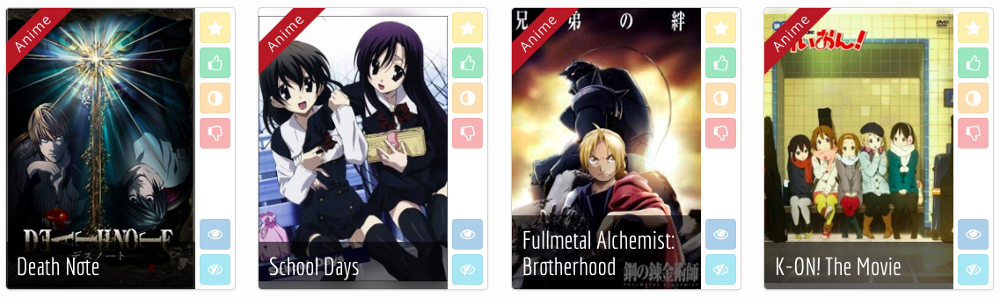
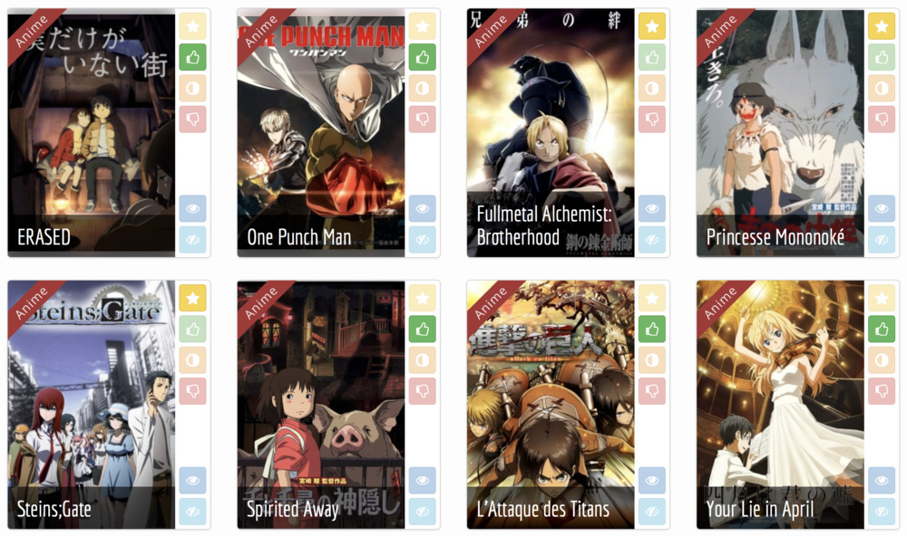
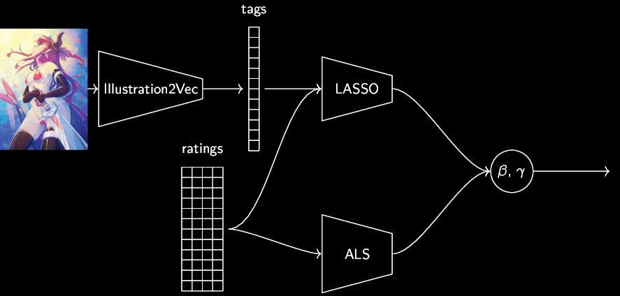
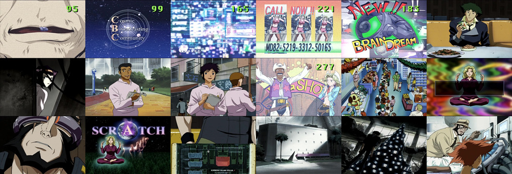
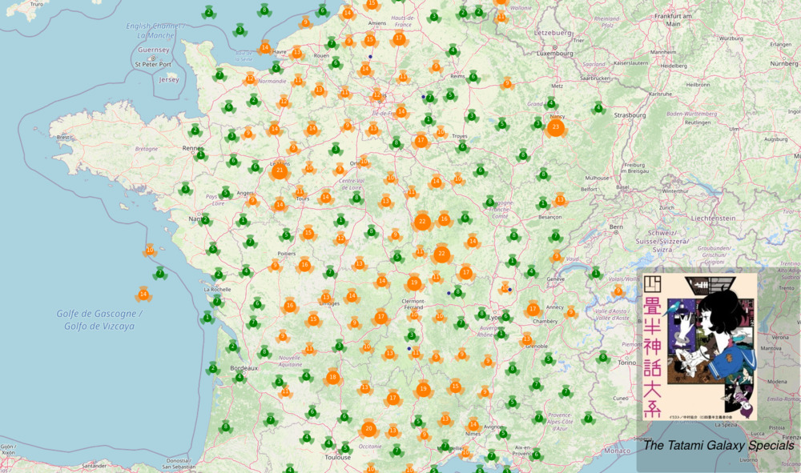

% Using Posters and Deep Learning\newline to Recommend Anime & Mangas
% Jill-Jênn Vie, PhD\newline RIKEN Center for AIP, Tokyo\vspace{3mm}\newline \includegraphics[width=2cm]{figures/aip-logo.png}
% July 5, 2018
---
handout: true
section-titles: false
header-includes:
    - \usebackgroundtemplate{\includegraphics[width=\paperwidth,height=\paperheight]{figures/bg.png}}
---

# Introduction

## Outline

### Mangaki

- Recommender system for anime & manga
- Why nonprofit?

### Research

- The geometry of mangas
- Deep learning: learning from massive data (it's all blocks)
- Our new algorithm (name will come, wait for it)

### Future

- ???

## Mangaki, recommendations of anime/manga

Rate anime/manga and receive recommendations

2,000 users, 10,000 anime/manga, 350,000 ratings

- myAnimeList (RIP their API)
- AniDB
- AniList
- (soon) TVtropes

# Mangaki

## Mangaki

## Build a profile

## Mangaki prioritizes your watchlist

## Browse the rankings: top works

## Why nonprofit?

- Why should blockbusters get all the fun/clicks/money?
- Maybe there is one precious, unknown anime \alert{for you}
    - and we can help you find it
- Driven by passion, not money

Everything is open source: `github.com/mangaki` (Python, Vue.js)

Awards: Microsoft Prize (2014) Japan Foundation (2016)

## Browse the rankings: precious pearls

# Research

## Embedding you in the geometry of mangas

\vspace{-3mm}

## Many blocks for recommendation

\begin{itemize}
\item[KNN] $K$-Nearest Neighbors
\item[ALS] Alternating Least Squares
\item[FMA] Factorization Machines
\end{itemize}

**Input:** ratings  
**Output:** representation of users and items  
(geometry used for reordering & recommendation)

## A new block appears!

Illustration2Vec (by Masaki Saito & Yusuke Matsui, 2015)

\centering

{width=42%}
{width=45%}

## We have (many) posters

## Existing algorithms

\begin{itemize}
\item[ALS] Take ratings $\rightarrow$ recommendations\\
\emph{Does not work when no ratings are available (ex. new work)}
\item[LASSO] Take tags/ratings $\rightarrow$ recommendations\\
\emph{Does not take care of people with similar taste}
\item[I2V] Take posters $\rightarrow$ tags
\end{itemize}

## Our new algorithm

Combine blocks  
Use machine learning to select the best model

\hfill Blended Alternating Least Squares with Explanation

## Our new algorithm

Combine blocks  
Use machine learning to select the best model

\hfill Blended Alternating Least Squares with Explanation

## Our new algorithm

Combine blocks  
Use machine learning to select the best model

\hfill Blended Alternating Least Squares with Explanation

## Our new algorithm

Combine blocks  
Use machine learning to select the best model

\hfill Blended Alternating Least Squares with Explanation

## Our new algorithm

Combine blocks  
Use machine learning to select the best model

\hfill Blended Alternating Least Squares with Explanation

## Our new algorithm

Combine blocks  
Use machine learning to select the best model

\hfill Blended Alternating Least Squares with Explanation

## BALSE

\centering

## Our paper BALSE was accepted at the MANPU workshop!

\pause

### Genuine excerpt from the reviewers

\vspace{3mm}

> Two models individually are existing methods, but this work presents a novel fusion method called \alert{Steins gate} to integrate results given by two models.

# Future

## Make your neural network look at the manga

Extract frames from episodes

\hfill \emph{Cowboy Bebop EP 23} "Brain Scratch", Sunrise

## Watching assistant

## Take home message

- Using machine learning, you can \alert{predict the future}
- Machine learning is made of many blocks put together
- But they need data
- To get data, interoperability is super important
    - Let's work together to pair myAnimeList / AniDB / TVtropes!
    - \alert{Contact us} to know more

## Still, there are things we can never predict

\centering

{width=50%}

## Thanks! Do you have any questions? \hfill jj@mangaki.fr

`mangaki.fr/map` \hfill `github.com/mangaki`
