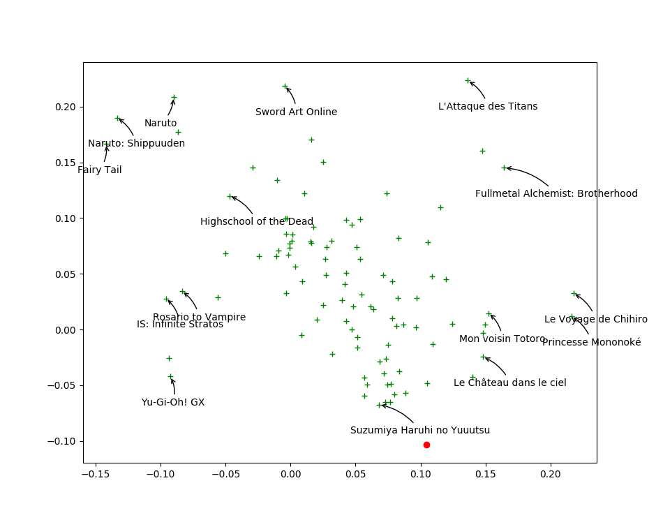

% Mangaki: Creating an open source\newline manga and anime discovery platform
% Jill-Jênn Vie (RIKEN, Tokyo)
% July 2, 2017
---
header-includes:
    - \usepackage{booktabs}
handout: true
---

# Quiz: What countries buy the most manga?

> 1. Japan: 500M volumes
> 2. France: 13M volumes \pause (actually, \alert{2\%} but 50% of Europe)
> 3. US: 9M volumes

# What is Mangaki?

## \centering An open source website where you can rate anime/manga  

\centering
\vspace{-2mm}
(like myAnimeList)

{width=75%}\ 

## \centering And receive personalized recommendations

\centering
\vspace{-2mm}
(not like myAnimeList)

# Main goals

> Use AI to discover precious pearls of Japanese culture!

- We are **non-profit**, established 2014
- The code is \alert{100\% open source} (on GitHub) \pause\newline
so you can read it, use it, break it, fix it… but can't erase it \pause
- Mainly students: 5 board + 20 helpers
- 350,000 ratings / 2,000 users / 10,000 works

\pause

## Achievements

> - 2015: Prize from Microsoft
> - 2016: Prize from the Japanese Cultural Institute in Paris
> - Summer 2016: Invited to Tokyo to meet Japanese investors
> - \alert{July 2, 2017}: Organizing a data challenge with Kyoto Univ.

# Who are we?

\centering

{height=4cm}\ 
{height=4cm}\ 
{height=4cm}\ 

{height=4cm}\ 
{height=4cm}\ 

# What can be done with 350,000 ratings?

    >>> Work.objects.popular()[:10]

\centering
\begin{tabular}{ccc} \toprule
\# & Work & \# Ratings\\ \midrule
1 & Death Note & 1453\\
2 & L'Attaque des Titans & 1330\\
3 & Le Voyage de Chihiro & 1196\\
4 & Naruto & 1167\\
5 & Princesse Mononoké & 1159\\
6 & Sword Art Online & 1141\\
7 & Fullmetal Alchemist: Brotherhood & 1138\\
8 & Fullmetal Alchemist & 1024\\
9 & Naruto: Shippuuden & 988\\
10 & Fairy Tail & 975\\ \bottomrule
\end{tabular}

# Most liked

\begin{tabular}{ccccc} \toprule
\# & Work & \# Like & \# Hate\\ \midrule
1 & L'Attaque des Titans & 1138 & 63\\
2 & Le Voyage de Chihiro & 1060 & 30\\
3 & FullMetal Alchemist & 530 & 13\\
4 & One Punch Man & 45 & 5\\
5 & Death note & 539 & 25\\
6 & Death Note & 1225 & 45\\
7 & Princesse Mononoké & 1013 & 32\\
8 & Fullmetal Alchemist - Edition reliée & 201 & 7\\
9 & Fullmetal Alchemist: Brotherhood & 993 & 35\\
10 & Attaque Des Titans (l') & 443 & 29\\
11 & Dragon Ball & 401 & 30\\
12 & One piece - Edition originale & 395 & 55\\
13 & Le Château ambulant & 696 & 30\\
14 & Mon voisin Totoro & 756 & 35\\
15 & Fullmetal Alchemist & 830 & 54\\
16 & No Game No Life & 658 & 47\\
\end{tabular}

# Most hated

\begin{tabular}{ccccc} \toprule
\# & Work & \# Like & \# Hate\\ \midrule
1 & Dragon Ball GT & 96 & 161\\
2 & Glasslip & 24 & 36\\
3 & Girls Bravo: First Season & 26 & 39\\
4 & Captain Earth & 25 & 35\\
5 & Ai non stop! & 25 & 33\\
6 & Yu-Gi-Oh! GX & 128 & 158\\
7 & Astarotte's Toy & 31 & 38\\
8 & Choujigen Game Neptune: The Animation & 27 & 33\\
9 & Haruka Nogizaka's Secret & 24 & 27\\
10 & Dog Days & 57 & 66\\
11 & Wizard Barristers & 51 & 59\\
12 & .Hack - Le bracelet du crépuscule & 24 & 26\\
13 & Sakura Trick & 48 & 50\\
14 & Ikki Tousen & 35 & 39\\
15 & Rail Wars! & 60 & 56\\
16 & The Severing Crime Edge & 33 & 29\\
\end{tabular}

# Most Controversial

\begin{tabular}{cccc} \toprule
\# & Work & \# Like & \# Hate\\ \midrule
1 & School Days & 182 & 156\\
2 & Dragon Ball Z Movie 11: Bio-Broly & 122 & 108\\
3 & Rail Wars! & 58 & 56\\
4 & Chaos;Head & 73 & 66\\
5 & To Love & 52 & 55\\
6 & Freezing & 74 & 66\\
7 & Kiss x Sis & 121 & 96\\
8 & Sakura Trick & 46 & 50\\
9 & Yu-Gi-Oh! GX & 118 & 158\\
10 & Naruto the Movie 2 & 114 & 89\\ \bottomrule
\end{tabular}

# Precious pearls

\alert{Few} ratings and \alert{mostly} likes

\pause

\begin{tabular}{ccc} \toprule
Work & \# Like & \# Hate\\ \midrule
Kaiba & 34 & 4\\
Madlax & 19 & 4\\
Lupin the Third, The Woman Called Fujiko Mine & 14 & 1\\
A Letter to Momo & 42 & 1\\
\end{tabular}

\centering
\includegraphics[height=4cm]{figures/fujiko.jpg}
\includegraphics[height=4cm]{figures/kaiba.jpg}

# Separate points via factor analysis

\alert{Closer} points means similar taste

\ 

# Find your taste

You will \alert{like} movies that are \alert{close to you}

\ 

# Study the components

## $x$-axis loves Ghibli and cyberpunk, hates teen stories
\begin{itemize}
\item[+] \emph{Princess Mononoké}, \emph{Spirited Away} (Chihiro)
\item[+] \emph{Cowboy Bebop}, space opera similar to \emph{Firefly}
\item[+] \emph{Paprika}, which inspired \emph{Inception}
\item[--] \emph{Naruto}, \emph{Bleach}
\end{itemize}

\pause

## $y$-axis loves really popular works, hates weird works

\begin{itemize}
\item[+] \emph{Attack on Titan}, \emph{Death Note}
\item[--] Erotic stories
\item[--] \alert{Same-family homosexual romances}:\\\emph{Kiss x Sis}, \emph{Papa to Kiss in the Dark}
\end{itemize}

# Call:

\centering
If you too want to play with Mangaki data, contact us!

\huge jj@mangaki.fr

\vspace{1cm}

\begin{columns}
\begin{column}{0.33\textwidth}
\large If you're an \alert{otaku}
\normalsize Try it
\end{column}

\begin{column}{0.33\textwidth}
\large If you're a \alert{researcher}
\normalsize Use it
\end{column}

\begin{column}{0.33\textwidth}
\large If you're a \alert{developer}
\normalsize Upgrade it!
\end{column}
\end{columns}

\centering\includegraphics{figures/mangaki.png}
