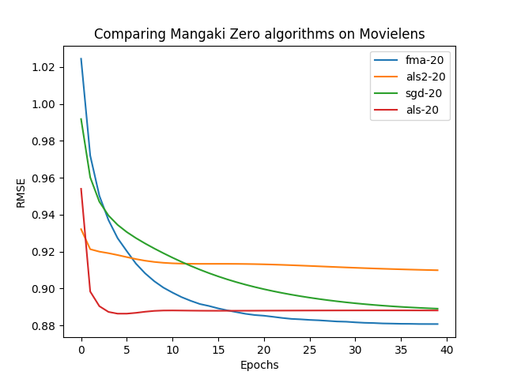

% Probabilistic programming, generative models, `torch.distributions`
% Jill-Jênn Vie
% January 13, 2023
---
aspectratio: 169
handout: false
institute: \includegraphics[height=1cm]{figures/inria.png}
section-titles: false
header-includes:
    - \usepackage{bm}
    - \usepackage{multicol,booktabs}
    - \usepackage{algorithm,algpseudocode,algorithmicx}
    - \DeclareMathOperator\argmax{argmax}
    - \DeclareMathOperator\logit{logit}
    - \def\bm{\boldsymbol}
    - \def\u{\bm{u}}
    - \def\v{\bm{{v}}}
    - \def\X{\bm{X}}
    - \def\x{\bm{x}}
    - \def\y{\bm{y}}
    - \def\E{\mathbb{E}}
    - \def\F{\mathcal{F}}
    - \def\I{\mathcal{I}}
    - \def\N{\mathcal{N}}
    - \def\Lb{\mathcal{L}_B}
    - \def\KL{\textnormal{KL}}
---

# Intro

## 2018 Turing Award: Yoshua Bengio, Yann LeCun, Geoffrey Hinton

\centering


## Yann LeCun's handwritten digit recognizer (1989)

\centering

[](https://www.youtube.com/watch?v=FwFduRA_L6Q)

## Geoffrey Hinton's generative models (2006)

\centering

[{width=80%}](https://www.youtube.com/watch?v=AyzOUbkUf3M&t=1290s)

\fullcite{hinton2006fast}

## Today's practical: Variational autoencoders

\centering

{width=90%}

\raggedright

Kingma, Diederik P and Welling, Max. Auto-Encoding Variational Bayes. In The 2nd International Conference on Learning Representations (ICLR), 2013.

## Probabilistic programming

It would be nice to have uncertainty on the output.

Ex. Bayesian neural networks, variational autoencoders, stable diffusion

### Why do we prefer distributions over point estimates?

- Measuring \alert{uncertainty} can be more robust for critical applications
- Bayesian models may require fewer hyperparameter optimization
- Can guide sequential estimation (reinforcement learning)

## Notations

$$ \begin{aligned}
\int_z p(x, z) dz = \int_z p(x|z) p(z) dz & = \E_{z\sim p(z)} p(x,z) = \E_{p(z)} p(x|z)\\
& \simeq \sum_{i = 1}^s p(x|z^{(i)}) \quad z^{(1)}, \ldots, z^{(s)} \sim p(z)
\end{aligned} $$

## VAE

{width=75%}

- Encoder: $x \mapsto z$ with posterior $q_\theta(z|x) \simeq \mathcal{N}(\mu, \sigma)$
- Decoder: $z \mapsto x$ with likelihood $p_\theta(x|z)$

Kingma, Diederik P and Welling, Max. Auto-Encoding Variational Bayes. In The 2nd International Conference on Learning Representations (ICLR), 2013.

## Variational inference

Replace inference problem with optimization

{width=70%}

*Variational Inference: Foundations & Innovations (Blei 2019)*

## Training using, for example, SGD

Take a batch $(\X_B, y_B)$ and update the parameters such that the error is minimized.

- Loss in classification: cross-entropy
- Loss in regression: squared error

\begin{algorithm}[H]
\begin{algorithmic}
\For {batch $\bm{X}_B, y_B$}
    \For {$k$ feature involved in this batch $\bm{X}_B$}
        \State Update $w_k, \bm{v}_k$ to decrease loss estimate $\mathcal{L}$ on $\bm{X}_B$
    \EndFor
\EndFor
\end{algorithmic}
\caption{SGD}
\label{algo-vfm}
\end{algorithm}

# Bayesian variational inference

## VI

$$\log p(y) \geq \E_{q(z)} (\sum_i \log p(X_i|z)) - KL(q(z)||p(z))$$

## Variational inference

\only<1>{Approximate true posterior with an easier distribution (Gaussian)} 

\only<2>{\begin{align*}
\textnormal{Priors } p(w_k) = \N(\nu^w_{g(k)}, 1/\lambda^w_{g(k)}) \qquad p(v_{kf}) = \N(\nu^{v,f}_{g(k)}, 1/\lambda^{v,f}_{g(k)})\\
\textnormal{Approx. posteriors } q(w_k) = \N(\mu^w_k, (\sigma^w_k)^2) \qquad q(v_{kf}) = \N(\mu^{v,f}_k, (\sigma^{v,f}_k)^2)
\end{align*}}

Idea: increase the ELBO $\Rightarrow$ increase the objective

\begin{align*}
\log p(\y) & \geq \sum_{i = 1}^N \underbrace{\E_{q(\theta)} [\log p(y_i|x_i,\theta)] - \KL(q(\theta)||p(\theta))}_{\textrm{Evidence Lower Bound (ELBO) }}\\
& \quad = \sum_{i = 1}^N \E_{q(\theta)} [ \log p(y_i|x_i,\theta) ] - \KL(q(w_0)||p(w_0)) - \sum_{k = 1}^K \KL(q(\theta_k)||p(\theta_k))
\end{align*}

Needs to be rescaled for mini-batching (see in [the paper](https://jiji.cat/bigdata/vie2022vfm.pdf))

## VFM training

\begin{algorithm}[H]
\begin{algorithmic}
\For {each batch $B \subseteq \{1, \ldots, N\}$}
    \State Sample $w_0 \sim q(w_0)$
    \For {$k \in F(B)$ feature involved in batch $B$}
        \State Sample $S$ times $w_k \sim q(w_k)$, $\bm{v}_k \sim q(\bm{v}_k)$
    \EndFor
    \For {$k \in F(B)$ feature involved in batch $B$}
        \State Update parameters $\mu_k^w, \sigma_k^w, \bm{\mu}_k^v, \bm{\sigma}_k^v$ to increase ELBO estimate
    \EndFor
    \State Update hyper-parameters $\mu_0, \sigma_0, \nu, \lambda, \alpha$
    \State Keep a moving average of the parameters to compute mean predictions
\EndFor
\end{algorithmic}
\caption{Variational Training (SGVB) of FMs}
\label{algo-vfm}
\end{algorithm}
\vspace{-5mm}
Then $\sigma$ can be reused for preference elicitation (see how in the paper)

## Stochastic weight averaging

A beneficial regularization: keep all weights over training epochs and average them.

Connections to Polyak-Ruppert averaging, aka stochastic weight averaging

# Conclusion

## Conclusion

- FMs are a strong baseline
- In this paper we present a variational approach for learning them
    - so that we can deal with u n c e r t a i n t y
- Our method is batched so suitable for large-scale datasets
- We have better performance on some (not all) classification datasets; perhaps due to Adam optimizer or stochastic weight averaging (beneficial regularization)

## Thanks for listening!

:::::: {.columns}
::: {.column}
VFM is implemented in TF & PyTorch\bigskip

$\E_{q(\theta)} [\log p(y_i|\bm{x}_i,\theta)]$ becomes

```python
outputs.log_prob(observed).mean()
```

Same implementation for classification and regression: the only difference in the distribution (Bernoulli vs. Gaussian)

\vspace{1cm}

Feel free to try it on GitHub (`vfm.py`):

[github.com/jilljenn/vae](https://github.com/jilljenn/vae)
:::
::: {.column}


See more benchmarks on \href{https://github.com/mangaki/zero}{github.com/mangaki/zero}
:::
::::::
