% Algorithmes de recommandation : comment ça marche ? \vspace{-5mm}
% \vspace{-5mm} {height=3.1cm} {height=3.1cm} {height=3.1cm} {height=3.1cm} {height=3.1cm}\newline \alert{Jill-Jênn Vie}¹; Solène Pichereau³; Ryan Lahfa³; Florian Yger\textsuperscript4; Hisashi Kashima²\newline; Basile Clement³; Kévin Cocchi³; Thomas Chalumeau³
% ¹ Inria (le bâtiment d'en face là)\newline ² Université de Kyoto\newline ³ Mangaki\newline \textsuperscript4 Université Paris-Dauphine \hfill \raisebox{-1em}{\includegraphics[height=1cm]{figures/inriawhite.png} \includegraphics[height=1cm]{figures/mangakiwhite.png}}
---
aspectratio: 169
theme: metropolis
lang: french
babel-lang: french
header-includes:
    - \usepackage{tikz}
    - \usepackage{array}
    - \usepackage{icomma}
    - \usepackage{multicol,booktabs}
    - \def\R{\mathcal{R}}
    - \usecolortheme{owl}
    - \def\no{n\textsuperscript{o}}
---

# Parcours

### Jill-Jênn Vie

\begin{itemize} \tightlist
\item<only@1> Classe à horaires aménagés musique à Marseille (piano) CE1--3e
\item<only@1> \alert{Passion 1 : concours d'algorithmique et programmation Prologin}
\item<only@2> 1er en première
\item<only@2> Milieu de la classe en terminale spé maths
\item<only@2> \alert{Refusé à Louis-le-Grand}
\item \only<2>{2e en }Prépa MPSI
\item<only@1> \alert{Passion 1 : enseigner l'informatique théorique en prépa}
\item<only@2> \alert{Dernier de la classe en MP**}
\item<only@2> \alert{Raté les concours de prépa}
\item<only@2> Admissible puis admis sur dossier à l'ENS de Lyon
\item<only@2> Président du concours national d'informatique Prologin
\item Master en informatique \only<2>{\alert{(raté la première année)}}
\item Admis 2e \only<2>{sur second concours }à l'ENS Paris-Saclay
\item<only@1> \alert{Passion 2 : le cinéma, les mangas et l'intelligence artificielle}
\item<only@2> \alert{Raté un master de mathématiques}
\item Agrégé de mathématiques
\item Docteur en informatique
\item<only@1> Travaillé comme chercheur 2,5 ans à Tokyo et 3 mois à New York
\item Chercheur à Inria
\item<only@1> Entraîneur de l'X et l'ENS Paris-Saclay aux concours de programmation
\item<only@1> Enseigne le deep learning (intelligence artificielle) à l'ENS Paris
\item<only@1> Jury de l'agrégation d'informatique, conseil scientifique de l'Éducation nationale
\end{itemize}

### Concours de programmation (Prologin, ICPC) {.fragile}

:::::::: {.columns}
::: {.column width="25%"}
#### Entrée

    9 10
    ##########
    .....#...#
    ####.###.#
    #..#.#...#
    #..#.#.###
    ###..#.#.#
    #.#.####.#
    #........#
    ########.#

12 problèmes  
3 coéquipiers
:::
::: {.column width="25%"}
#### Sortie
    23
    ##########
    XXXXX#...#
    ####X###.#
    #..#X#...#
    #..#X#.###
    ###XX#.#X#
    #X#X####X#
    #XXXXXXXX#
    ########X#

5 heures  
1 seul clavier
:::
::: {.column width="50%"}
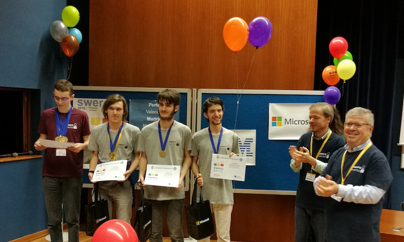
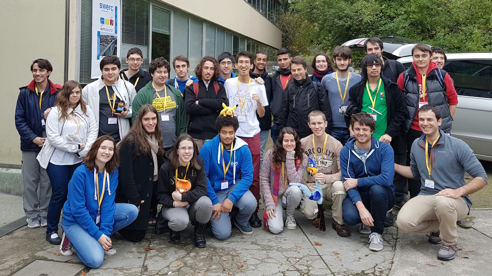
:::
::::::::

### Girls Can Code! Stages de programmation pour filles (Google RISE Award)

:::::::: {.columns}
::: {.column width="25%"}
\vspace{1.5cm}

:::
::: {.column width="75%"}
{width=50%}{width=50%}  
{width=50%}{width=50%}
:::
::::::

### Intelligence artificielle

\centering

# Introduction

### Recommandation d'articles

\includegraphics[width=\linewidth]{figures/amazon.jpg}

### Recommandation d'articles (fenêtre privée)

\includegraphics[width=\linewidth]{figures/amazon2.jpg}

### Recommandation d'articles (fenêtre privée)

\includegraphics[width=\linewidth]{figures/amazon3.jpg}

### Mangaki, recommandations d'anime/manga

Notez des anime/manga et recevez des recommandations

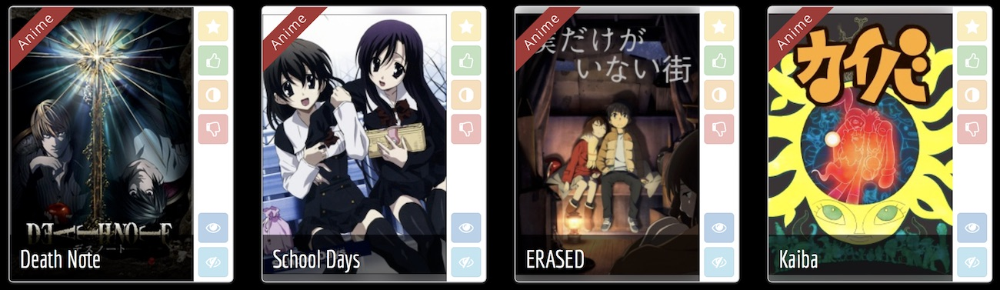

380 000 notes de 8 000 utilisateurs sur 29 000 œuvres

- myAnimeList
- AniDB
- AniList

### Remplir un profil

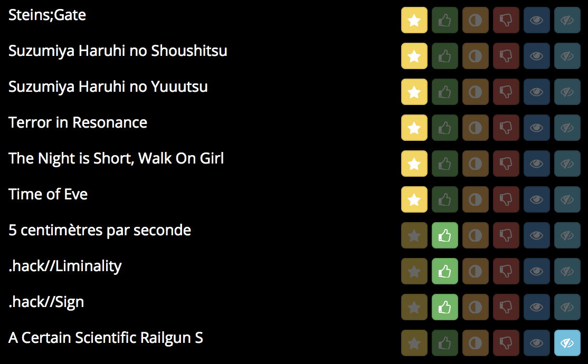

### Mangaki trie votre liste d'œuvres à voir

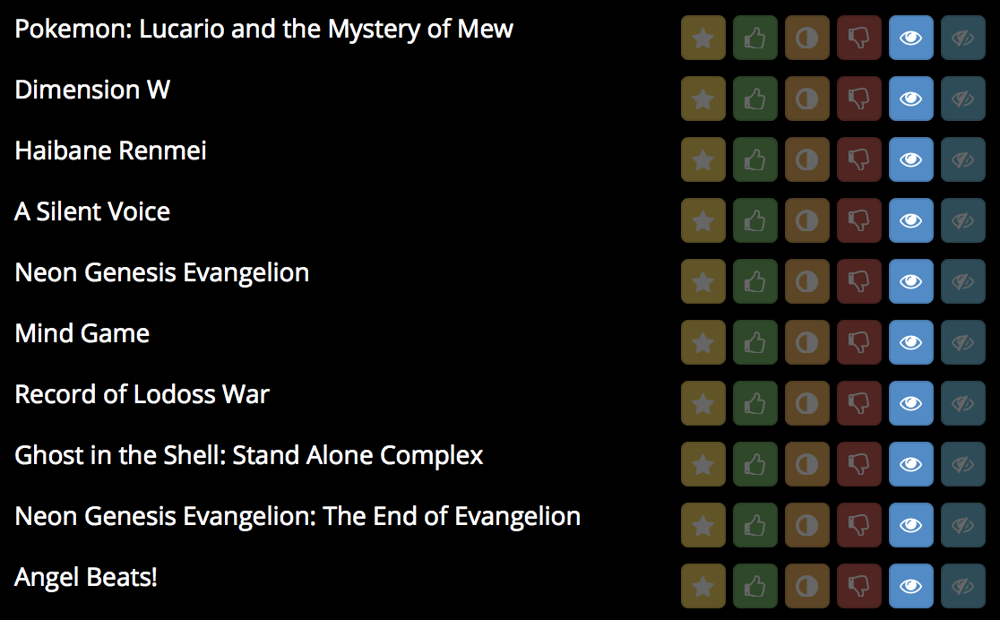

### Les plus notés

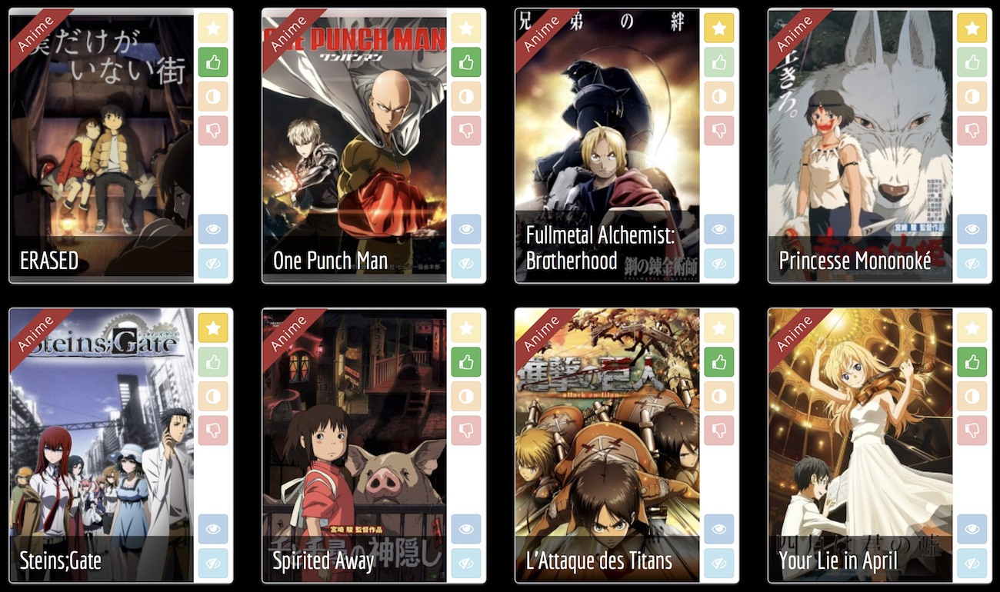

### L'association Mangaki

- Pourquoi uniquement faire la promotion des blockbusters ?
- Personnaliser les recommandations
- Identifier des perles rares

#### Codé en Python

- Tout le code est libre et ouvert : \alert{github.com/mangaki}

Prix : Microsoft Prize (2014) Japan Foundation (2016)

Financé par NLnet (Pays-Bas), commission européenne

### Perles rares

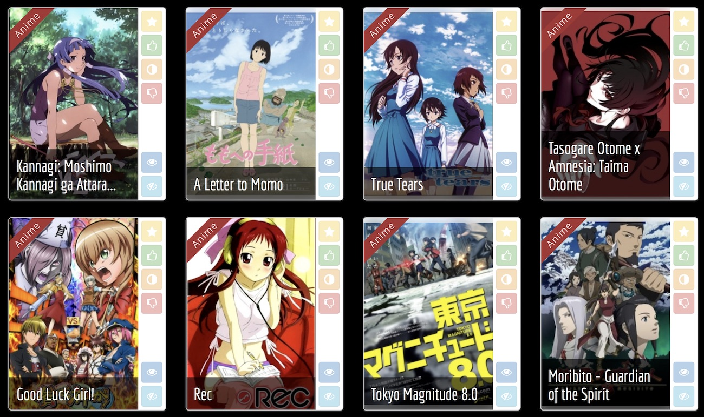

### Plan

#### 1. Comment ça marche ?

- Algorithmes de filtrage collaboratif
- Comment comparer plusieurs méthodes ?
- Comment faire mieux ?

#### 2. Risques et comment y remédier

# Comment ça marche ?

### Systèmes de recommandation

#### Problème

- Chaque personne note peu d'œuvres (1 %)
- Comment inférer les notes manquantes ?

#### Exemple

\centering
\begin{tabular}{ccccc}
& \includegraphics[height=2.5cm]{figures/1.jpg} & \includegraphics[height=2.5cm]{figures/2.jpg} & \includegraphics[height=2.5cm]{figures/3.jpg} & \includegraphics[height=2.5cm]{figures/4.jpg}\\
Sacha & ? & 5 & 2 & ?\\
Ondine & 4 & 1 & ? & 5\\
Pierre & 3 & 3 & 1 & 4\\
Joëlle & 5 & ? & 2 & ?
\end{tabular}

### Systèmes de recommandation

#### Problème

- Chaque personne note peu d'œuvres (1 %)
- Comment inférer les notes manquantes ?

#### Exemple

\centering
\begin{tabular}{ccccc}
& \includegraphics[height=2.5cm]{figures/1.jpg} & \includegraphics[height=2.5cm]{figures/2.jpg} & \includegraphics[height=2.5cm]{figures/3.jpg} & \includegraphics[height=2.5cm]{figures/4.jpg}\\
Sacha & \alert{3} & 5 & 2 & \alert{2}\\
Ondine & 4 & 1 & \alert{4} & 5\\
Pierre & 3 & 3 & 1 & 4\\
Joëlle & 5 & \alert{2} & 2 & \alert{5}
\end{tabular}

### Qu'est-ce qu'un algorithme de machine learning ?

#### Fit (entraîner)

\def\Zootopia{\emph{Zootopie}}
\def\Porco{\emph{Porco Rosso}}
\def\Tokikake{\emph{La Traversée du temps}}
\def\Martian{\emph{Seul sur Mars}}

\begin{center}
\begin{tabular}{rcl} \toprule
Ondine & \alert{aime} & \Zootopia\\
Ondine & \alert{adore} & \Porco\\
Sacha & \alert{adore} & \Tokikake\\
Sacha & \alert{n'aime pas} & \Martian\\ \bottomrule
\end{tabular}
\end{center}

#### Predict (prédire)

\begin{center}
\begin{tabular}{rcl} \toprule
Ondine & \alert{\only<1>{?}\only<2>{adore}} & \Martian\\
Sacha & \alert{\only<1>{?}\only<2>{aime}} & \Zootopia\\  \bottomrule
\end{tabular}
\end{center}

### Qu'est-ce qu'un \alert{mauvais} algorithme de machine learning ?

#### Fit

\begin{center}
\begin{tabular}{rcl} \toprule
Ondine & \alert{like} & \Zootopia\\
Ondine & \alert{favorite} & \Porco\\
Sacha & \alert{favorite} & \Tokikake\\
Sacha & \alert{dislike} & \Martian\\ \bottomrule
\end{tabular}
\end{center}

\hfill 100 % correct

#### Predict

\begin{center}
\begin{tabular}{rcl} \toprule
Ondine & \alert{n'aime pas} & \Martian{} (en fait : adore)\\
Sacha & \alert{neutre} & \Zootopia{} (en fait : aime)\\ \bottomrule
\end{tabular}
\end{center}

\hfill 20 % correct

N'arrive pas à \alert{généraliser}

### Qu'est-ce qu'un \alert{bon} algorithme de machine learning ?

#### Fit

\begin{center}
\begin{tabular}{rcl} \toprule
Ondine & \alert{adore} & \Zootopia{} (en fait : aime)\\
Ondine & \alert{adore} & \Porco\\
Sacha & \alert{adore} & \Tokikake\\
Sacha & \alert{n'aime pas} & \Martian\\ \bottomrule
\end{tabular}
\end{center}

\hfill 90 % correct

#### Predict

\begin{center}
\begin{tabular}{rcl} \toprule
Ondine & \alert{aime} & \Martian{} (en fait : adore)\\
Sacha & \alert{adore} & \Zootopia{} (en fait : aime)\\ \bottomrule
\end{tabular}
\end{center}

\hfill 90 % correct

### Comment comparer des méthodes ?

\centering
\begin{tabular}{cccccc}
n'aime pas & ne verra pas & neutre & veut voir & aime & adore\\
-2 & -0.5 & 0.1 & 0.5 & 2 & 4
\end{tabular}

\raggedright

#### Pénalités

Si je prédis :

:   \alert{adore} pour adore $\rightarrow$ erreur de 0  
    \alert{n'aime pas} pour adore $\rightarrow$ erreur de $(4 - (-2))^2 = 36$  
    \alert{aime} for adore $\rightarrow$ erreur de 4

Erreur : moyenne des (différences)²  
RMSE: racine carrée de la valeur ci-dessus

#### \alert{Validation croisée}

- On entraîne sur 80 % des données (entraînement)
- On cache les 20 % de données restantes (validation)
- On s'en sert pour évaluer la performance des modèles

Plus l'erreur de validation est basse, mieux c'est

### Algorithme des plus proches voisins

Pour recommander des films à quelqu'un :

- On introduit un \alert{score de similarité} entre personnes
- On détermine les 10 personnes \alert{les plus proches} de quelqu'un
- On lui recommande ce qu'elles ont aimé qu'il n'a pas vu

### Nos données

\centering
\begin{tabular}{c@{\hspace{3mm}}c@{\hspace{3mm}}c@{\hspace{3mm}}c@{\hspace{3mm}}c@{\hspace{3mm}}c@{\hspace{3mm}}c}
& \footnotesize{007} & \footnotesize{Batman 1} & \footnotesize{Shrek 2} & \footnotesize{Toy Story 3} & \footnotesize{Star Wars 4} & \footnotesize{Twilight 5}\\
Alice & $+$ & $-$ & $0$ & $+$ & $0$ & $-$\\
Bob & $-$ & $0$ & $+$ & $-$ & $+$ & $+$\\
Charles & $+$ & $+$ & $+$ & $+$ & $-$ & $-$\\
Daisy & $+$ & $+$ & $0$ & $0$ & $+$ & $-$\\
Everett & $+$ & $-$ & $+$ & $+$ & $-$ & $0$\\
\end{tabular}

\begin{center}
Quel score de similarité entre utilisateurs choisir ?
\end{center}

### Calcul du score

\centering
\begin{tabular}{c@{\hspace{3mm}}c@{\hspace{3mm}}c@{\hspace{3mm}}c@{\hspace{3mm}}c@{\hspace{3mm}}c@{\hspace{3mm}}c}
& \footnotesize{007} & \footnotesize{Batman 1} & \footnotesize{Shrek 2} & \footnotesize{Toy Story 3} & \footnotesize{Star Wars 4} & \footnotesize{Twilight 5}\\
Alice & $+$ & $-$ & $0$ & $+$ & $0$ & $-$\\
Charles & $+$ & $+$ & $+$ & $+$ & $-$ & $-$\\
\end{tabular}

\centering

À quel point Alice est proche de Charles ?

### Calcul du score

\centering
\begin{tabular}{c@{\hspace{3mm}}c@{\hspace{3mm}}c@{\hspace{3mm}}c@{\hspace{3mm}}c@{\hspace{3mm}}c@{\hspace{3mm}}c}
& \footnotesize{007} & \footnotesize{Batman 1} & \footnotesize{Shrek 2} & \footnotesize{Toy Story 3} & \footnotesize{Star Wars 4} & \footnotesize{Twilight 5}\\
Alice & $+$ & $-$ & $0$ & $+$ & $0$ & $-$\\
Charles & $+$ & $+$ & $+$ & $+$ & $-$ & $-$\\
Score & $+1$ & $-1$ & & $+1$ & & +1\\
\end{tabular}
\vspace{-1mm}
\begin{center}
$score(\textnormal{Alice}, \textnormal{Charles}) = 3 + (-1) = \alert{2}$  
\end{center}
\vspace{2mm}

\centering
\begin{tabular}{c@{\hspace{3mm}}c@{\hspace{3mm}}c@{\hspace{3mm}}c@{\hspace{3mm}}c@{\hspace{3mm}}c@{\hspace{3mm}}c}
& \footnotesize{007} & \footnotesize{Batman 1} & \footnotesize{Shrek 2} & \footnotesize{Toy Story 3} & \footnotesize{Star Wars 4} & \footnotesize{Twilight 5}\\
Alice & $+$ & $-$ & $0$ & $+$ & $0$ & $-$\\
Bob & $-$ & $0$ & $+$ & $-$ & $+$ & $+$\\
Score & $-1$ & & & $-1$ & & -1\\
\end{tabular}
\vspace{-1mm}
\begin{center}
$score(\textnormal{Alice}, \textnormal{Bob}) = \alert{-3}$\bigskip
\vspace{2mm}

Alice est \alert{plus proche} de Charles que de Bob
\end{center}

### Score de similarité entre personnes

\begin{center}
\begin{tabular}{c@{\hspace{2mm}}|c@{\hspace{2mm}}c@{\hspace{2mm}}c@{\hspace{2mm}}c@{\hspace{2mm}}c}
& Alice & Bob & Charles & Daisy & Everett\\
\hline
Alice & $4$ & $-3$ & $2$ & $1$ & $3$\\
Bob & $-3$ & $5$ & $-3$ & $-1$ & $-2$\\
Charles & $2$ & $-3$ & $6$ & $2$ & $3$\\
Daisy & $1$ & $-1$ & $2$ & $4$ & $-1$\\
Everett & $3$ & $-2$ & $3$ & $-1$ & $5$\\
\end{tabular}
\end{center}

\begin{center}
Qui sont les 2 plus proches voisins d'Alice ?
\end{center}

### Calcul des prédictions

\centering
\begin{tabular}{c@{\hspace{3mm}}c@{\hspace{3mm}}c@{\hspace{3mm}}c@{\hspace{3mm}}c@{\hspace{3mm}}c@{\hspace{3mm}}c}
& \footnotesize{007} & \footnotesize{Batman 1} & \footnotesize{Shrek 2} & \footnotesize{Toy Story 3} & \footnotesize{Star Wars 4} & \footnotesize{Twilight 5}\\
Alice & $+$ & $-$ & \alert{?} & $+$ & \alert{?} & $-$\\
Charles & $+$ & $+$ & $+$ & $+$ & $-$ & $-$\\
Daisy & $+$ & $+$ & $0$ & $0$ & $+$ & $-$\\
Everett & $+$ & $-$ & $+$ & $+$ & $-$ & $0$\\
\end{tabular}

\begin{center}
Connaissant ses voisin$\cdot$es, quelles sont les chances d'Alice d'apprécier ces films ?
\end{center}

### Calcul des prédictions

\centering
\begin{tabular}{c@{\hspace{3mm}}c@{\hspace{3mm}}c@{\hspace{3mm}}c@{\hspace{3mm}}c@{\hspace{3mm}}c@{\hspace{3mm}}c}
& \footnotesize{007} & \footnotesize{Batman 1} & \footnotesize{Shrek 2} & \footnotesize{Toy Story 3} & \footnotesize{Star Wars 4} & \footnotesize{Twilight 5}\\
Alice & $+$ & $-$ & \alert{$+$} & $+$ & \alert{$-$} & $-$\\
Charles & $+$ & $+$ & $+$ & $+$ & $-$ & $-$\\
Daisy & $+$ & $+$ & $0$ & $0$ & $+$ & $-$\\
Everett & $+$ & $-$ & $+$ & $+$ & $-$ & $0$\\
\end{tabular}

\begin{center}
On peut calculer la moyenne :\\
$prediction(\textnormal{Alice}, \textnormal{Star Wars 4}) =$ 0,333…
\end{center}

### Factorisation de matrice $\rightarrow$ réduire la dimension pour généraliser

**Idée :** Apprendre une représentation des utilisateurs et œuvres  
de sorte que les gens aiment des œuvres proches d'eux

#### Fit

- $R$ notes, \alert{$U$} vecteurs des utilisateurs, \alert{$W$} vecteurs des œuvres.

$$R = \alert{UW^T} \qquad \hat{r}_{ij}^{ALS} = \langle U_i, W_j \rangle $$

\pause

#### Predict : Est-ce que l'utilisateur $i$ va aimer l'œuvre $j$?

- Il suffit de calculer $\langle \alert{U_i}, \alert{W_j} \rangle$ pour le savoir

#### Algorithme \alert{ALS} : moindres carrés alternés (Zhou, 2008)

- Jusqu'à convergence (~ 20 itérations) :
    - Fixer $U$ (utilisateurs) améliorer $W$ (œuvres)  
    \hfill de façon à minimiser l'erreur
    - Fixer $W$ améliorer $U$

### Illustration de la minimisation alternée

\centering
\includegraphics<1>{figures/embed0.pdf}\includegraphics<2>{figures/embed1.pdf}\includegraphics<3>{figures/embed2.pdf}\includegraphics<4>{figures/embed3.pdf}\includegraphics<5>{figures/embed4.pdf}\includegraphics<6>{figures/embed5.pdf}\includegraphics<7>{figures/embed6.pdf}\includegraphics<8>{figures/embed7.pdf}\includegraphics<9>{figures/embed8.pdf}\includegraphics<10>{figures/embed9.pdf}\includegraphics<11>{figures/embed10.pdf}\includegraphics<12>{figures/embed11.pdf}\includegraphics<13>{figures/embed12.pdf}\includegraphics<14>{figures/embed13.pdf}\includegraphics<15>{figures/embed14.pdf}\includegraphics<16>{figures/embed15.pdf}\includegraphics<17>{figures/embed16.pdf}\includegraphics<18>{figures/embed17.pdf}\includegraphics<19>{figures/embed18.pdf}\includegraphics<20>{figures/embed19.pdf}\includegraphics<21>{figures/embed20.pdf}\includegraphics<22>{figures/embed21.pdf}\includegraphics<23>{figures/embed22.pdf}\includegraphics<24>{figures/embed23.pdf}\includegraphics<25>{figures/embed24.pdf}\includegraphics<26>{figures/embed25.pdf}\includegraphics<27>{figures/embed26.pdf}\includegraphics<28>{figures/embed27.pdf}\includegraphics<29>{figures/embed28.pdf}\includegraphics<30>{figures/embed29.pdf}\includegraphics<31>{figures/embed30.pdf}\includegraphics<32>{figures/embed31.pdf}\includegraphics<33>{figures/embed32.pdf}\includegraphics<34>{figures/embed33.pdf}\includegraphics<35>{figures/embed34.pdf}\includegraphics<36>{figures/embed35.pdf}\includegraphics<37>{figures/embed36.pdf}\includegraphics<38>{figures/embed37.pdf}\includegraphics<39>{figures/embed38.pdf}

### Visualisation des œuvres : points proches $\iff$ goûts similaires

\centering
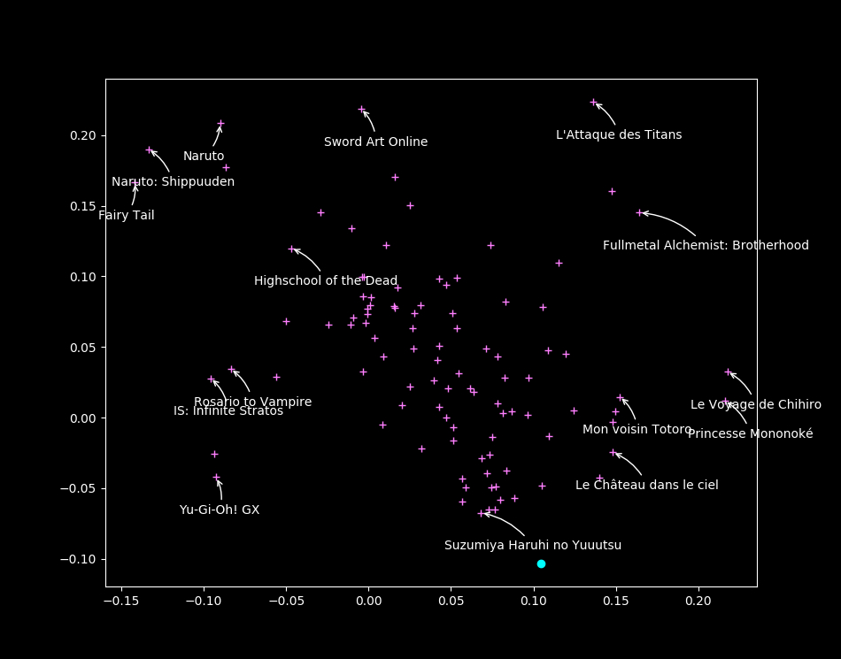\ 

### Où êtes-vous sur la carte ?

\centering
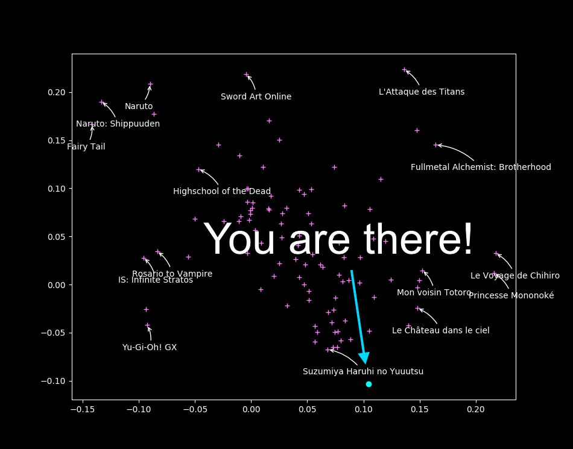\ 

### Mangaki Map: \alert{\href{https://mangaki.fr/map}{mangaki.fr/map}}

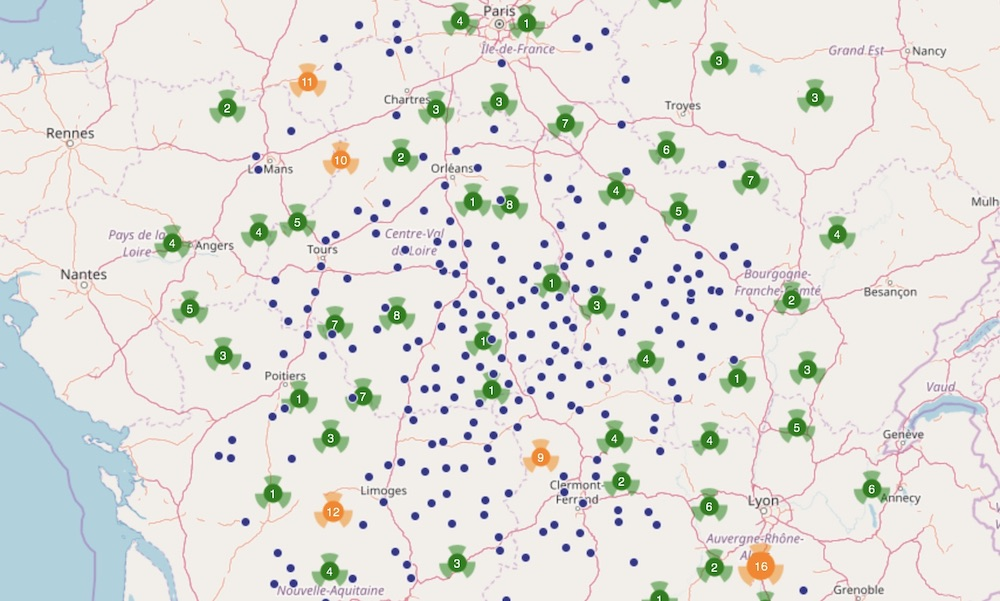

### Problème : démarrage à froid

Si on n'a pas de notes pour une œuvre, on ne sait pas où elle est sur la carte :-(

Aucun moyen de distinguer entre œuvres non notées

### Mais on a énormément de posters !

\centering
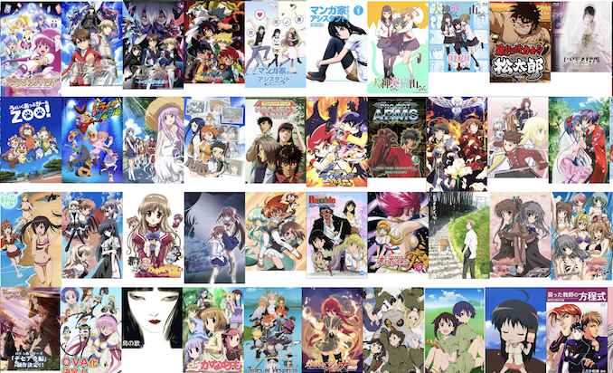

Comment utiliser cette information pour améliorer les recommandations ?

### Illustration2Vec (Saito and Matsui, 2015)

\centering

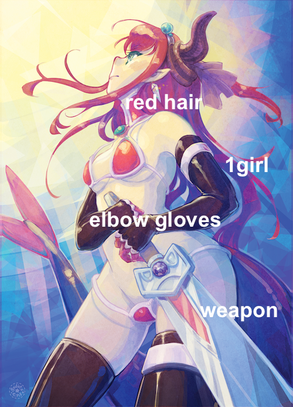{height=70%}\ 
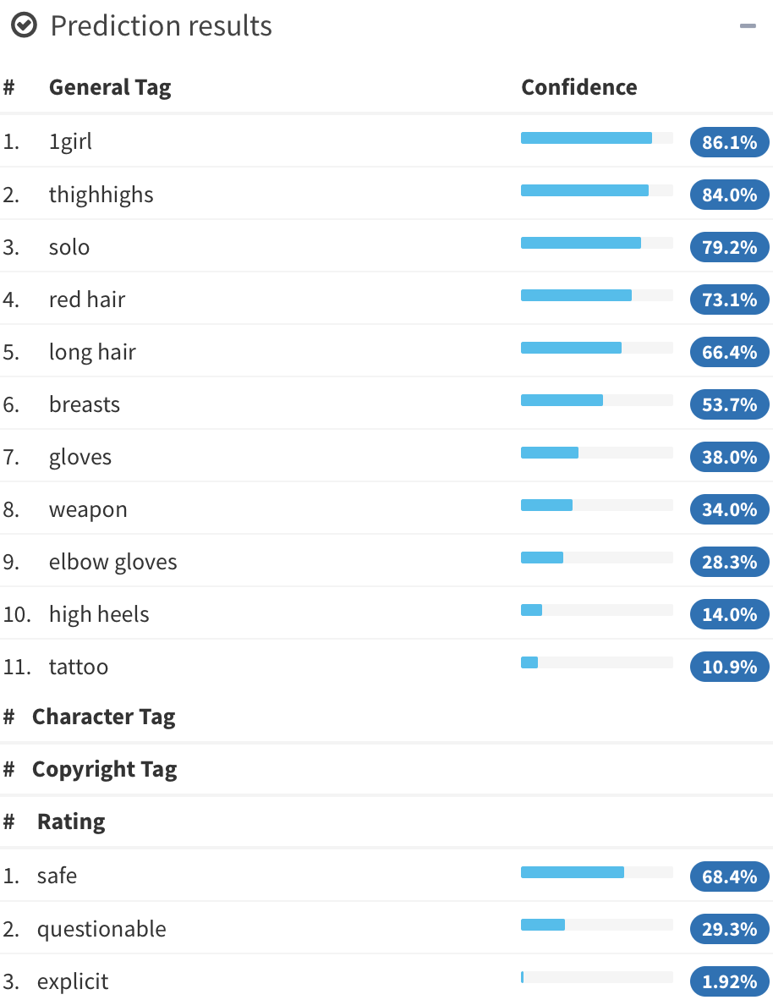{height=70%}\ 

\small (Solène Pichereau, sedeto.fr) \qquad (Saito and Matsui, 2015)

\normalsize

- Modèle CNN entraîné sur des photos (ImageNet, Danbooru)
- Reconnaît 502 tags, pondérés par confiance

### Représentation des œuvres et des posters

\centering

{width=80%}

{width=30%} {width=30%}

### Posters proches

### Interpolation entre posters

\centering

Stage de M1 de Thomas Chalumeau (ENSIIE Évry)

### Interpolation entre personnages : \alert{\href{https://make.girls.moe}{make.girls.moe}}

\centering

{width=90%}

\footnotesize \raggedright

Yanghua Jin, Jiakai Zhang, Minjun Li, Yingtao Tian, Huachun Zhu, Zhihao Fang. Towards the Automatic Anime Characters Creation with Generative Adversarial Networks. NIPS 2017 workshop for Machine Learning for Creativity and Design. \alert{\href{https://arxiv.org/pdf/1708.05509.pdf}{arxiv.org/pdf/1708.05509.pdf}}

### Étape suivante ?

Extraire les frames des épisodes

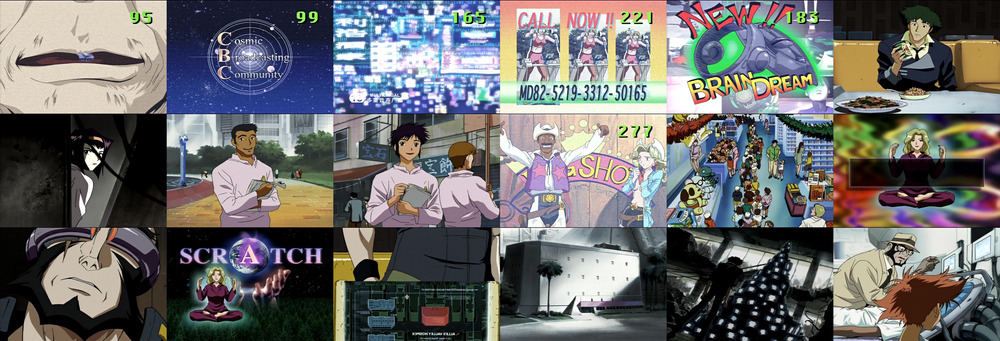

\hfill \emph{Cowboy Bebop EP 23} "Brain Scratch", Sunrise

### Bientôt : assistant de visionnage

\centering

### Bientôt : assistant de visionnage

\centering

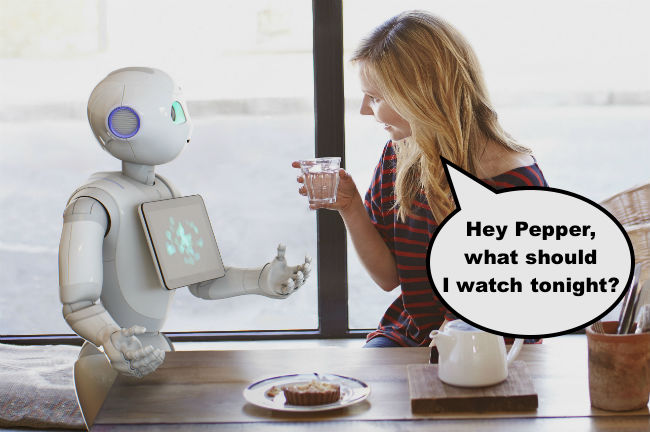

### Bientôt : assistant de visionnage

\centering

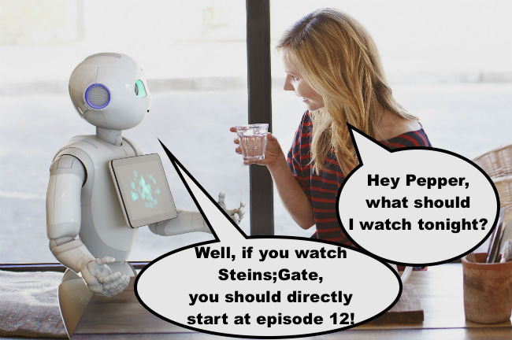

# Quels sont les risques ?

### Une petite anecdote

> - Le 2 octobre 2006, Netflix a lancé un concours :  
*Le premier qui bat notre algorithme de plus de 10 % remportera 1 million de dollars.*  
et ont filé des données pseudonymisées
> - La moitié de la communauté en IA s'est jetée sur le problème
> - Le 8 octobre, quelqu'un a battu Cinematch
> - Le 15 octobre, 3 équipes l'avaient battu, dont 1 de 1,06 %
> - Le 26 juin 2009, une équipe \no 1 bat Cinematch de 10,05 %  
$\rightarrow$ \alert{last call} : plus qu'un mois pour gagner
> - Le 25 juillet 2009, une \alert{équipe \no 2} bat Cinematch de 10,09 %
> - L'équipe \no 1 fait 10,09 % aussi
> - 20 minutes plus tard \alert{l'équipe \no 2} fait 10,10 %
> - … En fait, les deux équipes étaient ex \ae quo sur la validation
> - … Du coup c'est la première équipe à envoyer ses résultats qui a gagné (équipe 1, 10,09 %)

### Confidentialité des utilisateurs

> - Août 2009, Netflix annonce une saison 2
> - Entre-temps, en 2007 deux chercheurs de l'université du Texas ont été capables d'\alert{identifier} les utilisateurs du jeu de données anonymisées en croisant les données avec IMDb
> - (année approximative de naissance, code postal, films vus)
> - En décembre 2009, 4 utilisateurs de Netflix ont attaqué Netflix en justice
> - Mars 2010, arrangement à l'amiable, la plainte est close

### Informations démographiques

Savoir qui est un garçon ou une fille sur le site : pour ou contre ?

\pause

\alert{Fairness} : s'assurer que l'erreur du modèle ne varie pas trop sur des catégories de population

Il faut mesurer les discriminations pour réduire les inégalités

### Allez, on récapitule

#### Comment ça marche ?

- recommander des films $\Rightarrow$ \alert{inférer} des notes qui n'existent pas
- \alert{validation croisée} pour comparer les méthodes

1. $k$ plus proches voisins
2. factorisation de matrice $\Rightarrow$ apprendre une \alert{représentation}
3. utiliser l'information présente dans les posters

#### Quels sont les risques ?

- Confidentialité : réidentifier des personnes
- Est-ce que le modèle est ouvert ?
- Est-ce qu'il aggrave des biais ?

### Merci pour votre attention ! \hfill jill-jenn.net / jill-jenn.vie@inria.fr

\centering
{width=40%} {width=40%}\ 

\raggedright

#### Pour en savoir plus

- Deep Learning for Manga & Anime: \alert{\url{research.mangaki.fr}}
- Notamment un article en français publié dans LinuxMag qui explique comment programmer un algorithme de recommandation en Python

\centering
\includegraphics[height=3cm]{figures/styletransfer.jpg}
