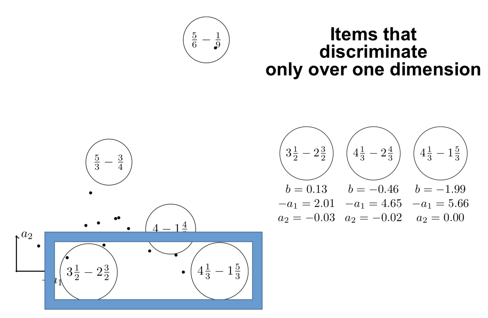
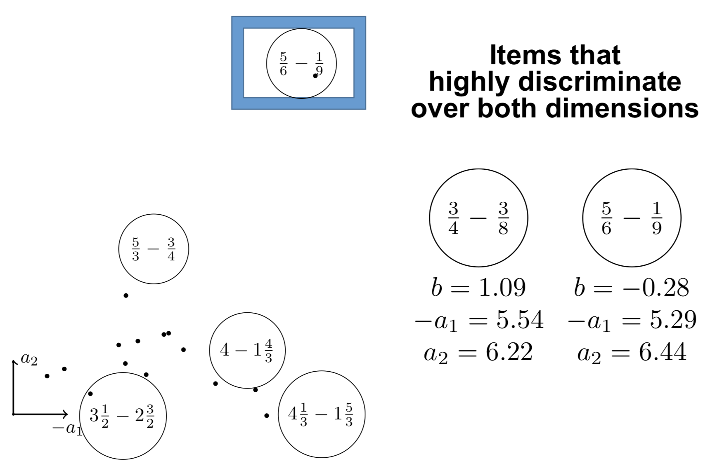

% De la théorie de la réponse à l'item aux LLM :\newline observer et agir pour l'éducation
% Jill-Jênn Vie
% CSEN, 21 mai 2024
---
institute: \includegraphics[height=1cm]{figures/inria.png}
lang: fr
babel-otherlangs: english
csquotes: true
aspectratio: 169
biblio-style: authoryear
navigation: frame
header-includes: |
  ```{=tex}
  \usepackage{subfig}
  \usepackage{bm}
  \def\correct{\includegraphics{figures/win.pdf}}
  \def\uic{\textnormal{User } i \textnormal{ Item } j~\correct}
  \setbeamertemplate{navigation symbols}{}

  \setbeamertemplate{footline}{%
    \leavevmode%
    \hbox{%
    \begin{beamercolorbox}[wd=\paperwidth,ht=2.25ex,dp=1ex,right]{date in head/foot}%
      \usebeamerfont{date in head/foot}\insertframenumber\hspace*{2ex}
    \end{beamercolorbox}}%
    \vskip0pt%
  }

  ```
biblatexoptions:
  - maxbibnames=99
  - maxcitenames=5
  - babel=other
---

# L'IA en éducation


# Where AI can be used in education?

:::::: {.columns}
::: {.column width=80%}
- Automatic grading
- Automatic generation of exercises using AI
- Predicting student performance to adapt instruction
- \alert{Personalization of assessment}
- Providing personalized feedback to students
- Personalized explanations\medskip

Check UK report (536 respondants): *Generative AI in education*, UK Department for Education, January 2024 $\to$
:::
::: {.column width=20%}
$\fbox{\includegraphics{figures/genai-uk.png}}$
:::
::::::

## Opportunities

- freeing up teacher time with administrative tasks to focus on teaching
- additional educational support, notably for students with special needs

## Risks

- Unreliable or biased information
- Overreliance on AI tools

# IA rudimentaire : régression logistique

Si vous savez ce qu'est une régression logistique : vous connaissez l'IA
$$\textnormal{régression logistique} \iff \textnormal{réseau de neurones à une couche}$$

Exemple : les modèles de théorie de réponse à l'item utilisés pour PISA, etc.

## Et l'apprentissage profond ?

Combinaison d'opérations (notamment multiplications de matrices) dérivables\bigskip

Ce qui a contribué à l'essor de la discipline :

- La plupart des articles sont en accès ouvert
- Code open source dans la communauté[^1]
- Développement de la technologie

[^1]: Un peu comme en psychométrie, *Journal of Statistical Software* fondé en 1996

# Exemple d'IA

Si l'on donne un objectif précis mesurable (et des données), on peut calculer pour minimiser cet objectif

\centering

{width=85%}

# Exemple d'IA

Si l'on donne un objectif précis mesurable (et des données), on peut calculer pour minimiser cet objectif

\centering

{width=85%}

# Exemple d'IA

Si l'on donne un objectif précis mesurable (et des données), on peut calculer pour minimiser cet objectif

\centering

{width=85%}

# Modèle rudimentaire : théorie de la réponse à l'item IRT-1PL

\centering

\resizebox{0.9\linewidth}{!}{$\displaystyle \substack{\normalsize \Pr(\textnormal{"étudiant A résout question B"})\\ \Pr(\textnormal{"joueur A bat joueur B"})\\ \Pr(\textnormal{"A est préféré à B"})} = \frac1{1 + \exp(-(score_A - score_B))}$}

\raggedright

Mesurer le trait latent (la position sur la gaussienne) à partir des résultats à des tests

\begin{figure}
  \captionsetup[subfigure]{labelformat=empty,justification=centering}
  \subfloat[reCAPTCHA\\ (Luis von Ahn, 2008)]{\raisebox{2mm}{\includegraphics[width=0.25\linewidth]{figures/captcha.png}}}
  \subfloat[Elo (1967)\\ TrueSkill (2007)]{\includegraphics[width=0.25\linewidth]{figures/tournament-nyt.png}}
  \subfloat[Tests adaptatifs\\ (Rasch, 1960)]{\includegraphics[width=0.25\linewidth]{figures/irt.pdf}}
  \subfloat[Modèles de préférences\\ (Bradley \& Terry, 1952)]{\raisebox{3mm}{\includegraphics[width=0.25\linewidth]{figures/elo2.jpg}}}
\end{figure}

\vfill \small

\fullcite{rasch1960studies}

# Personnalisation de l'évaluation : tests adaptatifs

Comment mesurer 800 composantes de connaissances efficacement ?  
Avec la théorie de la réponse à l'item

:::::: {.columns}
::: {.column}

:::
::: {.column}
\vspace{1cm}

- On pose une question de niveau 5
- L'apprenant \alert{réussit}
- On pose une question de niveau 12
- L'apprenant \alert{échoue}
- On pose une question de niveau 4
- etc.
:::
::::::

\small

\fullcite{Vie2017PIX}

# Jeu de données de soustractions sur les fractions

Essais de 536 collégiens sur $20$ items


# Théorie de la réponse à l'item en 2 dimensions

En noir, les 20 questions ; \alert{en rouge, l'apprenant}

\centering

{width=40%}

# Intepréter les composantes principales

\centering

{width=80%}

# Intepréter les composantes principales

\centering

{width=80%}

# Les grands modèles de langage (LLM) : quels objectifs ?

1. Transformer : prédire le mot suivant

```
Transformers / are / a / new / machine / [learning]  
Transformers / are / a / new / machine / learning / [architecture]
```

2. Données de démonstration d'experts :

```
Query: put the first letters in uppercase in "optimizing human learning"
Answer: Optimizing Human Learning
```

3. Données de comparaison d'experts :

```
Query: write a poem
Answer 1: Roses are red
Answer 2: Once upon a time, a prince in a castle
```

Où la réponse 2 est votée favorablement par les experts

ChatGPT est donc entraîné pour plaire aux experts et généraliser à de nouvelles tâches

# LLM sur questions SAT (1200 participants Amazon Mechanical Turk)

\begin{itemize}
\item[RQ1] When doing practice questions for a math test, how does the type of explanation people receive (answers alone or answers with LLM-generated explanations) affect performance on subsequent test questions?
\item[RQ2] How does the relationship between explanation type and performance change when people i) attempt questions before seeing explanations or ii) see explanations before attempting questions?
\end{itemize}

LLM-based explanations positively impact learning (relatively to seeing only correct answers), regardless of whether participants consulted them before or after attempting practice problems.

Exposure to LLM explanations increased the amount people felt they learned and decreased the perceived difficulty of the test problems.

\small

\fullcite{kumar2023math}

# LLM pour la programmation (5923 essais de 132 participants)

Sombre : groupe expérimental (accès aux explications ChatGPT)

{width=50%}\ 
{width=50%}

\raggedleft

Taux de succès cumulatif après chaque essai \hfill Taux de succès cumulatif sans ChatGPT

\raggedright \small

\fullcite{pankiewicz2023large}

# Une IA pour sous-titrer ? Same-language subtitling (SLS)

\centering

{height=3cm} {height=3cm}

\raggedright

Étude sur 13000 écoliers entre 2002 et 2007.\bigskip

> Purely from schooling, without any exposure to SLS, we found that \alert{24\%} children became good readers after 5 years of schooling. But in the group of school children that was exposed to SLS regularly, at most 30 min a week over five years, \alert{56\%} became good readers.

\small

\fullcite{kothari2008let}

# Paradoxe

PISA mesure 3 nombres par pays ; tandis que ChatGPT mesure 1536 nombres par mot.  
Une évaluation formative serait plus utile

\centering

{width=60%}

\raggedright

\small \fullcite{verhelst2017balance}

# Recommandations en IA pour l'éducation

## Savoir ce que l'on souhaite mesurer et optimiser

Pour réduire les inégalités il faut pouvoir mesurer les discriminations

## Ouvrir le code des algorithmes EdTech

Ne serait-ce que pour être en accord avec la loi pour une République numérique

## Pouvoir partager les paramètres du modèle en plus des énoncés

Les énoncés PISA / la problémathèque, mais avec des informations statistiques

## Conserver les données historiques de Parcoursup

Pour rejouer des décisions, critiquer les décisions du passé, tester de nouveaux algorithmes

## "Vieille" question du ministère : est-il possible de détecter la triche ChatGPT ?

- Oui (ICML 2023) et non (trop de LLM différents) ; attention aux faux positifs
- La plupart des profs repèrent déjà que ce n'est pas l'étudiant qui a écrit le texte

# Retour de la keynote de Khan Academy à LAK 2024 sur Khanmigo

Khan Academy ne publie rien, ils n'ont qu'un blog de communication

:::::: {.columns}
::: {.column width=70%}
## Retours d'expérience :

- Les jeunes demandent à ChatGPT de lui donner la réponse, ils ont la flemme de taper
- Du coup, *text to speech* est utile
- Khanmigo propose aussi à l'élève de cliquer parmi plusieurs réponses possibles
- Interagir dans leur langue maternelle est utile

## Même si Khanmigo n'est qu'une interface pour ChatGPT

- Aide pour la rédaction de curriculums
- Aide pour le style dans la rédaction de dissertation

## Autres usages ChatGPT

- Donne-moi un énoncé donc ce code est solution
- Critique ma lettre de recommandation
:::
::: {.column width=30%}


GPT-4o : festival de Khan
:::
::::::

# Merci pour votre attention !
