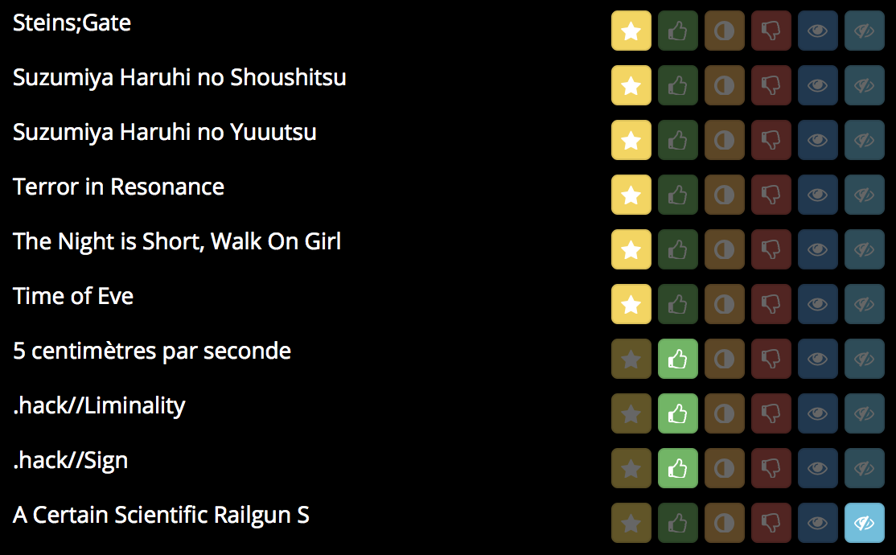
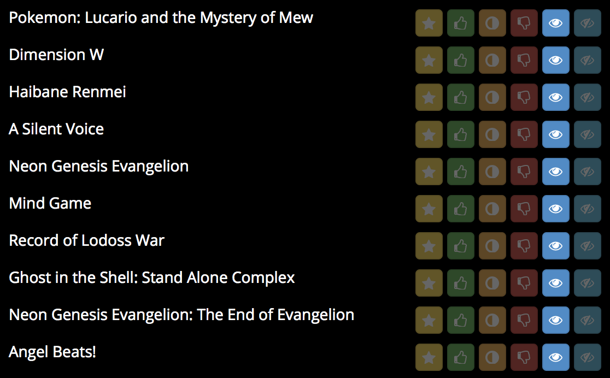

% Deep Recommender Systems \vspace{-5mm}
% \vspace{-5mm} {height=3.1cm} {height=3.1cm} {height=3.1cm} {height=3.1cm} \alert{Jill-Jênn Vie}¹³ \and \quad Florian Yger² \and \quad Ryan Lahfa³ \and \quad Hisashi Kashima\textsuperscript4\newline \and Basile Clement³ \and Kévin Cocchi³ \and Thomas Chalumeau³
% ¹ Inria Lille\newline ² Université Paris-Dauphine (France) \hfill \includegraphics[width=2cm]{figures/inria.png}\newline ³ Mangaki (Paris, France)\newline \textsuperscript4 RIKEN AIP, Tokyo & Kyoto University \hfill \includegraphics[width=2cm]{figures/mangakiwhite.png}
---
theme: metropolis
{}handout: true{}
header-includes:
    - \usepackage{tikz}
    - \usepackage{array}
    - \usepackage{icomma}
    - \usepackage{multicol,booktabs}
    - \def\R{\mathcal{R}}
    - \usepackage{bm}
    - \usecolortheme{owl}
    - \newcommand\mycite[3]{\textcolor{blue}{#1} "#2".~#3.}
    - \DeclareMathOperator\logit{logit}
    - \def\ReLU{\textnormal{ReLU}}
---

# I -- Collaborative filtering

## Mangaki, recommendations of anime/manga

<!-- Was: 5.9 MB. Is: 4.1 MB //-->

Rate anime/manga and receive recommendations


350,000 ratings by 2,000 users on 10,000 anime & manga

- myAnimeList
- AniDB
- AniList
- (soon) TVtropes

## Build a profile



## Mangaki prioritizes your watchlist



## Browse the rankings: top works

```python
>>> from mangaki.models import Work
>>> Work.objects.filter(category__slug='anime').top()[:8]
```


## Why nonprofit?

- Why should blockbusters get all the fun/clicks/money?
- Maybe there is one precious, unknown anime \alert{for you}
    - and we can help you find it

### Driven by passion, not profit

- Everything is open source: \alert{github.com/mangaki}
- Python (Django), Vue.js
- Many Jupyter notebooks (check 'em out!)

Awards: Microsoft Prize (2014) Japan Foundation (2016)

## A simple idea: precious pearls

```python
Work.objects.filter(category__slug='anime').pearls()[:8]
```


{}
## Recommender Systems

### Problem

- Every user rates few items (1 %)
- How to infer missing ratings?

### Example

\begin{tabular}{ccccc}
& \includegraphics[height=2.5cm]{figures/1.jpg} & \includegraphics[height=2.5cm]{figures/2.jpg} & \includegraphics[height=2.5cm]{figures/3.jpg} & \includegraphics[height=2.5cm]{figures/4.jpg}\\
Sacha & ? & 5 & 2 & ?\\
Ondine & 4 & 1 & ? & 5\\
Pierre & 3 & 3 & 1 & 4\\
Joëlle & 5 & ? & 2 & ?
\end{tabular}
{}

## Recommender Systems

### Problem

- Every user rates few items (1 %)
- How to infer missing ratings?

### Example

\begin{tabular}{ccccc}
& \includegraphics[height=2.5cm]{figures/1.jpg} & \includegraphics[height=2.5cm]{figures/2.jpg} & \includegraphics[height=2.5cm]{figures/3.jpg} & \includegraphics[height=2.5cm]{figures/4.jpg}\\
Sacha & \alert{3} & 5 & 2 & \alert{2}\\
Ondine & 4 & 1 & \alert{4} & 5\\
Pierre & 3 & 3 & 1 & 4\\
Joëlle & 5 & \alert{2} & 2 & \alert{5}
\end{tabular}

## What is a machine learning algorithm?

### Fit

\begin{center}
\begin{tabular}{ccc} \toprule
Ondine & \alert{like} & \emph{Zootopia}\\
Ondine & \alert{favorite} & \emph{Porco Rosso}\\
Sacha & \alert{favorite} & \emph{Tokikake}\\
Sacha & \alert{dislike} & \emph{The Martian}\\ \bottomrule
\end{tabular}
\end{center}

### Predict

\begin{center}
\begin{tabular}{ccc} \toprule
Ondine & \alert{\only<1>{?}\only<2>{favorite}} & \emph{The Martian}\\
Sacha & \alert{\only<1>{?}\only<2>{like}} & \emph{Zootopia}\\  \bottomrule
\end{tabular}
\end{center}

## What is a \alert{bad} machine learning algorithm?

### Fit

\begin{center}
\begin{tabular}{ccc} \toprule
Ondine & \alert{like} & \emph{Zootopia}\\
Ondine & \alert{favorite} & \emph{Porco Rosso}\\
Sacha & \alert{favorite} & \emph{Tokikake}\\
Sacha & \alert{dislike} & \emph{The Martian}\\ \bottomrule
\end{tabular}
\end{center}

\hfill 100% correct

### Predict

\begin{center}
\begin{tabular}{ccc} \toprule
Ondine & \alert{dislike} & \emph{The Martian} (was: favorite)\\
Sacha & \alert{neutral} & \emph{Zootopia} (was: like)\\ \bottomrule
\end{tabular}
\end{center}

\hfill 20% correct

Cannot generalize

## What is a \alert{good} machine learning algorithm?

### Fit

\begin{center}
\begin{tabular}{ccc} \toprule
Ondine & \alert{favorite} & \emph{Zootopia} (was: like)\\
Ondine & \alert{favorite} & \emph{Porco Rosso}\\
Sacha & \alert{favorite} & \emph{Tokikake}\\
Sacha & \alert{dislike} & \emph{The Martian}\\ \bottomrule
\end{tabular}
\end{center}

\hfill 90% correct

### Predict

\begin{center}
\begin{tabular}{ccc} \toprule
Ondine & \alert{like} & \emph{The Martian} (was: favorite)\\
Sacha & \alert{favorite} & \emph{Zootopia} (was: like)\\ \bottomrule
\end{tabular}
\end{center}

\hfill 90% correct

## How to compare algorithms?

\centering
\begin{tabular}{cccccc}
dislike & wontsee & neutral & willsee & like & favorite\\
-2 & -0.5 & 0.1 & 0.5 & 2 & 4
\end{tabular}

\raggedright

### Penalty

If I predict:

:   \alert{favorite} for favorite $\rightarrow$ 0 error  
    \alert{dislike} for favorite $\rightarrow$ $(4 - (-2))^2 = 36$ error  
    \alert{like} for favorite $\rightarrow$ 4 error

Error: Mean value of (difference)²  
RMSE: square root of that

### \alert<2>{Divide} / \alert<3,5>{Fit} / \alert<4,6>{Predict}

\begin{tabular}{c|c|c|c|c}
A likes 1 & & C likes 1 & & E \alert<3-4>{\only<3>{?}\only<1-2,4-6>{neutral}} 3\\
B likes 2 & B dislikes 3 & C likes 2 & D \alert<5-6>{\only<5>{?}\only<1-4,6>{wontsee}} 3 & C \alert<3-4>{\only<3>{?}\only<1-2,4-6>{willsee}} 2\\
& B likes 4 & & D \alert<5-6>{\only<5>{?}\only<1-4,6>{wontsee}} 4
\end{tabular}

## Matrix factorization $\rightarrow$ reduce dimension to generalize

**Idea:** Do \alert{user2vec} for all users, \alert{item2vec} for all movies  
such that users like movies that are in their direction.

### Fit

- $R$ ratings, \alert{$U$} user vectors, \alert{$W$} work vectors.

$$R = \alert{UW^T} \qquad \hat{r}_{ij}^{ALS} = U_i \cdot W_j$$

\pause

### Predict: Will user $i$ like item $j$?

- Just compute $\alert{U_i} \cdot \alert{W_j}$ and you will find out!

### Algorithm \alert{ALS}: Alternating Least Squares (Zhou, 2008)

- Until convergence (~ 20 iterations):
    - Fix $U$ (users) learn $W$ (works)  
    \hfill in order to minimize the error (+ something)
    - Fix $W$ find $U$

## Illustration of ALS

\only<1>{\includegraphics{figures/embed0.pdf}}
{}
## Illustration of ALS
{}
\only<2>{\includegraphics{figures/embed1.pdf}}
\only<3>{\includegraphics{figures/embed2.pdf}}
\only<4>{\includegraphics{figures/embed3.pdf}}
\only<5>{\includegraphics{figures/embed4.pdf}}
\only<6>{\includegraphics{figures/embed5.pdf}}
\only<7>{\includegraphics{figures/embed6.pdf}}
\only<8>{\includegraphics{figures/embed7.pdf}}
\only<9>{\includegraphics{figures/embed8.pdf}}
\only<10>{\includegraphics{figures/embed9.pdf}}
\only<11>{\includegraphics{figures/embed10.pdf}}
\only<12>{\includegraphics{figures/embed11.pdf}}
\only<13>{\includegraphics{figures/embed12.pdf}}
\only<14>{\includegraphics{figures/embed13.pdf}}
\only<15>{\includegraphics{figures/embed14.pdf}}
\only<16>{\includegraphics{figures/embed15.pdf}}
\only<17>{\includegraphics{figures/embed16.pdf}}
\only<18>{\includegraphics{figures/embed17.pdf}}
\only<19>{\includegraphics{figures/embed18.pdf}}
\only<20>{\includegraphics{figures/embed19.pdf}}
\only<21>{\includegraphics{figures/embed20.pdf}}
\only<22>{\includegraphics{figures/embed21.pdf}}
\only<23>{\includegraphics{figures/embed22.pdf}}
\only<24>{\includegraphics{figures/embed23.pdf}}
\only<25>{\includegraphics{figures/embed24.pdf}}
\only<26>{\includegraphics{figures/embed25.pdf}}
\only<27>{\includegraphics{figures/embed26.pdf}}
\only<28>{\includegraphics{figures/embed27.pdf}}
\only<29>{\includegraphics{figures/embed28.pdf}}
\only<30>{\includegraphics{figures/embed29.pdf}}
\only<31>{\includegraphics{figures/embed30.pdf}}
\only<32>{\includegraphics{figures/embed31.pdf}}
\only<33>{\includegraphics{figures/embed32.pdf}}
\only<34>{\includegraphics{figures/embed33.pdf}}
\only<35>{\includegraphics{figures/embed34.pdf}}
\only<36>{\includegraphics{figures/embed35.pdf}}
\only<37>{\includegraphics{figures/embed36.pdf}}
\only<38>{\includegraphics{figures/embed37.pdf}}
{}
\only<39>{\includegraphics{figures/embed38.pdf}}

## Why \alert{+ something}? Regularize to generalize

\begin{columns}
\begin{column}{0.6\linewidth}
Just minimize RMSE\\
May not be optimal\\\vspace{2cm}
Minimize RMSE + regularization:\\
$\Rightarrow$ easier to optimize
\end{column}
\begin{column}{0.4\linewidth}
\hfill \includegraphics[width=\linewidth]{figures/nonreg.pdf}\\
\hfill \includegraphics[width=\linewidth]{figures/reg.pdf}
\end{column}
\end{columns}


## Visualizing all anime

{}
\ 

## You will \alert{like} anime that are \alert{in your direction}
{}

\

## What did we do, precisely?

### Newton's method

To find the zeroes of $f : \mathbf{R} \to \mathbf{R}$:

$$x_{n + 1} = x_n - \frac{f(x_n)}{f'(x_n)}$$

### Optimization

What if we want to minimize $\mathcal{L}: \mathbf{R}^n \to \mathbf{R}$?

$$x_{n + 1} = x_n - {\underbrace{H\mathcal{L}(x_n)}_{n \times n \textnormal{ matrix}}}^{-1} \nabla \mathcal{L}(x_n)$$

### What if it is costly?

$$x_{n + 1} = x_n - \gamma \nabla \mathcal{L}(x_n)$$

Oh, we just invented gradient descent.


## Alternating Least Squares

find \alert{$U_k$} that minimizes $$f(U_k) = \sum_{i, j} (\underbrace{\alert{U_i} \cdot W_j}_{pred} - \underbrace{r_{ij}}_{real})^2 + \underbrace{\lambda ||\alert{U_i}||_2^2 + \lambda ||W_j||_2^2}_{regularization}$$

(by the way: the derivative of $\alert{u} \cdot v$ with respect to $\alert{u}$ is $v$)

\pause

find the zeroes of $$f'(U_k) = \sum_{j \textnormal{ rated by } k} 2 (\alert{U_k} \cdot W_j - r_{kj}) W_j + 2 \lambda \alert{U_k} = 0$$
can be rewritten $A\alert{U_k} = B$ so $\alert{U_k} = A^{-1}B$ (easy!)

Complexity: $O(n^3)$ where $n$ is the number of items rated by $U_k$

## Stochastic Gradient Descent

$$U_k \leftarrow U_k - \gamma f'(U_k)$$

$$U_k \leftarrow (1 - 2 \gamma \lambda) U_k - 2 \gamma \sum_{j \textnormal{ rated by } k} \underbrace{(U_k \cdot W_j - r_{kj})}_{\textnormal{prediction error}} W_j$$

$U_k$ is updated according to its neighbors $W_j$


## Benchmarks

ALS: minimizing $U$ then $W$ then $U$ then $W$  
SGD: minimizing $U$ and $W$ at the same time

\centering
{width=84%}\ 

## Drawback with collaborative filtering

### Issue: Item Cold-Start

- If no ratings are available for a work $j$  
$\Rightarrow$ Its vector $W_j$ cannot be learned :-(

No way to distinguish between unrated works.

## But we have (many) posters!


# II -- Factorization Machines

## Learning multidimensional feature embeddings

### Logistic Regression

Learn a \alert{bias} for each feature (each user, item, etc.)

### Factorization Machines

Learn a \alert{bias} and an \alert{embedding} for each feature

## What can be done with multidimensional embeddings?

\centering

{width=60%}

## Interpreting the components


## Interpreting the components


## How to model pairwise interactions with side information?

If you know user $i$ watched item $j$ on \alert{TV} (not theatre)  
How to model it?

$y$: rating of user $i$ over item $j$

### Biases

$$ y = \theta_i + e_j $$

### Collaborative filtering

$$ y = \theta_i + e_j + \langle \bm{v_\textnormal{user $i$}}, \bm{v_\textnormal{item $j$}} \rangle $$

\pause

### With side information

\small \vspace{-3mm}
$$ y = \theta_i + e_j + \alert{w_\textnormal{TV}} + \langle \bm{v_\textnormal{user $i$}}, \bm{v_\textnormal{item $j$}} \rangle + \langle \bm{v_\textnormal{user $i$}}, \alert{\bm{v_\textnormal{TV}}} \rangle + \langle \bm{v_\textnormal{item $j$}}, \alert{\bm{v_\textnormal{TV}}} \rangle $$

## Factorization Machines

Just pick features (ex. user, item, skill) and you get a model

Each feature $k$ is modeled by bias $\alert{w_k}$ and embedding $\alert{\bm{v_k}}$.\vspace{2mm}
\begin{columns}
\begin{column}{0.47\linewidth}
\includegraphics[width=\linewidth]{figures/fm-rv.png}
\end{column}
\begin{column}{0.53\linewidth}
\includegraphics[width=\linewidth]{figures/fm2-rv.png}
\end{column}
\end{columns}\vspace{-2mm}

\hfill $\logit p(\bm{x}) = \mu + \underbrace{\sum_{k = 1}^N \alert{w_k} x_k}_\textnormal{logistic regression} + \underbrace{\sum_{1 \leq k < l \leq N} x_k x_l \langle \alert{\bm{v_k}}, \alert{\bm{v_l}} \rangle}_\textnormal{pairwise relationships}$

\small
\fullcite{KTM2019}


## Regression with sparse features (very elegant!)

$\bm{x}$ concatenation of one-hot vectors \only<3->{(ex. at positions $s$ and $t$)}

$\langle \bm{w}, \bm{x} \rangle = \sum_i w_i x_i \only<3->{= w_s + w_t}$

$|| V\bm{x} ||^2 = \sum_{\alert{i, j}} x_i x_j \langle \bm{v}_i, \bm{v}_j \rangle \geq 0$

\pause

$\frac12 (|| V\bm{x} ||^2 - \mathbf{1}^T (V \circ V) (\bm{x} \circ \bm{x})) = \sum_{\alert{i < j}} x_i x_j \langle \bm{v}_i, \bm{v}_j \rangle \only<3->{= \langle \bm{v}_s, \bm{v}_t \rangle}$

\pause \pause

Factorization machines (Rendle 2012)

$P(\langle \bm{x}, \bm{v}_i \rangle)$ for a polynomial $P$

The Blondel Trilogy

- Polynomial networks and FMs (ICML 2016)
- Multi-output polynomial networks and FMs (NIPS 2017)
- Higher-order FMs (NIPS 2016)


# III -- Binary factorization


## Chess players have Elo ratings

Elo ratings are updated after each match

If player 1 (550) beats player 2 (600)

Then player 1 will $\uparrow$ (560) and player 2 will $\downarrow$ (590)

{}
## Let's ask Harvard students

\centering


(*The Social Network*)
{}

## Let's ask Harvard students

\centering


(*The Social Network*)


## K-Factor???

\centering


(Not *The Social Network*)


## Old models still used today

### Elo (1960--1978)

$$P(\theta_i \textnormal{ beats } \theta_j) = \frac1{1 + 10^{(\theta_j - \theta_i)/400}}$$

### Item response theory (1960)

$$P(\theta_i \textnormal{ solves } d_j) = \frac1{1 + e^{-(\theta_i - d_j)}}$$


## Examples


Used in PISA, GMAT, Pix.


## Maximum likelihood estimation

Given outcomes $r \in \{0, 1\}$, how to estimate $\theta$?

$p = \frac1{1 + e^{-(\theta - d)}} = \sigma(\theta - d)$

Thanks to logistic function: $p' = p(1 - p)$

$L(\theta) = \log p^r (1 - p)^{1 - r} = r \log p + (1 - r) \log (1 - p)$

$\nabla_\theta L = \frac{\partial L}{\partial \theta} = r - p$

$\theta_{t + 1} = \theta_t + \gamma \underbrace{\nabla_\theta L}_{r - p}$

\pause

Thus it is \alert{online gradient ascent}! K-factor = $\gamma$ = learning rate.\bigskip

> The chess statistician Jeff Sonas believes that the original $K=10$ value (for players rated above 2400) is inaccurate in Elo's work.


## Evolving over time

Players ability increase as they win matches over other players

So players may have an optimistic strategy to plan their matches


## Factorization: learning vectors

From some $R_{ij}$ infer other $R_{ij}$

### Collaborative filtering

Learn model $U, V$ such that $R \simeq UV \quad \widehat{r_{ij}} = \langle \bm{u}_i, \bm{v}_j \rangle$  
Optimize regularized least squares $\sum_{i, j} (\widehat{r_{ij}} - r_{ij})^2 + \lambda (||U||^2_F + ||V||^2_F)$

### Binary version

Learn model $U, V$ such that $R \simeq \sigma(UV) \quad \widehat{r_{ij}} = \sigma(\langle \bm{u}_i, \bm{v}_j \rangle)$
Optimize likelihood

EM algorithm via MCMC: sample $U$, optimize $V$ (Cai, 2010)  
Slow, $d \leq 6$

## Scaling to big data

### Gradient descent

For each example update parameters

\pause

### Batch gradient descent

Compute the gradient on all examples and update parameters

\pause

### Stochastic gradient descent

Sample examples and update parameters

\pause

### Minibatch gradient descent

Sample a minibatch of examples and update parameters

## Scaling to high dimension

$\theta_{t + 1} = \theta_t - \gamma \nabla_\theta \mathcal{L} \Rightarrow$ Replace $\nabla_\theta \mathcal{L}$ with an unbiased estimate $\tilde\nabla_\theta \mathcal{L}$ \centering
\includegraphics[width=0.98\linewidth]{figures/cfirt-rv.png}


# IV -- Deep Factorization


## Drawback with collaborative filtering

### Issue: Item Cold-Start

- If no ratings are available for a work $j$  
$\Rightarrow$ Its vector $W_j$ cannot be learned :-(

No way to distinguish between unrated works.

## But we have (many) posters!


## Illustration2Vec (Saito and Matsui, 2015)

\centering

{height=70%}\ 
{height=70%}\ 

- CNN (VGG-16) pretrained on ImageNet (photos)
- Retrained on Danbooru (1.5M manga illustrations with tags)
- 502 most frequent tags kept, outputs \alert{tag weights}

## LASSO for sparse linear regression

$T$ matrix of 15000 works $\times$ 502 tags ($T_j$: tags of work $j$)

### Fit

- Each user is described by its preferences over tags \alert{$P_i$}  
- \alert{LASSO constraint}: user likes/hates few tags
- Learn user preferences \alert{$P_i$} such that $$\hat{r}_{ij}^{LASSO} = \alert{P_i} \cdot T_j.$$

\pause

### Predict: Will user $i$ like work $j$?

- Here is a new work with a poster and tags $T_j$
- Just compute $\alert{P_i} \cdot T_j$ and you will find out!

### Interpretation and explanation of user preferences

- *You seem to like \alert{\emph{magical girls}} but not \alert{\emph{blonde hair}}  
$\Rightarrow$ Look! All of them are \alert{\emph{brown hair}}! Buy now!*

## Combine models

Which model should we choose between ALS and LASSO?

Answer

:   Both!

Methods

:   boosting, bagging, model stacking, blending.

Idea

:    find $\alert<2>{\alpha\only<2>{_j}}$ s.t. $\hat{r_{ij}} \triangleq \alert<2>{\alpha\only<2>{_j}} \hat{r}_{ij}^{ALS} + (1 - \alert<2>{\alpha\only<2>{_j}}) \hat{r}_{ij}^{LASSO}.$  
If popular, listen to ALS more than LASSO

{}
## Our Architecture

\includegraphics{figures/archiwhite-rv.pdf}  
{}

## Examples of $\alpha_j$

\centering \includegraphics{figures/curve1-rv.pdf}  
Mimics ALS $$\hat{r_{ij}} \triangleq \alert1 \hat{r}_{ij}^{ALS} + \alert0 \hat{r}_{ij}^{LASSO}.$$

## Examples of $\alpha_j$

\centering \includegraphics{figures/curve2-rv.pdf}  
Mimics LASSO $$\hat{r_{ij}} \triangleq \alert0 \hat{r}_{ij}^{ALS} + \alert1 \hat{r}_{ij}^{LASSO}.$$

## Examples of $\alpha_j$

\centering \includegraphics{figures/curve3-rv.pdf} $$ \hat{r}_{ij}^{BALSE} = \begin{cases}
\hat{r}_{ij}^{ALS} & \text{if item $j$ was rated at least $\gamma$ times}\\
\hat{r}_{ij}^{LASSO} & \text{otherwise}
\end{cases} $$ But we can't: \alert{Not differentiable!}

## Examples of $\alpha_j$

\centering \includegraphics{figures/curve4-rv.pdf} $$ \hat{r}_{ij}^{BALSE} = \alert{\sigma(\beta(R_j - \gamma))} \hat{r}_{ij}^{ALS} + \left(1 - \alert{\sigma(\beta(R_j - \gamma))}\right) \hat{r}_{ij}^{LASSO} $$ $\beta$ and $\gamma$ are learned by stochastic gradient descent.

{}
## Blended Alternate Least Squares with Explanation

\centering


## Blended Alternate Least Squares with Explanation


## Blended Alternate Least Squares with Explanation


## Blended Alternate Least Squares with Explanation


## Blended Alternate Least Squares with Explanation


## Blended Alternate Least Squares with Explanation


{}

## Blended Alternate Least Squares with Explanation \only<2>{(\alert{BALSE})}


## Comparing algorithms: cross-validation

- 80% of the ratings are used for training
- 20% of the ratings are kept for testing

Different sets of items:

- Whole test set of works
- 1000 works least rated (1.5%)
- Cold-start: works not seen in the training set (only the posters)

## Results

\centering

\ 

## Summing up

We presented BALSE, a model that:

- uses information in the \alert{ratings} (collaborative filtering)
- uses information in the \alert{posters} using CNNs (content-based)
- combine them in a \alert{nonlinear} way

to \alert{improve} the recommendations, and \alert{explain} them.

## Future work: Make your neural network watch the anime

Extract frames from episodes


\hfill \emph{Cowboy Bebop EP 23} "Brain Scratch", Sunrise

## Coming soon: Watching assistant


## Deep Factorization Machines

Learn layers \alert{$W^{(\ell)}$} and \alert{$b^{(\ell)}$} such that:
$$ \begin{aligned}[c]
\bm{a}^{0}(\bm{x}) & = (\alert{\bm{v_{\texttt{user}}}}, \alert{\bm{v_{\texttt{item}}}}, \alert{\bm{v_{\texttt{skill}}}}, \ldots)\\
\bm{a}^{(\ell + 1)}(\bm{x}) & = \ReLU(\alert{W^{(\ell)}} \bm{a}^{(\ell)}(\bm{x}) + \alert{\bm{b}^{(\ell)}}) \quad \ell = 0, \ldots, L - 1\\
y_{DNN}(\bm{x}) & = \ReLU(\alert{W^{(L)}} \bm{a}^{(L)}(\bm{x}) + \alert{\bm{b}^{(L)}})
\end{aligned} $$

$$ \logit p(\bm{x}) = y_{FM}(\bm{x}) + y_{DNN}(\bm{x}) $$

<!-- When trained, performance was lower than Bayesian FMs. -->

\fullcite{Duolingo2018}

## Comparison

- FM: $y_{FM}$ factorization machine with $\lambda = 0.01$
- Deep: $y_{DNN}$: multilayer perceptron
- DeepFM: $y_{DNN} + y_{FM}$ with shared embedding
- Bayesian FM: $\alert{w_k}, \alert{v_{kf}} \sim \mathcal{N}(\alert{\mu_f}, 1/\alert{\lambda_f})$  
$\alert{\mu_f} \sim \mathcal{N}(0, 1)$, $\alert{\lambda_f} \sim \Gamma(1, 1)$ (trained using Gibbs sampling)

### Various types of side information

- first: `<discrete>` (`user`, `token`, `countries`, etc.)
- last: `<discrete>` + `<continuous>` (`time` + `days`)
- pfa: `<discrete>` + `wins` + `fails`

## Duolingo dataset


## Results

\small
\begin{tabular}{cccccccc}
\toprule
  Model &  $d$ &     epoch &  train &  first &   last &    pfa \\
\midrule
Bayesian FM &   20 &   500/500 &     -- &  0.822 &     -- &     -- \\
Bayesian FM &   20 &   500/500 &     -- &     -- &  0.817 &     -- \\
     DeepFM &   20 &   15/1000 &  0.872 &  0.814 &     -- &     -- \\
Bayesian FM &   20 &   100/100 &     -- &     -- &  0.813 &     -- \\
         FM &   20 &   20/1000 &  0.874 &  0.811 &     -- &     -- \\
Bayesian FM &   20 &   500/500 &     -- &     -- &     -- &  0.806 \\
         FM &   20 &   21/1000 &  0.884 &     -- &     -- &  0.805 \\
         FM &   20 &   37/1000 &  0.885 &     -- &    0.8 &     -- \\
     DeepFM &   20 &   77/1000 &   0.89 &     -- &  0.792 &     -- \\
       Deep &   20 &    7/1000 &  0.826 &  0.791 &     -- &     -- \\
       Deep &   20 &  321/1000 &  0.826 &     -- &   0.79 &     -- \\
         LR &    0 &     50/50 &     -- &     -- &     -- &  0.789 \\
         LR &    0 &     50/50 &     -- &  0.783 &     -- &     -- \\
         LR &    0 &     50/50 &     -- &     -- &  0.783 &     -- \\
\bottomrule
\end{tabular}

## Duolingo ranking

\centering

\begin{tabular}{cccc} \toprule
Rank & Team & Algo & AUC\\ \midrule
1 & SanaLabs & RNN + GBDT & .857\\
2 & singsound & RNN & .854\\
2 & NYU & GBDT & .854\\
4 & CECL & LR + L1 (13M feat.) & .843\\
5 & TMU & RNN & .839\\ \midrule
7 (off) & JJV & Bayesian FM & .822\\
8 (off) & JJV & DeepFM & .814\\
10 & JJV & DeepFM & .809\\ \midrule
15 & Duolingo & LR & .771\\ \bottomrule
\end{tabular}

\raggedright
\small
\fullcite{Settles2018}

## Thank you! \hfill jill-jenn.vie@inria.fr

Try our recommender system: \alert{mangaki.fr}

\raggedright

\pause

### Any questions?

### Know more

- AI for Manga & Anime: \alert{research.mangaki.fr}

\centering
\includegraphics[height=3cm]{figures/styletransfer.jpg}

