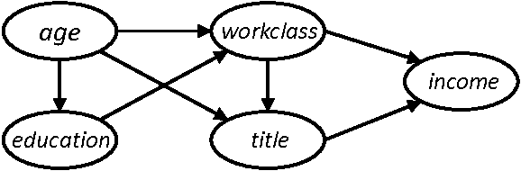
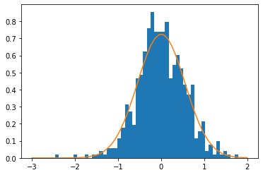
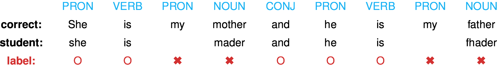
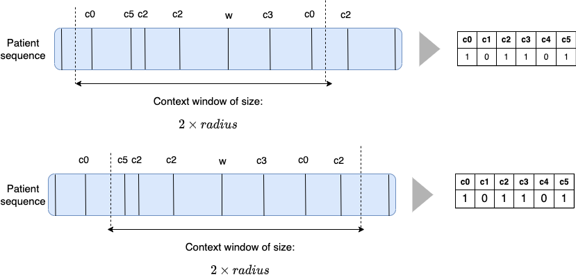
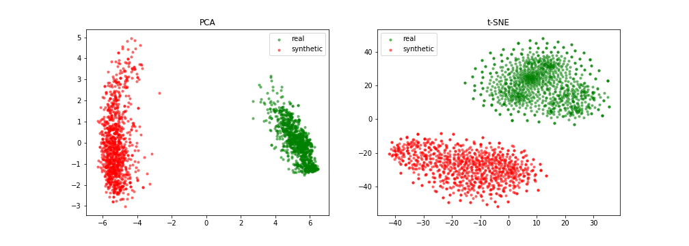
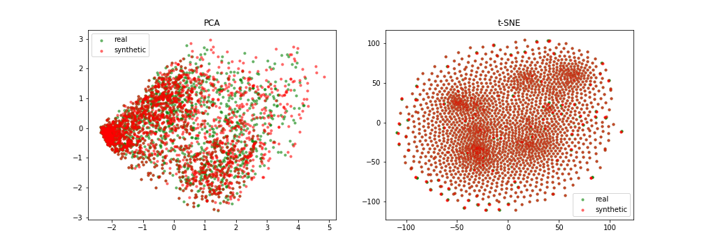

% Privacy-Preserving Synthetic Educational Data Generation
% Jill-Jênn Vie; \alert{Tomas Rigaux}; Sein Minn
% September 15, 2022
---
institute: \includegraphics[height=1cm]{figures/inria.png}
colorlinks: true
biblio-style: authoryear
biblatexoptions: natbib
header-includes:
    - \usepackage{bm}
    - \usepackage{tikz}
    - \usepackage{booktabs}
    - \usepackage{colortbl}
    - \DeclareMathOperator\logit{logit}
    - \def\Dt{D_\theta}
    - \def\E{\mathbb{E}}
    - \def\logDt{\log \Dt(x)}
    - \def\logNotDt{\log(1 - \Dt(x))}
---

# Goal

- It is hard to get access to educational data for research, considered too sensitive
- Open data is great! But a dataset posted online may be archived forever (privacy issues)
- How about having instead access to a fake dataset? (ex. for reproducibility of experiments)

# Outline

- Can pseudonymization guarantee privacy? (spoiler: no)
- Format of educational tabular data
- Framework for assessing privacy leaks in data generation
    - Membership inference
    - Metrics: utility and re-identification
- We present: generative models, attack model, results

# Removing names / pseudonymizing does not ensure privacy

Using the pseudonymized Netflix dataset of ratings given by users (identified by ID) on movies, @narayanan2008robust matched:

- \alert{some public} ratings on IMDb of some user's public profile  
- with \alert{all their private} ratings in the Netflix dataset

revealing their political & sexual preferences or religious views.

\vfill \scriptsize
\fullcite{narayanan2008robust}

# Few points are enough to uniquely identify users

\normalsize
4 timestamp-location points are needed to uniquely identify 95\% of individual trajectories in a dataset of 1.5M rows

\scriptsize
\fullcite{de2013unique}

\vspace{1cm}

\normalsize
15 demographic points are enough to re-identify 99.96\% of Americans

\scriptsize
\fullcite{rocher2019estimating}

<!---
# Differentially private graphical models

## $\varepsilon$-differential privacy

$$ \left|\log \frac{Pr(A(D_1) \in S)}{Pr(A(D_2) \in S)}\right| \leqslant \varepsilon $$

for all datasets $D_1$ and $D_2$ that differ on a single element  
for all possible subsets $S$ (of $\textnormal{Im } A$)

## PrivBayes \citep{zhang2017privbayes}

{width=50%}

However, we need a dynamic model
-->

# Intuition

Knowledge parameters are safe to be shared

User parameters should not be the true ones, but drawn from the same distribution (or blurred)

\centering

{width=50%}

# Example data

\begin{table}[h]
%\caption{Example of minimal tabular dataset.}
\label{example-dataset}
\centering
\resizebox{\textwidth}{!}{%
\begin{tabular}{ccc} \toprule
user ID & action ID & outcome \\ \midrule
2487 & 384 & 1 \\
2487 & 242 & 0 \\
2487 & 39 & 1 \\
2487 & 65 & 1 \\ \bottomrule
\end{tabular}
\arrayrulecolor{white}
\begin{tabular}{l} \toprule
description \\ \midrule
user 2487 got token ``I'' correct \\
user 2487 got token ``ate'' incorrect \\
user 2487 got token ``an'' correct \\
user 2487 got token ``apple'' correct \\ \bottomrule
\end{tabular}
}
\arrayrulecolor{black}
\end{table}

To generate this, we can have two generative models:

- Sequence generation: Predicting the next action ID
- Response pattern generation: Predicting the outcome given user ID and action ID

# Item response theory for response pattern generation

Well known model (Rasch, 1961)

Ex. $r_{ij}$ is 1 if user $i$ gets a positive outcome on action (item) $j$

$$p_{ij} = \Pr(R_{ij} = 1) = \sigma(\theta_i - d_j)$$

\noindent
where $\theta_i$ is ability of user $i$ and $d_j$ is difficulty of action $j$

\vspace{1cm}

Trained using Newton's method: minimize log-loss $\mathcal{L} = \sum_{i, j} (1 - r_{ij}) \log (1 - p_{ij}) + r_{ij} \log p_{ij}$

# Generation

Generative model

For example, Bayesian networks:

{width=50%}

\centering
\begin{tikzpicture}[
    xscale=3,
    yscale=2,
    data/.style={draw},
    >=stealth
]
\node[data] (original) at (0,0) {Original};
\node[data] (training) at (1,0) {Training set};
\node[data] (fake) at (1,-1) {Fake set};
\draw[->] (original) edge node[above=3mm] {sampling half users} (training);
\draw[->] (training) edge node[right] {generator} (fake);
\end{tikzpicture}

# Utility: fake dataset should be useful

\centering
Practitioners who conduct study on the real and fake dataset should have \alert{similar} findings

$\downarrow$

Trained IRT model on original dataset should have parameters that are \alert{not too far} in $RMSE = \sqrt{\sum_{j = 1}^N (d_j - \widehat{d_j})^2}$

\raggedright \footnotesize
(where $d_j, \widehat{d_j}$ are item $j$'s inferred difficulty from the real and fake datasets)

\normalsize
\centering
\begin{tikzpicture}[
    xscale=3,
    yscale=2,
    data/.style={draw},
    >=stealth
]
\node[data] (original) at (0,0) {Original};
\node[data] (training) at (1,0) {Training set};
\node[data] (fake) at (1,-1) {Fake set};
\node[data,text width=1.6cm,text centered] (real-irt) at (2,0) {Real item params $d$};
\node[data,text width=1.6cm,text centered] (fake-irt) at (2,-1) {Fake item params $\hat{d}$};
\draw[->] (original) edge node[above=3mm] {sampling half users} (training);
\draw[->] (training) edge node[right] {generator} (fake);
\draw[<->] (real-irt) edge node[right] {RMSE} (fake-irt);
\draw[->] (training) edge node[above] {IRT} (real-irt);
\draw[->] (fake) edge node[above] {IRT} (fake-irt);
\end{tikzpicture}

# Membership inference: reidentification task

\centering
It should not be easy to re-identify people / the fake dataset should not leak too much information about participants

$\downarrow$

An attacker has to guess, from a broader population, who was in the training set (predict 1 if in training, 0 otherwise)

\centering
\begin{tikzpicture}[
    xscale=3,
    yscale=2,
    data/.style={draw},
    >=stealth
]
\node[data] (original) at (0,0) {Original};
\node[data] (training) at (1,0) {Training set};
\node[data] (fake) at (1,-1) {Fake set};
\node[data,text width=1.6cm,text centered] (real-irt) at (2,0) {Real item params $d$};
\node[data,text width=1.6cm,text centered] (fake-irt) at (2,-1) {Fake item params $\hat{d}$};
\draw[->] (original) edge node[above=3mm] {sampling half users} (training);
\draw[->] (training) edge node[right] {generator} (fake);
\draw[<->] (real-irt) edge node[right] {RMSE} (fake-irt);
\draw[red,->,dashed,bend right] (original) edge (training);
\draw[red,->,dashed,bend left=60,text width=2cm,text centered] (fake) edge node[below left] {reidentify\\AUC} (training);
\draw[->] (training) edge node[above] {IRT} (real-irt);
\draw[->] (fake) edge node[above] {IRT} (fake-irt);
\end{tikzpicture}

(framework inspired by NeurIPS "Hide and Seek" challenge in healthcare by \cite{jordon2020hide})

# Example scenarios of membership inference

Membership inference seems innocuous, but could lead to privacy issues.

For instance, if we want to publish a dataset of test results for students with \alert{special needs} using an anonymizing method, it shouldn't be possible to guess who was selected to generate the published dataset.

<!-- Should the system be able to adapt to people with special needs, without guessing the condition? -->

More generally, any leak of information is potentially bad

# Reidentification

We use a heuristic based on Longest Common Subsequence (LCS) to reidentify

\begin{figure}
\centering
\begin{tikzpicture}[scale=0.5]
\node at (0, 0) {384};
\node at (2, 0) [draw=blue] {39};
\node at (4, 0) [draw=blue] {39};
\node at (6, 0) {65};
\node at (8, 0) [draw=blue] {17};
\draw (-2, 1) -- (10, 1);
\node at (-1, 2) {65};
\node at (1, 2) {39};
\node at (3, 2) [draw=blue] {39};
\node at (5, 2) [draw=blue] {39};
\node at (7, 2) [draw=blue] {17};
\node at (9, 2) {242};
\end{tikzpicture}

LCS: $39 - 39 - 17$ with length 3
\end{figure}

For each user in the original dataset, this heuristic gives a \alert{matching score}, and we compute the Area under the ROC curve (AUC) associated with those scores for the training dataset classification task

Users with too few actions (in the information entropy sense) are excluded

# Experiments

Baseline: Drop $p \%$ is dropping $p \%$ of rows and renumbering the user IDs

Sequence generation model: RNN or Markov chain (probability to jump from an action to another)

Predicting the outcome: IRT

# Histogram of actions ($y$-axis: frequency)

\centering

Actions

# Quantitative results

{width=49%}
{width=49%}

$\downarrow$ low distance between real and fake parameters, lower is better (high utility)

$\leftarrow$ low reidentification score, lower is better (hard to identify)

<!---
# Slided bag of events for SNDS

# A bad example

# A good example

{width=100%}
-->

# Take home message

We managed to generate fake datasets that are:

- useful for practitioners (because item difficulties can be estimated similarly)
- hard to re-identify (because membership inference is not possible)

Extensions:

- Our approach can be easily generalized to more complicated datasets
- With more columns it is even easier to re-identify

Let's share the data of people who do not exist!  
Generating synthetic datasets for reproducing experiments

\vspace{1cm}

# Thanks! Questions?

- Slides on \href{https://jjv.ie/slides/ectel2022.pdf}{jjv.ie/slides/ectel2022.pdf}
- Code on \href{https://github.com/Akulen/PrivGen}{github.com/Akulen/PrivGen}
