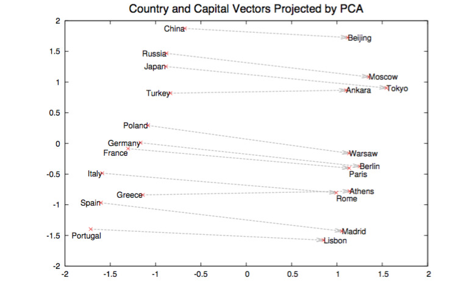

% Embeddings: learning representations for unsupervised learning
% Marc Lelarge; Kevin Scaman; Jill-Jênn Vie
% Oct 28, 2022
---
aspectratio: 169
header-includes: |
  ```{=tex}
  \usepackage{tikz}
  \usepackage{bm}
  \def\x{{\bm{x}}}
  \def\y{{\bm{y}}}
  \def\u{{\bm{u}}}
  \def\v{{\bm{v}}}
  \def\X{{\bm{X}}}
  \def\e{{\bm{e}}}
  \def\W{{\bm{W}}}
  \def\L{\mathcal{L}}
  \def\R{\mathbf{R}}
  \usepackage{datetime2}
  ```
---
# Supervised learning \hfill Unsupervised learning

:::::: {.columns}
::: {.column}
We observe $\x, y$

i.e. classification, regression


:::
::: {.column}
\pause
We just observe $\x$

i.e. raw text, music, ratings

:::
::::::

\pause

It all deals with learning a representation of the data: embedding entities into $\R^d$

# Context

- Dealing with unlabeled data, like raw text
- Dealing with tabular data, which mixes \alert{categorical} and continuous variables
- Detecting outliers in the dataset
- Or mistakes in labels

## Natural language processing

- A document can be represented as a sparse vector $\x$ of size 60,000 where $\x_i$ is the number of occurrences of the $i$th word.
- Could we guess meaning from context like humans?

# Learned embeddings have interesting properties: word2vec

\centering
{width=70%}

\raggedright \small \fullcite{mikolov2013}

# Multilingual word embeddings (unsupervised)

\centering

{width=40%}

\raggedright
\fullcite{lample2018word}

# Application: Recommender Systems

## Problem

- Every user rates few items (1 %)
- How to infer missing ratings?

## Example

\begin{tabular}{ccccc}
& \includegraphics[height=2.5cm]{figures/1.jpg} & \includegraphics[height=2.5cm]{figures/2.jpg} & \includegraphics[height=2.5cm]{figures/3.jpg} & \includegraphics[height=2.5cm]{figures/4.jpg}\\
Sacha & ? & 5 & 2 & ?\\
Ondine & 4 & 1 & ? & 5\\
Pierre & 3 & 3 & 1 & 4\\
Joëlle & 5 & ? & 2 & ?
\end{tabular}

# Application: Recommender Systems

## Problem

- Every user rates few items (1 %)
- How to infer missing ratings?

## Example

\begin{tabular}{ccccc}
& \includegraphics[height=2.5cm]{figures/1.jpg} & \includegraphics[height=2.5cm]{figures/2.jpg} & \includegraphics[height=2.5cm]{figures/3.jpg} & \includegraphics[height=2.5cm]{figures/4.jpg}\\
Sacha & \alert{3} & 5 & 2 & \alert{2}\\
Ondine & 4 & 1 & \alert{4} & 5\\
Pierre & 3 & 3 & 1 & 4\\
Joëlle & 5 & \alert{2} & 2 & \alert{5}
\end{tabular}

# Encoding the problem

## Matrix completion (unsupervised)

Given sparse entries $M_{ij}$ find the other entries $M_{ij}$

## Supervised problem

- $\X = \{(i, j)\}$ are the categorical observed indices (ex. user $i$ and item $j$)
- $\y = \{R_{ij}\}$ are the continuous (or categorical) ratings

# Learning embeddings

Embedding $n$ entities into $\R^d$ is equivalent to learning a $n \times d$ matrix $\W$ s.t. embedding of entity $i$ is $W_i$.

One-hot encoding
:	
$\e_j = (0, \ldots, 0, \underbrace1_j, 0, \ldots, 0)$ so that $\W \e_j = W_j$

\centering


# Dimensionality reduction, or best approximation of rank $k$

Input: $n \times m$ matrix $\X$

Minimize: $||\X - M||^2_2 = \sum_{i, j} (X_{ij} - M_{ij})^2$ where $rank(M) = k$

\pause

Solution: compute the singular value decomposition (SVD) $\X = U \Sigma V^T$ where

- $U$ ($n \times r$) is orthogonal: $U^T U = I_r$ where $r = rank(\X)$
- $\Sigma$ ($r \times r$) is diagonal: its values $\lambda_1 \geq \ldots \geq \lambda_r > 0$
- $V$ ($m \times r$) is orthogonal: $V^T V = I_r$

$k$-SVD is truncated to $k$ biggest singular values. $M = U_k \Sigma_k V_k^T$ is solution. And $W = U_k \Sigma_k$ is a $n \times k$ matrix of embeddings (`pca.transform`).

# KNN $\rightarrow$ measure similarity between users (or items)

## $K$-nearest neighbors

- $R_u$ represents the row vector of user $u$ in the rating matrix (users $\times$ items).
- Similarity score between users (cosine):
$$ score(u, v) = \frac{R_u \cdot R_v}{||R_u|| \cdot ||R_v||}. $$
- Let's identify the $k$-nearest neighbors of user $u$
- And recommend to user $u$ what $u$'s neighbors liked, but $u$ didn't watch

\pause

## Hint

If $R'$ the $N \times M$ matrix of rows $\frac{R_u}{||R_u||}$, we can get the $N \times N$ score matrix by computing $R' R'^T$. May not fit in memory.

# Matrix factorization $\rightarrow$ reduce dimension to generalize

\vspace{-7mm}

$$ R = \left(\begin{array}{c}
R_1\\
R_2\\
\vdots\\
R_n
\end{array}\right) = \raisebox{-1cm}{\begin{tikzpicture}
\draw (0,0) rectangle (2.5,2);
\end{tikzpicture}} =
\raisebox{-1cm}{\begin{tikzpicture}
\draw (0,0) rectangle ++(1,2);
\draw node at (0.5,1) {$U$};
\draw (1.1,1) rectangle ++(2.5,1);
\draw node at (2.35,1.5) {$P$};
\end{tikzpicture}} $$
$$ \text{$R$: 600 users $\times$ 9k works} \iff
\left\{\begin{array}{l}
\text{$U$: 600 users $\times$ \alert{20 profiles}}\\
\text{$P$: \alert{20 profiles} $\times$ 9k works}\\
\end{array}\right. $$
$\R_\text{Bob}$ is a linear combination of profiles $P_1$, $P_2$, etc.

\pause

## Interpreting Key Profiles

\begin{tabular}{@{}lccc@{}}
If $P$ & $P_1$: adventure & $P_2$: romance & $P_3$: plot twist\\
And $U_{\textnormal{Bob}}$ & $0.2$ & $-0.5$ & $0.6$
\end{tabular}

$\Rightarrow$ Bob \alert{likes a bit} adventure, \alert{hates} romance, \alert{loves} plot twists.

# Matrix factorization $\rightarrow$ reduce dimension to generalize

## Train

- $R$ ratings, \alert{$U$} user embeddings, \alert{$V$} item embeddings.

$$R = \alert{UV^T} \qquad \hat{r}_{ij} = \u_i^T \v_j$$

\pause

## Test: Will user $i'$ like item $j'$?

- Just compute $\u_{i'}^T \v_{j'}$

# Objective: regularized squared loss

$$\L = \sum_{i,j}~(\underbrace{\u_i^T \v_j}_{\textnormal{pred}} - \underbrace{r_{ij}}_{\textnormal{real}})^2 + \underbrace{\lambda || \u_i ||_2^2 + \lambda || \v_j ||_2^2}_{\textnormal{regularization}}$$

## Variants

SVD: $\sum_{\textnormal{\alert{all} } i, j}~(\u_i^T \v_j - r_{ij})^2$ (missing pairs are imputed to zero)

ALS-WR : $\sum_{i, j \textnormal{\alert{ known}}}~(\u_i^T \v_j - r_{ij})^2 + \lambda (\sum_i N_i ||\u_i||^2 + \sum_j M_j ||\v_j||^2)$  
where $N_i$ (resp. $M_j$): how many times user $i$ rated items (resp. item $j$ was rated)

# Computing the gradients

$$\L = \sum_{i,j} (\underbrace{\u_i^T \v_j}_{\textnormal{pred}} - \underbrace{r_{ij}}_{\textnormal{real}})^2 + \underbrace{\lambda || \u_i ||_2^2 + \lambda || \v_j ||_2^2}_{\textnormal{regularization}}$$

\pause

$\L$ is (polynomial and) convex in each $\u_k$ or $\v_\ell$.

Finding \alert{$\u_k$} that minimizes $\L$ $\Rightarrow$ Finding the zeroes of $$\frac{\partial \L}{\partial \u_k} = \sum_{j \textnormal{ rated by } k} 2 (\alert{\u_k}^T \v_j - r_{kj}) \v_j + 2 \lambda \alert{\u_k} = 0$$
can be rewritten $A\alert{\u_k} = B$ so $\alert{\u_k} = A^{-1}B$ (closed form)

Complexity: $O(d^3)$ where $d$ is the (embedding) size of $A$ (but can be parallelized)

\pause

## Algorithm \alert{ALS}: Alternating Least Squares (Zhou, 2008)

- Until convergence (few iterations):
    - Fix $U$ (users) learn $V$ (items) in order to minimize $\L$
    - Fix $V$ find $U$

# Illustration of Alternating Least Squares

\only<1>{\includegraphics[width=0.9\linewidth]{figures/embed0.pdf}}
\only<2>{\includegraphics[width=0.9\linewidth]{figures/embed1.pdf}}
\only<3>{\includegraphics[width=0.9\linewidth]{figures/embed2.pdf}}
\only<4>{\includegraphics[width=0.9\linewidth]{figures/embed3.pdf}}
\only<5>{\includegraphics[width=0.9\linewidth]{figures/embed4.pdf}}
\only<6>{\includegraphics[width=0.9\linewidth]{figures/embed5.pdf}}
\only<7>{\includegraphics[width=0.9\linewidth]{figures/embed6.pdf}}
\only<8>{\includegraphics[width=0.9\linewidth]{figures/embed7.pdf}}
\only<9>{\includegraphics[width=0.9\linewidth]{figures/embed8.pdf}}
\only<10>{\includegraphics[width=0.9\linewidth]{figures/embed9.pdf}}
\only<11>{\includegraphics[width=0.9\linewidth]{figures/embed10.pdf}}
\only<12>{\includegraphics[width=0.9\linewidth]{figures/embed11.pdf}}
\only<13>{\includegraphics[width=0.9\linewidth]{figures/embed12.pdf}}
\only<14>{\includegraphics[width=0.9\linewidth]{figures/embed13.pdf}}
\only<15>{\includegraphics[width=0.9\linewidth]{figures/embed14.pdf}}
\only<16>{\includegraphics[width=0.9\linewidth]{figures/embed15.pdf}}
\only<17>{\includegraphics[width=0.9\linewidth]{figures/embed16.pdf}}
\only<18>{\includegraphics[width=0.9\linewidth]{figures/embed17.pdf}}
\only<19>{\includegraphics[width=0.9\linewidth]{figures/embed18.pdf}}
\only<20>{\includegraphics[width=0.9\linewidth]{figures/embed19.pdf}}
\only<21>{\includegraphics[width=0.9\linewidth]{figures/embed20.pdf}}
\only<22>{\includegraphics[width=0.9\linewidth]{figures/embed21.pdf}}
\only<23>{\includegraphics[width=0.9\linewidth]{figures/embed22.pdf}}
\only<24>{\includegraphics[width=0.9\linewidth]{figures/embed23.pdf}}
\only<25>{\includegraphics[width=0.9\linewidth]{figures/embed24.pdf}}
\only<26>{\includegraphics[width=0.9\linewidth]{figures/embed25.pdf}}
\only<27>{\includegraphics[width=0.9\linewidth]{figures/embed26.pdf}}
\only<28>{\includegraphics[width=0.9\linewidth]{figures/embed27.pdf}}
\only<29>{\includegraphics[width=0.9\linewidth]{figures/embed28.pdf}}
\only<30>{\includegraphics[width=0.9\linewidth]{figures/embed29.pdf}}
\only<31>{\includegraphics[width=0.9\linewidth]{figures/embed30.pdf}}
\only<32>{\includegraphics[width=0.9\linewidth]{figures/embed31.pdf}}
\only<33>{\includegraphics[width=0.9\linewidth]{figures/embed32.pdf}}
\only<34>{\includegraphics[width=0.9\linewidth]{figures/embed33.pdf}}
\only<35>{\includegraphics[width=0.9\linewidth]{figures/embed34.pdf}}
\only<36>{\includegraphics[width=0.9\linewidth]{figures/embed35.pdf}}
\only<37>{\includegraphics[width=0.9\linewidth]{figures/embed36.pdf}}
\only<38>{\includegraphics[width=0.9\linewidth]{figures/embed37.pdf}}
\only<39>{\includegraphics[width=0.9\linewidth]{figures/embed38.pdf}}

# Close $\v_j$ mean similar movies

\centering
{width=80%}

# $\u_i$ will like movies in its direction

\centering
{width=80%}

# word2vec: the Skip-Gram model

We want, given a word $w \sim P(W)$, to predict its \alert{context} (i.e. the words around it).

Oh, it's a classification problem! With 60,000 classes.
$$ P(c | w) = \textnormal{softmax}(\u_w^T \v_c) \propto \exp(\u_w^T \v_c) $$

Cross-entropy would look like:
$$ \L = \log \sigma(\u_w^T \v_c) + \sum_{\substack{i = 1\\c_i \neq c}}^{60000} \log (1 - \sigma(\u_w^T \v_{c_i})) $$

So instead let's just sample $k$ words from vocabulary proportionally to their occurrence:
$$ \L = \sum_{w, c} \log \sigma(\u_w^T \v_c) + \sum_{\substack{i = 1\\c_i \sim P(W)}}^k \log (1 - \sigma(\u_w^T \v_{c_i})) $$

# Neural Word Embedding as Implicit Matrix Factorization

## Noise contrastive estimation
\vspace{-5mm}
$$ \L = \sum_{w, c} \log \sigma(\u_w^T \v_c) + \sum_{\substack{i = 1\\c_i \sim P(W)}}^k \log (1 - \sigma(\u_w^T \v_{c_i})) $$

## Negative sampling (similar objective)
\vspace{-5mm}
$$ \L = \sum_{w, c} \log \sigma(\u_w^T \v_c) + \sum_{\substack{i = 1\\c_i \sim P(W)}}^k \log \sigma(-\u_w^T \v_{c_i})) $$
This objective is equivalent to factorizing the pointwise mutual information matrix:
$$ \log \frac{\#(w, c) N}{\#w \#c} - \log k = \u_w^T \v_c \textnormal{ where $N$ is the number of pairs.} $$

\footnotesize
\fullcite{levy2014neural}

# Practical datasets

## A toy dataset of matrix completion

You are given some entries of $M = U V$ where the shapes are $(10, 3) \cdot (3, 5)$  
The goal is to recover the other entries

## Movielens

100,000 ratings (1--5 stars) of 600 users on 9,000 movies.

\url{https://files.grouplens.org/datasets/movielens/ml-latest-small.zip}

## The Adventures of Sherlock Holmes

By Arthur Conan Doyle

\url{https://github.com/theeluwin/pytorch-sgns}
