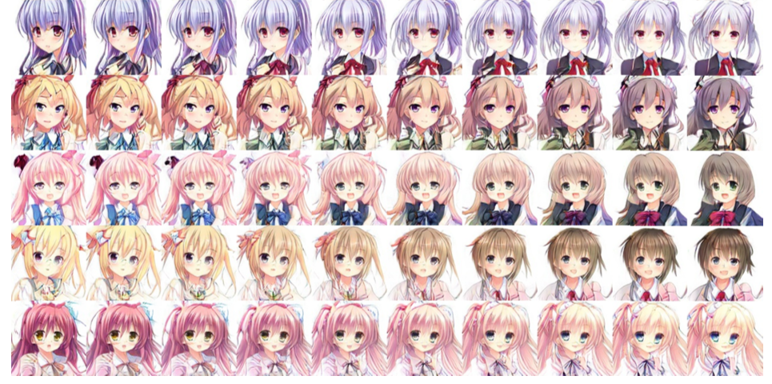

% Research @ Mangaki
% Jill-Jênn Vie
% RIKEN Center for Advanced Intelligence Project (Tokyo)\newline Mangaki (Paris)
---
header-includes:
    - \usepackage{tikz}
    - \usepackage{array}
    - \usepackage{icomma}
    - \usepackage{multicol,booktabs}
    - \def\R{\mathcal{R}}
handout: true
---

# Jill-Jênn Vie

> - 2006: Prépa MP au lycée Thiers
> - 2008: Auditeur 1A à l'ENS de Lyon \hfill (pavages, Markov)
> - 2010: Normalien 3A à l'ENS Paris-Saclay \hfill (langages, crypto)
> - 2012: Master Parisien de Recherche Informatique \hfill (crypto)
> - 2013: Raté un master de mathématiques (MVA) \hfill (Akinator)
> - 2014: Agrégation de mathématiques \hfill (géo diff)
> - 2016: Thèse d'informatique à Paris-Saclay \hfill (active learning)
> - 2017: Postdoc à Tokyo \hfill (crowdsourcing)

# RIKEN Center for Advanced Intelligence Project

\ 

- RIKEN is the biggest public research institution in Japan
- New AI lab near Tokyo Station (opened in 2016)
- 3 interns from Master Vision Apprentissage in ENS Paris-Saclay
- 8 accepted papers at NIPS 2017

# Outline

## Deep Learning

- history
- word2vec
- images

## Recommendation Systems

- KNN
- ALS
- Hybrid

## Further work

- Privacy
- Bias
- Extra sources of information

# Deep Learning

- 1957 : Perceptron : le premier réseau de neurones
- 1969 : Minsky met en évidence des limitations $\rightarrow$ perte de fonds

**Trio conspirationniste**

Geoffrey Hinton (Canadien @ Univ. Toronto & Google Brain)  
Yann LeCun (Français @ Facebook AI Research), son postdoc
Yoshua Bengio (Français @ Univ. Montréal), son postdoc

\pause

> - 2007 : fake workshop organisé à NIPS
> - 2012 : breakthrough traitement du langage
> - 2015 : breakthrough reconnaissance d'images
> - 2017 : \$\$\$

# word2vec (Mikolov et al., 2013)

- word $\rightarrow \mathbb{R}^d$
- document $\rightarrow$ mean of vectors of words

\ 

Also: $king - man + woman = queen$.

# images2vec

\ 

# Image recognition

\centering

\   
\ 

# Image captioning

\ 

# Image captioning + attention (Xu and Bengio, 2015)

\ 

# Translation + attention

\centering

\ 

# Generative Adversarial Networks (Goodfellow, 2014)

\ 

Article cité 1340 fois.

# Image interpolation

\centering

\ 

# MakeGirls.Moe (Jin et al., 2017)

\ 

# Recommender systems

## Problem

- Every user rates few items (1 %)
- How to infer missing ratings?

\begin{tabular}{ccccc}
& \includegraphics[height=2.5cm]{figures/1.jpg} & \includegraphics[height=2.5cm]{figures/2.jpg} & \includegraphics[height=2.5cm]{figures/3.jpg} & \includegraphics[height=2.5cm]{figures/4.jpg}\\
Sacha & ? & 5 & 2 & ?\\
Ondine & 4 & 1 & ? & 5\\
Pierre & 3 & 3 & 1 & 4\\
Joëlle & 5 & ? & 2 & ?
\end{tabular}

# Filtrage collaboratif

\begin{tabular}{ccccc}
& \includegraphics[height=2.5cm]{figures/1.jpg} & \includegraphics[height=2.5cm]{figures/2.jpg} & \includegraphics[height=2.5cm]{figures/3.jpg} & \includegraphics[height=2.5cm]{figures/4.jpg}\\
Sacha & \alert{3} & 5 & 2 & \alert{2}\\
Ondine & 4 & 1 & \alert{4} & 5\\
Pierre & 3 & 3 & 1 & 4\\
Joëlle & 5 & \alert{2} & 2 & \alert{5}
\end{tabular}

# Every supervised machine learning algorithm

## fit($X$, $y$)

\centering
\begin{tabular}{ccc} \toprule
\multicolumn{2}{c}{$X$} & $y$\\ \cmidrule{1-2}
\texttt{user\_id} & \texttt{work\_id} & \texttt{rating}\\ \midrule
24 & 823 & like\\
12 & 823 & dislike\\
12 & 25 & favorite\\
\ldots & \ldots & \ldots\\ \bottomrule
\end{tabular}

\pause

## $\hat{y}$ = predict($X$)

\centering
\begin{tabular}{ccc} \toprule
\multicolumn{2}{c}{$X$} & $\hat{y}$\\ \cmidrule{1-2}
\texttt{user\_id} & \texttt{work\_id} & \texttt{rating}\\ \midrule
24 & 25 & \only<2>{?}\only<3>{\alert{disliked}}\\
12 & 42 & \only<2>{?}\only<3>{\alert{liked}}\\ \bottomrule
\end{tabular}

# Algorithme des plus proches voisins

Pour recommander des films à quelqu'un :

- On introduit un \alert{score de similarité} entre personnes
- On détermine les 10 personnes \alert{les plus proches} de lui
- On lui recommande ce qu'ils ont aimé qu'il n'a pas vu

# Nos données

\begin{tabular}{c@{\hspace{3mm}}c@{\hspace{3mm}}c@{\hspace{3mm}}c@{\hspace{3mm}}c@{\hspace{3mm}}c@{\hspace{3mm}}c}
& \footnotesize{007} & \footnotesize{Batman 1} & \footnotesize{Shrek 2} & \footnotesize{Toy Story 3} & \footnotesize{Star Wars 4} & \footnotesize{Twilight 5}\\
Alice & $+$ & $-$ & $0$ & $+$ & $0$ & $-$\\
Bob & $-$ & $0$ & $+$ & $-$ & $+$ & $+$\\
Charles & $+$ & $+$ & $+$ & $+$ & $-$ & $-$\\
Daisy & $+$ & $+$ & $0$ & $0$ & $+$ & $-$\\
Everett & $+$ & $-$ & $+$ & $+$ & $-$ & $0$\\
\end{tabular}

\begin{center}
Quel score de similarité entre utilisateurs choisir ?
\end{center}

# Calcul du score

\begin{tabular}{c@{\hspace{3mm}}c@{\hspace{3mm}}c@{\hspace{3mm}}c@{\hspace{3mm}}c@{\hspace{3mm}}c@{\hspace{3mm}}c}
& \footnotesize{007} & \footnotesize{Batman 1} & \footnotesize{Shrek 2} & \footnotesize{Toy Story 3} & \footnotesize{Star Wars 4} & \footnotesize{Twilight 5}\\
Alice & $+$ & $-$ & $0$ & $+$ & $0$ & $-$\\
Charles & $+$ & $+$ & $+$ & $+$ & $-$ & $-$\\
Score & $+1$ & $-1$ & & $+1$ & & +1\\
\end{tabular}
\vspace{-1mm}
\begin{center}
$score(\textnormal{Alice}, \textnormal{Charles}) = 3 + (-1) = \alert{2}$  
\end{center}
\vspace{2mm}

\begin{tabular}{c@{\hspace{3mm}}c@{\hspace{3mm}}c@{\hspace{3mm}}c@{\hspace{3mm}}c@{\hspace{3mm}}c@{\hspace{3mm}}c}
& \footnotesize{007} & \footnotesize{Batman 1} & \footnotesize{Shrek 2} & \footnotesize{Toy Story 3} & \footnotesize{Star Wars 4} & \footnotesize{Twilight 5}\\
Alice & $+$ & $-$ & $0$ & $+$ & $0$ & $-$\\
Bob & $-$ & $0$ & $+$ & $-$ & $+$ & $+$\\
Score & $-1$ & & & $-1$ & & -1\\
\end{tabular}
\vspace{-1mm}
\begin{center}
$score(\textnormal{Alice}, \textnormal{Bob}) = \alert{-3}$\bigskip
\vspace{2mm}

Alice est \alert{plus proche} de Charles que de Bob
\end{center}

# Score de similarité entre personnes

\begin{center}
\begin{tabular}{c@{\hspace{2mm}}|c@{\hspace{2mm}}c@{\hspace{2mm}}c@{\hspace{2mm}}c@{\hspace{2mm}}c}
& Alice & Bob & Charles & Daisy & JJ\\
\hline
Alice & $4$ & $-3$ & $2$ & $1$ & $3$\\
Bob & $-3$ & $5$ & $-3$ & $-1$ & $-2$\\
Charles & $2$ & $-3$ & $6$ & $2$ & $3$\\
Daisy & $1$ & $-1$ & $2$ & $4$ & $-1$\\
Everett & $3$ & $-2$ & $3$ & $-1$ & $5$\\
\end{tabular}
\end{center}

\begin{center}
Qui sont les 2 plus proches voisins d'Alice ?
\end{center}

# Evaluation: Root Mean Squared Error (RMSE)

If I predict $\hat{y_i}$ for each user-work pair to test among $n$,  
while truth is $y^*_i$:

$$ RMSE(\hat{y}, y^*) = \sqrt{\frac1n \sum_i (\hat{y}_i - y^*_i)^2}. $$

# Dataset: Mangaki

\ 

- 2300 users
- 15000 works \textcolor{gray}{\hfill {\em \small anime / manga / OST}}
- 340000 ratings \textcolor{gray}{\hfill {\em \small fav / like / dislike / neutral / willsee / wontsee}}
- User can rate anime or manga
- And receive recommendations
- And reorder their watchlist

\pause

- Code is 100% on GitHub  
- Awards from Microsoft and Japanese Foundation
- Made a data challenge with Kyoto U! `research.mangaki.fr`

# Recommendation algorithms

Content-based

:   (features for movies: directors, genre, etc.)

Collaborative filtering

:   (solely based on ratings)

Hybrid recommender systems

:   (combine those two)

# KNN $\rightarrow$ measure similarity between users (or items)

## $K$-nearest neighbors

- $\R_u$ represents the row vector of user $u$ in the rating matrix (users $\times$ works).
- Similarity score between users (cosine):
$$ score(u, v) = \frac{\R_u \cdot \R_v}{||\R_u|| \cdot ||\R_v||}. $$
- Let's identify the $k$-nearest neighbors of user $u$
- And recommend to user $u$ what $u$'s neighbors liked  
but $u$ didn't see

## Hint

If $R'$ the $N \times M$ matrix of rows $\frac{\R_u}{||\R_u||}$, we can get the $N \times N$ score matrix by computing $R' R'^T$.

# Matrix factorization $\rightarrow$ reduce dimension to generalize

\vspace{-7mm}

$$ R = \left(\begin{array}{c}
\R_1\\
\R_2\\
\vdots\\
\R_n
\end{array}\right) = \raisebox{-1cm}{\begin{tikzpicture}
\draw (0,0) rectangle (2.5,2);
\end{tikzpicture}} =
\raisebox{-1cm}{\begin{tikzpicture}
\draw (0,0) rectangle ++(1,2);
\draw node at (0.5,1) {$C$};
\draw (1.1,1) rectangle ++(2.5,1);
\draw node at (2.35,1.5) {$P$};
\end{tikzpicture}} $$
$$ \text{$R$: 2k users $\times$ 15k works} \iff
\left\{\begin{array}{l}
\text{$C$: 2k users $\times$ \alert{20 profiles}}\\
\text{$P$: \alert{20 profiles} $\times$ 15k works}\\
\end{array}\right. $$
$\R_\text{Bob}$ is a linear combination of profiles $P_1$, $P_2$, etc..

\pause

## Interpreting Key Profiles

\begin{tabular}{@{}lccc@{}}
If $P$ & $P_1$: adventure & $P_2$: romance & $P_3$: plot twist\\
And $C_u$ & $0,2$ & $-0,5$ & $0,6$
\end{tabular}

$\Rightarrow$ $u$ \alert{likes a bit} adventure, \alert{hates} romance, \alert{loves} plot twists.

\vspace{2mm}

\pause

## Ex. Singular Value Decomposition (SVD)

$R = (U \cdot \Sigma)V^T$ where $U : N \times r$ et $V : M \times r$ are orthogonal and $\Sigma : r \times r$ is diagonal, with singular values in decreasing order.

# Visualizing first two columns of $V_j$ in SVD

\alert{Closer} points mean similar taste

\ 

# Find your taste by plotting first two columns of $U_i$

You will \alert{like} movies that are \alert{in your direction}

\ 

# Variants of Matrix Factorization for Recommendation

$R$ ratings, $C$ coefficients, $P$ profiles ($F$ features).

$R = CP = CF^T \Rightarrow r_{ij} \simeq \hat{r}_{ij} \triangleq C_i \cdot F_j$.

## Objective functions (reconstruction error) to minimize

SVD : $\sum_{i, j}~(r_{ij} - C_i \cdot F_j)^2$ (deterministic)

\pause

ALS : $\sum_{i, j \textnormal{\alert{ known}}}~(r_{ij} - C_i \cdot F_j)^2$

\pause

\alert<6>{ALS-WR} : $\sum_{i, j \textnormal{\alert{ known}}}~(r_{ij} - C_i \cdot F_j)^2 + \lambda (\sum_i \alert<6>{N_i} ||C_i||^2 + \sum_j \alert<6>{M_j} ||F_j||^2)$  
where $N_i$ ($M_j$): how many times user $i$ rated (item $j$ was rated)

\pause

WALS by Tensorflow™ : $$\sum_{i, j} w_{ij} \cdot (r_{ij} - C_i \cdot F_j)^2 + \lambda (\sum_i ||C_i||^2 + \sum_j ||F_j||^2)$$  
where $w_{ij}$: how much can you trust rating $r_{ij}$.

\pause

## Who do you think wins?

# ALS for feature extraction

$R = CP$

## Issue: Item Cold-Start

- If no ratings are available for an anime  
$\Rightarrow$ no feature will be trained
- If anime features at put to 0  
$\Rightarrow$ prediction of ALS will be constant for every unrated anime.

\pause

## But we have posters!

- On Mangaki, almost all works have a poster
- How to extract information?

# Illustration2Vec (Saito and Matsui, 2015)

\centering

{width=40%}\ 
{width=40%}\ 

- CNN (VGG-16) pretrained on ImageNet, trained on Danbooru  
(1.5M illustrations with tags)
- 502 most frequent tags kept, outputs \alert{tag weights}

# Ce que les stagiaires ont fait avec Illustration2Vec

\ 

# Ce que les stagiaires ont fait avec Illustration2Vec II

\ 

# Blended Alternate Least Squares with Explanation

\centering

# LASSO for explanation of user preferences

$T$ matrix of 15000 works $\times$ 502 tags ($t_{jk}$: tag $k$ appears in item $j$)

- Each user is described by its preferences $P_i$  
$\rightarrow$ a \alert{sparse} row of weights over tags.
- Estimate user preferences $P_i$ such that $r_{ij} \simeq P_iT_j^T$.

\pause

## Least Absolute Shrinkage and Selection Operator (LASSO)

$$ \frac1{2 N_i} {\lVert \R_i - P_i T^T \rVert}_2^2 + \alpha \alert{ {\lVert P_i \rVert}_1}. $$

\noindent
where $N_i$ is the number of items rated by user $i$.

\pause

## Interpretation and explanation

- *You seem to like \alert{\emph{magical girls}} but not \alert{\emph{blonde hair}}  
$\Rightarrow$ Look! All of them are \alert{\emph{brown hair}}! Buy now!*

# Blending

We would like to do:

$$ \hat{r}_{ij}^{BALSE} = \begin{cases}
\hat{r}_{ij}^{ALS} & \text{if item $j$ was rated at least $\gamma$ times}\\
\hat{r}_{ij}^{LASSO} & \text{otherwise}
\end{cases} $$

But we can't. Why? \pause \alert{Not differentiable!}

$$ \hat{r}_{ij}^{BALSE} = \alert{\sigma(\beta(R_j - \gamma))} \hat{r}_{ij}^{ALS} + \left(1 - \alert{\sigma(\beta(R_j - \gamma))}\right) \hat{r}_{ij}^{LASSO} $$

\noindent
where $R_j$ denotes how many times item $j$ was rated  
$\beta$ and $\gamma$ are learned by stochastic gradient descent.

\pause

\centering

We call this gate the \alert{Steins;Gate}.

# Blended Alternate Least Squares with Explanation

\centering

\ 

\pause

We call this model \alert{BALSE}.

# Results

\centering

\ 

# Further Work

## Privacy

Si on apprend un modèle génératif (type GAN) à générer des fake ratings  
On peut ouvrir notre dataset sans risquer que les gens soient identifiés

## Bias

Existe-t-il une minorité (ex. filles) insatisfaite sur Mangaki ?

## Intégrer des sources d'informations extérieures

Wikidata, TV Tropes, AniDB, etc.

# Thank you!

\centering
{width=50%}\ 

\raggedright

## Read the article

\small
Using Posters to Recommend Anime and Mangas in a Cold-Start Scenario

\normalsize
\alert{github.com/mangaki/balse} (PDF on arXiv, front page of HNews)

## Mangaki Data Challenge: \alert{research.mangaki.fr}

- Who won? Japan? France? US? Korea? \alert<2>{China?} You?

## Try it: \alert{https://mangaki.fr} \newline Twitter: \alert{@MangakiFR}
