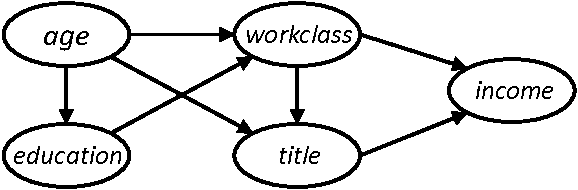

% Privacy-Preserving Tabular Data Generation
% Matthieu Doutreligne; Aymeric Floyrac; Pierre-Alain Jachiet; Sein Minn; Tomas Rigaux; \alert{Jill-Jênn Vie}
% May 9, 2022
---
institute: \includegraphics[width=2cm]{figures/soda.png}
colorlinks: true
biblio-style: authoryear
biblatexoptions: natbib
header-includes:
    - \usepackage{bm}
    - \usepackage{tikz}
    - \usepackage{booktabs}
    - \usepackage{colortbl}
    - \DeclareMathOperator\logit{logit}
    - \def\Dt{D_\theta}
    - \def\E{\mathbb{E}}
    - \def\logDt{\log \Dt(x)}
    - \def\logNotDt{\log(1 - \Dt(x))}
---

# Intro

- It is hard to get access to sensitive data[^1]
- A dataset posted online may be archived forever
- How about having instead access to:
    - statistics
    - conditional probabilities
    - a fake dataset? (ex. for reproducibility)

[^1]: Is it for the sake of privacy, safety, or just administrative sadism?

# Outline

- Privacy
- Metrics: utility and re-identification
- Attack models
    - Weak: Membership inference
    - Strong: Train on real and fake, learn to distinguish the two

# Striking facts

## People pseudonymize, but it's not enough
@narayanan2008robust managed to de-anonymize a Netflix pseudonymized dataset of seen movies with IMDb

## People $k$-anonymize, but high-dimensional data (e.g. mobility) is rarely $k$-anonymizable

- 4 timestamp-location points are needed to uniquely identify 95\% of individual trajectories in a dataset of 1.5M rows \citep{de2013unique}
- 15 demographic points are enough to re-identify 99.96\% of Americans \citep{rocher2019estimating}

# Differentially private graphical models

## $\varepsilon$-differential privacy

$$ \left|\log \frac{Pr(A(D_1) \in S)}{Pr(A(D_2) \in S)}\right| \leqslant \varepsilon $$

for all datasets $D_1$ and $D_2$ that differ on a single element  
for all possible subsets $S$ (of $\textnormal{Im } A$)

## PrivBayes \citep{zhang2017privbayes}

{width=50%}

However, we need a dynamic model

# Intuition

Knowledge embeddings are safe to be shared

User embeddings however should be drawn from distribution

\centering

{width=50%}

# Example data

\begin{table}[h]
%\caption{Example of minimal tabular dataset.}
\label{example-dataset}
\centering
\resizebox{\textwidth}{!}{
\begin{tabular}{ccc} \toprule
user ID & action ID & outcome \\ \midrule
2487 & 384 & 1 \\
2487 & 242 & 0 \\
2487 & 39 & 1 \\
2487 & 65 & 1 \\ \bottomrule
\end{tabular}
\arrayrulecolor{white}
\begin{tabular}{l} \toprule
description \\ \midrule
user 2487 got token ``I'' correct \\
user 2487 got token ``ate'' incorrect \\
user 2487 got token ``an'' correct \\
user 2487 got token ``apple'' correct \\ \bottomrule
\end{tabular}
}
\arrayrulecolor{black}
\end{table}

So in our case there are two models:

- Sequence generation (Markov chain, RNN)
- Response pattern generation (IRT, Bayesian networks)

# Item response theory for response pattern generation

Ex. $r_{ij}$ is 1 if user $i$ got a positive outcome on action (item) $j$

$$p_{ij} = \Pr(R_{ij} = 1) = \sigma(\theta_i + e_j)$$

\noindent
where $\theta_i$ is ability of user $i$ and $e_j$ is easiness of action $j$

\vspace{1cm}

Trained using Newton's method: minimize log-loss $\mathcal{L} = \sum_{i, j} (1 - r_{ij}) \log (1 - p_{ij}) + r_{ij} \log p_{ij}$

# Logistic regression with sparse features

Let us encode the event (user $i$, item $j$) as a two-hot vector $\bm{x}$:

\centering

$p_{ij} = \sigma(\langle \alert{\bm{w}}, \bm{x} \rangle) = \sigma(\sum_k \alert{w_k} x_k) = \sigma(\alert{\theta_i} + \alert{e_j})$

# Utility

\centering
Practictioners who conduct study on the real and fake dataset should have similar findings

$\downarrow$

Trained model on original dataset should have parameters that are not too far in RMSE

\raggedright

We also consider weighted RMSE:

$$ wRMSE = \sqrt{\sum_{i = 1}^N w_i (d_i - \widehat{d_i})^2} $$

where $w_i \in [0, 1]$ is the frequency of action $i$ in the training set.

# Reidentification

\centering
It should not be easy to re-identify people / the fake dataset should not leak too much information about participants

$\downarrow$

An attacker has to guess, from a broader population, who was in the training set

\centering
\begin{tikzpicture}[
    xscale=3,
    yscale=2,
    data/.style={draw},
    >=stealth
]
\node[data] (original) at (0,0) {Original};
\node[data] (training) at (1,0) {Training set};
\node[data] (fake) at (1,-1) {Fake set};
\node[data,text width=1.6cm,text centered] (real-irt) at (2,0) {Real item params $d$};
\node[data,text width=1.6cm,text centered] (fake-irt) at (2,-1) {Fake item params $\hat{d}$};
\draw[->] (original) edge node[above=3mm] {sampling half users} (training);
\draw[->] (training) edge node[right] {generator} (fake);
\draw[<->] (real-irt) edge node[right] {RMSE} (fake-irt);
\draw[->,dashed,bend right] (original) edge (training);
\draw[->,dashed,bend left=60,text width=2cm,text centered] (fake) edge node[below left] {reidentify\\AUC} (training);
\draw[->] (training) edge node[above] {IRT} (real-irt);
\draw[->] (fake) edge node[above] {IRT} (fake-irt);
\end{tikzpicture}

(framework inspired by NeurIPS "Hide and Seek" challenge in healthcare by \cite{jordon2020hide})

# Histogram of actions ($y$-axis: frequency)

\centering

Actions

# Quantitative results

{width=49%}
{width=49%}

# Slided bag of events for SNDS

# A bad example

# A good example

{width=100%}

# Take home message

- Let's share the data of people who do not exist

\vspace{1cm}

\pause

Thanks! Questions? \hfill These slides on \href{https://jjv.ie/slides/heka.pdf}{jjv.ie/slides/heka.pdf}
