% Intelligence artificielle
% Jill-Jênn Vie
% 8 mai 2025
---
lang: fr
handout: true
csquotes: true
aspectratio: 169
biblio-style: authoryear
biblatexoptions:
  - backend=biber
  - natbib=true
header-includes: |
  ```{=tex}
  \usepackage{tikz}
  \usepackage{bm}
  \def\x{{\bm{x}}}
  \def\y{{\bm{y}}}
  \def\u{{\bm{u}}}
  \def\v{{\bm{v}}}
  \def\X{{\bm{X}}}
  \def\e{{\bm{e}}}
  \def\W{{\bm{W}}}
  \def\L{\mathcal{L}}
  \def\R{\mathbf{R}}
  \usepackage{datetime2}
  \usepackage{bm}
  \def\E{\mathbb{E}}
  \def\R{\mathbf{R}}
  \def\N{\mathbf{N}}
  \def\C{\mathcal{C}}
  \def\L{\mathcal{L}}
  \def\NN{\mathcal{N}}
  \def\MLP{\textnormal{MLP}}
  \def\x{{\bm{x}}}
  \def\y{{\bm{y}}}
  \def\w{{\bm{w}}}
  \def\W{{\bm{W}}}
  \def\b{{\bm{b}}}
  \def\CC{{\bm{C}}}
  \def\boldth{{\bm{\theta}}}
  \def\hf{{g_\boldth}}
  \usepackage[skins,minted]{tcolorbox}
  \definecolor{bgm}{rgb}{0.95,0.95,0.95}
  \newtcblisting{myminted}[3][]{listing engine=minted,listing only,#1,minted language=#3,colback=bgm,minted options={linenos,fontsize=\footnotesize,numbersep=2mm,escapeinside=||,mathescape=true}}
  \AtEndPreamble{\DefineBibliographyExtras{french}{\restorecommand\mkbibnamefamily}}
  \usepackage{bm}
  \usepackage[skins,minted]{tcolorbox}
  \definecolor{bgm}{rgb}{0.95,0.95,0.95}
  \DeclareMathOperator*{\argmin}{argmin}
  \def\x{\bm{x}}
  \def\y{\bm{y}}
  \def\w{\bm{\theta}}
  \def\m{\bm{\mu}}
  \def\L{\mathcal{L}}
  \def\X{\mathcal{X}}
  \def\Y{\mathcal{Y}}
  \def\C{\mathcal{C}}
  \def\R{\mathbf{R}}
  \setbeamertemplate{navigation symbols}{}
  \setbeamertemplate{footline}{%
    \leavevmode%
    \hbox{%
    \begin{beamercolorbox}[wd=\paperwidth,ht=2.25ex,dp=1ex,right]{date in head/foot}%
      \usebeamerfont{date in head/foot}\insertframenumber\hspace*{2ex}
    \end{beamercolorbox}}%
    \vskip0pt%
  }
  \usepackage{tikz}
  \usepackage{bm}
  \usepackage{booktabs}
  \def\bolda{{\bm{a}}}
  \def\boldth{{\bm{\theta}}}
  \def\X{{\bm{X}}}
  \def\x{{\bm{x}}}
  \def\y{{\bm{y}}}
  \def\Y{{\mathcal{Y}}}
  \def\W{{\bm{W}}}
  \def\b{{\bm{b}}}
  \def\p{{\bm{p}}}
  \def\L{\mathcal{L}}
  \def\R{\mathbb{R}}
  \def\th{\bm{\theta}}
  \def\diag{{\textnormal{diag}}}
  \def\softmax{{\textnormal{softmax}}}
  \def\softplus{{\textnormal{softplus}}}
  \def\sigmoid{{\textnormal{sigmoid}}}
  \def\logsumexp{{\textnormal{logsumexp}}}
  \usepackage[skins,minted]{tcolorbox}
  \definecolor{bgm}{rgb}{0.95,0.95,0.95}
  \usepackage[noend]{algorithm,algpseudocode}
  \floatname{algorithm}{Algorithme}
  \usepackage{algorithm}
  \renewcommand{\thealgorithm}{}
  \renewcommand{\algorithmicwhile}{\textbf{tant que}}
  \renewcommand{\algorithmicif}{\textbf{si}}
  \renewcommand{\algorithmicthen}{\textbf{alors}}
  \renewcommand{\algorithmicfor}{\textbf{pour}}
  \renewcommand{\algorithmicforall}{\textbf{pour tout}}
  \renewcommand{\algorithmicdo}{\textbf{faire}}
  \renewcommand{\algorithmicend}{\textbf{fin}}
  \renewcommand{\algorithmicreturn}{\textbf{renvoyer}}
  ```
---
# Jill-Jênn Vie

Thiers, Lyon, Cachan, agrég', Orsay, Pix, Tokyo, Inria Lille, Inria Saclay, X

\pause

ICPC coach Ecole polytechnique (gold SWERC 2024), ENS Paris-Saclay, Université de Lille, Institut Polytechnique de Paris, CentraleSupélec

\centering

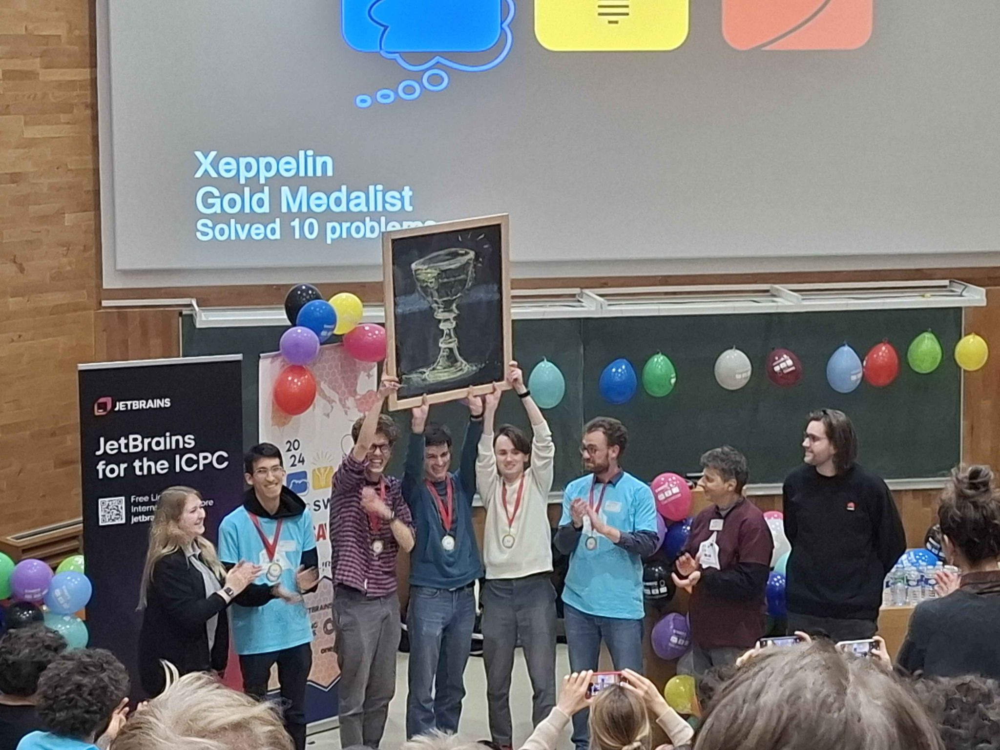

Dérivation automatique, Computer Vision, GPT

# Inria

Équipe Soda à Inria Saclay : understanding society with data

IA en éducation, systèmes de recommandation (TP 1), tabular deep learning

scikit-learn : 3 millions de téléchargements par jour

# J'ai rejoint le CSEN en 2013

\centering


- Pix (6M utilisateurs actifs), Pix+IA en 4e et 2de
- France-ioi : Castor informatique (750k), IOAI
- BrevetAI par ENS Paris-Saclay (2025)

# Outline

Apprentissage

Cheval de troie 1

Cheval de troie 2

Démo : illustration de fairness (biais dans les décisions algorithmiques)

Bonus 1 : efficacité et impact environnemental des LLM

Bonus 2 : risques sociétaux des LLM, notamment pour l'éducation

<!-- # IA

Frise -->

# IA

Une base de données : me renvoie les requêtes que je demande

Une IA : infère les points manquants par interpolation \hfill ("BayesDB")

Apprend à partir d'exemples, ou collecte ses données par l'expérience (par renforcement)

Doit être capable de généraliser

# Programme \alert{MP}\textcolor{black}{I} / \textcolor{black}{NSI}

## Apprentissage supervisé

- \alert{Algorithme des $k$ plus proches voisins} (NSI 1re)
- \alert{Matrice de confusion}
- Arbres $k$-dimensionnels
- Arbre de décision (algorithme ID3)

## Apprentissage non supervisé

- \alert{Algorithme des $k$-moyennes}
- Algorithme de classification hiérarchique ascendante

## Jeux et heuristiques

- \alert{Jeux d'accessibilité à 2 joueurs sur un graphe}
- \alert{Algorithme min-max avec une heuristique}
- Élagage alpha-bêta
- Algorithme A* (ex. projet NSI)

# Apprentissage supervisé \hfill Apprentissage non supervisé

:::::: {.columns}
::: {.column}
On observe des échantillons $\x, y$

ex. classification, régression

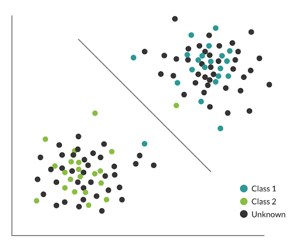

`model.fit(x_train, y_train)` \hfill `model.predict(x_test)`
:::
::: {.column}
On observe seulement $\x$

ex. texte brut, du son
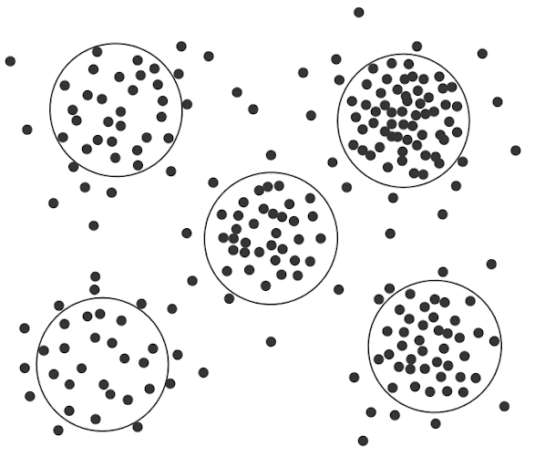
`x_tr = pca.fit_transform(x_train)`
`x_te = pca.transform(x_test)`
:::
::::::

# Exemple : reconnaissance de chiffres manuscrits (TP 2)

```python
from sklearn.datasets import load_digits
```
\centering

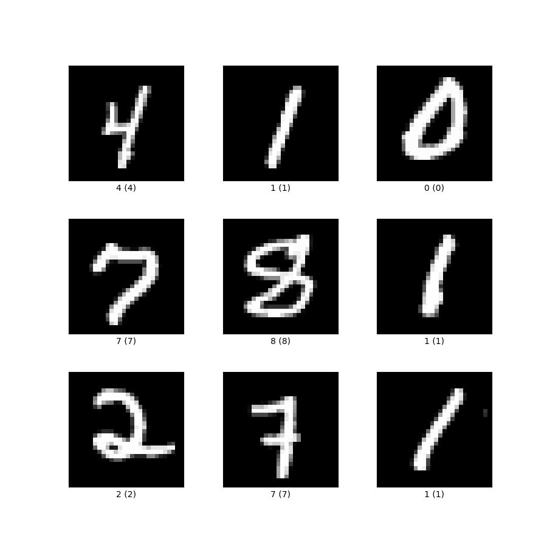{width=40%}

\raggedright

1797 images 8 x 8 en niveaux de gris, $X \in \mathbb{R}^{1797 \times 64}, y \in \{0, \ldots, 9\}^{64}$

# TP 2 : visualisation via projection en 2 dimensions

:::::: {.columns}
::: {.column width=33%}
## $k$ plus proches voisins (projection linéaire)

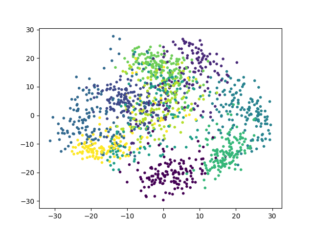
:::
::: {.column width=34%}
## $k$-moyennes sur PCA (projection linéaire)

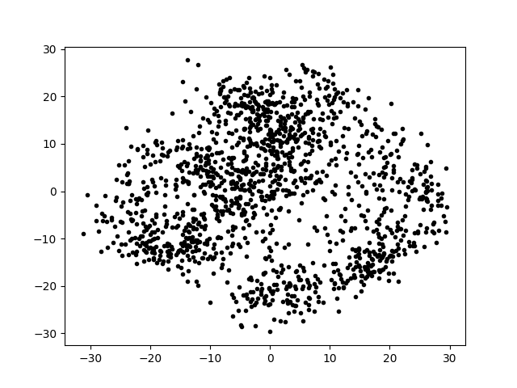


:::
::: {.column width=33%}
## $k$-moyennes sur t-SNE  (non linéaire)

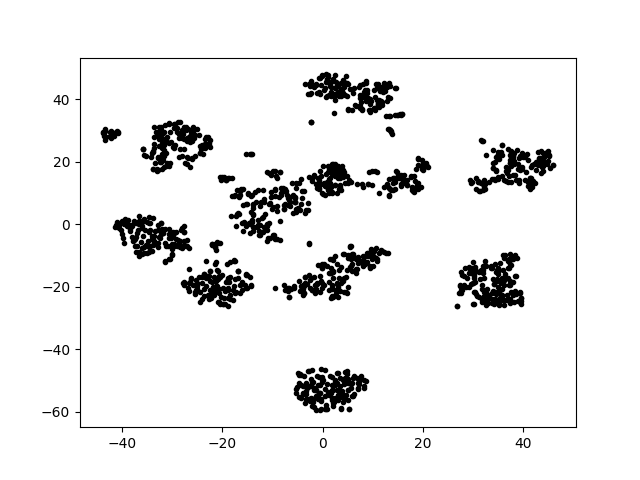

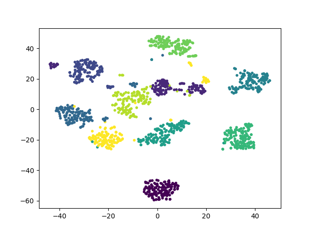
:::
::::::

<!-- Cela repose sur l'apprentissage de représentations : plonger des entités dans $\mathbb{R}^d$ -->

# Apprentissage semi-supervisé : certains $\x$ n'ont pas de $y$

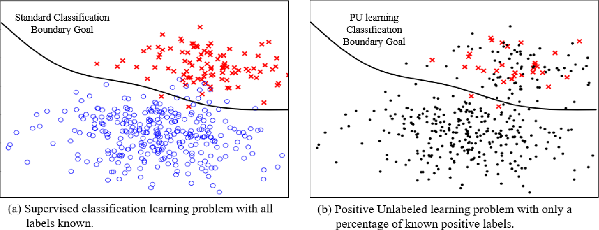

"PU" learning pour "positive unlabeled"

# Apprentissage auto-supervisé

Prédire un mot à partir des mots autour (word2vec, \cite{mikolov2013}) \hfill $\to$ TP 3

\centering
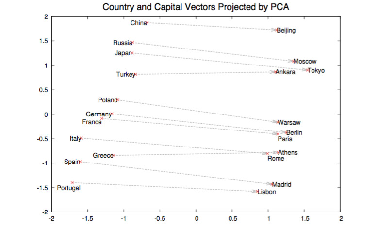{width=70%}

\raggedright

Prédire le token suivant (GPT) $\to$ aussi TP 3

# Apprentissage en contexte

Traditional ML: fit(train), predict(test)

Transfer learning: pretrain, finetune(train), predict(test) \hfill (e.g. word embeddings)

In-context learning: pretrain (LLM), predict(test, train)

\pause

\centering

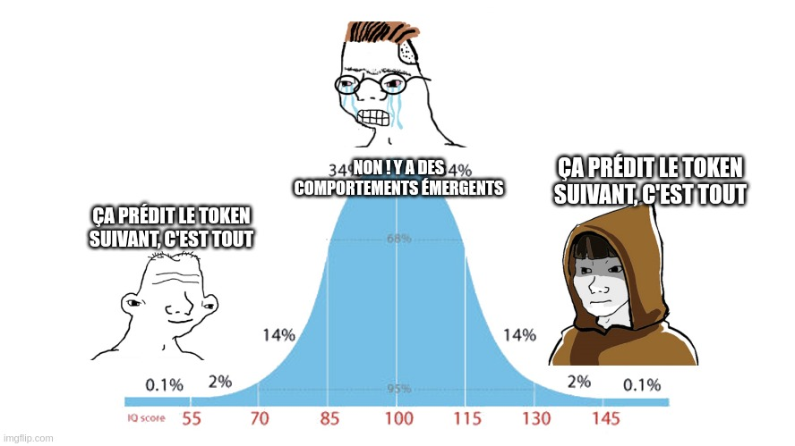{width=80%}

# LLMs are few shot learners

\centering

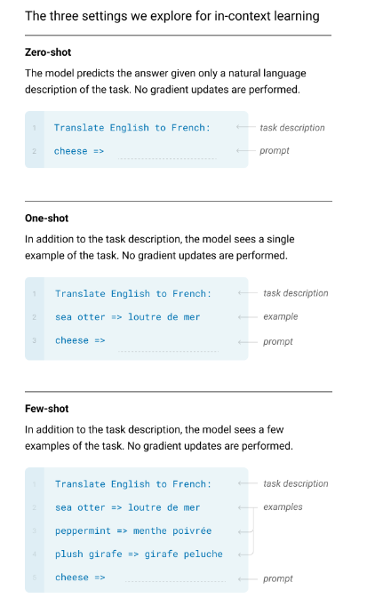

TODO ref

# 

\centering

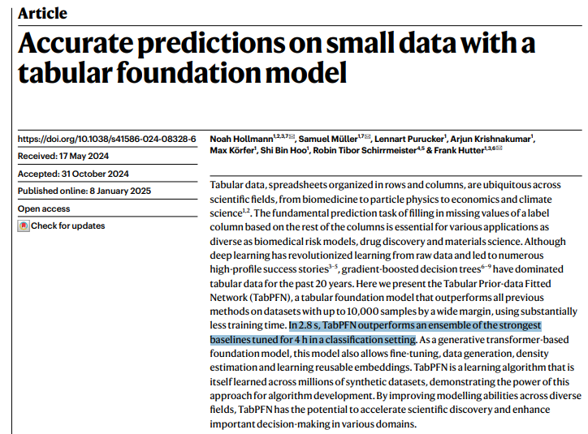

# Multilingual word embeddings (unsupervised)

\centering
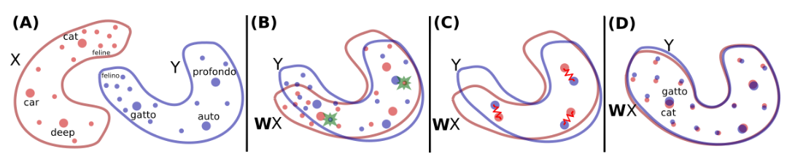
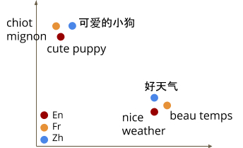{width=40%}

\raggedright \small
\fullcite{lample2018word}

# Légende automatique et attention (Xu and Bengio, 2015)

"C'est une boîte noire"

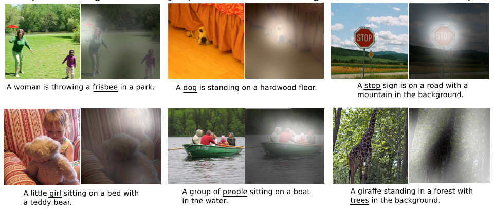

# Attention (Bahdanau, Cho and Bengio, 2014, Test of Time 2024)

\centering

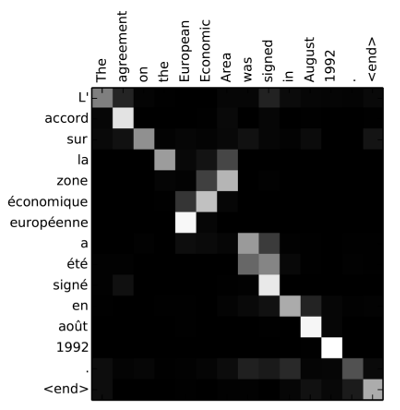{width=50%}

# $k$ plus proches voisins \citep[p.~687]{RussellNorvig} {.fragile}

\begin{algorithm}[H]
\caption{$k$ plus proches voisins parmi $n$ en $d$ dimensions}
\begin{algorithmic}
\ForAll{$i$ de 1 à $n$}
\State calculer la distance de $\x$ à $\x_i$
\EndFor
\State identifier les $k$ plus proches voisins de $\x$
\State calculer la moyenne de leurs valeurs, ou la classe majoritaire
\end{algorithmic}
\end{algorithm}

> - Complexité de trouver les voisins de $\x$ dans $X$ ? $O(nd + kn)$
> - Avec *median of medians* : $O(nd)$
> - Peut être accéléré avec un *$K$-d tree* en $O((n + K) \log n)$
> - Product quantization : $O(n + k \log k \log \log n)$ (algorithme d'approximation)

Pour une version recommandation dans des bases de données, cf. \citep[p.~365]{Abiteboul}

# Product Quantization (2010) Vector Databases (2022)

Une structure de données pour calculer des $k$ plus proches voisins $\textnormal{argmax}_{i \in S} q^T x_i$ (MIPS : *maximum inner product search*)

- $K$-dim tree
- en grande dimension, $k$ plus proches voisins approchés (ex. FAISS) : *product quantization* (Jégou, Douze and Schmid, 2010), des objets proches doivent avoir des hash proches[^1] (*locality-sensitive hashing*)

[^1]: À ne pas utiliser pour hacher des mots de passe SVP

## Variante : $k$ plus proches voisins pondérés

Similarité $w_i = \x_{test}^T \x_{train_i} / N_z$ (renormalisés pour sommer à 1)

Je prédis pour $\x_{test}$ : $\hat{y} = \sum_i w_i y_{train_i}$

Tiens mais l'attention c'est quoi ? $softmax(QK^T) V$  
Une combinaison linéaire de valeurs $V$ à poids correspondant à des produits scalaires (similarités) entre la requête $Q$ et les clés $K$  
Comprendre les KNN, c'est une bonne étape pour comprendre l'attention

# Récapitulatif et bonus

Apprentissage supervisé : caractéristiques $X$ et étiquettes $y$

Apprentissage non supervisé : apprendre une représentation des données $X$, ex. réduire la dimension

Apprentissage par renforcement : apprendre en interagissant avec un environnement

Apprentissage semi-supervisé : certains $X$ n'ont pas de $y$ associé

Apprentissage auto-supervisé : prédire des parties de $X$ à partir de lui-même

Apprentissage en contexte : prédire $y_{test}$ à partir de $X_{test}, X_{train}, y_{train}$, pas d'entraînement, seulement de l'inférence

Méthodes paramétriques (réseaux de neurones)

Méthodes non paramétriques ($k$ plus proches voisins, arbres de décision)

# Formalisation apprentissage supervisé

Échantillons : $(\x_i, y_i) \in \X \times \Y$

Les caractéristiques $\x_i$ et les étiquettes $y_i$.

Habituellement $\X = \R^d$  
Si $\Y$ est discret : classification, sinon régression.

Modèle $f_\theta : \X \to \Y$ ayant des paramètres $\theta$

Une fonction d'erreur $\L$ à minimiser qui dépend des paramètres $\theta$.

But : trouver $\theta = \argmin_\theta \L(\theta, \x_i, y_i)$

# Régression linéaire (ATTENTION, HORS PROGRAMME !!!)

:::::: {.columns}
::: {.column}
Modèle $f_{\w}(\x_i) = \x_i^T \w \simeq y_i$\bigskip

Erreur : moindres carrés
$\L = \sum_i ||\x_i^T \w - y_i||^2$

\begin{align*}
\frac{\partial \L}{\partial \w} = \sum_i 2 \x_i (\x_i^T \w - y_i) & = 0\\
\left(\sum_i \x_i \x_i^T\right) \w = \sum_i \x_i y_i\\
\w = (X^T X)^{-1} X^T \y
\end{align*}
:::
::: {.column}
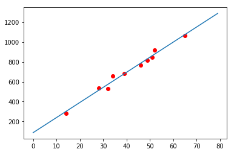
:::
::::::

# Risque de surapprentissage

:::::: {.columns}
::: {.column}
## Fitting
Polynomial degree 1 $Y = wX + b$
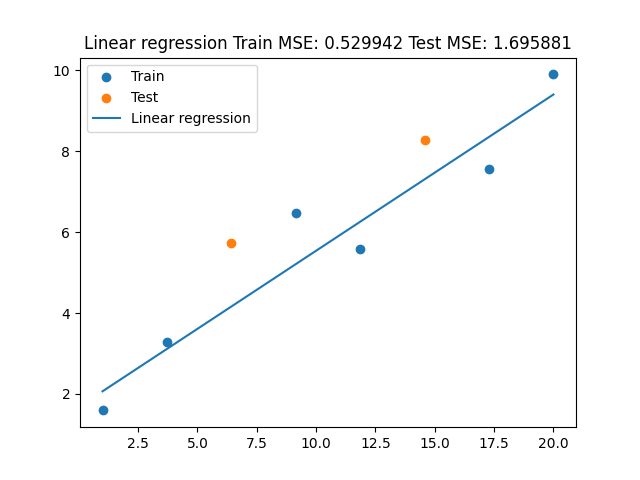
Linear regression  
`scipy.stats.linreg`
:::
::: {.column}
## Overfitting
Polynomial degree 6 $Y = \sum_{k = 0}^6 w_k X^k$
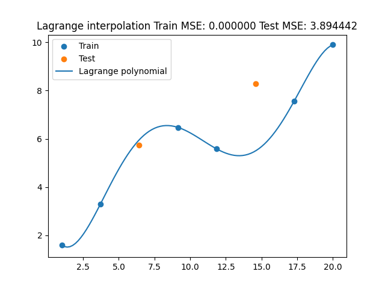
Lagrange interpolation
`scipy.interpolation.lagrange`
:::
::::::

# Régression logistique (classification)

:::::: {.columns}
::: {.column}
$f_{\w}(\x_i) = \sigma(\x_i^T \w) = \Pr(Y_i = 1)$

où $\sigma : x \mapsto 1 / (1 + e^{-x})$\bigskip

Pratique car $\sigma' = \sigma (1 - \sigma)$\bigskip

Pas de formule close pour $\w$ donc apprentissage de $\w$ par \alert{méthode de Newton}
:::
::: {.column}
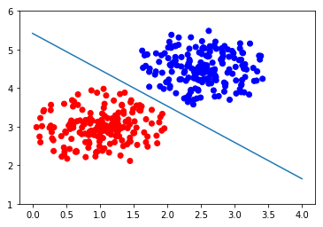
:::
::::::

Algorithme du perceptron (Rosenblatt, 1957) est une couche linéaire (remplacer $\sigma$ par la fonction en escalier Heaviside)

## Variante : reconnaissance de caractères

Remplacer $\sigma$ par un softmax : régression logistique multinomiale

# Réseau de neurones {.fragile}

$$\begin{aligned}
\x^{(0)} & = \x \only<2->{\in \R^{d_0}}\\
\x^{(\ell + 1)} & = \sigma(\W^{(\ell)} \x^{(\ell)} + \b^{(\ell)}) \only<2->{\in \R^{d_\ell}} \quad \ell = 0, \ldots, L - 2\\
y = \x^{(L)} & = \W^{(L-1)} \x^{(L-1)} + \b^{(L-1)} \only<2->{\in \R^{d_L}}
\end{aligned}$$

La $\ell$-ième couche a $d_\ell$ neurones. Couche $\ell = 0$ d'entrée, $\ell = L$ de sortie.  
$\sigma$ est la fonction d'activation (non linéaire), ex. $\sigma = \textnormal{ReLU} = \max(\mathbf{0}, \x)$. Le code :

\begin{myminted}{MLP}{python}
from torch import nn
mlp = nn.Sequential(
    nn.Linear(|$d_0$|, |$d_1$|),
    nn.ReLU(),
    nn.Linear(|$d_1$|, |$d_2$|),
    ...
    nn.Linear(|$d_{L - 1}$|, |$d_L$|)
)
\end{myminted}

Mais du coup ? Je peux le représenter comme $d_0 \to d_1 \to \cdots \to d_L$

# Cette notation simplifie cet exposé

Régression linéaire ou logistique : $n \to 1$

Perceptron pour la reconnaissance des chiffres : \pause $n \to 10$

L'apprentissage de représentations

Autoencodeur $n \to \cdots \to k \to \cdots \to n$

Analyse en composantes principales PCA : \pause $n \to k \to n$ (sans les $\sigma$ non linéaires)

Ainsi, une PCA est un autoencodeur linéaire à une couche

($k$-SVD : meilleure approximation de rang $k$, on tronque aux $k$ plus grandes valeurs singulières, cf. TP 1 et TP 3)

# Extrait du MOOC de Hinton (2012)

[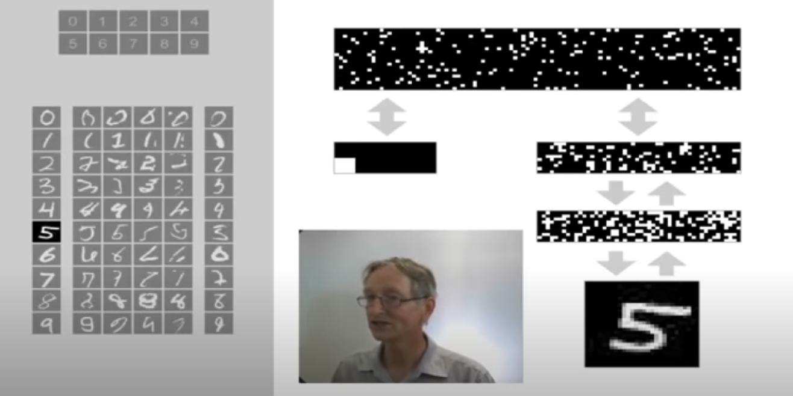](https://www.youtube.com/watch?v=5NGWdgEJq0s&t=222s)

<!-- # 

Une base de données : me renvoie les requêtes que je demande

Une IA : infère les points manquants par interpolation -->

# Variational autoencoders (Kingma 2014)

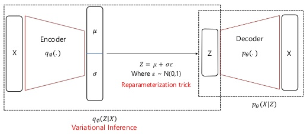

Contrôler la génération par une classe, ou un prompt

# Generative Adversarial Networks (Goodfellow, 2014, Test of Time 2024)

Un étudiant de master à l'université de Kyoto (Yanghua Jin) a fait ceci :

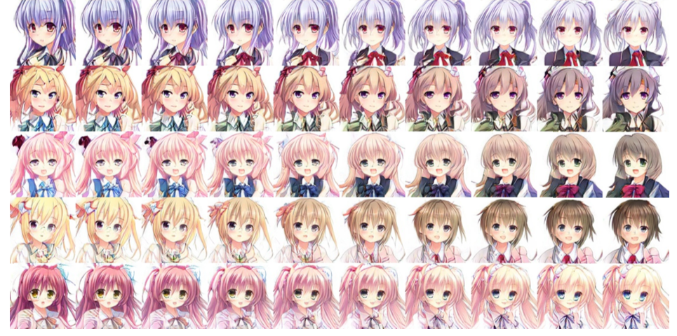

# Why SGD?

To minimize a function

Find the zeroes of its derivative

How to find the zeroes of a function?

# Newton's method: find $x$ such that $f(x) = 0$ {.fragile}

\centering

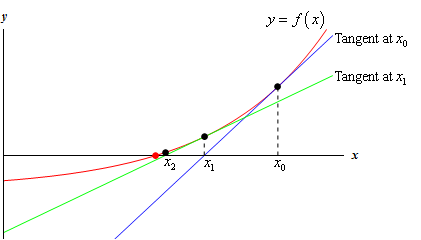{width=60%}

\raggedright

$f: \R \to \R$ differentiable, $\not\exists x, f'(x) = 0$

$$ x_{t + 1} = x_t - \frac{f(x_t)}{f'(x_t)} \qquad \parbox{0.45\textwidth}{\centering Quadratic convergence\\$\exists C > 0, |x_{t + 1} - \ell| \leq C |x_t - \ell|^2$}$$

# In higher dimension

Let $g : \R^n \to \R$ twice differentiable, with $n$ big

\pause

What is the size of $g'(\bm{x})$? Usually noted $\displaystyle \frac{\partial g}{\partial \bm{x}}$ or $\nabla_{\bm{x}} g$.

\pause

$$\x_{t + 1} = \x_t - \underbrace{g''(\x_t)^{-1}}_{\in \mathbf{R}^{n \times n},~O(n^3)} \underbrace{g'(\x_t)}_{\in \mathbf{R}^n}$$

# Gradient descent {.fragile}

\centering

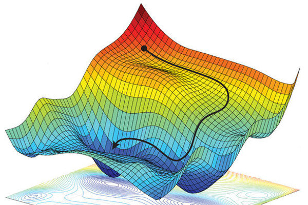{width=50%}

$\x_{t + 1} = \x_t - \gamma \nabla_{\x} \L(\x_t)$

\begin{myminted}{SGD}{python}
for each epoch:
    for |$\x$|, |$y$| in dataset:
        compute gradients |$\frac{\partial \L}{\partial \boldth}(f_\boldth(\x), y)$|  # also noted $\nabla_\boldth \L$
        |$\boldth \gets \boldth - \gamma \nabla_\boldth \L$|  # $\gamma$ is the learning rate
\end{myminted}

# SGD in PyTorch {.fragile}

\begin{myminted}{PyTorch SGD}{python}
import torch

# define model, n_epochs, trainloader
criterion = torch.nn.CrossEntropyLoss()
optimizer = torch.optim.SGD(model.parameters(), lr=0.001)

for _ in range(n_epochs):
    for batch_inputs, batch_labels in trainloader:
        outputs = model(batch_inputs)
        loss = criterion(outputs, batch_labels)

        optimizer.zero_grad()
        loss.backward()
        optimizer.step()
\end{myminted}

# How to compute gradients automatically? What's in `loss.backward()`? {.fragile}

\centering\footnotesize
\begin{myminted}{PyTorch SGD}{python}
from autograd import elementwise_grad as egrad
import matplotlib.pyplot as plt
x = np.linspace(-7, 7, 200)
plt.plot(x, tanh(x),
      x, egrad(tanh)(x),                                     # first
      x, egrad(egrad(tanh))(x),                              # second
      x, egrad(egrad(egrad(tanh)))(x),                       # third
      x, egrad(egrad(egrad(egrad(tanh))))(x),                # fourth
      x, egrad(egrad(egrad(egrad(egrad(tanh)))))(x),         # fifth
      x, egrad(egrad(egrad(egrad(egrad(egrad(tanh))))))(x))  # sixth
plt.show()
\end{myminted}

\begin{center}\includegraphics[width=4cm]{figures/tanh.png}\end{center}

# Existing methods and their limitations

## Numerical differentiation

$$\frac{f(x + h) - f(x)}h$$

Round-off errors

\pause

## Symbolic differentiation

Have to keep symbolic expressions at each step of the process

\pause

## Automatic differentiation

# Chain rule

$$ (f \circ g)' = g' \cdot (f' \circ g) $$

## Generalized chain rule

$$ \frac{df_1}{dx} = \frac{df_1}{df_2} \frac{df_2}{df_3} \cdots \frac{df_n}{dx} $$

# Reminder: Jacobians

Consider differentiable $f : \R^n \to \R^m$, its Jacobian $J_f \in \R^{m \times n}$ contains its first-order partial derivatives $\displaystyle (J_f)_{ij} = \frac{\partial f_i}{\partial x_j}$:

$$J_f ={\begin{bmatrix}{\dfrac {\partial f }{\partial x_{1}}}&\cdots &{\dfrac {\partial f }{\partial x_{n}}}\end{bmatrix}}={\begin{bmatrix}\nabla ^{\mathrm {T} }f_{1}\\\vdots \\\nabla ^{\mathrm {T} }f_{m}\end{bmatrix}}={\begin{bmatrix}{\dfrac {\partial f_{1}}{\partial x_{1}}}&\cdots &{\dfrac {\partial f_{1}}{\partial x_{n}}}\\\vdots &\ddots &\vdots \\{\dfrac {\partial f_{m}}{\partial x_{1}}}&\cdots &{\dfrac {\partial f_{m}}{\partial x_{n}}}\end{bmatrix}}$$

\pause

## Example: linear layer

$W$ is a $m \times n$ matrix

If $f(\x) = W \x$

$f_i = W_i \x = \sum_j W_{ij} x_j$ where $W_i$ is $i$th row of $W$

$\displaystyle (J_f)_{ij} = \frac{\partial f_i}{\partial x_j} = W_{ij}$ so $J_f = W$

# Generalized multivariate chain rule

Consider differentiable $f : \R^m \to \R^k, g : \R^n \to \R^m$ and $\bolda \in \R^n$.

$$D_\bolda (f \circ g) = D_{g(\bolda)} f \circ D_\bolda g$$

So the Jacobians verify:

$$ J_{f \circ g} = (J_f \circ g) J_g$$

# Graphe orienté acyclique (DAG) de calcul dérivable

\centering
\begin{tikzpicture}[var/.style={draw,rounded corners=2pt}, every edge/.style={draw,->,>=stealth},xscale=2.5,yscale=2]
\node (x) [var] {$\x$};
\node (y) at (2.5,-1) [var] {$y$};
\node (W) at (0.5,-1) [var] {$\W$};
\node (b) at (1.5,-1) [var] {$\b$};
\node (z) at (1,0) [var] {$z$};
\node (f) at (2,0) [var] {$\softmax$};
\node[var] (loss) at (3,0) {$\L$};
\node (end) at (4,0) {};
\draw (x) edge (z);
\draw (W) edge (z);
\draw (b) edge (z);
\draw (z) edge node[above] {$z(\x)$} (f);
\draw (f) edge node[above] {$f(\x)$} (loss);
\draw (y) edge (loss);
\draw (loss) edge node[above] {$\L(f(\x), y)$} (end);
\end{tikzpicture}

$$\begin{aligned}
\frac{d\L}{db_1} & = \frac{d\L}{df} \frac{df}{db_1} = \frac{d\L}{df} \left( \frac{df}{dz} \frac{dz}{db_1} \right) \textnormal{ (forward)}\\
& = \frac{d\L}{dz} \frac{dz}{db_1} = \left( \frac{d\L}{df} \frac{df}{dz} \right) \frac{dz}{db_1} \textnormal{ (backward)}
\end{aligned}$$

Properly written: $J_{\L \circ \softmax \circ z} = (J_\L \circ f) (J_\softmax \circ z) J_z$

Given that $\x \in \R^d, z(\x), f(\x) \in \R^{d_2}, \L(f(\x), y) \in \R$,  
which order is better? \only<2>{This is why \alert{backpropagation}.}

# Reverse accumulation (in $\R$)

Let us note the adjoint $\bar{f} \triangleq \frac{d\L}{df}$.

\centering
\begin{tikzpicture}[var/.style={draw,circle}, every node/.style={minimum size=7mm}, every edge/.style={draw,->,>=stealth},xscale=2.5,yscale=2]
\node (f) [var] {$f$};
\node (end) at (1,0) {};
\node (u) at (-1,1) {};
\node (v) at (-1,-1) {};
\draw (u) edge[bend right,draw=none] coordinate[at start](u-b) coordinate[at end](f-b) (f)
          edge[bend left,draw=none] coordinate[at start](u-t) coordinate[at end](f-t) (f)
          (u-b) edge node[below] {$u$} (f-b);
\only<2>{\draw[red] (f-t) edge node[above right] {$\bar{f} \frac{df}{du}$} (u-t);}
\draw (v) edge[bend right,draw=none] coordinate[at start](v-b) coordinate[at end](f-bv) (f)
          edge[bend left,draw=none] coordinate[at start](v-t) coordinate[at end](f-tv) (f)
          (v-t) edge node[above] {$v$} (f-tv);
\only<2>{\draw[red] (f-bv) edge node[below right] {$\bar{f} \frac{df}{dv}$} (v-b);}
\draw (f) edge node[above] {$f(u,v)$} (end);
\only<2>{\draw[red] ([yshift=-2pt] end.west) edge node[below] {$\bar{f}$} ([yshift=-2pt] f.east);}
\end{tikzpicture}

Éviter de recalculer deux fois la même chose (mémoïsation)

# A complete example (Wikipedia)

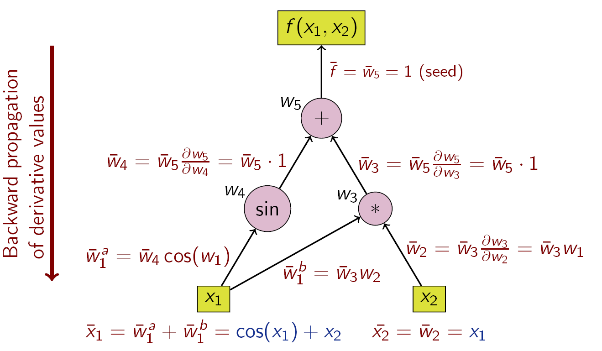

# Notebook: compute gradients

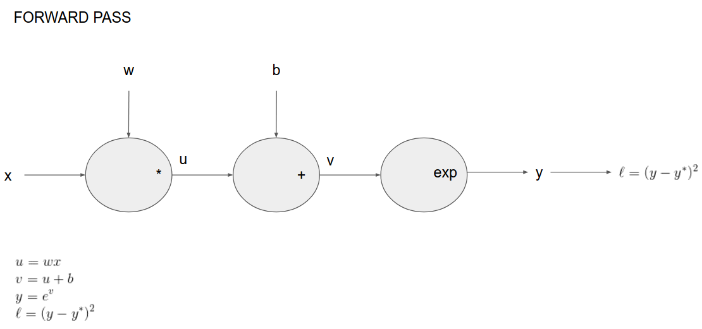

# Question (piège ?)

Pourquoi A* c'est de l'IA ?

\pause

Est-ce que l'algorithme de Dijkstra c'est de l'IA aussi ?

# Parce que les deux sont Best-first search

\begin{algorithm}[H]
\small
\caption{Recherche du meilleur en premier}
\begin{algorithmic}
\State Mettre la $source$ dans la file
\While{la file n'est pas vide}
  \State Extraire le nœud $u$ ayant la priorité $f(u)$ minimale
  \If{$u$ est la $cible$} \Return dist, prec \EndIf
  \ForAll{voisin $v$ du nœud $u$}
    \State candidat $\gets$ dist$(u)$ + poids arête $w_{uv}$
    \If{c'est un meilleur candidat i.e. candidat < dist(voisin)}
      \State dist(voisin $v$) $\gets$ candidat
      \State prec(voisin $v$) $\gets$ nœud $u$
      \State Ajouter $v$ à la file avec priorité $f(v)$
    \EndIf
  \EndFor
\EndWhile
\end{algorithmic}
\end{algorithm}

## Valeurs de priorité $f(u)$

- Dijkstra : parcourir par plus courte distance(source, nœud $u$)
- *Greedy best-first search* : $h(u)$ distance à vol d'oiseau à l'arrivée
- A* : par $dist(u) + h(u)$ croissant.
- Prim (arbre couvrant) : distance à l'arbre en cours

# Principe d'optimalité de Bellman

\vspace{5mm}

> An optimal policy has the property that whatever the initial state and initial decision are, the remaining decisions must constitute an optimal policy with regard to the state resulting from the first decision.\bigskip

## Équation de Bellman

Soit un état $s$, on choisit une action $a$ qui nous rapporte une récompense $R(s, a)$ et nous met dans un état $s'$. $V$ indique la récompense moyenne obtenue si l'on agit de façon optimale.

$$V(s) = \max_a R(s, a) + \gamma V(s')$$

Ça vous rappelle quelque chose ?

\pause

## Bellman-Ford

$$V(u) = \max_v -w_{u, v} + V(v) \quad V = -d$$

# Trouvé dans une médiathèque

{width=33%}
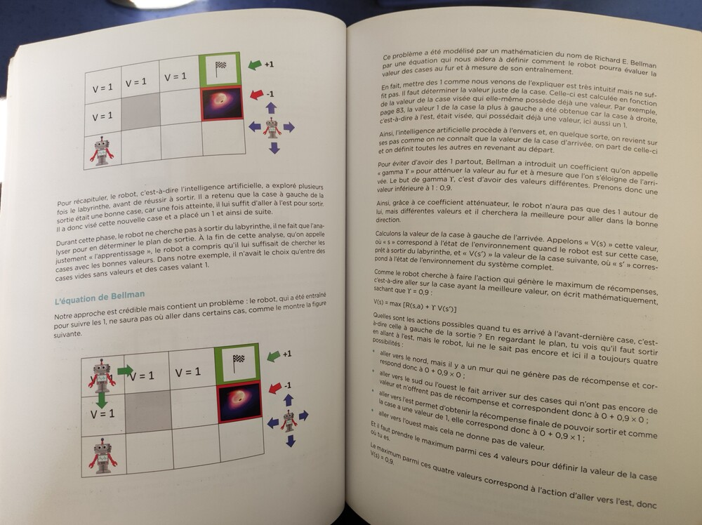{width=66%}

# Exemples d'environnements d'apprentissage par renforcement

:::::: {.columns}
::: {.column width=50%}
CartPole-v1

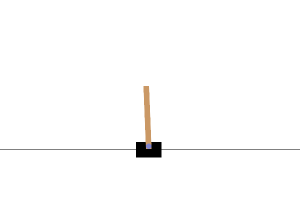

$S = (x, \dot{x}, \theta, \dot\theta) \in \R^4$  
$A \in \{\leftarrow, \rightarrow\}$  
$R = 1$
:::
::: {.column width=50%}
MountainCar-v2

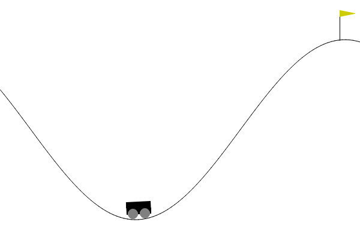

$S = (x, \dot{x}) \in \R^2$  
$A \in \{\leftarrow, 0, \rightarrow\}$  
$R = -1$
:::
::::::

# Dans le même bouquin, quelques pages plus loin

\centering

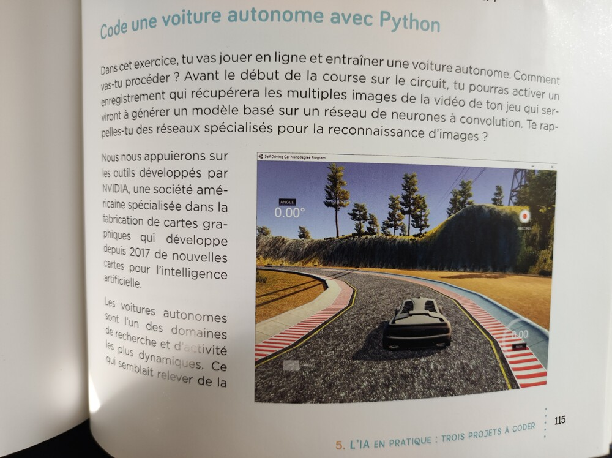

# Gold mine problem (Bellman, 1952)

Two gold mines, Anaconda (amount $x$) and Bonanza (amount $y$).

- Anaconda: probability $p_1$ to collect $r_1 x$ \hfill $1 - p_1$ to break the machine forever
- Bonanza: probability $q_1$ to collect $r_2 y$ \hfill $1 - q_1$ to break the machine forever

Parameters of the problem: $p_1, q_1, r_1, r_2 \in [0, 1]$, $x, y \in \mathbb{R}^+$.

What is the optimal action, that maximizes the amount of extracted gold?

\pause

Let $f(x, y)$ be the maximum expected gold extracted.

# Solution to the gold mine problem

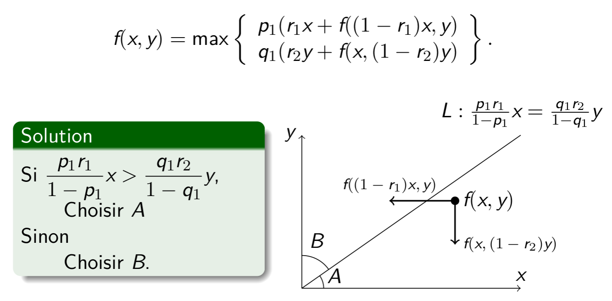

# Policy evaluation on Gridworld (not a DAG)

$$\begin{array}{c}
S \in \{(i, j)\}_{1 \leq i, j \leq 5}\\[5mm]
A \in \{\leftarrow, \rightarrow, \uparrow, \downarrow\}
\end{array} \qquad R = \begin{cases}
10 \text{ if leaving from A}\\
5 \text{ if leaving from B}\\
-1 \text{ if hitting a wall}\\
0 \text{ otherwise.}
\end{cases}$$
\centering
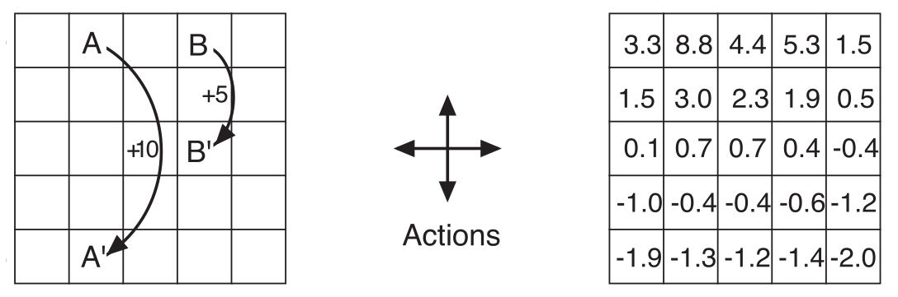{width=80%}  
$\text{Gridworld} \qquad \pi_{\text{uniform}} = (1/4, 1/4, 1/4, 1/4) \qquad v_{\pi_{\text{uniform}}}$

# Policy improvement on Gridworld

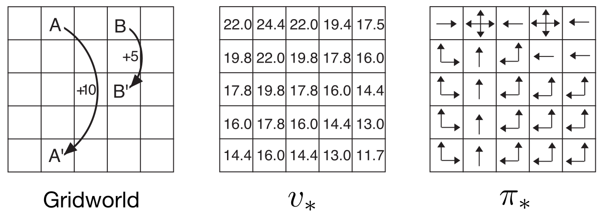

# La programmation dynamique de Richard Bellman (1920-1984)

\centering

{width=4cm}

\raggedright

1952 : Richard Bellman publie *Programmation dynamique*

1952 : Autocode, le premier langage de programmation

Il avait la présence d'esprit de résoudre des problèmes (de maths appliquées) par prises de décision optimales successives (*multistage decision processes*), de façon constructive

# La programmation dynamique a mené à l'apprentissage par renforcement

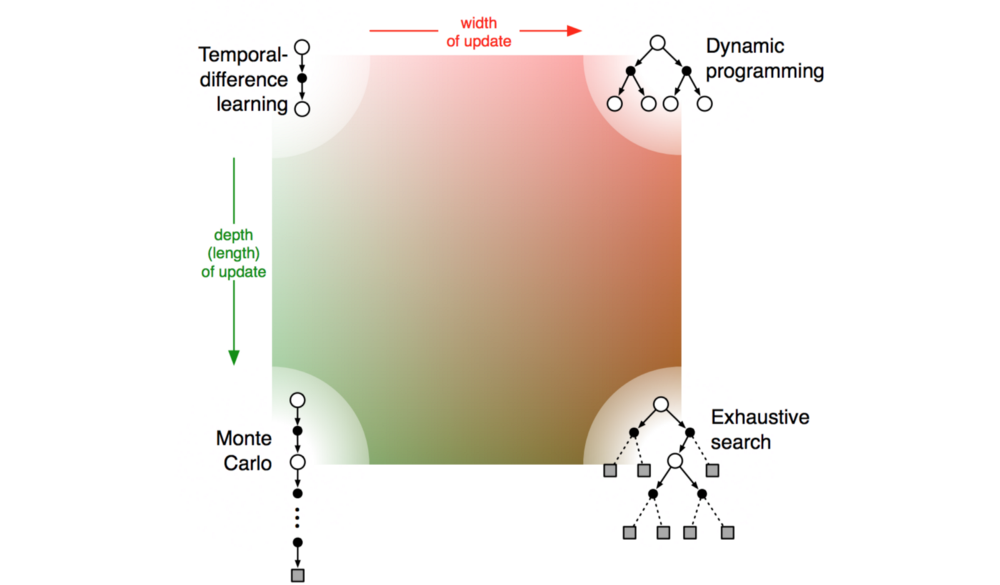

# Trouvé dans la bibliothèque du CIRM

\centering

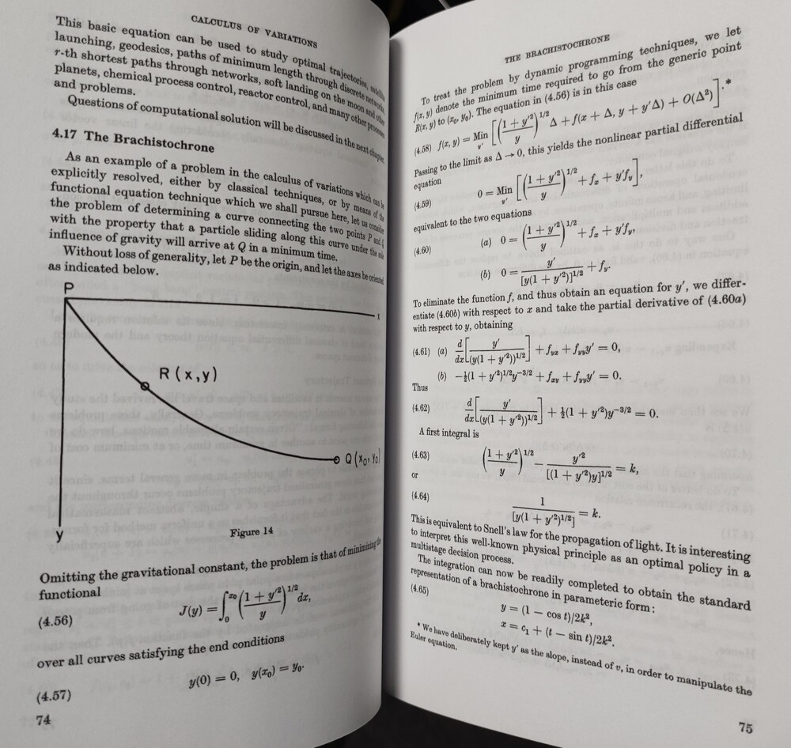

# Les grands modèles de langage (LLM) : quels objectifs ?

1. Transformer : prédire le mot suivant

```
Transformers / are / a / new / machine / [learning]  
Transformers / are / a / new / machine / learning / [architecture]
```

2. Données de démonstration d'experts :

```
Query: put the first letters in uppercase in "optimizing human learning"
Answer: Optimizing Human Learning
```

3. Données de comparaison d'experts :

```
Query: write a poem
Answer 1: Roses are red
Answer 2: Once upon a time, a prince in a castle
```

Où la réponse 2 est votée favorablement par les experts

ChatGPT est donc entraîné pour plaire aux experts et généraliser à de nouvelles tâches

# Recherche d'une réponse d'un LLM

\centering


<!-- https://mitchgordon.me/ml/2022/07/01/retro-is-blazing.html -->

# 

La tâche est dans les données d'entrée

Machine de Turing : le programme est dans les données

Machine de Turing universelle : exécuter le $i$-ème programme

François Chollet dit ça beaucoup mieux :\bigskip

> My mental model for LLMs is that they work as a repository of vector programs. When prompted, they will fetch the program that your prompt maps to and "execute" it on the input at hand. LLMs are a way to store and operationalize millions of useful mini-programs via passive exposure to human-generated content.\medskip

> If a LLM is like a database of millions of vector programs, then a prompt is like a search query in that database [...] this “program database” is continuous and interpolative — it’s not a discrete set of programs.

\small

Sources: \url{https://arcprize.org/blog/oai-o3-pub-breakthrough}, \url{https://simonwillison.net/2023/Oct/25/francois-chollet/}

# Take home message

Nombreuses applications de l'IA, beaucoup d'impacts sociétaux, essentiel pour faire rêver les jeunes (ou les inquiéter)

On peut regretter que l'informatique et l'IA ne s'entendent pas bien alors que les deux s'intéressent à des algorithmes qui optimisent un objectif

Je mise tout sur les *vector databases* et Bellman pour les réconcilier

## Analyse (du second degré)

Le ou la prof de maths fait les fonctions à plusieurs variables, jacobiennes, vraiment à la fin de l'année parce que flemme et de toute façon il n'a pas l'intention de le coder\bigskip

Le ou la prof d'info fait l'IA à la fin parce que "l'IA ça marche pas et de toute façon ça ne tombe jamais aux concours" (pourtant, X 2025) et 1) pf faut installer numpy sur les ordis 2) en SQL, C, OCaml, l'IA c'est infernal

# 

TP 1 -- Systèmes de recommandation : KNN, SVD, ALS, SGD

TP 2 -- Reconnaissance de motifs OU Gridworld OU Quoridor

TP 3 -- Traitement automatique des langues : chaîne de Markov, GPT-based LLM

On pourrait adapter le TP 1 en posant des questions informatives sur les goûts (à la ID3)

\centering

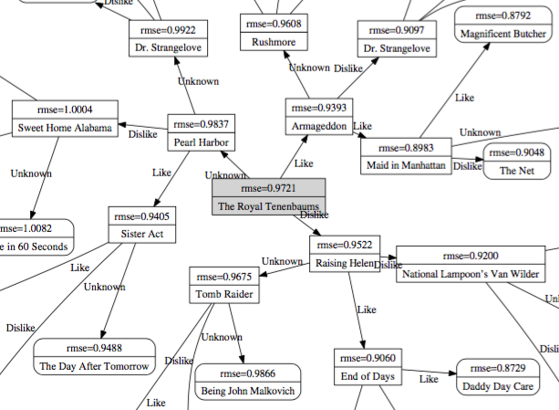{width=50%}

# Merci pour votre attention

Si vous souhaitez parler de l'environnement de concours NonOS, n'hésitez pas, je ne mords pas
