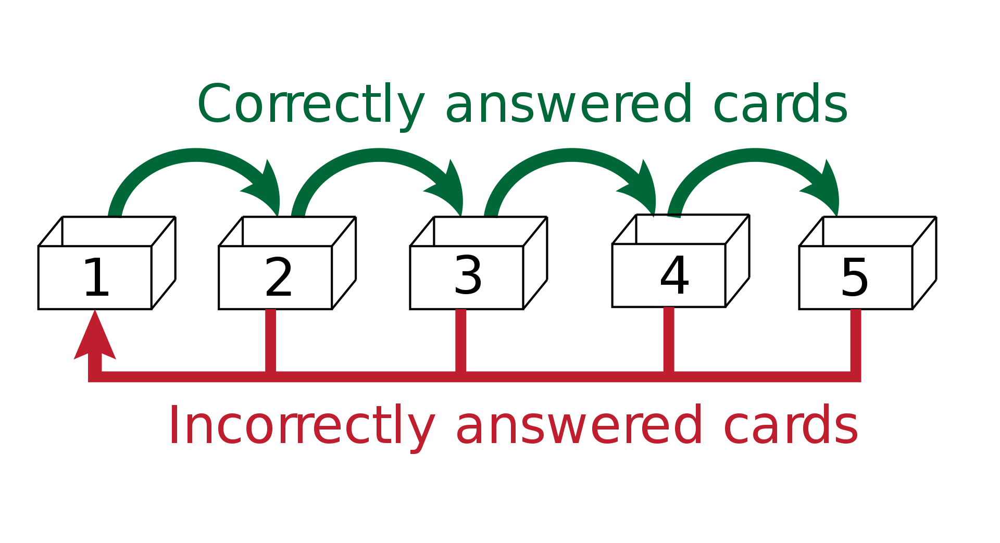

% IA, éducation et formation\vspace{3mm}
% Jill-Jênn Vie\newline\newline\includegraphics[height=0.8cm]{figures/aip-logo.png}\qquad\includegraphics[height=1.3cm]{figures/inria.jpg}\newline aip.riken.jp \qquad \qquad \qquad inria.fr
% 25 octobre 2019
---
theme: Frankfurt
section-titles: false
handout: true
biblio-style: authoryear
header-includes:
    - \usepackage{booktabs}
    - \usepackage{multicol}
    - \usepackage{bm}
    - \usepackage{multirow}
    - \DeclareMathOperator\logit{logit}
    - \def\ReLU{\textnormal{ReLU}}
    - \newcommand\mycite[3]{\textcolor{blue}{#1} "#2".~#3.}
biblatexoptions:
    - maxbibnames=99
    - maxcitenames=5
---
# Introduction

## Optimisation de l'apprentissage humain

On observe des données d'apprentissage sur une plateforme  
(évaluation, cours en ligne)

Comment utiliser ces données pour profiter aux autres apprenants ?

### Challenges

- Ne pas poser trop de questions
- Les apprenants évoluent au cours du temps
- Quelle fonction objectif choisir ?

## Tests adaptatifs

\centering

## Prédiction de la performance des étudiants

### Data

A population of students answering questions

- Events: "Student $i$ answered question $j$ correctly/incorrectly"

### Goal

- Learn the difficulty of questions automatically from data
- Measure the knowledge of students
- Potentially optimize their learning

### Assumption

Good model for prediction $\rightarrow$ Good adaptive policy for teaching

## Exemples

- Pix, la certification des compétences numériques
- Systèmes de recommandation
- Modélisation de la mémoire

## Pix

- Recherche d'information sur Internet
- Communication collaboration

## Un exemple de problème

### Ludique

Montrésor, rue des Perrières ?

## Types de tests

### Tests de positionnement

Évaluer le niveau des gens ; peut être un faible enjeu, cartographier les connaissances.

### Tests de certification

Fort enjeu.

### Tests de progression

Optimiser l'apprentissage humain

# Test de positionnement

## Acquis

## Théorie de la réponse à l'item

\centering

## Choosing the objective function to optimize

\alert{Maximiser l'information} $\rightarrow$ learners fail 50% of the time (good for the assessing institution, not for the learning student)

\alert{Maximize success rate} $\rightarrow$ asking too easy questions

\alert{Maximize the growth of the success rate} (Clement et al. 2015)

\alert{Compromise exploration} (items that we don't know)  
and \alert{exploitation} (items that measure well)

\alert{Identify a gap from the learner} (Teng et al. ICDM 2018)  
+ assume that a item brings less learning when it was administered before (Seznec et al. AISTATS 2019, SequeL)

Increasing number of works(hops) about reinforcement learning in education

## Le but de cette étape ?

\centering

{width=60%}

## Interpreting the components

## Interpreting the components

## Le niveau évolue au cours du temps

\centering

# Systèmes de recommandation

## Systèmes de recommandation

À partir de notes, on est capables de généraliser aux autres

github.com/mangaki/zero

## Cartographie des goûts

## Données obtenues

Retour explicite : notes

Retour implicite : à quel point une formation les intéresse, etc.

Utiliser d'autres données

## Par exemple, le contenu graphique

# Mémoire

## Modélisation de la mémoire

Optimize scheduling of items in spaced repetition systems ($\sim$ Anki)

\centering
\includegraphics[width=0.5\linewidth]{figures/anki.png}

\raggedright
Use knowledge tracing machines with extra features: counters of attempts at skill level for different time windows in the past

**EDM 2019**

:   \scriptsize
\mycite{Benoît Choffin, Fabrice Popineau, Yolaine Bourda, and Jill-Jênn Vie (2019)}{DAS3H: Modeling Student Learning and Forgetting for Optimally Scheduling Distributed Practice of Skills}{\alert{Best Paper Award}}

## Leitner system

## Mémoriser le nombre d'essais

## Données de Duolingo

# Conclusion

## Take home message

\alert{Factorization machines} are a strong baseline for knowledge tracing that take many models as special cases

\alert{Recurrent neural networks} are powerful because they track the evolution of the latent state (try simpler dynamic models?)

\alert{Deep factorization machines} may require more data/tuning, but neural collaborative filtering offer promising directions

Next step: use this model and optimize human learning

## Any suggestions are welcome!

Feel free to chat:

\centering
`vie@jill-jenn.net`

\raggedright
All code:

\centering
`github.com/jilljenn/ktm`

\raggedright
Do you have any questions?
