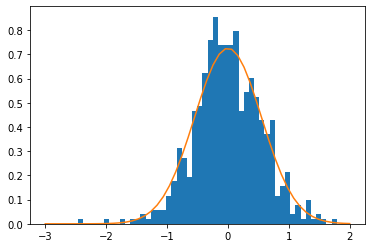

% Deep Knowledge Tracing is an implicit dynamic multidimensional item response theory model
% \alert{Jill-Jênn Vie} \hspace{11mm} Hisashi Kashima\medskip\newline \includegraphics[height=9mm]{figures/inria.png}\qquad\includegraphics[height=9mm]{figures/kyoto.png}
% December 7, 2023
---
aspectratio: 169
theme: Frankfurt
section-titles: false
biblio-style: authoryear
header-includes:
    - \usepackage{booktabs}
    - \usepackage{multicol}
    - \usepackage{bm}
    - \usepackage{multirow}
    - \DeclareMathOperator\logit{logit}
    - \def\ReLU{\textnormal{ReLU}}
    - \newcommand\mycite[3]{\textcolor{blue}{#1} "#2".~#3.}
    - \usepackage{subfig}
    - \def\correct{\includegraphics{figures/win.pdf}}
    - \def\mistake{\includegraphics{figures/fail.pdf}}
    - \def\xdownarrow{ {\left\downarrow\vbox to 2.9\baselineskip{}\right.\kern-\nulldelimiterspace}}
    - \usepackage{minted}
    - \newsavebox{\mintedbox}
    - \def\uic{\textnormal{User } i \textnormal{ Item } j~\correct}
biblatexoptions:
    - maxbibnames=99
    - maxcitenames=5
---

## Outline of this talk

- Explaining the title
    - Knowledge tracing \hfill \autocite{corbett1994knowledge}
    - Strong baseline: Rasch model in item response theory \hfill \autocite{rasch1960studies}
    - Multidimensional item response theory \hfill \autocite{reckase1991}
    - Deep knowledge tracing \hfill \autocite{piech2015deep}
- A few surprising recent works
- Answering those questions

Key takeaway message: deep learning is not necessarily a black box.

# Knowledge tracing and logistic regression

## Knowledge Tracing

Data
:   
A population of students answering questions  

Events
:   
"Student $i$ answered question $j$ \correct or \mistake"

Use data from other students to predict performance for a new student:


\centering \small [@piech2015deep]

\raggedright \normalsize

Why is it important? If we can predict student performance, we can optimize instruction (avoid putting students in failure, etc.)

## Rasch model from item response theory / Elo

\centering

\resizebox{0.9\linewidth}{!}{$\displaystyle \substack{\normalsize \Pr(\textnormal{"student A solves question B"})\\ \Pr(\textnormal{"player A beats player B"})\\ \Pr(\textnormal{"A is preferred to B"})} = \frac1{1 + \exp(-(score_A - score_B))}$}\vspace{3mm}

:::::: {.columns}
::: {.column width=50%}
\vspace{5mm}
People "compete" against questions (Rasch) and possibly \alert{learn} while attempting
:::
::: {.column width=50%}

:::
::::::

\vspace{-5mm}

\begin{figure}
  \captionsetup[subfigure]{labelformat=empty,justification=centering}
  \subfloat[reCAPTCHA\\ (Luis von Ahn, 2008)]{\raisebox{2mm}{\includegraphics[width=0.25\linewidth]{figures/captcha.png}}}
  \subfloat[Elo (1967)\\ TrueSkill (2007)]{\includegraphics[width=0.25\linewidth]{figures/tournament-nyt.png}}
  \subfloat[Adaptive tests\\ (Rasch, 1960)]{\includegraphics[width=0.25\linewidth]{figures/irt.pdf}}
  \subfloat[Preference models\\ (Bradley \& Terry, 1952)]{\raisebox{3mm}{\includegraphics[width=0.25\linewidth]{figures/elo2.jpg}}}
\end{figure}

## Item Response Theory

Learn abilities $\theta_i$ for each user $i$  
Learn difficulty $d_j$ for each item $j$ such that:

\centering
$\logit \Pr(\uic) = \theta_i - d_j$

:::::: {.columns}
::: {.column}
### Learning user abilities

:::
::: {.column width=40%}
### And item difficulties

:::
::::::

## Graphically: IRT as logistic regression

One-hot encoding of "User $i$ answered Item $j$":

\centering


$$ \logit Pr(\textnormal{User $i$ Item $j$ \correct}) = \langle \bm{w}, \bm{x} \rangle = \theta_i - d_j $$

## One-hot encoding

:::::: {.columns}
::: {.column width="45%"}
\begin{block}{Predicting student performance}
\vspace{2mm}
\parbox{6mm}{over\\time} $\xdownarrow$ \parbox{4.2cm}{User 1 attempts Item 1 \correct\\
User 1 attempts Item 2 \mistake\\
User 1 attempts Item 2 \correct\\
User 2 attempts Item 1 ???\\
User 2 attempts Item 1 ???\\
User 2 attempts Item 2 ???}
\end{block}
:::
::: {.column width="55%"}
\qquad
\input{tables/show-ui}
:::
::::::

\centering

Then logistic regression can be run on the sparse features.

## Oh, there's a problem

\centering

\input{tables/pred-ui}

We predict the same thing when there are several attempts.

## Count successes and failures

Keep track of what the student has done before:

\centering

\input{tables/dummy-uiswf}

## Performance Factor Analysis

$W_{ik}$: how many successes of user $i$ over skill $k$ ($F_{ik}$: #failures)

:::::: {.columns}
::: {.column}

:::
::: {.column}
Learn $\alert{\beta_k}$, $\alert{\gamma_k}$, $\alert{\delta_k}$ for each skill $k$ such that:
$$\begin{aligned}
\logit Pr(\textnormal{User $i$ Item $j$ \correct})\\
= \sum_{\textnormal{Skill } k \textnormal{ of Item } j} \alert{\beta_k} + W_{ik} \alert{\gamma_k} + F_{ik} \alert{\delta_k}
\end{aligned}$$
:::
::::::

\centering \footnotesize
\input{tables/pred-swf}

## Logistic-based knowledge tracing in a nutshell


\fullcite{KTM2019}

## Python Code {.fragile}

\small

```python
from sklearn.pipeline import Pipeline
from sklearn.preprocessing import OneHotEncoder
from sklearn.linear_model import LogisticRegression
import pandas as pd

df = pd.read_csv('data.csv')
model = Pipeline([('onehot', OneHotEncoder()), ('lr', LogisticRegression())])

model.fit(df_train[['user', 'item']], df_train['correct'])  # Train
print(model.predict_proba(df_test[['user', 'item']]))  # Test
```

\normalsize

:::::: {.columns}
::: {.column width="80%"}
Our Soda team at Inria is developing the \alert{scikit-learn} library  
(1.4 million downloads \alert{per day})  
MOOC in November: registration in September--October
:::
::: {.column width="20%"}
{width=3cm}
:::
::::::

# Multidimensional item response theory

## Fraction dataset

Fraction subtraction data contains $536 \times 20$ attempts of middle schoolers.


## Multidimensional item response theory {.fragile}

$$\begin{array}{rc}
& \Pr(\uic)\\
\textnormal{IRT} & \theta_i - d_j\\
\textnormal{Multidimensional IRT} & \langle \bm{v_{\textnormal{user } i}}, \bm{v_{\textnormal{item } j}} \rangle + e_j\\
\textnormal{2-dimensional IRT} & a_1 \theta_1 + a_2 \theta_2 + d
\end{array}$$

:::::: {.columns}
::: {.column width=60%}
### R code

```r
install.packages(c("mirt", "CDM"))
library(mirt)
library(CDM)
fit = mirt(fraction.subtraction.data, 2)
coef(fit)
```
:::
::: {.column width=40%}
```
$Item1
       a1    a2     d g u
par -2.92 3.532 0.155 0 1

$Item2
        a1    a2     d g u
par -6.248 7.374 1.292 0 1
...
```
:::
::::::

## Visualizing the learned parameters

\centering

{width=40%}

## Interpreting the components

\centering

{width=80%}

## Interpreting the components

\centering

{width=80%}

# Deep Learning

## Deep knowledge tracing for sequence prediction

:::::: {.columns}
::: {.column width=45%}
### Our approach: summarize-predict with encoder-decoder

$\displaystyle \left\{\begin{array}{l}
\bm{h_t} = Encoder(q_{1:t}, a_{1:t})\\
p_t = Decoder(\bm{h_t}, q_t)\\
\end{array}\right. 1 \leq t \leq T$

### Deep knowledge tracing

$\displaystyle \left\{\begin{array}{l}
\bm{h_t} = RNN(h_{t - 1}, q_{t - 1}, a_{t - 1})\\
\bm{p_t} = \sigma(\bm{V} \bm{h_t} + \bm{b})\\
\end{array}\right.$
:::
::: {.column width=55%}
Each student on skill $q_t$ has performance $a_t$  
How to predict outcomes $\bm{y}$ on every skill $k$?  
By measuring the evolution of a latent state $\alert{\bm{h_t}}$\bigskip


:::
::::::

\small
\fullcite{piech2015deep}
\normalsize

## Related work 1: Online IRT does better than DKT


\alert{Hint:} simpler models may be useful

\vspace{5mm}

\fullcite{wilson2016back}

## Related work 2: Random encoders perform well already

$$\left\{\begin{array}{ll}
\bm{h_t} = Encoder(q_{1:t}, a_{1:t})\\
p_t = Decoder(\bm{h_t}, q_t)\\
\end{array}\right. t = 1, \ldots, T$$

Training only the decoder has good performance already

Decoder: $n \to d$ principal components analysis $\to 1$ prediction

\alert{Hint:} decoder is important; transformers such as GPT are decoder-only

\vspace{5mm}

\small \fullcite{ding2019}

## Related work 3: Predictions at item level better than at skill level

Decoder: $n \to m$ number of items or $n \to k$ number of skills?

DKT outputting items instead of skills perform better

\alert{Hint:} learning item parameters are important (just like in IRT)

:::::: {.columns}
::: {.column}

:::
::: {.column}

:::
::::::

\fullcite{gervet2020deep}

## Graphically: deep knowledge tracing

\centering


## DKT \only<2>{is implicitly a dynamic MIRT model}

$$\begin{aligned}
\only<1>{p_t = \sigma(V h_t + b)} \only<2>{\textnormal{MIRT: } p = \sigma(\langle \bm{v_{\textnormal{user } i}}, \bm{v_{\textnormal{item } j}} \rangle + e_j)}\qquad p_{t q_1} = \sigma(\langle \bm{h_t}, \bm{v}_{q_1} \rangle + b_{q_1})
\end{aligned}$$

\centering

{width=70%}

## Results on Berkeley dataset

562201 attempts of 1730 students over 234 CS-related items of 29 categories. 

\begin{table}
\centering
\begin{tabular}{cccccc} \toprule
Model & \#Parameters & Encoder & Decoder & ACC & AUC\\ \midrule
\textbf{Ours} & 17k & RNN $d = 50$ & iswf $d' = 1$ & \textbf{0.707} & \textbf{0.778}\\
\textbf{Logistic} & 321 & (no encoder) & iswf $d' = 1$ & \textbf{0.704} & \textbf{0.775}\\
DKT & 18k & GRU $d = 50$ & s $d' = 50$ & 0.684 & 0.751\\
PFA & 87 & (no encoder) & swf $d' = 1$ & 0.630 & 0.683\\ \bottomrule
\end{tabular}
\label{results-assistments}
\end{table}

It is always better to have unidimensional or low-dimensional projection.  
Too big dimension overfits.

Check the paper: also Fraction dataset, Assistments dataset

All code available on GitHub: [`github.com/jilljenn/dktm`](https://github.com/jilljenn/dktm)

# Conclusion

## Take home message

\alert{Logistic regression} are a strong baseline for knowledge tracing that take many models as special cases. If interested, check our knowledge tracing machines paper (AAAI 2019)

\alert{Recurrent neural networks} track the evolution of the latent state  
(we could also try transformers, a decoder-only architecture)

While it is important to model users with several variables (we did not prove it), it may not be necessary to model items with too many parameters. Simpler models are easily interpretable, and faster to train. Metadata in the decoder is important.

\pause

\alert{Further work:} using these knowledge tracing models we can

- optimize instruction (reinforcement learning)
- estimate performance on AI-generated items.

## Optimizing human learning workshop at LAK 2024, Kyoto

\centering


CFP on [`humanlearn.io`](https://humanlearn.io). Please submit papers by \alert{December 16}.

[`jjv.ie`](https://jjv.ie) / `jill-jenn.vie@inria.fr` / \@jjvie

{height=1cm} {height=1cm} {height=1cm}