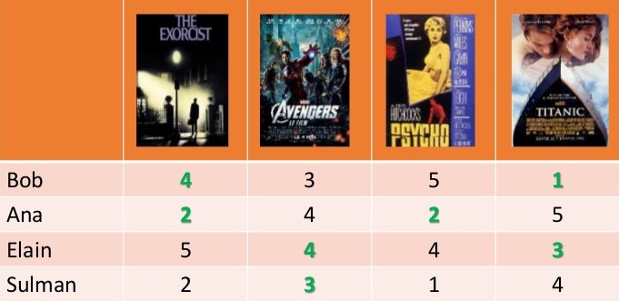
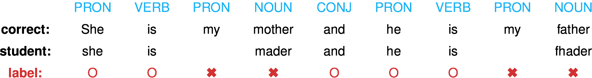
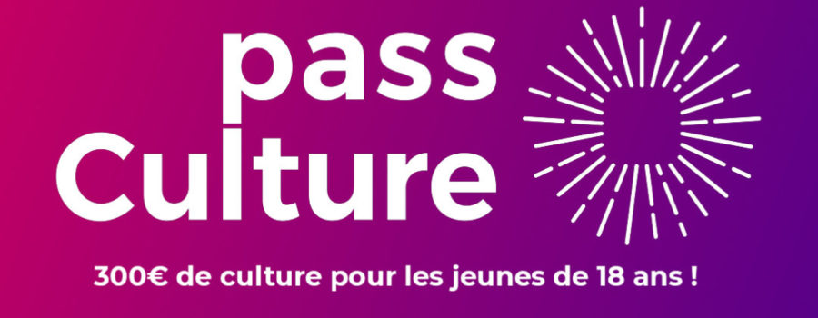
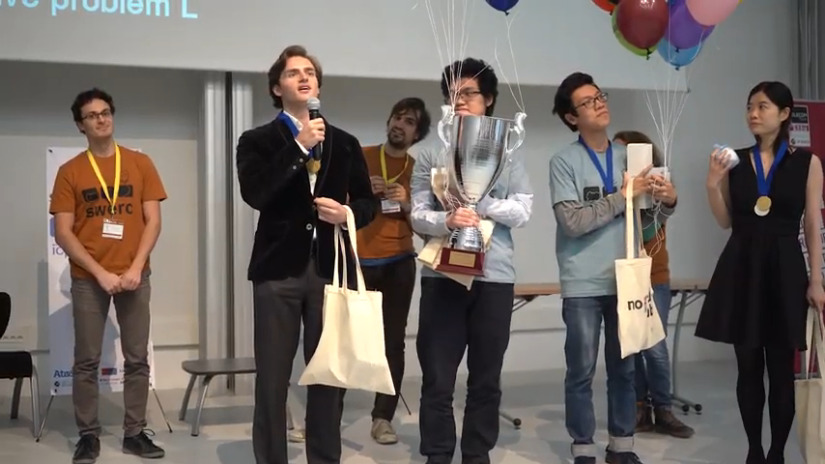

% Research in personalized education\newline Teaching competitive programming
% Jill-Jênn Vie; Michael Anoprenko
% April 11, 2025
---
aspectratio: 169
institute: \includegraphics[height=1cm]{figures/inria.png} \includegraphics[height=1cm]{figures/ipparis.png} 
biblio-style: authoryear
colorlinks: true
draft: true
header-includes: |
  ```{=tex}
  \usepackage{tikz}
  \usepackage{subfig}
  \usepackage{eurosym}
  \usepackage{graphbox}
  \usepackage{tabularx}
  \usepackage{annotate-equations}
  \usepackage{xcolor}
  \def\hfilll{\hspace{0pt plus 1 filll}}
  \def\D{\mathcal{D}}
  \def\E{\mathbb{E}}
  \def\x{{\bm{x}}}
  \def\W{{\bm{W}}}
  \def\b{{\bm{b}}}
  \def\L{\mathcal{L}}
  \def\R{\mathbf{R}}
  \def\softmax{{\textnormal{softmax}}}
  \renewcommand{\arraystretch}{1.2}
  \newcolumntype{C}{>{\centering\arraybackslash}X}
  \def\correct{\includegraphics{figures/win.pdf}}
  \def\mistake{\includegraphics{figures/fail.pdf}}
  \usepackage{bm}
  \def\uic{\alert{\textnormal{User } i} \textnormal{ solves item } j~\correct}
  \usepackage{fontspec}
  \newfontfamily{\Emoji}[Renderer=Harfbuzz]{Noto Color Emoji}
  \def\Winner{{\Emoji 🏆}}
  \def\Gold{{\Emoji 🥇}}
  \def\Silver{{\Emoji 🥈}}
  \def\Bronze{{\Emoji 🥉}}
  \def\Clap{{\Emoji 👏}}
  ```
biblatexoptions:
  - maxbibnames=99
  - maxcitenames=5
---

## About me: Jill-Jênn Vie

- 2008 Normalien étudiant at ENS de Lyon
- 2010 Normalien élève at ENS Paris-Saclay
- 2012 MPRI \only<2>{\alert{(at second attempt)}} 
- 2013 MVA \only<2>{\alert{(failed)}}
- 2014 Agrégation de mathématiques option informatique
- 2016 *Competitive programming in Python* book with Christoph Dürr
- 2016 PhD in Computer Science at Université Paris-Saclay  
"Adaptive Testing using Cognitive Diagnosis for Large-Scale Learning"  
Yolaine Bourda (LISN), Fabrice Popineau (LISN), Éric Bruillard (ENS Paris-Saclay)
- 2017--2019 Postdoc at RIKEN AIP, Tokyo (Japanese CNRS)
- 2019 Joined Inria Lille, SCOOL team (chargé de recherche)
- 2021 Joined Inria Saclay, SODA team
- 2022 Secretary of Société informatique de France
- From 2022 Jury of agrégation d'informatique
- From 2022 ICPC coach of Ecole polytechnique
- 2014--2016 & 2023--2025 ICPC coach of ENS Paris-Saclay
- From 2023 Scientific committee of French Ministry of Education

# Research in personalized education

## Learning human representations over time

<!-- :::::: {.columns}
::: {.column}

:::
::: {.column}

:::
:::::: -->

### Movie recommendations (e.g. Movielens): matrix factorization, bandits \medskip

\centering

{width=60%}

### Knowledge tracing: predicting student performance (e.g. Duolingo) \medskip


## Sparked my interest: Guessing games, for example 20Q systems

### Guess Who? (Coster, 1979), 20Q (Burgener, 1988), ESP game (von Ahn, 2003), Akinator (Megret, 2007) {.subtitle}

:::::: {.columns}
::: {.column}

:::
::: {.column}


Decision trees (ID3), neural networks
:::
::::::

## How are Elo ratings computed?

\centering


## Estimating item difficulty from data, using item response theory

\centering

\resizebox{0.9\linewidth}{!}{$\displaystyle \substack{\normalsize \Pr(\textnormal{"student A solves question B"})\\ \Pr(\textnormal{"player A beats player B"})\\ \Pr(\textnormal{"A is preferred to B"})} = \frac1{1 + \exp(-(score_A - score_B))}$}

\raggedright

Learn \alert{scores} from data by maximum likelihood estimation (or gradient descent)

\begin{figure}
  \captionsetup[subfigure]{labelformat=empty,justification=centering}
  \subfloat[reCAPTCHA\\ (Luis von Ahn, 2008)]{\raisebox{2mm}{\includegraphics[width=0.25\linewidth]{figures/captcha.png}}}
  \subfloat[Elo (1967)\\ TrueSkill (2007)]{\includegraphics[width=0.25\linewidth]{figures/tournament-nyt.png}}
  \subfloat[Adaptive tests\\ (Rasch, 1960)]{\includegraphics[width=0.25\linewidth]{figures/irt.pdf}}
  \subfloat[Preference models\\ (Bradley \& Terry, 1952)]{\raisebox{3mm}{\includegraphics[width=0.25\linewidth]{figures/elo2.jpg}}}
\end{figure}

We provided efficient implementations scaling to millions of rows, using sparse vectors

\vfill \small

\fullcite{KTM2019}

## Application: adaptive tests in dimension 1

After item difficulty has been learned from data

To measure efficiently, we can do a binary search over the level of the student.  
Good for the examiner (fewer questions), not for the examinee (50\% chance \correct)

\centering


## Reinforcement learning (RL) on human feedback

RL is popular in simulated environments such as games.

Challenges:

- How to be sample efficient when doing RL on human interaction data?
- How to generalize a trained agent on new courses?

\centering


\small \raggedright

\fullcite{Vassoyan2023}

## Problem description

### A dynamic version of cognitive diagnosis {.subtitle}

:::::: {.columns}
::: {.column width=55%}
- States are binary states $s \in \{0, 1\}^K$
- Actions are documents
- Observations are:
  - Easy (0) if already mastered,
  - "I learned something" (1) if within reach
  - Hard (0) if not have the prerequisites
- Dynamic: if user learns something, then reward is 1 and state evolves
:::
::: {.column width=45%}

:::
::::::

Initial knowledge $p(s_0)$ is either $p(0) = 1$ (no prior knowledge), or uniform $p(s_0)$, or decreasing exponential.

Goal: maximize learned skills i.e. $V(s_T) - V(s_0)$ where $V(s) = |s|$

## Preference elicitation \hfill Knowledge elicitation

Learning your position in space using few questions

:::::: {.columns}
::: {.column width=50%}

:::
::: {.column width=50%}

:::
::::::

## Applications to (public) State Startups

:::::: {.columns}
::: {.column width=75%}
### Pix

Certifying 800 digital skills of French citizens using $\sim$ 20 questions  
6M active users (10\% of French population)  

### Pass Culture  

Recommending items with diversity to 3M students  
with Kyoto U: RED (Recommendations Encouraging Diversity)  

### MonProjetSup

Recommender system of jobs and disciplines  
AEx Orion (optimization of professional orientation)  
:::
::: {.column width=25%}
\centering

{width=70%}

\vspace{1cm}



\vspace{1cm}


:::
::::::

## Inferring problem solving on learning programming (Hour of Code)

:::::: {.columns}
::: {.column width=60%}
\vspace{2cm}


:::
::: {.column width=40%}

:::
::::::

\small

\fullcite{piech2015autonomously}

## LLMs in Competitive Programming

:::::: {.columns}
::: {.column width=50%}
### In 2023: memorization?

:::
::: {.column width=50%}
### At IOI 2024
o1-ioi got median performance.\medskip

o1-ioi got Gold Medal, if you allow 10,000 submissions ("relaxed competition constraints").\medskip

o3 got Gold Medal, within the 50 submissions limit by selecting among 1,000 solutions; and generated a small testcase generator.\bigskip

\small

\fullcite{huang2023competition}\bigskip

\fullcite{el2025competitive}
:::
::::::

## Distillation: GPT-4 teaches GPT-3.5 to fix its code


\vfill

\small \fullcite{phung2024automating}

# Teaching competitive programming

## Algorithms \& complexity, e.g. shortest paths

\centering

{width=90%}

## Practical lessons on real data: Paris's graph (11k vertices, 18k edges)

\centering

{width=90%}

## Shortest path in Paris (Gare de Lyon $\to$ Porte d'Italie)


## Algorithmic problem solving: International Collegiate Programming Contest

:::::: {.columns}
::: {.column width=60%}

:::
::: {.column width=40%}
\centering
{width=40%}


:::
::::::

## Loading testcases in Codium (offline judge)

\centering


## Submitting your solution to an online judge

Judge answers: AC (accepted), WA (wrong answer), TLE (time limit exceeded), etc.


Kattis is developed by KTH (Stockholm, Sweden)

:::::: {.columns}
::: {.column width=34%}
### SWERC

- Around 12--13 problems
- 5 hours  3 people, 1 keyboard
$\to$ It's a team competition!
- Top 2 teams advance both to Europe & World Finals
:::
::: {.column width=33%}
### EUC

- Around 11 problems
- 5 hours, 3 people, 1 keyboard
- 8 extra teams advance to the World Finals
:::
::: {.column width=33%}
### ICPC World Finals

- Around 11 problems
- 5 hours, 3 people, 1 keyboard
- Welcomes 1\% of all participants
:::
::::::

Usually 3 teams per university can compete to SWERC.

## SWERC 2024 Leaderboard


## What is the problem with this code?

```cpp
template<class F>
int binarySearch(int a, int b, F f) {
    while (b - a > 1) {
        int mid = (a + b) / 2;
        if (!f(mid)) a = mid;
        else b = mid;
    }
    return a + 1;
}

int main() {
    int n, x;
    cin >> n >> x;
    int ind = binarySearch(0, n, [&](int i){return (i >= x) ? 1 : 0;});
    cout << ind << endl;
    return 0;
}
```

## Solution, cf. *Nearly All Binary Searches and Mergesorts are Broken*


## Results ICPC 2024 for Ecole polytechnique

:::::: {.columns}
::: {.column width=33%}
### XCPC local contest

1.  \alert{Luca PV} \hfill 6 cnXtv
2.  \alert{Quang} \hfill   6 eXotic
3.  \alert{Cristian} \hfill 5 cnXtv
4.  \alert{Luca M}  \hfill  4 cnXtv
5.  \alert{Sirawit}  \hfill 4 eXotic
6.  Gabriel  \hfill 4 eXotic
7.  Aymane   \hfill 4
8.  \alert{Tudor}  \hfill   4
9.  \alert{Duc}   \hfill    3
10. \alert{Pu}   \hfill     3
11. Zhicheng \hfill 2
12. Mostafa  \hfill 1\medskip

(over 22 students)
:::
::: {.column width=33%}
### Southwestern Europe

\begin{enumerate}
\item ETH Zürich \hfill (11 pbs)
\item Univ. Porto \hfill (11 pbs)
\item \Silver \alert{cnXtv} \hfill (11 pbs)
\item \Silver \alert{eXotic} \hfill (10 pbs) 
\item[10.] ENS Ulm 1 \hfill (9 pbs)
\end{enumerate} \medskip

(over 107 teams of 3)
:::
::: {.column width=33%}
### European Championship

\begin{enumerate}
\item Univ. Warsaw \hfill (9 pbs)
\item  Univ. Zagreb \hfill (8 pbs)
\item Univ. Kyiv \hfill (8 pbs)  
\item[6.] ENS Ulm 1 \hfill (8 pbs)  
\item[9.] Univ. Porto \hfill (8 pbs)  
\item[11.] ETH Zurich  \hfill (7 pbs)  
\item[21.] \alert{cnXtv}  \hfill (7 pbs)
\end{enumerate} \medskip

(over 52 teams of 3) 
:::
::::::

\alert{cnXtv} qualified for ICPC World Finals in September 2024 in Astana, Kazakhstan

## Results ICPC 2025 for Ecole polytechnique

:::::: {.columns}
::: {.column width=33%}
### XCPC local contest

1.  \alert{UXT} \hfill 6 246
2.  \alert{Xeppelin} \hfill   6 292
3.  \alert{Xchb} \hfill 6 499
4.  PAD \hfill 6 557

(over 9 teams)
:::
::: {.column width=33%}
### Southwestern Europe

\begin{enumerate}
\item \Gold \alert{Xeppelin} \Winner \hfill (10 pbs)
\item Univ di Pisa \hfill (9 pbs)
\item \Silver \alert{UXT} \hfill (9 pbs)
\item ETH Zürich \hfill (9 pbs)
\item[9.] ENS Ulm 1 \hfill (8 pbs)
\end{enumerate} \medskip

(over 141 teams)
:::
::: {.column width=33%}
### European Championship

\begin{enumerate}
\item Delft U of Tech \hfill (8 pbs)
\item Univ Utrecht \hfill (7 pbs)
\item ETH Zürich \hfill (7 pbs)  
\item[12.] \Bronze \alert{Xeppelin} \hfill (6 pbs)
\end{enumerate} \medskip

Very first to solve (9 min)

(over 53 teams) 
:::
::::::

\alert{Xeppelin} qualified for ICPC World Finals in September 2025 in Baku, Azerbaidjan

## About me: Michael Anoprenko

- Finishing master at IP Paris, starting a PhD next year
- Doing research in distributed systems, blockchains and such
- Participated in programming competitions since middle school
- IOI 2016, 2018 Silver medalist
- ICPC World Finals 2020 Bronze medalist

## Why study competitive programming?

- Solving problems is entertaining and satisfying!
- Great opportunities to travel
- Huge international community of very smart people
- Coding interviews and Leetcode will become a walk in the park
- You will become much more confident and strong in coding

## Organization of trainings

- Weekly trainings consisting of theoretical material and problem solving, starting September
- Register now on Discord
- For advanced and active participants: more problem solving sessions
- Joint trainings with Polytechnique

## You can bring to the contest 25 pages of code

\centering


## 

\centering


## Outline

1. Pathfinding
1. DP: Dynamic Programming
1. Search: Binary, Ternary, Backtracking
1. Graphs: connected components
1. Dynamic data structures (segment trees)
1. Matching & Flows
1. Geometry & sweep line
1. String Processing (suffix arrays)
1. Maths: Arithmetics, Combinatorics
1. Advanced trees: heavy-light decomposition, tree painting
1. Team selection contest

## 

- It is a \alert{team} competition
  - You should learn to communicate and explain your solution to a teammate
  - You should learn to debug each other's code
  - If a submission fails, print your code and debug it by hand in order to free the keyboard for someone else
  - Divide the work between you three
- Identify as soon as possible the easy problems
- Highlight the important points of the problem statement (bounds of variables).  
Is it a DP? A graph problem?
- Learn to solve problems on paper
- Avoid presentation errors (missing spaces, etc.)
- Think about extreme cases (empty graph) for the rest of your team
- Think about out-of-bounds (sometimes it is better to allocate more memory)
  - E.g. integer bounds: you may need an `unsigned long long int (%lld)`
- Evaluate the complexity before implementing it
  - Sometimes it is good to code the naive solution just to debug a better one
- If there are several instances, make sure everything is cleared, notably global variables

## Thank you for your attention!

Any questions? Join the Discord: \hfill jill-jenn.vie@inria.fr

\hfill manoprenko@gmail.com

\centering


(We will now show some examples of problems.)

## Bonus: Google Hash Code 2014

How to explore a maximum of meters of Paris within 15 hours?

### Hint: Eulerian graphs

\centering
\ 

\vspace{1cm}

\raggedright
iff 0 or 2 nodes having an \alert{odd} number of neighbors.

## Add edges to make Paris graph Eulerian by coupling nodes with shortest paths

\centering
\ 

\vspace{1cm}

\raggedright
Some nodes have an \alert{excess} number of incoming edges, others are \alert{lacking} edges.

Maximum matching of minimal weight
