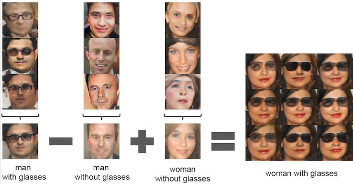
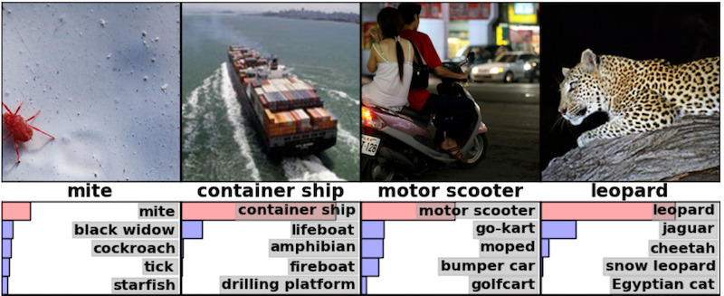
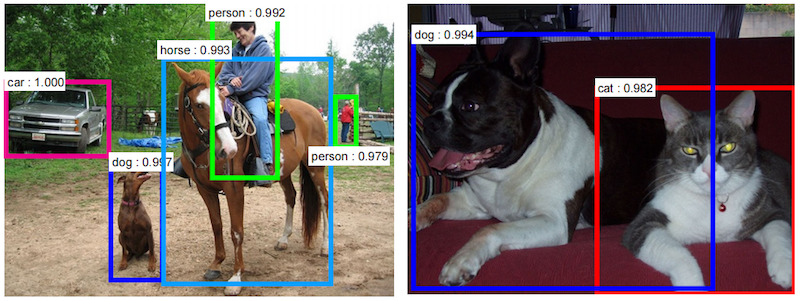
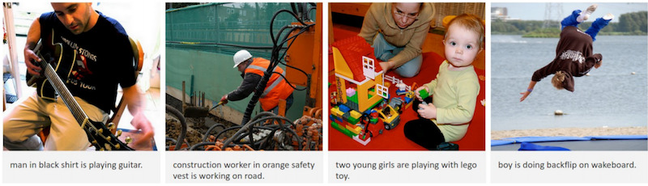
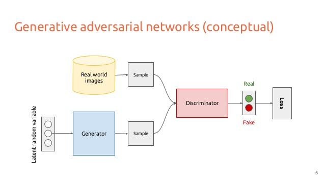
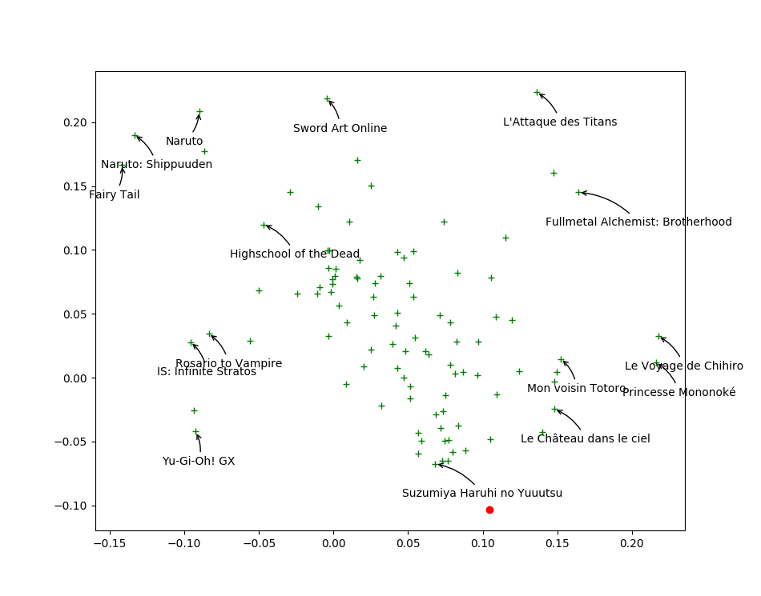
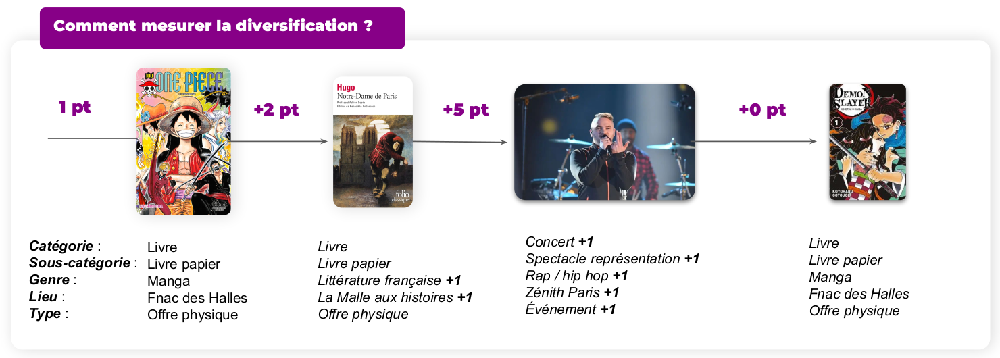

% IA et apprentissage
% Jill-Jênn Vie
% 20 novembre 2024
---
handout: true
institute: \includegraphics[height=1cm]{figures/inria.png}
lang: fr
babel-otherlangs: english
csquotes: true
aspectratio: 169
biblio-style: authoryear
navigation: frame
header-includes: |
  ```{=tex}
  \usepackage{subfig}
  \usepackage{icomma}
  \usepackage{bm}
  \usepackage{multicol,booktabs}
  \def\correct{\includegraphics{figures/win.pdf}}
  \def\uic{\textnormal{User } i \textnormal{ Item } j~\correct}
  \AtEndPreamble{\DefineBibliographyExtras{french}{\restorecommand\mkbibnamefamily}}
  \newcommand\mycite[3]{\textcolor{blue}{#1} "#2".~#3.}

  \setbeamertemplate{navigation symbols}{}
  \setbeamertemplate{footline}{%
    \leavevmode%
    \hbox{%
    \begin{beamercolorbox}[wd=\paperwidth,ht=2.25ex,dp=1ex,right]{date in head/foot}%
      \usebeamerfont{date in head/foot}\insertframenumber\hspace*{2ex}
    \end{beamercolorbox}}%
    \vskip0pt%
  }
  ```
biblatexoptions:
  - maxbibnames=99
  - maxcitenames=5
  - babel=other
---

# Plan

1. \alert{L'essor de l'IA et ses applications à l'éducation}

2. Personnalisation dans les systèmes de recommandation / tests adaptatifs  
\indent L'exemple de la certification Pix

3. Risques et opportunités des LLM[^1]

 [^1]: Grands modèles de langue (*large language models*) comme Mistral, LLaMa, ChatGPT, Gemini

# L'IA en éducation


# *Deep Learning* -- Apprentissage profond

- 1957 : Perceptron (Rosenblatt) : le premier réseau de neurones
- 1969 : Minsky & Papert mettent en évidence des limitations du modèle linéaire $\rightarrow$ perte de fonds
- 1980 : Fukushima propose le néocognitron, précurseur des CNN (vision artificielle)

"**Trio conspirationniste**" a remporté le prix Turing 2018

Geoffrey Hinton (Anglais-Canadien, prix Nobel de physique 2024)  
Yann LeCun (Français-Américain, Meta AI), son postdoc  
Yoshua Bengio (Canadien, Univ. Montréal), son postdoc

\pause

> - 2007 : faux workshop organisé à N(eur)IPS
> - 2012 : percée reconnaissance d'images : AlexNet (Krizhevsky, Sutskever, Hinton)
> - 2013 : percée traitement du langage : word2vec (Mikolov et al.)
> - 2014 : percée génération d'images : GAN (Goodfellow et al.)
> - 2017 : transformers (Vaswani et al.) puis BERT (2018) et GPT (2018)

# Représentation de mots word2vec (Mikolov et al., 2013)

\centering

{width=80%}

Donc : $Paris - France + Japon = Tokyo$  
Et : $king - man + woman = queen$.

# Déjà des biais : $programmer - man + woman = ?$

\centering

{width=70%}

\raggedright \small

\fullcite{bolukbasi2016man}

# images2vec

\ 

# Reconnaissance d'images

\centering

{width=70%}   
{width=80%}

# Légende automatique

\ 

Utile pour les personnes malvoyantes

# Légende automatique et attention (Xu and Bengio, 2015)

\ 

# Traduction et attention

\centering

{width=50%}

# Représentations de mots multilingues (non supervisé !)

\centering

{width=40%}

\raggedright
\fullcite{lample2018word}

# Application : une IA pour sous-titrer ? Sous-titres automatiques

\centering

{height=3cm} {height=3cm}

\raggedright

Étude sur 13000 écoliers entre 2002 et 2007. (Tordons le cou aux critiques sur les écrans.)\bigskip

> Purely from schooling, without any exposure to [same-language subtitling, SLS], we found that \alert{24\%} children became good readers after 5 years of schooling. But in the group of school children that was exposed to SLS regularly, at most 30 min a week over five years, \alert{56\%} became good readers.

\small

\fullcite{kothari2008let}

# Un récent outil : AxTongue.com \only<2>{basé sur un prompt ChatGPT}

\centering

{width=80%}

# Synthèse vocale : Whisper

Un modèle de seulement 75 Mo et 8 secondes pour exécuter ceci :

\footnotesize

```
time ./main -m models/ggml-tiny.bin -l fr -f sample-show.wav

[00.000 --> 02.500]   - Ça va, merci. - C'est pas trois que je parle.
[02.500 --> 04.800]   Regarde ce que tu as fait, c'est de pourfouter de chose.
[04.800 --> 06.100]   Est-ce qu'il ne respire?
[06.100 --> 08.100]   - Euh, bah je crois. - Oui, je crois.
[08.100 --> 11.000]   - Ne restes pas planté là, tu vois bien qu'il a besoin d'un médecin.
[11.000 --> 13.000]   Il y a un centre Pokémon, non loin d'ici.
[13.000 --> 15.200]   Il faut que tu y ailles le plus vite possible.
[15.200 --> 16.700]   - C'est vrai et un centre.
[16.700 --> 20.600]   - Oui, pour Pokémon. - Est-ce que tu peux m'indiquer la direction?
[20.600 --> 21.700]   - Par là.
[21.700 --> 25.700]   - Oh non, ils arrivent!
[25.700 --> 28.900]   - Humé! Qu'est-ce que tu fais?
[28.900 --> 30.900]   Je comprends pas mis.
```

\normalsize

Lalilo : correction de la parole (attention aux accents régionaux)

# Generative Adversarial Networks (Goodfellow, 2014)



# Interpolation d'images

\centering

\ 

# MakeGirls.Moe (Jin et al., 2017)

\ 

# Où l'IA (générative) peut-elle être utilisée en éducation ?

:::::: {.columns}
::: {.column width=80%}
- Correction automatique
- Génération automatique d'exercices
- Prédire la performance d'apprenants pour adapter l'instruction
- Personnaliser l'évaluation (ma recherche)
- Proposer un retour (*feedback*) personnalisé aux apprenants
- Explications personnalisées\medskip

Cf. le rapport anglais de janvier 2024 (536 répondants)
:::
::: {.column width=15%}
$\fbox{\includegraphics{figures/genai-uk.png}}$
:::
::::::

## Opportunités

- libérer du temps d'enseignant passé aux tâches administratives pour se concentrer sur l'enseignement
- un soutien pédagogique supplémentaire (par ex. élèves en situation de handicap)

## Risques

- Informations biaisées ou peu fiables
- Dépendance excessive aux outils d'IA

# Correction automatique : GradeScope (Singh et al. 2017, Berkeley)


# Quels superpouvoirs souhaitent avoir les profs ?

Trop d'EdTech ne se soucient pas des réels besoins des professeurs

\small

## Superpouvoirs : avoir un baromètre de si la classe a compris ou pas

- Voir les processus de pensée des apprenants (ceux dans la mauvaise direction)
- Voir qui est vraiment bloqué / qui y est presque / qui a juste besoin de motivation
- Se cloner / avoir des yeux dans le dos (patrouiller)
- Détecter les mauvaises conceptions des apprenants (qui risquent de persister)

Doléances :

- Aidez-moi à intervenir là, quand, et ce pour quoi on a le plus besoin de moi
- La technologie ne doit pas attirer mon attention hors de mes étudiants
- Comment savoir si ce que je fais a un réel impact ?
- Je ne suis qu'une personne ; déchargez-moi
- Que pouvez-vous me dire sur mes étudiants que je ne sais pas déjà ?
- Laissez-moi contrôler et personnaliser la technologie pour mes propres besoins

\fullcite{holstein2019co}


# Principe fondamental de l'IA et l'optimisation

Si l'on donne un objectif précis mesurable (et des données), on peut calculer pour optimiser cet objectif

## Contre-exemple : Parcoursup

Problème d'optimisation : est-il optimal pour les établissements ou pour les apprenants ?\medskip

Le truc évident qu'il faudrait faire et qu'on ne fait pas  
Sauvegarder les vœux d'une année sur l'autre pour anticiper les envies des élèves, remarquer les inégalités, critiquer les décisions passées\medskip

Attention à l'autocensure des filles et des personnes en situation défavorisée\medskip

Vers un système de recommandation de vœux ?  
(Suggérer des filières plus prestigieuses, ou au contraire des vœux moins ambitieux au regard des notes.)

\small \fullcite{hakimov2023confidence}

# Plan

1. L'essor de l'IA et ses applications à l'éducation

2. \alert{Personnalisation dans les systèmes de recommandation / tests adaptatifs}  
    L'exemple de la certification Pix

3. Risques et opportunités des LLM[^1]

 [^1]: Grands modèles de langue (*large language models*) comme Mistral, LLaMa, ChatGPT, Gemini

# Systèmes de recommandation

## Problème

- Chaque personne note peu d'œuvres (1 %)
- Comment inférer les notes manquantes ?

## Exemple

\centering

\begin{tabular}{ccccc}
& \includegraphics[height=2.5cm]{figures/1.jpg} & \includegraphics[height=2.5cm]{figures/2.jpg} & \includegraphics[height=2.5cm]{figures/3.jpg} & \includegraphics[height=2.5cm]{figures/4.jpg}\\
Sacha & ? & 5 & 2 & ?\\
Ondine & 4 & 1 & ? & 5\\
Pierre & 3 & 3 & 1 & 4\\
Joëlle & 5 & ? & 2 & ?
\end{tabular}

# Systèmes de recommandation

## Problème

- Chaque personne note peu d'œuvres (1 %)
- Comment inférer les notes manquantes ?

## Exemple

\centering

\begin{tabular}{ccccc}
& \includegraphics[height=2.5cm]{figures/1.jpg} & \includegraphics[height=2.5cm]{figures/2.jpg} & \includegraphics[height=2.5cm]{figures/3.jpg} & \includegraphics[height=2.5cm]{figures/4.jpg}\\
Sacha & \alert{3} & 5 & 2 & \alert{2}\\
Ondine & 4 & 1 & \alert{4} & 5\\
Pierre & 3 & 3 & 1 & 4\\
Joëlle & 5 & \alert{2} & 2 & \alert{5}
\end{tabular}

# Qu'est-ce qu'un algorithme de machine learning ?

## Fit (entraîner)

\def\Zootopia{\emph{Zootopie}}
\def\Porco{\emph{Porco Rosso}}
\def\Tokikake{\emph{La Traversée du temps}}
\def\Martian{\emph{Seul sur Mars}}

\begin{center}
\begin{tabular}{rcl} \toprule
Ondine & \alert{aime} & \Zootopia\\
Ondine & \alert{adore} & \Porco\\
Sacha & \alert{adore} & \Tokikake\\
Sacha & \alert{n'aime pas} & \Martian\\ \bottomrule
\end{tabular}
\end{center}

## Predict (prédire)

On est passé des bases de données à l'inférence :  
"Je ne connais pas la bonne réponse, mais voici celle qui me semble la plus probable à la lumière des données que j'ai"\medskip

\begin{center}
\begin{tabular}{rcl} \toprule
Ondine & \alert{\only<1>{?}\only<2>{adore}} & \Martian\\
Sacha & \alert{\only<1>{?}\only<2>{aime}} & \Zootopia\\  \bottomrule
\end{tabular}
\end{center}

# Qu'est-ce qu'un \alert{mauvais} algorithme de machine learning ?

## Fit

\begin{center}
\begin{tabular}{rcl} \toprule
Ondine & \alert{like} & \Zootopia\\
Ondine & \alert{favorite} & \Porco\\
Sacha & \alert{favorite} & \Tokikake\\
Sacha & \alert{dislike} & \Martian\\ \bottomrule
\end{tabular}
\end{center}

\hfill 100 % correct

## Predict

\begin{center}
\begin{tabular}{rcl} \toprule
Ondine & \alert{n'aime pas} & \Martian{} (en fait : adore)\\
Sacha & \alert{neutre} & \Zootopia{} (en fait : aime)\\ \bottomrule
\end{tabular}
\end{center}

\hfill 20 % correct

N'arrive pas à \alert{généraliser}

# Qu'est-ce qu'un \alert{bon} algorithme de machine learning ?

## Fit

\begin{center}
\begin{tabular}{rcl} \toprule
Ondine & \alert{adore} & \Zootopia{} (en fait : aime)\\
Ondine & \alert{adore} & \Porco\\
Sacha & \alert{adore} & \Tokikake\\
Sacha & \alert{n'aime pas} & \Martian\\ \bottomrule
\end{tabular}
\end{center}

\hfill 90 % correct

## Predict

\begin{center}
\begin{tabular}{rcl} \toprule
Ondine & \alert{aime} & \Martian{} (en fait : adore)\\
Sacha & \alert{adore} & \Zootopia{} (en fait : aime)\\ \bottomrule
\end{tabular}
\end{center}

\hfill 90 % correct

# Algorithme des plus proches voisins (programme de 1re NSI)

Pour recommander des films à quelqu'un :

- On introduit un \alert{score de similarité} entre personnes
- On détermine les $N$ personnes \alert{les plus proches} de quelqu'un
- On lui recommande ce qu'elles ont aimé qu'il n'a pas vu

Si $N$ vaut la taille de toute la population : on recommande le Top 250 IMDb  
Si $N$ est trop petit : peu de généralisation

# Un exemple de données

\centering

\begin{tabular}{c@{\hspace{3mm}}c@{\hspace{3mm}}c@{\hspace{3mm}}c@{\hspace{3mm}}c@{\hspace{3mm}}c@{\hspace{3mm}}c}
& \footnotesize{007} & \footnotesize{Batman 1} & \footnotesize{Shrek 2} & \footnotesize{Toy Story 3} & \footnotesize{Star Wars 4} & \footnotesize{Twilight 5}\\
Alice & $+$ & $-$ & $0$ & $+$ & $0$ & $-$\\
Bob & $-$ & $0$ & $+$ & $-$ & $+$ & $+$\\
Charles & $+$ & $+$ & $+$ & $+$ & $-$ & $-$\\
Daisy & $+$ & $+$ & $0$ & $0$ & $+$ & $-$\\
Everett & $+$ & $-$ & $+$ & $+$ & $-$ & $0$\\
\end{tabular}

\begin{center}
Quel score de similarité entre utilisateurs choisir ?
\end{center}

# Calcul du score

\centering

\begin{tabular}{c@{\hspace{3mm}}c@{\hspace{3mm}}c@{\hspace{3mm}}c@{\hspace{3mm}}c@{\hspace{3mm}}c@{\hspace{3mm}}c}
& \footnotesize{007} & \footnotesize{Batman 1} & \footnotesize{Shrek 2} & \footnotesize{Toy Story 3} & \footnotesize{Star Wars 4} & \footnotesize{Twilight 5}\\
Alice & $+$ & $-$ & $0$ & $+$ & $0$ & $-$\\
Charles & $+$ & $+$ & $+$ & $+$ & $-$ & $-$\\
\end{tabular}

\centering

À quel point Alice est proche de Charles ?

# Calcul du score

\centering

\begin{tabular}{c@{\hspace{3mm}}c@{\hspace{3mm}}c@{\hspace{3mm}}c@{\hspace{3mm}}c@{\hspace{3mm}}c@{\hspace{3mm}}c}
& \footnotesize{007} & \footnotesize{Batman 1} & \footnotesize{Shrek 2} & \footnotesize{Toy Story 3} & \footnotesize{Star Wars 4} & \footnotesize{Twilight 5}\\
Alice & $+$ & $-$ & $0$ & $+$ & $0$ & $-$\\
Charles & $+$ & $+$ & $+$ & $+$ & $-$ & $-$\\
Score & $+1$ & $-1$ & & $+1$ & & +1\\
\end{tabular}
\vspace{-1mm}
\begin{center}
$score(\textnormal{Alice}, \textnormal{Charles}) = 3 + (-1) = \alert{2}$  
\end{center}
\vspace{2mm}

\begin{tabular}{c@{\hspace{3mm}}c@{\hspace{3mm}}c@{\hspace{3mm}}c@{\hspace{3mm}}c@{\hspace{3mm}}c@{\hspace{3mm}}c}
& \footnotesize{007} & \footnotesize{Batman 1} & \footnotesize{Shrek 2} & \footnotesize{Toy Story 3} & \footnotesize{Star Wars 4} & \footnotesize{Twilight 5}\\
Alice & $+$ & $-$ & $0$ & $+$ & $0$ & $-$\\
Bob & $-$ & $0$ & $+$ & $-$ & $+$ & $+$\\
Score & $-1$ & & & $-1$ & & -1\\
\end{tabular}
\vspace{-1mm}
\begin{center}
$score(\textnormal{Alice}, \textnormal{Bob}) = \alert{-3}$\bigskip
\vspace{2mm}

Alice est \alert{plus proche} de Charles que de Bob
\end{center}

# Score de similarité entre personnes

\begin{center}
\begin{tabular}{c@{\hspace{2mm}}|c@{\hspace{2mm}}c@{\hspace{2mm}}c@{\hspace{2mm}}c@{\hspace{2mm}}c}
& Alice & Bob & Charles & Daisy & Everett\\
\hline
Alice & $4$ & $-3$ & $2$ & $1$ & $3$\\
Bob & $-3$ & $5$ & $-3$ & $-1$ & $-2$\\
Charles & $2$ & $-3$ & $6$ & $2$ & $3$\\
Daisy & $1$ & $-1$ & $2$ & $4$ & $-1$\\
Everett & $3$ & $-2$ & $3$ & $-1$ & $5$\\
\end{tabular}
\end{center}

\begin{center}
Qui sont les 3 plus proches voisins d'Alice ?
\end{center}

# Calcul des prédictions

\centering

\begin{tabular}{c@{\hspace{3mm}}c@{\hspace{3mm}}c@{\hspace{3mm}}c@{\hspace{3mm}}c@{\hspace{3mm}}c@{\hspace{3mm}}c}
& \footnotesize{007} & \footnotesize{Batman 1} & \footnotesize{Shrek 2} & \footnotesize{Toy Story 3} & \footnotesize{Star Wars 4} & \footnotesize{Twilight 5}\\
Alice & $+$ & $-$ & \alert{?} & $+$ & \alert{?} & $-$\\
Charles & $+$ & $+$ & $+$ & $+$ & $-$ & $-$\\
Daisy & $+$ & $+$ & $0$ & $0$ & $+$ & $-$\\
Everett & $+$ & $-$ & $+$ & $+$ & $-$ & $0$\\
\end{tabular}

\begin{center}
Connaissant ses voisin$\cdot$es, quelles sont les chances d'Alice d'apprécier ces films ?
\end{center}

# Calcul des prédictions

\centering

\begin{tabular}{c@{\hspace{3mm}}c@{\hspace{3mm}}c@{\hspace{3mm}}c@{\hspace{3mm}}c@{\hspace{3mm}}c@{\hspace{3mm}}c}
& \footnotesize{007} & \footnotesize{Batman 1} & \footnotesize{Shrek 2} & \footnotesize{Toy Story 3} & \footnotesize{Star Wars 4} & \footnotesize{Twilight 5}\\
Alice & $+$ & $-$ & \alert{$+$} & $+$ & \alert{$-$} & $-$\\
Charles & $+$ & $+$ & $+$ & $+$ & $-$ & $-$\\
Daisy & $+$ & $+$ & $0$ & $0$ & $+$ & $-$\\
Everett & $+$ & $-$ & $+$ & $+$ & $-$ & $0$\\
\end{tabular}

\begin{center}
On peut calculer la moyenne :\\
$prediction(\textnormal{Alice}, \textnormal{Star Wars 4}) = -0,333$…
\end{center}

# Apprentissage de représentation (position dans l'espace)

**Idée :** Apprendre une représentation des utilisateurs et œuvres  
de sorte que les gens aiment des œuvres proches d'eux

## Algorithme \alert{ALS} : moindres carrés alternés (Zhou, 2008)

- Jusqu'à convergence :
    - Fixer $U$ (utilisateurs) améliorer $W$ (œuvres)  
    - Fixer $W$ améliorer $U$

# Illustration de la minimisation alternée

\only<1>{\includegraphics{figures/embed0.pdf}}
\only<2>{\includegraphics{figures/embed1.pdf}}
\only<3>{\includegraphics{figures/embed2.pdf}}
\only<4>{\includegraphics{figures/embed3.pdf}}
\only<5>{\includegraphics{figures/embed4.pdf}}
\only<6>{\includegraphics{figures/embed5.pdf}}
\only<7>{\includegraphics{figures/embed6.pdf}}
\only<8>{\includegraphics{figures/embed7.pdf}}
\only<9>{\includegraphics{figures/embed8.pdf}}
\only<10>{\includegraphics{figures/embed9.pdf}}
\only<11>{\includegraphics{figures/embed10.pdf}}
\only<12>{\includegraphics{figures/embed11.pdf}}
\only<13>{\includegraphics{figures/embed12.pdf}}
\only<14>{\includegraphics{figures/embed13.pdf}}
\only<15>{\includegraphics{figures/embed14.pdf}}
\only<16>{\includegraphics{figures/embed15.pdf}}
\only<17>{\includegraphics{figures/embed16.pdf}}
\only<18>{\includegraphics{figures/embed17.pdf}}
\only<19>{\includegraphics{figures/embed18.pdf}}
\only<20>{\includegraphics{figures/embed19.pdf}}
\only<21>{\includegraphics{figures/embed20.pdf}}
\only<22>{\includegraphics{figures/embed21.pdf}}
\only<23>{\includegraphics{figures/embed22.pdf}}
\only<24>{\includegraphics{figures/embed23.pdf}}
\only<25>{\includegraphics{figures/embed24.pdf}}
\only<26>{\includegraphics{figures/embed25.pdf}}
\only<27>{\includegraphics{figures/embed26.pdf}}
\only<28>{\includegraphics{figures/embed27.pdf}}
\only<29>{\includegraphics{figures/embed28.pdf}}
\only<30>{\includegraphics{figures/embed29.pdf}}
\only<31>{\includegraphics{figures/embed30.pdf}}
\only<32>{\includegraphics{figures/embed31.pdf}}
\only<33>{\includegraphics{figures/embed32.pdf}}
\only<34>{\includegraphics{figures/embed33.pdf}}
\only<35>{\includegraphics{figures/embed34.pdf}}
\only<36>{\includegraphics{figures/embed35.pdf}}
\only<37>{\includegraphics{figures/embed36.pdf}}
\only<38>{\includegraphics{figures/embed37.pdf}}
\only<39>{\includegraphics{figures/embed38.pdf}}

# Visualisation des œuvres : points proches $\iff$ goûts similaires

\centering



# Où êtes-vous sur la carte ?

\centering


# Tordre le cou aux bulles de filtre

Je ne dis pas que ça n'existe pas (cf. polarisation sur les réseaux sociaux, élections, etc.)

Mais avant les systèmes de recommandation, on était dans nos bulles de filtre physiques.

Un moteur de recherche ou un LLM a lu beaucoup plus de choses que nous (polydisciplinaires) :

- peut nous amener vers des choses où on ne serait pas naturellement allé  
Ex. le système de recommandation est le reflet de la multitude de notes
- LLM capables de repérer qu'un même concept a des noms différents dans différentes disciplines, différentes langues
- multiplier les points de vue (jeu de rôle) et différences culturelles

# Travaux en cours sur la diversité dans les systèmes de recommandation (Pass Culture, 3M users)



Faire découvrir de nouvelles choses aux jeunes (et non juste les faire consommer)

# Optimisation de l'apprentissage humain

On observe des données d'apprentissage sur une plateforme  
(évaluation, cours en ligne)

Comment utiliser ces données pour profiter aux autres apprenants ?

## Challenges

- Ne pas poser trop de questions aux apprenants
- Les apprenants évoluent au cours du temps
- Quelles données utiliser ?
- Quelle fonction objectif choisir ?

# Personnalisation de l'évaluation : tests adaptatifs

Comment mesurer 800 composantes de connaissances efficacement ?  
Avec la théorie de la réponse à l'item

:::::: {.columns}
::: {.column}

:::
::: {.column}
\vspace{1cm}

- On pose une question de niveau 5
- L'apprenant \alert{réussit}
- On pose une question de niveau 12
- L'apprenant \alert{échoue}
- On pose une question de niveau 4
- etc.
:::
::::::

\small

\fullcite{Vie2017adaptive}


# Modèle rudimentaire : théorie de la réponse à l'item IRT-1PL

\centering

\resizebox{0.9\linewidth}{!}{$\displaystyle \substack{\normalsize \Pr(\textnormal{"étudiant A résout question B"})\\ \Pr(\textnormal{"joueur A bat joueur B"})\\ \Pr(\textnormal{"A est préféré à B"})} = \frac1{1 + \exp(-(score_A - score_B))}$}

\raggedright

Mesurer le trait latent (la position sur la gaussienne) à partir des résultats à des tests

\begin{figure}
  \captionsetup[subfigure]{labelformat=empty,justification=centering}
  \subfloat[reCAPTCHA\\ (Luis von Ahn, 2008)]{\raisebox{2mm}{\includegraphics[width=0.25\linewidth]{figures/captcha.png}}}
  \subfloat[Elo (1967)\\ TrueSkill (2007)]{\includegraphics[width=0.25\linewidth]{figures/tournament-nyt.png}}
  \subfloat[Tests adaptatifs\\ (Rasch, 1960)]{\includegraphics[width=0.25\linewidth]{figures/irt.pdf}}
  \subfloat[Modèles de préférences\\ (Bradley \& Terry, 1952)]{\raisebox{3mm}{\includegraphics[width=0.25\linewidth]{figures/elo2.jpg}}}
\end{figure}

\vfill \small

\fullcite{rasch1960studies}

# Référentiel de compétences numériques DIGCOMP 2.0

\centering
\includegraphics[width=0.4\linewidth]{figures/digcomp.png}
\includegraphics[width=0.4\linewidth]{figures/prerequisite.png}

- Informations et données
  - Ex. rechercher de l'information sur Internet
- Communication collaboration
- Création de contenu
- Protection et sécurité
- Résolution de problèmes

# Certification des compétences numériques Pix

{width=2cm}

La certification Pix a remplacé le B2i pour les lycéens en 2019

À présent 6 millions d'utilisateurs actifs

- 1 intrapreneur au ministère de l'Éducation
- 3 chercheurs concepteurs d'épreuves
- 2 développeurs
- +1 concepteur de l'algorithme adaptatif

# Un exemple de problème Pix

\centering \Large
Dans le village de Montrésor,  
sur quelle rue débouche la rue des Perrières ?

\vspace{1cm} \pause

\normalsize
$\rightarrow$ permet de valider l'acquis \@rechercheInfo3

# Types de tests

## Tests de positionnement

Évaluer son niveau en peu de questions  
Faible enjeu ; basé sur une cartographie des connaissances

## Tests de certification

Fort enjeu : l'apprenant peut le valoriser

## Tests de progression

"Quoi apprendre ensuite ?"  
Optimiser l'apprentissage humain

# Compromis entre bien mesurer et poser peu de questions

\centering

{width=70%}

\raggedright

\alert{Maximiser l'information} $\rightarrow$ poser des questions à la frontière de la connaissance $\rightarrow$ les apprenants échouent 50 % du temps (bien pour l'évaluateur, pas pour les apprenants)


# Choisir la bonne fonction à optimiser

\centering


\raggedright

\alert{Maximiser le taux de succès} $\rightarrow$ on pose artificiellement des questions trop faciles

\pause

\alert{Acquérir le plus de connaissances} \parencite{Yessad2022}

\pause

\alert{Maximiser son score sur l'examen suivant ?}  
Réviser ce qui a le plus de chances de tomber \parencite{Lan2016ACB}

\pause

\alert{Maximiser la croissance du taux de succès} Travaux zone proximale de développement à Inria Bordeaux \parencite{clement2015multi}

\pause

\alert{Identifier une lacune de l'apprenant le plus vite possible} \parencite{Seznec2020}

Étant donné un objectif d'apprentissage, planifier les activités pour y parvenir ?

# Algorithme conçu pour Pix

\alert{Maximiser le nombre moyen d'acquis validés ou invalidés}

Le code source de l'algorithme adaptatif est \alert{ouvert}  
(pix.fr, code sur GitHub sous licence AGPLv3)  
Déjà 350 000 comptes créés, 50 000 certifications délivrées

\centering
\includegraphics[width=\linewidth]{figures/example.pdf}

\raggedright

\small

\fullcite{Vie2017PIX}

# Flow

Récompense plus haute si l'étudiant a résolu une question plus difficile, 0 si l'étudiant n'arrive pas à répondre

\centering

{width=50%}

\raggedright

On identifie le *flow* directement à partir des données (soumission en cours)

# Challenges supplémentaires : évolution des connaissances (oubli)

Travaux sur la mémoire et la répétition espacée

\centering

{width=45%}

\raggedright \small

\fullcite{Choffin2019}

# Recommandation de documents pour un apprentissage dynamique

\centering

{width=70%}

\textcolor{gray}{Figure from \cite{shabana2022curriculumtutor}.}

\small \raggedright

\fullcite{Vassoyan2023}

Travaux acceptés à NeurIPS 2024 workshop on Large Foundation Models for Educational Assessment

# Système de tuteurs intelligent pour apprendre à compter (Inria Bordeaux)

\centering

{width=90%}

# Représentation du domaine préparée par les professeurs

De l'intérêt d'une personnalisation contrôlée par l'enseignant


La séquence IA met moins les apprenants en échecs et utilise davantage la banque d'exercices que la séquence préparée par l'enseignant

# Effets sur les apprentissages

:::::: {.columns}
::: {.column width=50%}
## Contrôle

:::
::: {.column width=50%}
## Traitement

:::
:::

\fullcite{clement2015multi}

# Jeu de données de soustractions sur les fractions

Essais de 536 collégiens sur $20$ items


# Carte de connaissances

En noir, les 20 questions ; \alert{en rouge, l'apprenant}

\centering

{width=40%}

# Les points forts

\centering

{width=80%}

# Et les points faibles

\centering

{width=80%}

# Plan

1. L'essor de l'IA et ses applications à l'éducation

2. Personnalisation dans les systèmes de recommandation / tests adaptatifs  
    L'exemple de la certification Pix

3. \alert{Risques et opportunités des LLM}[^1]

 [^1]: Grands modèles de langue (*large language models*) comme Mistral, LLaMa, ChatGPT, Gemini

# 


# Les grands modèles de langage (LLM) : quels objectifs ?

1. Transformer : prédire le mot suivant

```
Transformers / are / a / new / machine / [learning]  
Transformers / are / a / new / machine / learning / [architecture]
```

2. Données de démonstration d'experts :

```
Query: put the first letters in uppercase in "optimizing human learning"
Answer: Optimizing Human Learning
```

3. Données de comparaison d'experts :

```
Query: write a poem
Answer 1: Roses are red
Answer 2: Once upon a time, a prince in a castle
```

Où la réponse 2 est votée favorablement par les experts

ChatGPT est donc entraîné pour plaire aux experts et généraliser à de nouvelles tâches

# 


# Mais ce biais est une vertu : multiplier les points de vue (ex. PhiloGPT)

\centering


\url{https://philogpt.vmirebeau.fr}

# Risques possibles des LLM

## I -- Discrimination, exclusion et toxicité : stéréotypes

GPT-3 : analogies entre musulmans et terroristes dans 23 % des tests

Le fait que ça fonctionne moins bien dans d'autres langues que l'anglais

Suggestion de prendre un médicament ou de pousser au suicide

## II -- Risques liés à l'information

Le fait que ChatGPT mémorise et régurgite des informations confidentielles présentes dans les données d'entraînements

## III -- Dommages causés par la désinformation

Disséminer des informations fausses

## IV -- Utilisations malveillantes

Plus facile de fabriquer de la désinformation à moindre coût

Arnaques fraude en imitant la voix

Créer des nouveaux virus difficiles à détecter

# Risques possibles des LLM

## V -- Dommages causés par l'interaction homme-machine

Risque que ChatGPT s'exprime tellement bien qu'on vienne à en oublier qu'il s'agit d'un robot ; que les jeunes s'ouvrent à lui car ils sont moins jugés que s'ils s'exprimaient avec un professeur ou un humain. (Les humains qui interagissent avec un robot qui a l'air humain révèlent plus d'informations que s'ils partagent avec un robot qui a l'air machine.)

## VI -- Automatisation, accès et dommages environnementaux

Bien sûr, l'impact environnemental de ces techniques

Risque de déplacement des emplois (et non suppression). Il est possible qu'on ait moins besoin de développement de la technologie et plus besoin d'embaucher des gens pour la modération à moindre coût. Risque d'une dégradation de la qualité des emplois, si les gens doivent juste valider ce que la machine fait, avec moins d'autonomie, et moins de contact humain au travail.\bigskip

\small

\fullcite{weidinger2022taxonomy}

# À propos des risques de confidentialité


\small

\fullcite{weidinger2022taxonomy}

# Utiliser un chatbot pour réduire la croyance en conspirations

Ça permet aux gens conspirationnistes (ex. COVID-19) de revenir sur leurs idées  
(effets durables : 10 jours, 2 mois)


\small

\fullcite{costello2024durably}

# LLM sur questions SAT (1200 participants Amazon Mechanical Turk)

\begin{itemize}
\item[RQ1] When doing practice questions for a math test, how does the type of explanation people receive (answers alone or answers with LLM-generated explanations) affect performance on subsequent test questions?
\item[RQ2] How does the relationship between explanation type and performance change when people i) attempt questions before seeing explanations or ii) see explanations before attempting questions?
\end{itemize}

LLM-based explanations positively impact learning (relatively to seeing only correct answers), regardless of whether participants consulted them before or after attempting practice problems.

Exposure to LLM explanations increased the amount people felt they learned and decreased the perceived difficulty of the test problems.

\small

\fullcite{kumar2023math}

# LLM pour la programmation (5923 essais de 132 participants)

Sombre : groupe expérimental (accès aux explications ChatGPT)

{width=50%}\ 
{width=50%}

\raggedleft

Taux de succès cumulatif après chaque essai \hfill Taux de succès cumulatif sans ChatGPT

\raggedright \small

\fullcite{pankiewicz2023large}

# Retours terrain de GPT-4 par Khan Academy

Khan Academy ne publie rien, ils n'ont qu'un blog de communication

:::::: {.columns}
::: {.column width=70%}
## Retours d'expérience

- Les jeunes demandent à ChatGPT de lui donner la réponse, ils ont la flemme de taper
- Du coup, la reconnaissance vocale *speech to text* est utile
- Khanmigo propose aussi à l'élève de cliquer parmi plusieurs réponses possibles
- Interagir dans leur langue maternelle est utile
:::
::: {.column width=30%}

:::
::::::

## Même si Khanmigo n'est qu'une interface pour ChatGPT

- Aide pour la rédaction de curriculums pour l'organisation d'un cours
- Génération de planches d'exercices
- Aide pour le style dans la rédaction de dissertation : générer un document par itérations et interaction (`*Always easier to edit a shitty draft than a blank page*')
- Critique ma lettre de recommandation
- Multimodal : génère une interrogation sur ce polycopié\medskip

# Merci pour votre attention ! Recommandations en IA pour l'éducation :

## Savoir ce que l'on souhaite mesurer et optimiser

Pour réduire les inégalités il faut pouvoir mesurer les discriminations

## Ouvrir le code des algorithmes EdTech

Ne serait-ce que pour être en accord avec la loi pour une République numérique

## Pouvoir partager les paramètres des modèles d'IA en plus des énoncés

Si je souhaite m'entraîner, je souhaite avoir des informations statistiques sur une base de problèmes \hfill \url{https://jjv.ie/slides/infine.pdf}

## Conserver les données historiques de Parcoursup

Pour rejouer des décisions, critiquer les décisions du passé, tester de nouveaux algorithmes \hfill \href{mailto:vie@jill-jenn.net}{vie@jill-jenn.net}

## "Vieille" question du ministère : est-il possible de détecter la triche ChatGPT ?

- Oui (ICML 2023) et non (trop de LLM différents) ; attention aux faux positifs
- La plupart des profs repèrent déjà que ce n'est pas l'étudiant qui a écrit le texte

# Paradoxe

PISA mesure 3 nombres par pays ; tandis que ChatGPT mesure 1536 nombres par mot.  
Une évaluation formative serait plus utile

\centering

{width=60%}

\raggedright

\small \fullcite{verhelst2017balance}

# Théorie de la réponse à l'item

\centering


Utilisé par les certifications PISA, GMAT, etc.

<!-- Autrefois les chatbots : soit on échafaude des règles de partout

Soit on encode cela dans une règle mathématique

Exemple : je souhaite minimiser le nombre de questions -->

<!-- Certains jeunes ont besoin qu'on leur explique plusieurs fois de façons différentes. -->

<!-- Les jeunes qui ne comprennent pas ne sont pas ceux qui vont poser des questions. -->

<!-- - Rappel que y avait déjà des robots pour résoudre Todai
- Gemini qui peut créer une interrogation sur n'importe quel poly -->

<!-- Ajouter des liens vers les articles -->
