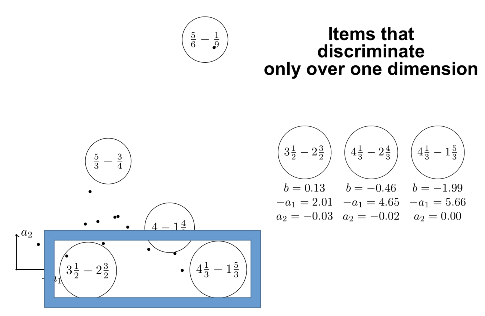

% Learning representations that evolve over time
% JJ Vie
% November 22, 2019
---
aspectratio: 169
handout: true
theme: Frankfurt
section-titles: false
header-includes:
    - \usepackage{bm}
    - \newcommand\mycite[3]{\textcolor{blue}{#1} "#2".~#3.}
---

# Learning scalars

## Outline

1. learning latent constructs from humans

Ex. skills at Chess, calculus skills, preferences

2. that evolve over time

3. and optimize human learning

## Chess players have Elo ratings

Elo ratings are updated after each match

If player 1 (550) beats player 2 (600)

Then player 1 will $\uparrow$ (560) and player 2 will $\downarrow$ (590)

## Let's ask Harvard students

\centering

(*The Social Network*)

## Let's ask Harvard students

\centering

(*The Social Network*)

## K-Factor???

\centering

(Not *The Social Network*)

## Old models still used today

### Elo (1960--1978)

$$P(\theta_i \textnormal{ beats } \theta_j) = \frac1{1 + 10^{(\theta_j - \theta_i)/400}}$$

### Item response theory (1960)

$$P(\theta_i \textnormal{ solves } d_j) = \frac1{1 + e^{-(\theta_i - d_j)}}$$

## Examples

Used in PISA, GMAT, Pix.

## Maximum likelihood estimation

Given outcomes $r \in \{0, 1\}$, how to estimate $\theta$?

$p = \frac1{1 + e^{-(\theta - d)}} = \sigma(\theta - d)$

Thanks to logistic function: $p' = p(1 - p)$

$L(\theta) = \log p^r (1 - p)^{1 - r} = r \log p + (1 - r) \log (1 - p)$

$\nabla_\theta L = \frac{\partial L}{\partial \theta} = r - p$

$\theta_{t + 1} = \theta_t + \gamma \underbrace{\nabla_\theta L}_{r - p}$

\pause

Thus it is \alert{online gradient ascent}! K-factor = $\gamma$ = learning rate.\bigskip

> The chess statistician Jeff Sonas believes that the original $K=10$ value (for players rated above 2400) is inaccurate in Elo's work.

## Evolving over time

Players ability increase as they win matches over other players

So players may have an optimistic strategy to plan their matches

\pause

(If you want to write this paper, I'm in A09.)

# Learning vectors

## Recommender systems

\centering

\begin{tabular}{ccccc}
& \includegraphics[height=2.5cm]{figures/1.jpg} & \includegraphics[height=2.5cm]{figures/2.jpg} & \includegraphics[height=2.5cm]{figures/3.jpg} & \includegraphics[height=2.5cm]{figures/4.jpg}\\
Sacha & \only<2>{\alert{3}} & 5 & 2 & \only<2>{\alert{2}}\\
Ondine & 4 & 1 & \only<2>{\alert{4}} & 5\\
Pierre & 3 & 3 & 1 & 4\\
Joëlle & 5 & \only<2>{\alert{2}} & 2 & \only<2>{\alert{5}}
\end{tabular}

## Factorization: learning vectors

From some $R_{ij}$ infer other $R_{ij}$

### Collaborative filtering

Learn model $U, V$ such that $R \simeq UV \quad \widehat{r_{ij}} = \langle \bm{u}_i, \bm{v}_j \rangle$  
Optimize regularized least squares $\sum_{i, j} (\widehat{r_{ij}} - r_{ij}) + \lambda (||U||^2_F + ||V||^2_F)$

### Binary version

Learn model $U, V$ such that $R \simeq \sigma(UV) \quad \widehat{r_{ij}} = \sigma(\langle \bm{u}_i, \bm{v}_j \rangle)$
Optimize likelihood

EM algorithm via MCMC: sample $U$, optimize $V$ (Cai, 2010)  
Slow, $d \leq 6$

## Example

\centering

{height=7.5cm}

## Identify strong points

\centering

{height=7.5cm}

## And weak points

\centering

{height=7.5cm}

## Regression with sparse features (very elegant!)

$\bm{x}$ concatenation of one-hot vectors \only<3->{(ex. at positions $s$ and $t$)}

$\langle \bm{w}, \bm{x} \rangle = \sum_i w_i x_i \only<3->{= w_s + w_t}$

$|| V\bm{x} ||^2 = \sum_{\alert{i, j}} x_i x_j \langle \bm{v}_i, \bm{v}_j \rangle \geq 0$

\pause

$\frac12 (|| V\bm{x} ||^2 - \mathbf{1}^T (V \circ V) (\bm{x} \circ \bm{x})) = \sum_{\alert{i < j}} x_i x_j \langle \bm{v}_i, \bm{v}_j \rangle \only<3->{= \langle \bm{v}_s, \bm{v}_t \rangle}$

\pause \pause

Factorization machines (Rendle 2012)

$P(\langle \bm{x}, \bm{v}_i \rangle)$ for a polynomial $P$

The Blondel Trilogy

- Polynomial networks and FMs (ICML 2016)
- Multi-output polynomial networks and FMs (NIPS 2017)
- Higher-order FMs (NIPS 2016)

## Scaling to high dimension

$\theta_{t + 1} = \theta_t - \gamma \nabla_\theta \mathcal{L} \Rightarrow$ Replace $\nabla_\theta \mathcal{L}$ with an unbiased estimate $\tilde\nabla_\theta \mathcal{L}$ \centering
\includegraphics[width=0.7\linewidth]{figures/cfirt.pdf}

## In an ideal world (full answers, static humans)

\centering
<!--
$enc : \mathbf{R}^n \to \mathbf{R}^d$, $\bm{u} = enc(\bm{r})$  
$dec : \mathbf{R}^d \to \mathbf{R}^n$, $\bm{r} = dec(\bm{u})$

$\bm{\mu} \cdot \bm{\sigma} = enc(r)$
$u \sim \mathcal{N}(\mu, \sigma)$  
$r = dec(u)$
-->

The decoder is the response model $P(X_j = 1) = \sigma(\langle \bm{z}, \bm{v}_j \rangle)$  
The encoder is an approximate maximum likelihood estimator

# Knowledge tracing

## Knowledge tracing

Observe outcomes of students over questions:

$i: (q_t, a_t)_t = (j_t, r_{ij_t})_{0 \leq t \leq T}$

How to predict future performance of students, given the questions asked to them $(q_t)_t$?

## Encoder-decoder models

Evolution model of $\bm{u}_T$ over time

$\bm{u}_T = enc_\theta\left((q_t, a_t)_{0 \leq t \leq T}\right)$  
$\widehat{r_{ij_T}} = \sigma(\langle \bm{u}_T, \bm{v}_{j_T} \rangle)$

- online item response theory
- affine function (AAAI 2019)
- random encoders (ICLR 2019, EDM 2019)
- recurrent neural network (Piech et al., NIPS 2015)

## Deep knowledge tracing

\centering

## Spaced repetition systems (Leitner, 1970s)

\includegraphics[width=0.5\linewidth]{figures/anki.png}\includegraphics[width=0.5\linewidth]{figures/leitner.png}

## Modeling memory for card scheduling

Our solution (implemented using queues):

- count number of attempts (hour, day, week, month, $\infty$)
- count number of successes in these time windows

Learn using logistic regression or FMs:

- the difficulty of exercises
- the difficulty of skills
- the progress per attempt, per skill, per time window

**Article**

:   \scriptsize
\mycite{Benoît Choffin, Fabrice Popineau, Yolaine Bourda, and Jill-Jênn Vie (2019)}{DAS3H: Modeling Student Learning and Forgetting for Optimally Scheduling Distributed Practice of Skills}{Best Paper Award at EDM 2019}

## Shifting time windows

\centering

## Optimizing human memory

\alert{Maximize information} $\rightarrow$ learners fail 50% of the time
(good for the examiner, not for the learners)

\pause

\alert{Maximize success rate} $\rightarrow$ we ask too easy questions

\pause

\alert{Maximize the growth of success rate} Multi-Armed Bandits for Intelligent Tutoring Systems (Clement et al., JEDM 2015)

\pause

\alert{Identify a gap from the learner as soon as possible} Rotting bandits are not harder than stochastic ones (Seznec et al., AISTATS 2019)

## Further work

### Theory

- Modeling the \alert{cost of moving} in the latent space (learning)
- Relationships with \alert{machine teaching}: difficulty of an example

### Practice

- Use the generative model as \alert{simulator} to optimize  
(but correlation is not causation)
- Adaptively collected data has \alert{bias}
