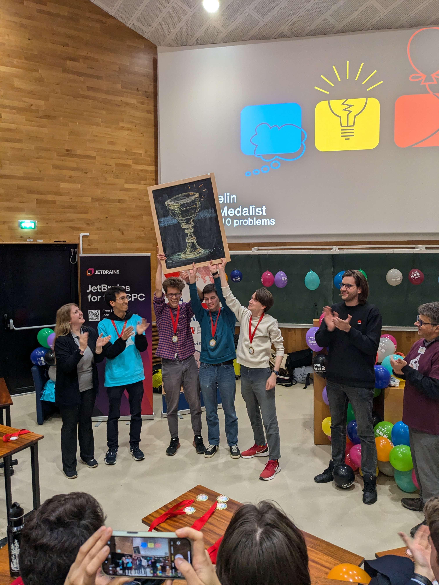
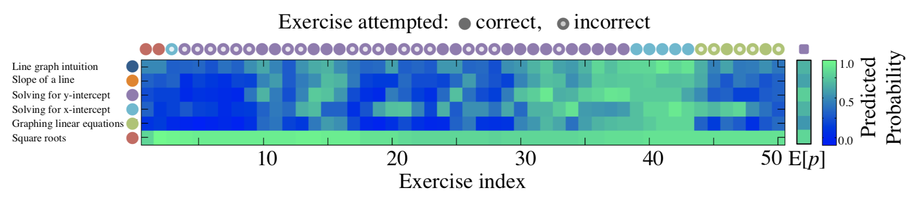

% A Pre-Trained Graph-Based Model\newline for Adaptive Sequencing of Educational Documents
% Jean Vassoyan¹²; Anan Schütt³; \alert{Jill-Jênn Vie}\textsuperscript{4}; Arun Balajiee\textsuperscript{5}\newline Elisabeth André³; Nicolas Vayatis¹
% January 29, 2025
---
handout: true
aspectratio: 169
institute: ¹ ENS Paris-Saclay, France \quad ² onepoint, France \quad ³ University of Augsburg, Germany\newline \textsuperscript{4} Inria, France \quad \textsuperscript{5} University of Pittsburgh, USA
header-includes:
  - \def\E{\mathbb{E}}
  - \usepackage{booktabs}
  - \def\hfilll{\hspace{0pt plus 1 filll}}
---

# About me

:::::: {.columns}
::: {.column width=70%}
\vspace{1cm}

2016 -- PhD in Computer Science at Paris-Saclay University (ENS Paris-Saclay \& CentraleSupélec), France\bigskip

2017--2019 -- Postdoc at RIKEN AIP with Prof. Kashima\bigskip

Since 2019 -- Researcher at Inria, France\bigskip

Since 2022 -- Lecturer \& ICPC coach at École polytechnique
:::
::: {.column width=30%}

École polytechnique won rank #1 ICPC SWERC last month (10/13 pbs)

\footnotesize

Correlation does not imply causation
:::
::::::

# Background: Reinforcement learning (Sutton and Barto, 1988, 2018, 2022)

# Background: Guessing games, for example 20Q systems

## Guess Who? (Coster, 1979), 20Q (Burgener, 1988), ESP game (von Ahn, 2003), Akinator (Megret, 2007) {.subtitle}

:::::: {.columns}
::: {.column}

:::
::: {.column}

Decision trees (ID3), neural networks
:::
::::::

# Background: optimizing learning outcomes

One teacher to many students: not personalized

One agent per student: everyone receives a different sequence of activities:  
"try exercise $\to$ fail $\to$ read resource $\to$ try exercise $\to$ succeed" and learn

Why are there so many sequential MOOCs, but no personalized MOOCs?  
OK now we have LLMs, but they optimize human preferences, not learning outcomes

Teacher has to \alert{guess} where students are, to start personalizing learning resources

- Can we model personalized learning using reinforcement learning (RL) in the real world? (few students, few interactions per student)
- Can we avoid relying on cumbersome data structures? (reduce teacher workload)

# Problem description

A student is an episode of learning (states, actions, observables) $s_0 \to a_1 \to o_1 \to s_1 \to a_2 \to o_2 \to \cdots \to s_{T - 1} \to a_T \to o_T \to s_{T}$

Teacher using history $h_t = (a_1, o_1, \ldots, a_t, o_t)$ chooses next action $\pi : h_t \mapsto a_{t + 1}$ (policy)

Assume $V$ a function of goodness of states (e.g. predicted score on an exam)

Goal: $V(s_{T}) - V(s_0)$ as high as possible, in average: $\E_{s_0, \pi} V(s_T) - V(s_0)$

Challenges:

- $s$ are unobserved
- Sometimes only sparse rewards at the end; $\sum_t V(s_{t + 1}) - V(s_t) = V(s_T) - V(s_0)$
- Actually rewards are estimated with $V$, not observed

# Related theory: Cognitive diagnosis

## A toy example {.subtitle}

We want to assess your skills in some domain, by asking you to complete some tasks.

\centering
\begin{tabular}{rlcccc} \toprule
& & \multicolumn{4}{c}{Knowledge components}\\
& & \textbf{form} & \textbf{mail} & \textbf{copy} & \textbf{url}\\ \midrule
T1 & Send a mail & \textbf{form} & \textbf{mail}\\
T2 & Fill a form & \textbf{form}\\
T3 & Share a link & & & \textbf{copy} & \textbf{url}\\
T4 & Type a URL & \textbf{form} & & & \textbf{url}\\ \bottomrule
\end{tabular}

\raggedright
\def\correct{\textcolor{green!50!black}{Correct !}}
\def\incorrect{\textcolor{red}{Incorrect.}}

We administer task 1. \correct{}  
$\Rightarrow$ \textbf{form} & \textbf{mail} : mastered. Task 2 brings few information.

We administer task 4. \incorrect{}  
$\Rightarrow$ \textbf{url} seems unmastered. Task 3 will bring few information.

## Feedback

*You seem to master **form** & **mail** but not **url**.*  

# Related theory: Cognitive diagnosis

## Discrete latent states \\(s \\in \\{0, 1\\}^K\\) {.subtitle}

:::::: {.columns}
::: {.column width=70%}
Maintain distribution $p(s)$: our belief of where the student is\bigskip

Goal: take action $a$ that gives observation $o$ that reduces (greedily) entropy of posterior $p(s|o)$ as much as possible\bigskip

(a bit like MasterMind: every turn gives partial information)\bigskip

Unfortunately:

- usually assumes that latent state (knowledge) is static, not dynamic
- cumbersome to build such a graph for every new domain
:::
::: {.column width=30%}

Assumes that a knowledge graph of prerequisites is known (costly to make)
:::
::::::

# Related theory: Information geometry and Bayesian design of experiments

Maintain distribution $p(s)$: our belief of where the student is

Goal: either take action $a$ that gives observation $o$

- that reduces entropy of posterior $p(s|o)$ as much as possible
- of likelihood $p(o|s)$ as uncertain as possible, i.e. variance of gradient of log-likelihood (Fisher information) as high as possible

Unfortunately: also usually assumes knowledge is static

# A toy example of Fisher information in item response theory

:::::: {.columns}
::: {.column width=55%}
Let's take the Rasch IRT model

Likelihood: $L_a = p(o_a|s) = \sigma(s - d_a) = p_a$\bigskip

1\textsuperscript{st} derivative: Gradient of log-likelihood (like Elo update): $\nabla_s \log L_a = o_a - p_a$  
$>0$ if correct answer, $<0$ if incorrect answer.\bigskip

2\textsuperscript{nd} derivative (Hessian): Fisher information $\mathcal{F}_a(s) = - \frac{\partial^2 \log L_a}{\partial^2 s} = p_a (1 - p_a)$\bigskip
:::
::: {.column width=45%}

:::
::::::

Which means for the Rasch model, the action of maximum Fisher information is the one of probability \alert{closest to $1/2$} (estimated at current best estimate).

Good for converging estimates, not for optimizing learning outcomes

# Related work: Knowledge tracing

## Predicting student performance given history (Corbett \\& Anderson, 1987; Piech et al., 2015) {.subtitle}

Train on student episodes of learning (states, actions, observables) $s_0 \to a_1 \to o_1 \to s_1 \to a_2 \to o_2 \to \cdots \to s_{T - 1} \to a_T \to o_T \to s_{T}$  
Test on new student episodes of learning

Really many papers about it, but this is a supervised learning problem, not RL (a bit related to "supervised fine tuning" in LLM): the policy of asking questions is not changed

Can be used to build a model of the environment, then learn to optimize it (model-based RL), but may overfit the simulator (Doroudi et al. 2017)

# Related work: RL in education

Bassen et al. (CHI 2020) directly optimizes post-test minus pre-test using model-free RL

But requires many students (10000s if Q-learning, 100s-1000s if PPO) because the reward is sparse

Has to learn from scratch on each new domain

\vfill

\fullcite{Bassen2020}

# Problem description

## A dynamic version of cognitive diagnosis {.subtitle}

:::::: {.columns}
::: {.column width=55%}
- States are binary states $s \in \{0, 1\}^K$
- Actions are documents
- Observations are:
  - Easy (0) if already mastered,
  - "I learned something" (1) if within reach
  - Hard (0) if not have the prerequisites
- Dynamic: if user learns something, then reward is 1 and state evolves
:::
::: {.column width=45%}

:::
::::::

Initial knowledge $p(s_0)$ is either $p(0) = 1$ (no prior knowledge), or uniform $p(s_0)$, or decreasing exponential.

Goal: maximize learned skills i.e. $V(s_T) - V(s_0)$ where $V(s) = |s|$

# Transfer learning framework

:::::: {.columns}
::: {.column width=60%}
## Pre-training

Learn $\pi$ on sequential lessons (simple environments)\bigskip

## Evaluation

Fine-tuning $\pi$ on new, more complex graphs (hard environments)
:::
::: {.column width=40%}

:::
::::::

Can we pretrain our model on easy-to-find simple graphs (Coursera, etc.)?

Then generalize to new domain graphs within few episodes?

# Proposed solution

In this work we present a method based on GNNs (Graph transformers):

- We keep fine-tuning within dozens of episodes instead of thousands  
(Bassen et al., 2020)
- Our model does not assume access to the graph of prerequisites between keywords
- (Our synthetic experiments do assume such a graph of prerequisites for simulating the environment.)
- But our model has access to the textual content of learning resources (keyword-document bipartite graph, and word embeddings)

# Getting inspiration from LLMs

| Our work in RL in education                                   | Training of LLMs                           |
|-----------------------------------------|--------------------------------------------|
| Many MOOCs available, but sequential    | Many raw data available |
| Knowledge tracing, i.e. learning a model of the environment | Generative pre-training: predict the next token |
| Learning a behavior policy from teacher data | Supervised fine-tuning: few expert data available |
| Fine-tuning from interaction with "real" students | Reinforcement learning from human feedback: fine-tuning on the reward model of preferences |

# Evaluation

Can we pretrain our model on easy-to-find simple graphs?

Then generalize to new domain graphs?

## Models

- Similar architecture (our earlier work) but not pre-trained
- CMAB: LinUCB from contextual bandits; but does not consider long-term rewards, just immediate rewards
- Bassen et al. (model-free PPO actor-critic); needs to be trained from scratch

# Zero-shot performance of our model

$x$-axis: number of students in the fine-tuning phase, i.e. learning episodes  
$y$-axis: learning gains, i.e. $V(s_T) - V(s_0)$

Encouraging results, but on synthetic data

Models learn to adapt to various (unobserved) student states, just from content (word embeddings) and interaction

It's rare to see RL fine-tuning within dozens of episodes

# Take home message

We provided a dynamic environment for cognitive diagnosis

Use dense rewards (in our case, immediate feedback) instead of sparse rewards

Pre-train on 22 linear available corpuses to provide zero-shot performance on 1 graph-based new domain

# Future work

Try it on real students

If we provide a text-based version of the environment, then a LLM agent can play too

But my student said: "Actually a LLM agent can directly generate new documents"  
(hard to evaluate; promising results with MCQs and learning programming)

Maintain $p(s)$ over possible states and optimize $\E_{s \sim p(s)} V(s)$ (Thompson sampling?)

# Machine learning for combinatorial optimization

## Scaling test time compute {.subtitle}

\small

Source: \url{https://huggingface.co/spaces/HuggingFaceH4/blogpost-scaling-test-time-compute}

# Impact of our research in AI for education

## Trap question from the French government {.subtitle}

> If we have AI for education, do we need more computer science teachers or fewer computer science teachers?

Simple answer: even with Google Translate we still need English teachers (do we?);  
we can have both

First answer: automated measurement (exam value $V$) is an altimeter (it measures potential). The (human) teacher still has to elevate the students (policy $\pi$).

LLM answer: "This is a complex question with no easy answer!"\bigskip

> But indeed, if this research (personalized learning paths) is successful, do we still need teachers?

Second answer: possibly we are more motivated if we see our progress, get encouragement, or learn as peers (in groups), not just everyone behind their screen (e.g. Duolingo is addictive, but do people actually learn the language?)

# How about the amount of CS teachers?

I firmly believe we need more educators in this topic, but I should still sharpen my arguments. For example, any modeling (physics, biology) involves computation, and digital data is everywhere. Still, some people believe we need fewer programmers.

:::::: {.columns}
::: {.column width=70%}
## Other risks LLM vs. human teachers

The risk of increasing inequality (people who already have knowledge accelerate with programming and LLMs) $\to$\bigskip

But decreasing inequality in language (e.g. immigrants can understand what teachers say in their own language using LLMs)\bigskip

Perhaps COVID taught us we still need human teachers $\to$
:::
::: {.column width=30%}

:::
::::::

# Very happy that Japan has a CS standardized test as of 2025

## Clever strategy to motivate high schools to hire more CS teachers {.subtitle}

:::::: {.columns}
::: {.column}
## 2025 Computer Science zero exam

1 hour, MCQ, 34 pages

1. Binary representation, cybersecurity, data integrity
1. QR codes, crepe scheduling, random variables
1. Optimal coin change algorithm (minimizing number of coins)
1. Reading plots about correlations between screen time and sleep or learning

I am currently translating it for the French government (thanks LLMs)
:::
::: {.column}
\pause
In France: philosophy for everyone in last year of high school only

## 2024 Philosophy real exam

4 hours, coefficient 8, 1 page

Choose one:

1. Can science satisfy our need for truth?
2. Does the state owe us anything?
3. Explain some text from Simone Weil (French philosopher)\bigskip

\pause \small

Is Japan optimizing accuracy, standardization and speed while France is optimizing argumentation and freedom of thought? 
:::
::::::

# LLMs in education

Impressive democratization of universal knowledge (and hallucinations):  
even our grandparents have heard of it

Still, too many people only know ChatGPT as LLM  
(well since last week, people know about DeepSeek too)

Offline LLMs represent an opportunity for decentralized, private applications  
(keeping data in the classroom, quantized models for reducing environmental impact)

It makes no longer sense to evaluate the \alert{outcome} only (as we don't know who did it)  
If a teacher gives a dissertation, it's not for the final product but for the thinking exercise  
Should we evaluate the \alert{reasoning} of students? Using think-aloud data and local LLMs?

# PISA vs. LLMs

## A bit tired of comparisons between countries using scalar values {.subtitle}

:::::: {.columns}
::: {.column}
PISA measures 3 numbers per country

The risk of overfitting to a given exam (e.g. standardized tests)
:::
::: {.column}
LLMs measure 1536 numbers per token

## DeepSeek

Many tricks for reducing costs (45x improvement)

- Caching frequent requests
- 671B parameters but only 37B active in the VRAM
- Multi-head latent attention (MLA) reducing key-value cache
- Multi-token prediction

\small

All those tricks, I hope, show that Computer Science skills can help gain advantage in a competitive world (so we need more CS teachers)

:::
::::::

# No need of a ***Thank you for your attention*** slide

Sure thing! I can stop your presentation for you.

\vfill

My webpage: `jjv.ie` \hfill `jill-jenn.vie@inria.fr`  
(includes source of those slides)
