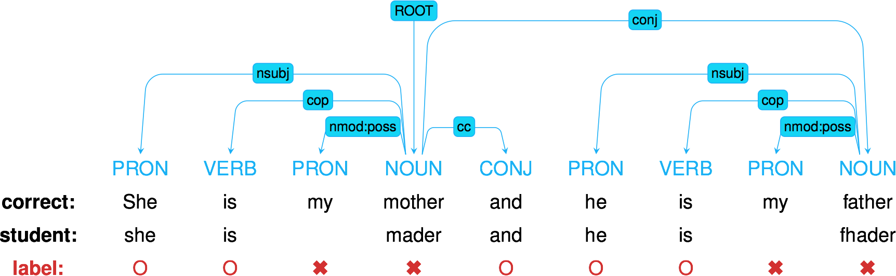

% Knowledge Tracing Machines:\newline Families of models\newline for predicting student performance
% Jill-Jênn Vie \and Hisashi Kashima
% November 9, 2018\bigskip\newline \url{https://arxiv.org/abs/1811.03388}
---
theme: Frankfurt
handout: true
institute: \includegraphics[height=1cm]{figures/aip-logo.png} \quad \includegraphics[height=1cm]{figures/kyoto.png}
section-titles: false
biblio-style: authoryear
header-includes:
    - \usepackage{booktabs}
    - \usepackage{multicol}
    - \usepackage{bm}
    - \DeclareMathOperator\logit{logit}
    - \def\ReLU{\textnormal{ReLU}}
biblatexoptions:
    - maxbibnames=99
    - maxcitenames=5
---

# Introduction

## AI for Social Good

AI can:

- recognize images
- recognize speech
- create fakes (generation)
- play go (decision making)

as long as you have enough data.

Can it also:

- \alert{improve education}

as long as you have enough data?

\pause

- automatic exercise generation
- \alert{prediction of student performance}
- optimizing human learning

## Predicting student performance

### Data

A population of students answering questions

- Events: "Student $i$ answered question $j$ correctly/incorrectly"

### Goal

- Learn the difficulty of questions automatically from data
- Measure the knowledge of students
- Potentially optimize their learning

### Assumption

Good model for prediction $\rightarrow$ Good adaptive policy for teaching

## Learning outcomes

- \alert{Logistic regression} is amazing
    - Unidimensional models of learning
    - Takes IRT, PFA as special cases\vspace{1cm}
- \alert{Factorization machines} are even more amazing
    - Multidimensional models of learning
    - Take MIRT as special case\vspace{1cm}
- It makes sense to consider \alert{deep neural networks}
    - What does deep knowledge tracing model exactly?

## Families of models

- Factorization Machines [@rendle2012factorization]
    - Multidimensional Item Response Theory
    - Logistic Regression
        - Item Response Theory (1980s)
        - Additive factor model (Cen, Hao, Koedinger, Junker, 2006)
        - Performance Factor Analysis (Pavlik, Cen, Koedinger, 2009)
- Recurrent Neural Networks
    - Deep Knowledge Tracing [@piech2015deep]

\vspace{5mm}

\fullcite{rendle2012factorization}

\fullcite{piech2015deep}

## Problems

### Weak generalization (in these slides)

Filling the blanks: some students did not attempt all questions

### Strong generalization (in the paper)

Cold-start: some new students are not in the train set

## Visually: model learning over time

\includegraphics[width=\linewidth]{figures/dkt.png}

\emph{From the DKT paper.}

## Dummy dataset: weak generalization

\begin{columns}
\begin{column}{0.6\linewidth}
\begin{itemize}
\item User 1 answered Item 1 correct
\item User 1 answered Item 2 incorrect
\item User 2 answered Item 1 incorrect
\item User 2 answered Item 1 correct
\item User 2 answered Item 2 ???
\end{itemize}
\end{column}
\begin{column}{0.4\linewidth}
\centering
\input{tables/dummy-ui-weak}\vspace{5mm}

\texttt{dummy.csv}
\end{column}
\end{columns}

## Dummy dataset: strong generalization

\begin{columns}
\begin{column}{0.6\linewidth}
\begin{itemize}
\item User 1 answered Item 1 correct
\item User 1 answered Item 2 incorrect
\item User 2 answered Item 1 ???
\item User 2 answered Item 1 ???
\item User 2 answered Item 2 ???
\end{itemize}
\end{column}
\begin{column}{0.4\linewidth}
\centering
\input{tables/dummy-ui-strong}\vspace{5mm}

\texttt{dummy.csv}
\end{column}
\end{columns}

# Logistic Regression

## Task 1: Item Response Theory

Learn abilities $\theta_i$ for each user $i$  
Learn easiness $e_j$ for each item $j$ such that:
$$ \begin{aligned}
Pr(\textnormal{User $i$ Item $j$ OK}) & = \sigma(\theta_i + e_j)\\
\logit Pr(\textnormal{User $i$ Item $j$ OK}) & = \theta_i + e_j
\end{aligned}$$

### Logistic regression

Learn $\alert{\bm{w}}$ such that $\logit Pr(\bm{x}) = \langle \alert{\bm{w}}, \bm{x} \rangle$

Usually with L2 regularization: ${||\bm{w}||}_2^2$ penalty $\leftrightarrow$ Gaussian prior

## Graphically: IRT as logistic regression

Encoding of "User $i$ answered Item $j$":

\centering

$$ \logit Pr(\textnormal{User $i$ Item $j$ OK}) = \langle \bm{w}, \bm{x} \rangle = \theta_i + e_j $$

## Encoding

`python encode.py --users --items`  

\centering

\input{tables/show-ui}

`data/dummy/X-ui.npz`

\raggedright
Then logistic regression can be run on the sparse features:

`python lr.py data/dummy/X-ui.npz`

## Oh, there's a problem

`python encode.py --users --items`

`python lr.py data/dummy/X-ui.npz`

\input{tables/pred-ui}

We predict the same thing when there are several attempts.

## Count successes and failures

Keep track of what the student has done before:

\centering

\input{tables/dummy-uiswf}

`data/dummy/data.csv`

## Task 2: Performance Factor Analysis

$W_{ik}$: how many successes of user $i$ over skill $k$ ($F_{ik}$: #failures)

Learn $\alert{\beta_k}$, $\alert{\gamma_k}$, $\alert{\delta_k}$ for each skill $k$ such that:
$$ \logit Pr(\textnormal{User $i$ Item $j$ OK}) = \sum_{\textnormal{Skill } k \textnormal{ of Item } j} \alert{\beta_k} + W_{ik} \alert{\gamma_k} + F_{ik} \alert{\delta_k} $$

`python encode.py --skills --wins --fails`

\centering
\input{tables/show-swf}

`data/dummy/X-swf.npz`

## Better!

`python encode.py --skills --wins --fails`

`python lr.py data/dummy/X-swf.npz`

\input{tables/pred-swf}

## Test on a large dataset: Assistments 2009

278608 attempts of 4163 students over 196457 items on 124 skills.

- Download `http://jiji.cat/weasel2018/data.csv`
- Put it in `data/assistments09`

`python fm.py data/assistments09/X-ui.npz`  (or `make big`)

\vspace{1cm}

\centering
\input{tables/assistments42-afm-pfa}

## Task 3: a new model (but still logistic regression)

`python encode.py --items --skills --wins --fails`

`python lr.py data/dummy/X-iswf.npz`

\centering
\input{tables/assistments42-afm-pfa-iswf}

# Factorization Machines

## Here comes a new challenger

How to model \alert{side information} in, say, recommender systems?

### Logistic Regression

Learn a 1-dim \alert{bias} for each feature (each user, item, etc.)

### Factorization Machines

Learn a 1-dim \alert{bias} and a $k$-dim \alert{embedding} for each feature

## What can be done with 2-dim embeddings?

\centering

{width=60%}

## Interpreting the components

## Interpreting the components

## How to model side information?

If you know user $i$ attempted item $j$ on \alert{mobile} (not desktop)  
How to model it?

$y$: score of event "user $i$ solves correctly item $j$"

### IRT

$$ y = \theta_i + e_j $$

### Multidimensional IRT (similar to collaborative filtering)

$$ y = \theta_i + e_j + \langle \bm{v_\textnormal{user $i$}}, \bm{v_\textnormal{item $j$}} \rangle $$

\pause

### With side information

$$ y = \theta_i + e_j + \langle \bm{v_\textnormal{user $i$}}, \bm{v_\textnormal{item $j$}} \rangle + \langle \bm{v_\textnormal{user $i$}}, \alert{\bm{v_\textnormal{mobile}}} \rangle + \langle \bm{v_\textnormal{item $j$}}, \alert{\bm{v_\textnormal{mobile}}} \rangle $$

## Graphically: logistic regression

\centering

## Graphically: factorization machines

\centering

## Formally: factorization machines

Learn bias \alert{$w_k$} and embedding \alert{$\bm{v_k}$} for each feature $k$ such that:
$$ \logit p(\bm{x}) = \mu + \underbrace{\sum_{k = 1}^N \alert{w_k} x_k}_{\textnormal{logistic regression}} + \underbrace{\sum_{1 \leq k < l \leq N} x_k x_l \langle \alert{\bm{v_k}}, \alert{\bm{v_l}} \rangle}_{\textnormal{pairwise interactions}} $$

Multidimensional item response theory: $\logit p(\bm{x}) = \langle \bm{u_i}, \bm{v_j} \rangle + e_j$\\
is a particular case.

\small
\fullcite{rendle2012factorization}

# Deep Learning

## Duolingo challenge: second language learning (2018)

\centering
\input{tables/duolingo}

Available on \url{http://sharedtask.duolingo.com}

## Duolingo challenge: lots of side information!

## Deep Factorization Machines

Learn layers \alert{$W^{(\ell)}$} and \alert{$b^{(\ell)}$} such that:
$$ \begin{aligned}[c]
\bm{a}^{0}(\bm{x}) & = (\alert{\bm{v_{\texttt{user}}}}, \alert{\bm{v_{\texttt{item}}}}, \alert{\bm{v_{\texttt{skill}}}}, \ldots)\\
\bm{a}^{(\ell + 1)}(\bm{x}) & = \ReLU(\alert{W^{(\ell)}} \bm{a}^{(\ell)}(\bm{x}) + \alert{\bm{b}^{(\ell)}}) \quad \ell = 0, \ldots, L - 1\\
y_{DNN}(\bm{x}) & = \ReLU(\alert{W^{(L)}} \bm{a}^{(L)}(\bm{x}) + \alert{\bm{b}^{(L)}})
\end{aligned} $$

$$ \logit p(\bm{x}) = y_{FM}(\bm{x}) + y_{DNN}(\bm{x}) $$

<!-- When trained, performance was lower than Bayesian FMs. -->

\small
\fullcite{Duolingo2018}

## Duolingo ranking

\centering

\begin{tabular}{cccc} \toprule
Rank & Team & Algo & AUC\\ \midrule
1 & SanaLabs & RNN + GBDT & .857\\
2 & singsound & RNN & .854\\
2 & NYU & GBDT & .854\\
4 & CECL & LR + L1 (13M feat.) & .843\\
5 & TMU & RNN & .839\\ \midrule
(7) & JJV & KTM == FM & .822\\
(8) & JJV & DeepFM & .814\\
10 & JJV & DeepFM & .809\\ \midrule
-- & JJV & KTM == LR + L2 & .783\\
15 & Duolingo & LR + L1 & .771\\ \bottomrule
\end{tabular}

\raggedright
\small
\fullcite{Settles2018}

## What 'bout recurrent neural networks?

Deep Knowledge Tracing: model the problem as sequence prediction

- Each student on skill $q_t$ has performance $a_t$
- How to predict outcomes $\bm{y}$ on every skill $k$?
- Spoiler: by measuring the evolution of a latent state $\alert{\bm{h_t}}$

## Graphically: deep knowledge tracing

\centering

## Graphically: there is a MIRT in my DKT

\centering

## Drawback of Deep Knowledge Tracing

DKT does not model individual differences.

Actually, Wilson even managed to beat DKT with (1-dim!) IRT.

By estimating on-the-fly the student's learning ability, we managed to get a better model.

\centering
\input{tables/results-dkt}

\raggedright \small
\fullcite{Minn2018}

## Results

\input{tables/assistments42-full}

# Conclusion

## Take home message

\alert{Factorization machines} are a strong baseline that unifies many existing EDM models

- It is better to estimate an item per bias, not only per skill
- Side information improves performance more than higher $d$

\alert{Recurrent neural networks} are powerful because they track the evolution of the latent state

- Most existing models (like DKT) cannot handle multiple skills, but KTM do
- We should combine DKT with side information

\fullcite{KTM2018}

## Any suggestions are welcome!

Read our article:

\begin{block}{Knowledge Tracing Machines}
\url{https://arxiv.org/abs/1811.03388}
\end{block}

Try the code:

\centering
\url{https://github.com/jilljenn/ktm}

\raggedright
Feel free to chat:

\centering
vie@jill-jenn.net

\raggedright
Do you have any questions?
