% Using Ratings & Posters\newline for Anime & Manga Recommendations \vspace{2mm}
% \alert{Jill-Jênn Vie}¹³ \and Florian Yger² \and Ryan Lahfa³ \and Basile \nolinebreak Clement³ \and Kévin Cocchi³ \and Thomas Chalumeau³ \and Hisashi Kashima¹\textsuperscript4
% ¹ RIKEN Center for Advanced Intelligence Project (Tokyo)\newline ² Université Paris-Dauphine (France)\newline ³ Mangaki (Paris, France)\newline \textsuperscript4 Kyoto University
---
theme: Frankfurt
section-titles: false
header-includes:
    - \usepackage{tikz}
    - \usepackage{array}
    - \usepackage{icomma}
    - \usepackage{multicol,booktabs}
    - \def\R{\mathcal{R}}
handout: true
---

# Mangaki

## Mangaki

### Mangaki, recommendations of anime/manga

Rate anime/manga and receive recommendations

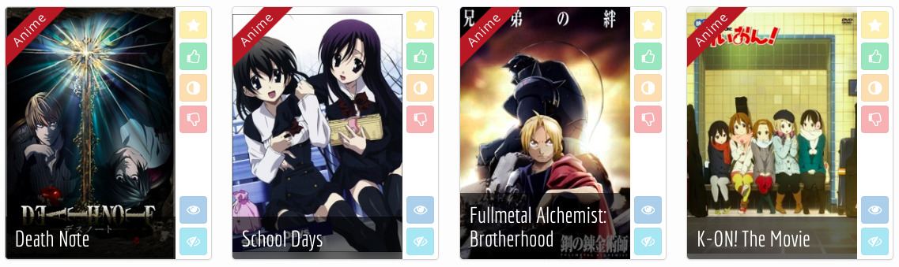

2,000 users, 10,000 anime/manga, 350,000 ratings

- myAnimeList (RIP their API)
- AniDB
- AniList
- (soon) TVtropes

### Mangaki

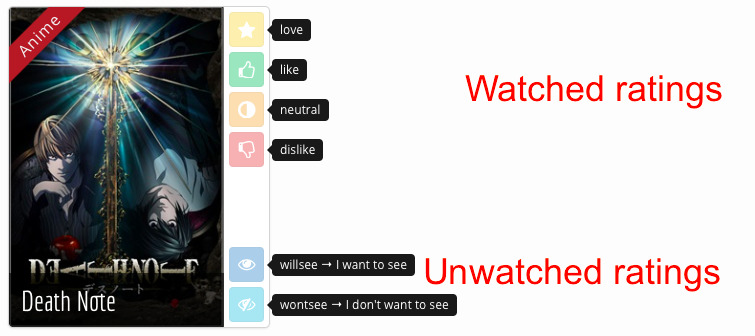

### Build a profile

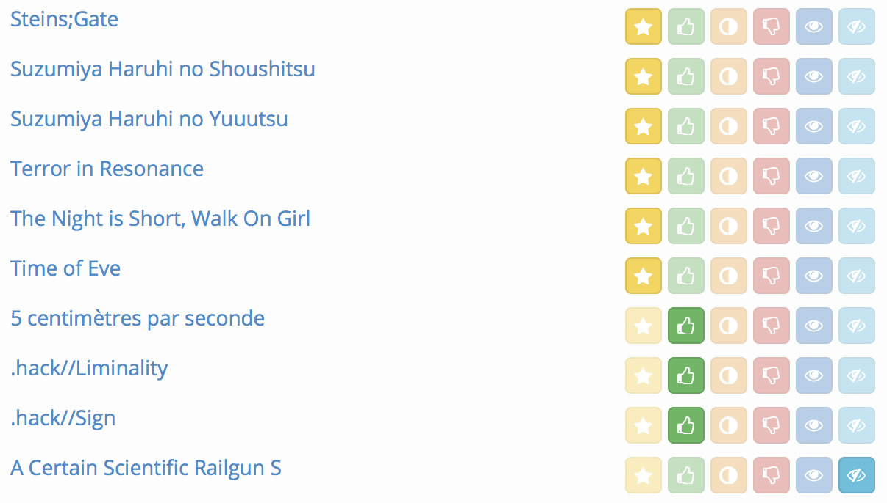

### Mangaki prioritizes your watchlist

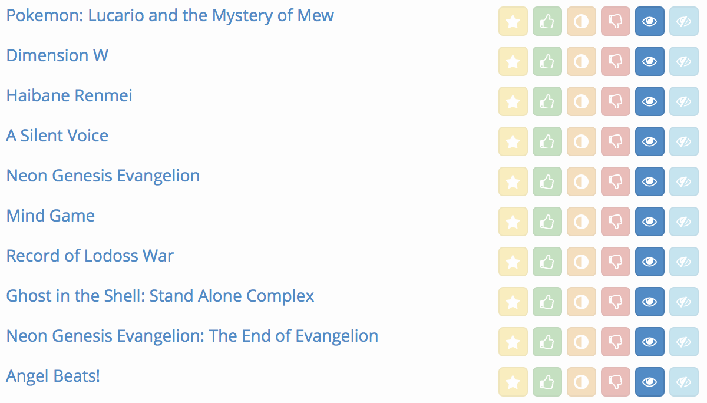

### Browse the rankings: top works

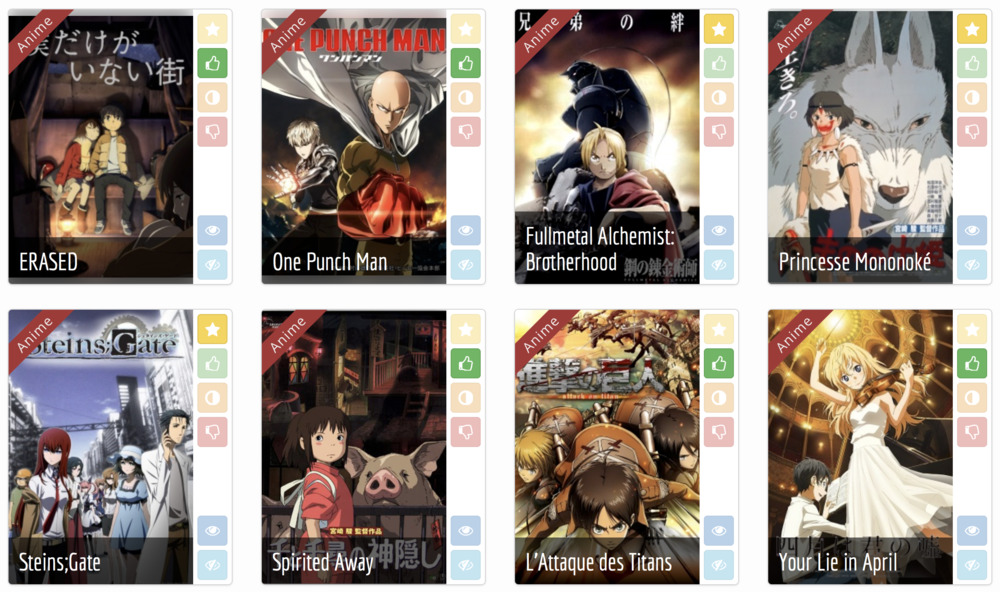

### Why nonprofit?

- Why should blockbusters get all the fun/clicks/money?
- Maybe there is one precious, unknown anime \alert{for you}
    - and we can help you find it
- Driven by passion, not money

Everything is open source: \alert{\texttt{github.com/mangaki}} (Python, Vue.js)

Awards: Microsoft Prize (2014) Japan Foundation (2016)

### Browse the rankings: precious pearls

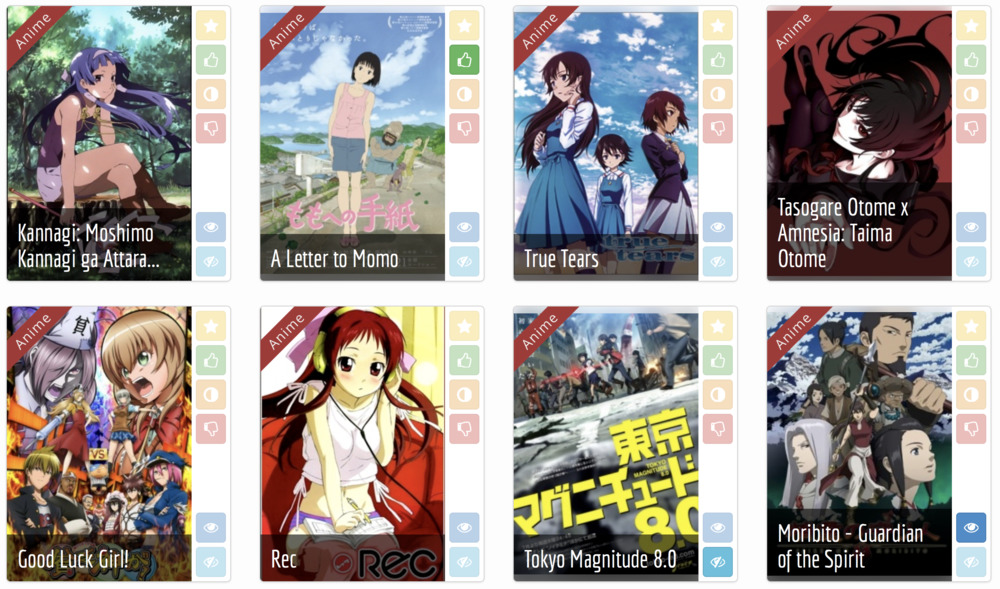

### RIKEN Center for Advanced Intelligence Project

\ 

- New AI lab near Tokyo Station (opened in 2016)
- 8 accepted papers at NIPS 2017

### Authors

{height=3.1cm} {height=3.1cm} {height=3.1cm} {height=3.1cm}

\begin{minipage}{2.6cm}\centering Jill-Jênn Vie\end{minipage}\begin{minipage}[c]{2.6cm}\centering Florian Yger\end{minipage}\begin{minipage}[c]{2.5cm}\centering Ryan Lahfa\end{minipage}\begin{minipage}[c]{2.6cm}Hisashi Kashima\end{minipage}

- Florian Yger was visiting RIKEN AIP
- Kévin Cocchi & Thomas Chalumeau were interns at Mangaki

### Outline

#### 1. Usual algorithms for recommender systems

- Content-based
- Collaborative filtering

#### 2. Our method

- Extracting tags from posters
- Blending models

#### 3. Experiments

- Dataset: Mangaki
- Results

# Recommender Systems

## Recommender Systems

### Recommender Systems

#### Problem

- Every user rates few items (1 %)
- How to infer missing ratings?

#### Example

\begin{tabular}{ccccc}
& \includegraphics[height=2.5cm]{figures/1.jpg} & \includegraphics[height=2.5cm]{figures/2.jpg} & \includegraphics[height=2.5cm]{figures/3.jpg} & \includegraphics[height=2.5cm]{figures/4.jpg}\\
Sacha & ? & 5 & 2 & ?\\
Ondine & 4 & 1 & ? & 5\\
Pierre & 3 & 3 & 1 & 4\\
Joëlle & 5 & ? & 2 & ?
\end{tabular}

### Recommender Systems

#### Problem

- Every user rates few items (1 %)
- How to infer missing ratings?

#### Example

\begin{tabular}{ccccc}
& \includegraphics[height=2.5cm]{figures/1.jpg} & \includegraphics[height=2.5cm]{figures/2.jpg} & \includegraphics[height=2.5cm]{figures/3.jpg} & \includegraphics[height=2.5cm]{figures/4.jpg}\\
Sacha & \alert{3} & 5 & 2 & \alert{2}\\
Ondine & 4 & 1 & \alert{4} & 5\\
Pierre & 3 & 3 & 1 & 4\\
Joëlle & 5 & \alert{2} & 2 & \alert{5}
\end{tabular}

### Usual techniques

Content-based

:   \hfill (work features: directors, genre, etc.)

- Linear regression
- Sparse linear regression (LASSO)

Collaborative filtering

:   \hfill (solely based on ratings)

- $K$-nearest neighbors
- Matrix factorization:
    - Singular value decomposition
    - Alternating least squares
    - Stochastic gradient descent

Hybrid recommender systems

:   \hfill (combine those two)

- The proposed method

### Example: $K$-Nearest Neighbors

\includegraphics{figures/ratings1.pdf}  
\includegraphics{figures/knn.pdf}

### Example: $K$-Nearest Neighbors

\includegraphics{figures/ratings2.pdf}  
\includegraphics{figures/sim.pdf}

### Matrix factorization $\rightarrow$ reduce dimension to generalize

\vspace{-7mm}

$$ R = \left(\begin{array}{c}
\R_1\\
\R_2\\
\vdots\\
\R_n
\end{array}\right) = \raisebox{-1cm}{\begin{tikzpicture}
\draw (0,0) rectangle (2.5,2);
\end{tikzpicture}} =
\raisebox{-1cm}{\begin{tikzpicture}
\draw (0,0) rectangle ++(1,2);
\draw node at (0.5,1) {$C$};
\draw (1.1,1) rectangle ++(2.5,1);
\draw node at (2.35,1.5) {$P$};
\end{tikzpicture}} $$
$$ \text{$R$: 2k users $\times$ 15k works} \iff
\left\{\begin{array}{l}
\text{$C$: 2k users $\times$ \alert{20 profiles}}\\
\text{$P$: \alert{20 profiles} $\times$ 15k works}\\
\end{array}\right. $$
$\R_\text{Bob}$ is a linear combination of profiles $P_1$, $P_2$, etc..

\pause

#### Interpreting Key Profiles

\begin{tabular}{@{}lccc@{}}
If $P$ & $P_1$: adventure & $P_2$: romance & $P_3$: plot twist\\
And $C_u$ & $0,2$ & $-0,5$ & $0,6$
\end{tabular}

$\Rightarrow$ $u$ \alert{likes a bit} adventure, \alert{hates} romance, \alert{loves} plot twists.

### Weighted Alternating Least Squares (Zhou, 2008)

$R$ ratings, \alert{$U$} user features, \alert{$V$} work features.

$$R = \alert{UV^T} \qquad \Rightarrow \qquad r_{ij} \simeq \hat{r}_{ij}^{ALS} \triangleq \alert{U_i} \cdot \alert{V_j}.$$

#### Objective function to minimize

$U, V \mapsto \sum_{i, j \textnormal{ known}}~(r_{ij} - U_i \cdot V_j)^2 + \lambda \left(\sum_i N_i ||U_i||^2 + \sum_j M_j ||V_j||^2\right)$
where:

- $N_i$: number of ratings by user $i$
- $M_j$: number of ratings for item $j$

#### Algorithm

Until convergence (~ 10 iterations):

- Fix $U$ find $V$ \hfill (just linear regression $\rightarrow$ least squares)
- Fix $V$ find $U$

### Visualizing first two components of anime $V_j$

\alert{Closer} points mean similar taste

\vspace{-1cm}

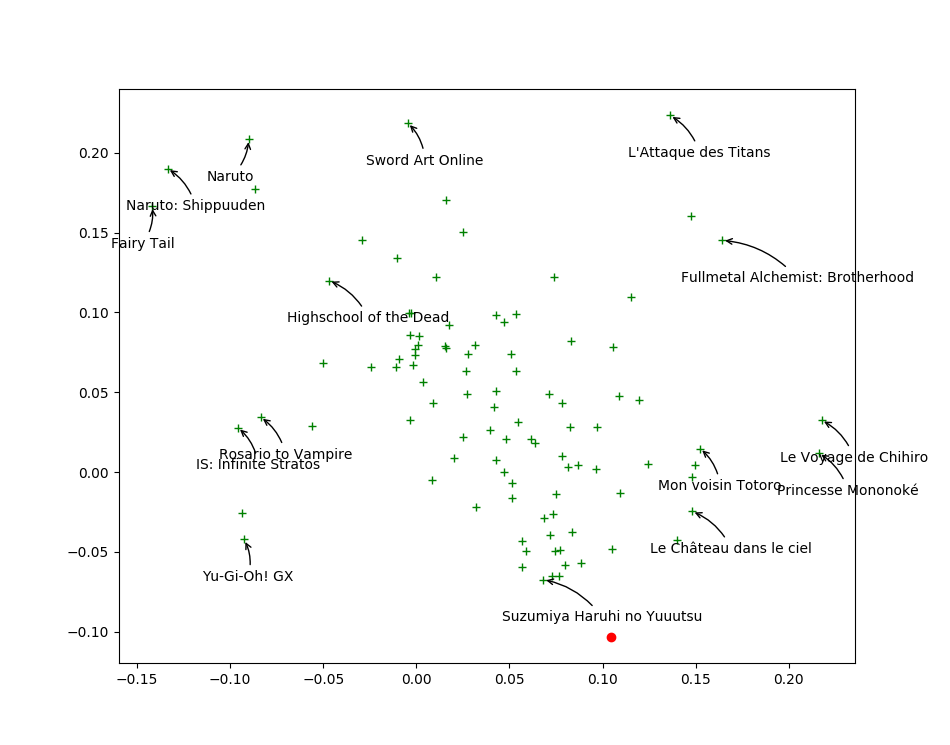\ 

### Find your taste by plotting first two columns of $U_i$

You will \alert{like} anime that are \alert{in your direction}

\vspace{-1cm}

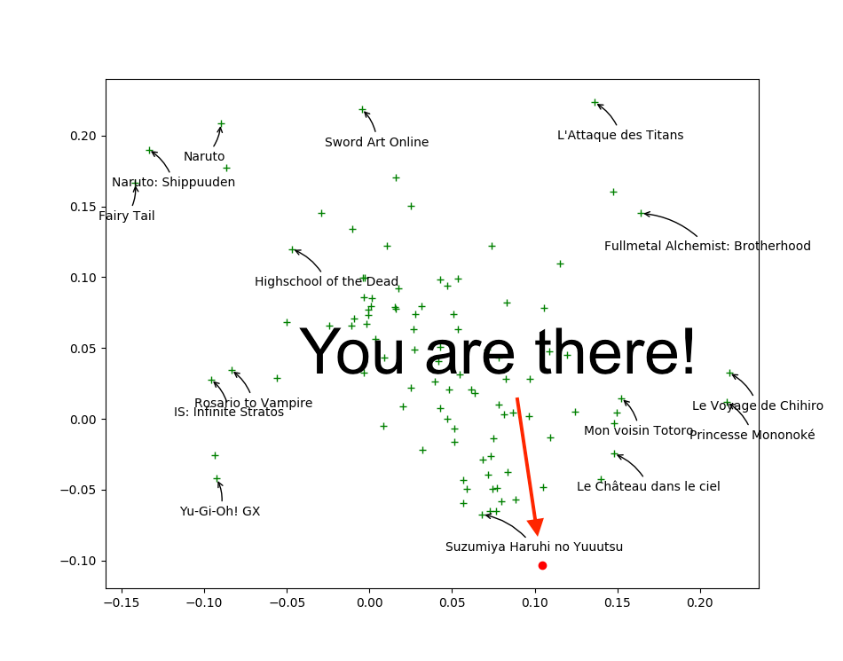\ 

### Drawback with collaborative filtering

#### Issue: Item Cold-Start

- If no ratings are available for a work $j$  
$\Rightarrow$ Its features $V_j$ cannot be trained :-(

No way to distinguish between unrated works.

\pause

#### But we have posters!

- On Mangaki, almost all works have a poster
- How to extract information?

# Our method

## Our method

### Illustration2Vec (Saito and Matsui, 2015)

\centering

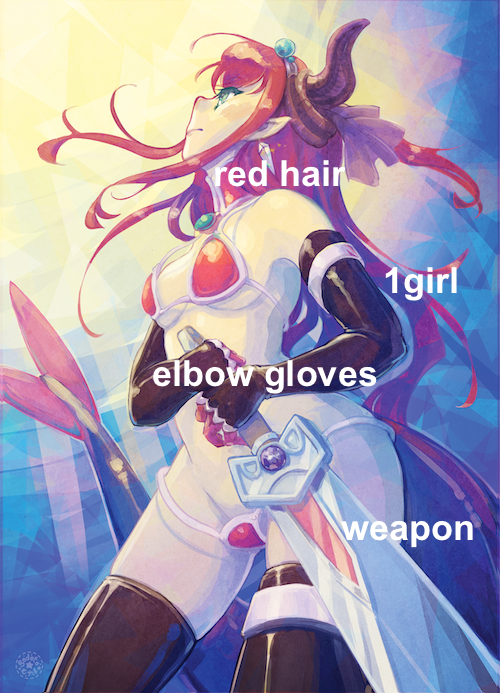{width=40%}\ 
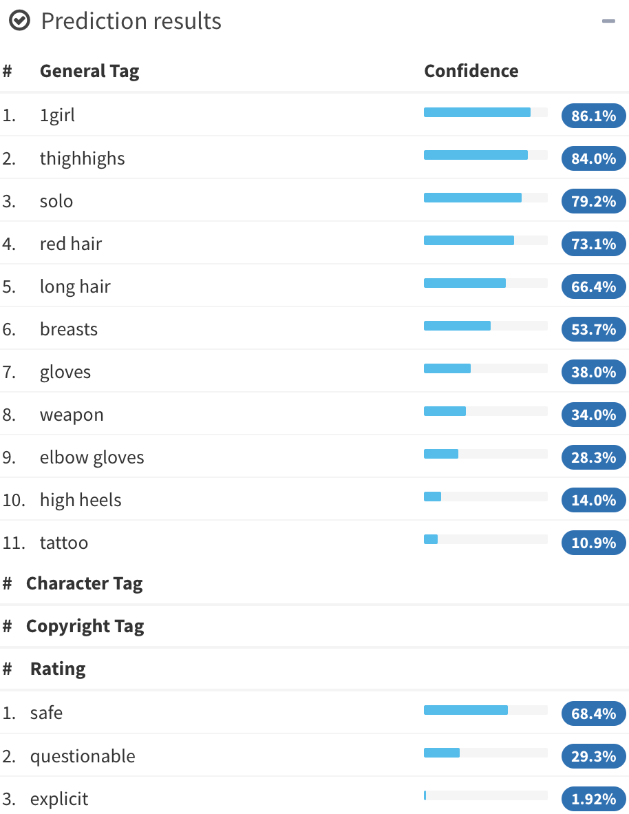{width=40%}\ 

- CNN (VGG-16) pretrained on ImageNet, trained on Danbooru  
(1.5M illustrations with tags)
- 502 most frequent tags kept, outputs \alert{tag weights}

### LASSO for sparse linear regression

$T$ matrix of 15000 works $\times$ 502 tags ($t_{jk}$: tag $k$ appears in item $j$)

- Each user is described by its preferences \alert{$P_i$}  
$\rightarrow$ a \alert{sparse} row of weights over tags.
- Estimate user preferences \alert{$P_i$} such that $$r_{ij} \simeq \hat{r}_{ij}^{LASSO} \triangleq \alert{P_i} T_j^T.$$

\pause

#### Least Absolute Shrinkage and Selection Operator (LASSO)

$$ P_i \mapsto \frac1{2 N_i} {\lVert \R_i - P_i T^T \rVert}_2^2 + \alpha \alert{ {\lVert P_i \rVert}_1}. $$

\noindent
where $N_i$ is the number of items rated by user $i$.

\pause

#### Interpretation and explanation of user preferences

- *You seem to like \alert{\emph{magical girls}} but not \alert{\emph{blonde hair}}  
$\Rightarrow$ Look! All of them are \alert{\emph{brown hair}}! Buy now!*

### Combine models

Which model should be choose between ALS and LASSO?

Answer

:   Both!

Methods

:   boosting, bagging, model stacking, blending.

Idea

:    find $\alert<2>{\alpha\only<2>{_j}}$ s.t. $\hat{r_{ij}} \triangleq \alert<2>{\alpha\only<2>{_j}} \hat{r}_{ij}^{ALS} + (1 - \alert<2>{\alpha\only<2>{_j}}) \hat{r}_{ij}^{LASSO}.$

### Examples of $\alpha_j$

\centering \includegraphics{figures/curve1.pdf}  
Mimics ALS $$\hat{r_{ij}} \triangleq \alert1 \hat{r}_{ij}^{ALS} + \alert0 \hat{r}_{ij}^{LASSO}.$$

### Examples of $\alpha_j$

\centering \includegraphics{figures/curve2.pdf}  
Mimics LASSO $$\hat{r_{ij}} \triangleq \alert0 \hat{r}_{ij}^{ALS} + \alert1 \hat{r}_{ij}^{LASSO}.$$

### Examples of $\alpha_j$

\centering \includegraphics{figures/curve3.pdf} $$ \hat{r}_{ij}^{BALSE} = \begin{cases}
\hat{r}_{ij}^{ALS} & \text{if item $j$ was rated at least $\gamma$ times}\\
\hat{r}_{ij}^{LASSO} & \text{otherwise}
\end{cases} $$ But we can't: \alert{Not differentiable!}

### Examples of $\alpha_j$

\centering \includegraphics{figures/curve4.pdf} $$ \hat{r}_{ij}^{BALSE} = \alert{\sigma(\beta(R_j - \gamma))} \hat{r}_{ij}^{ALS} + \left(1 - \alert{\sigma(\beta(R_j - \gamma))}\right) \hat{r}_{ij}^{LASSO} $$ $\beta$ and $\gamma$ are learned by stochastic gradient descent.

We call this gate the \alert{Steins;Gate}.

### Blended Alternate Least Squares with Explanation

\centering

### Blended Alternate Least Squares with Explanation

### Blended Alternate Least Squares with Explanation

### Blended Alternate Least Squares with Explanation

### Blended Alternate Least Squares with Explanation

### Blended Alternate Least Squares with Explanation

### Blended Alternate Least Squares with Explanation

# Experiments

## Experiments

### Dataset: Mangaki

\ 

- 2300 users
- 15000 works \textcolor{gray}{\hfill {\em \small anime / manga / OST}}
- 340000 ratings \textcolor{gray}{\hfill {\em \small fav / like / dislike / neutral / willsee / wontsee}}

### Evaluation: Root Mean Squared Error (RMSE)

If we predict $\hat{r_{ij}}$ for each user-work pair $(i, j)$ to test among $n$,  
while truth is $r_{ij}$:

$$ RMSE(\hat{r}, r) = \sqrt{\frac1n \sum_{i, j} (\hat{r}_{ij} - r_{ij})^2}. $$

### Cross-validation

- 80% of the ratings are used for training
- 20% of the ratings are kept for testing

Differents sets of items:

- Whole test set of works
- 1000 works least rated (1.5%)
- Cold-start: works not seen in the training set (only the posters)

### Results

\centering

\ 

### Summing up

We presented BALSE, a model that:

- uses information in the \alert{ratings} (collaborative filtering)
- uses information in the \alert{posters} using CNNs (content-based)
- combine them in a \alert{nonlinear} way

to \alert{improve} the recommendations, and \alert{explain} them.

\pause

#### Further work

- Use latent features (not only tags) of the posters (IJCAI 2016)
- End-to-end training (not separately)

### Coming soon: Watching assistant

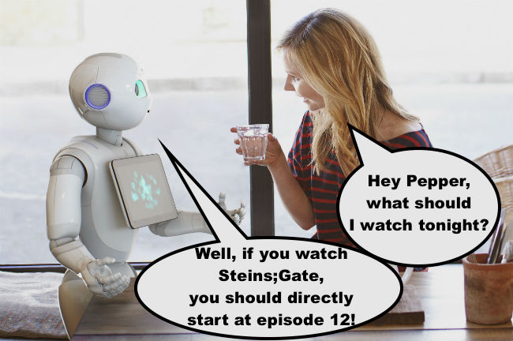

### Thank you! \hfill jj@mangaki.fr

\centering
{width=50%}\ 

Try it: \alert{https://mangaki.fr} \hfill Twitter: \alert{@MangakiFR}

\raggedright

#### Read the article

\small
Using Posters to Recommend Anime and Mangas in a Cold-Start Scenario

\normalsize
\alert{github.com/mangaki/balse} (PDF on arXiv, front page of HNews)

#### Results of Mangaki Data Challenge: \alert{research.mangaki.fr}

1. Ronnie Wang (Microsoft Suzhou, China)
2. Kento Nozawa (Tsukuba University, Japan)
3. Jo Takano (Kobe University, Japan)
