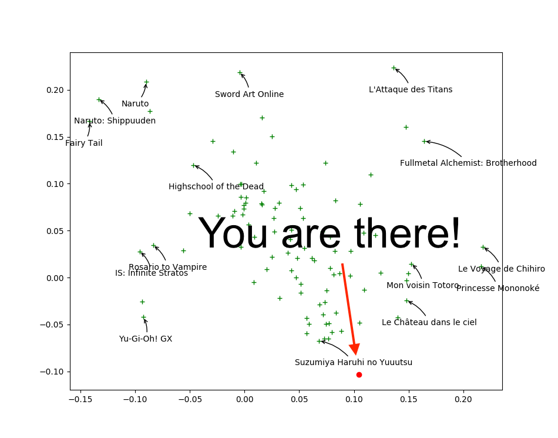

% Using Ratings & Posters\newline for Anime & Manga Recommendations
% Jill-Jênn Vie
% August 31, 2017
---
header-includes:
    - \usepackage{tikz}
    - \usepackage{array}
    - \usepackage{icomma}
    - \usepackage{multicol,booktabs}
    - \def\R{\mathcal{R}}
handout: true
---

# Recommendation System

## Problem

- Every user rates few items (1 %)
- How to infer missing ratings?

\ 

# Every supervised machine learning algorithm

## fit($X$, $y$)

\centering
\begin{tabular}{ccc} \toprule
\multicolumn{2}{c}{$X$} & $y$\\ \cmidrule{1-2}
\texttt{user\_id} & \texttt{work\_id} & \texttt{rating}\\ \midrule
24 & 823 & like\\
12 & 823 & dislike\\
12 & 25 & favorite\\
\ldots & \ldots & \ldots\\ \bottomrule
\end{tabular}

\pause

## $\hat{y}$ = predict($X$)

\centering
\begin{tabular}{ccc} \toprule
\multicolumn{2}{c}{$X$} & $\hat{y}$\\ \cmidrule{1-2}
\texttt{user\_id} & \texttt{work\_id} & \texttt{rating}\\ \midrule
24 & 25 & \only<2>{?}\only<3>{\alert{disliked}}\\
12 & 42 & \only<2>{?}\only<3>{\alert{liked}}\\ \bottomrule
\end{tabular}

# Evaluation: Root Mean Squared Error (RMSE)

If I predict $\hat{y_i}$ for each user-work pair to test among $n$,  
while truth is $y^*_i$:

$$ RMSE(\hat{y}, y^*) = \sqrt{\frac1n \sum_i (\hat{y}_i - y^*_i)^2}. $$

# Dataset 1: Movielens

\ 

- 700 users
- 9000 movies
- 100000 ratings

# Dataset 2: Mangaki

\ 

- 2100 users
- 15000 works \textcolor{gray}{\hfill {\em \small anime / manga / OST}}
- 310000 ratings \textcolor{gray}{\hfill {\em \small fav / like / dislike / neutral / willsee / wontsee}}
- User can rate anime or manga
- And receive recommendations
- Also reorder their watchlist

\pause

- Code is 100% on GitHub  
- Awards from Microsoft and Kokusai Kōryū Kikin
- Ongoing data challenge on universityofbigdata.net

# KNN $\rightarrow$ measure similarity

## $K$-nearest neighbors

- $\R_u$ represents the row vector of user $u$ in the rating matrix (users $\times$ works).
- Similarity score between users (cosine):
$$ score(u, v) = \frac{\R_u \cdot \R_v}{||\R_u|| \cdot ||\R_v||}. $$
- Let's identify the $k$-nearest neighbors of user $u$
- And recommend to user $u$ what $u$'s neighbors liked  
but $u$ didn't see

## Hint

If $R'$ the $N \times M$ matrix of rows $\frac{\R_u}{||\R_u||}$, we can get the $N \times N$ score matrix by computing $R' R'^T$.

# PCA, SVD $\rightarrow$ reduce dimension to generalize

## Matrix factorization

\vspace{-7mm}

$$ R = \left(\begin{array}{c}
\R_1\\
\R_2\\
\vdots\\
\R_n
\end{array}\right) = \raisebox{-1cm}{\begin{tikzpicture}
\draw (0,0) rectangle (2.5,2);
\end{tikzpicture}} =
\raisebox{-1cm}{\begin{tikzpicture}
\draw (0,0) rectangle ++(1,2);
\draw node at (0.5,1) {$C$};
\draw (1.1,1) rectangle ++(2.5,1);
\draw node at (2.35,1.5) {$P$};
\end{tikzpicture}} $$
Each row $\R_u$ is a linear combination of profiles $P$.

\pause

## Interpreting Key Profiles

\begin{tabular}{@{}lccc@{}}
If $P$ & $P_1$: adventure & $P_2$: romance & $P_3$: plot twist\\
And $C_u$ & $0,2$ & $-0,5$ & $0,6$
\end{tabular}

$\Rightarrow$ $u$ \alert{likes a bit} adventure, \alert{hates} romance, \alert{loves} plot twists.

\vspace{2mm}

\pause

## Singular Value Decomposition

$R = (U \cdot \Sigma)V^T$ where $U : N \times r$ et $V : M \times r$ are orthogonal and $\Sigma : r \times r$ is diagonal.

# Visualizing first two columns of $V_j$ in SVD

\alert{Closer} points mean similar taste

\ 

# Find your taste by plotting first two columns of $U_i$

You will \alert{like} movies that are \alert{close to you}

\ 

# Variants of Matrix Factorization

$R$ ratings, $C$ coefficients, $P$ profiles ($F$ features).

$R = CP = CF^T \Rightarrow r_{ij} \simeq \hat{r}_{ij} \triangleq C_i \cdot F_j$.

## Objective functions (reconstruction error) to minimize

SVD : $\sum_{i, j}~(r_{ij} - C_i \cdot F_j)^2$ (deterministic)

\pause

ALS : $\sum_{i, j \textnormal{\alert{ known}}}~(r_{ij} - C_i \cdot F_j)^2$

\pause

ALS-WR : $\sum_{i, j \textnormal{\alert{ known}}}~(r_{ij} - C_i \cdot F_j)^2 + \lambda (\sum_i N_i ||C_i||^2 + \sum_j M_j ||F_j||^2)$

\pause

WALS by Tensorflow™ : $$\sum_{i, j} w_{ij} \cdot (r_{ij} - C_i \cdot F_j)^2 + \lambda (\sum_i ||C_i||^2 + \sum_j ||F_j||^2)$$

\pause

## Who do you think wins?

# About the Netflix Prize

> - On October 2, 2006, Netflix organized an online contest:  
*The first one who beats our algorithm (Cinematch) by more than 10% will receive 1,000,000 USD.*  
and gave anonymized data
> - Half of world AI community suddenly became interested  
in this problem
> - October 8, someone beat Cinematch
> - October 15, 3 teams beat it, notably by 1.06%
> - June 26, 2009, team 1 beat Cinematch by 10.05%  
$\rightarrow$ \alert{last call}: still one month to win
> - July 25, 2009, \alert{team 2} beat Cinematch by 10.09%
> - Team 1 does 10.09% also
> - 20 minutes later \alert{team 2} does 10.10%
> - … Actually, both teams were ex \ae quo on the validation set
> - … So the first team to send their results won (team 1, 10.09%)

# Privacy concerns

> - August 2009, Netflix wanted to restart a contest
> - Meanwhile, in 2007 two researchers from Texas University could \alert{de-anonymize} users by crossing data with IMDb
> - (approximate birth year, zip code, watched movies)
> - In December 2009, 4 Netflix users sued Netflix
> - March 2010, amicable settlement (*enmankaiketsu*)  
$\rightarrow$ complaint is closed

# ALS for feature extraction

$R = CP$

## Issue: Item Cold-Start

- If no ratings are available for an anime  
$\Rightarrow$ no feature will be trained
- If anime features at put to 0  
$\Rightarrow$ prediction of ALS will be constant for every unrated anime.

\pause

## But we have posters!

- On Mangaki, almost all works have a poster
- How to extract information?

# Illustration2Vec (Saito and Matsui, 2015)

\centering

{width=40%}\ 
{width=40%}\ 

- CNN pretrained on ImageNet, trained on Danbooru  
(1.5M illustrations with tags)
- 502 most frequent tags kept, outputs \alert{tag weights}

# LASSO for explanation of user preferences

$T$ matrix of 15000 works $\times$ 502 tags

- Each user is described by its preferences $P$  
$\rightarrow$ a \alert{sparse} row of weights over tags.
- Estimate user preferences $P$ such that $r_{ij} \simeq PT^T$.

## Interpretation and explanation

- *You seem to like \alert{\emph{magical girls}} but not \alert{\emph{blonde hair}}  
$\Rightarrow$ Look! All of them are \alert{\emph{brown hair}}! Buy now!*

## Least Absolute Shrinkage and Selection Operator (LASSO)

$$ \frac1{2 N_i} {\lVert \R_i - P_i T^T \rVert}_2^2 + \alpha \alert{ {\lVert P_i \rVert}_1}. $$

\noindent
where $N_i$ is the number of items rated by user $i$.

# Blending

We would like to do:

$$ \hat{r}_{ij}^{BALSE} = \begin{cases}
\hat{r}_{ij}^{ALS} & \text{if item $j$ was rated at least $\gamma$ times}\\
\hat{r}_{ij}^{LASSO} & \text{otherwise}
\end{cases} $$

But we can't. Why?

\pause

$$ \hat{r}_{ij}^{BALSE} = \alert{\sigma(\beta(R_j - \gamma))} \hat{r}_{ij}^{ALS} + \left(1 - \alert{\sigma(\beta(R_j - \gamma))}\right) \hat{r}_{ij}^{LASSO} $$

\noindent
where $R_j$ denotes the number of ratings of item $j$  
$\beta$ and $\gamma$ are learned by stochastic gradient descent.

\pause

\centering

We call this gate the \alert{Steins;Gate}.

# Blended Alternate Least Squares with Explanation

\centering

\ 

\pause

We call this model \alert{BALSE}.

# Results

\centering

\ 

# Thank you!

\centering
{width=50%}\ 

\raggedright

## Read this article

`http://jiji.cat/bigdata/balse.pdf` (soon on arXiv)

## Compete to Mangaki Data Challenge

`research.mangaki.fr` (problem + University of Big Data)

## Reproduce our results on GitHub

`github.com/mangaki`

## Follow us on Twitter: \alert{@MangakiFR}
