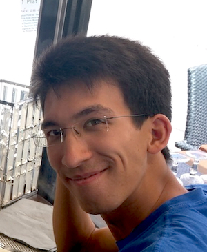
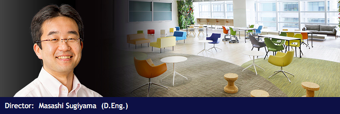

% OPALE: Optimal Policy Active Learning for Education
% {height=3.1cm} {height=3.1cm} {height=3.1cm} {height=3.1cm} {height=3.1cm}\newline \small \alert{Jill-Jênn Vie}¹; Samuel Girard¹; Tomas Rigaux\textsuperscript{\alert<2>{$1 \to 2$}}; Koh Takeuchi²; Hisashi Kashima²;\newline Sein Minn¹; Bénédicte Colnet¹; Gaël Varoquaux¹ \vspace{-1cm}
% ¹ France \hfill ² Japan \newline \raisebox{-1em}{\includegraphics[height=2cm]{figures/inria.png} \includegraphics[height=2cm]{figures/kyoto.png}}
---
aspectratio: 169
header-includes:
  - \def\D{\mathcal{D}}
  - \newcommand{\myhfill}{\hskip0pt plus 1filll}
---
# OPALE: Optimal Policy Active Learning for Education

Reinforcement learning is popular in simulated environments such as games.

We had extensive experience in building student models (models of forgetting for spaced repetition systems, best paper at EDM 2019), but not in RL.

Challenges:

- How to be sample efficient when doing RL on human interaction data?
- Experiments with real students are costly, how to learn promising policies on offline data before conducting online experiments?

Solutions: off-policy estimation, importance sampling

\centering

# Contextual bandits

Observe student context $s$ $\to$ select question $a$ $\to$ observe reward $r$

Maximize average reward:

$$V(\pi) = \int_s \int_a \int_r p(s) \pi(a \mid s) p(r \mid s, a)\, r\,  ds\, da\, dr$$

Given a dataset $\D_0 = (s_i, a_i, r_i)_i$ collected with policy $\pi_0(a \mid s)$:

- How to learn a good model $p(r \mid s, a)$ on existing data $\D_0$? (EAAI AAAI 2022)
- How to generate a new synthetic dataset $\mathcal{D}'$ that follows similar distribution than $\D_0$ while ensuring privacy of participants? (EC-TEL 2022)
- Given data $\mathcal{D}_0$ collected with policy $\pi_0$ how to evaluate a different policy $\pi_e$ for asking questions? (counterfactual learning, ongoing submission)

As you can see, these questions go beyond the application to education.

# Research interests

{height=1.5cm} \hfill {height=1.5cm}

SODA and Kashima lab (Kyoto U) have the common goal of doing machine learning on data from humans. JJV did his postdoc at RIKEN AIP Tokyo / Kashima lab Kyoto.

SODA has more expertise on causal inference, educational data mining

Kashima lab has more expertise on causal inference, crowdsourcing, reinforcement learning, graph neural networks

## Scientific impact

- EAAI track @ AAAI 2022, EC-TEL 2022, IEEE BigData 2022, ICCE 2023
- Joint organization of PAKDD 2023
- Joint organization of workshop Optimizing Human Learning LAK 2024 (next week)

# Joint organization of PAKDD 2023

\centering

# OPALE Team highlights

:::::: {.columns}
::: {.column width=35%}
\centering

{height=3cm}

## \hspace{1cm} Tomas Rigaux

- was research engineer at SODA
- did the entrance examinations of Kyoto U
- is now a PhD candidate at Kyoto University  
(RL on games on graphs)
:::
::: {.column width=32%}
\centering

{height=3cm}

## \hspace{1.25cm} Sein Minn

- was a postdoc at Inria (SODA $\to$ CEDAR)
- (Coup d'État Myanmar 2021)
- could not travel to Japan (COVID-19)
- moved to Canada as independent researcher
:::
::: {.column width=33%}
\centering

{height=3cm}

## \hspace{1cm} Samuel Girard

- joined SODA in 2023 as research intern
- got a Paris Region PhD funding from Île-de-France
- thanks to OPALE we could submit a paper on his very first day of PhD

:::
::::::

# About security policy in Japan

In Kyoto:

Enter building $\to$ Type door code $\to$ Enter lab

In Tokyo, RIKEN AIP:

Get QR code $\to$ Enter building $\to$ Call $\to$ Free common space (blackboard, whiteboard)

# About security policy in France

Context: colleague Koh Takeuchi was invited by Inria Rocquencourt and wanted to visit Inria Saclay.

In Inria for non-Schengen visitors:

Ask *Fonctionnaire sécurité défense* (1 month delay) $\to$ Ask badge $\to$ Enter building

"Solution": for less than 5 calendar days, FSD approval is not required.  
So he stayed Friday to Tuesday (3 working days).

# Future work -- RED: Recommendations Encouraging Diversity 2024--2026

New associate team RED 2024--2026

Maximize average reward:

$$V(\pi) = \int_s \int_a \int_r p(s) \pi(a \mid s) p(r \mid s, a)\, r\,  ds\, da\, dr$$

In recommendation, how to add a metric of diversity in the reward function?

Collaborations with:

- Pass Culture (3M students aged 18 and less)
- Clémence Réda (Universität Rostock, Germany)
- Fabien Tarissan (CNRS, ENS Paris-Saclay)

<!-- Because of 1 year delay, although the project was introduced in November 2022 it could start in September 2023 -->

We are actually currently in Japan working on both OPALE and RED topics.

# How to improve the Associate Teams program

- More info about what agreements we are expected to sign (MoU?)
- More info about France-Japan calls (PHC Sakura has a great resource for this)
- Help us welcome researchers outside of Schengen

Unsolvable problems:

- Sharing data with a non-EU country (we decided not to share)
- Visa issues for Chinese PhD students in Japan

Thanks for the amazing program :-)

(Koh Takeuchi is currently learning French)
