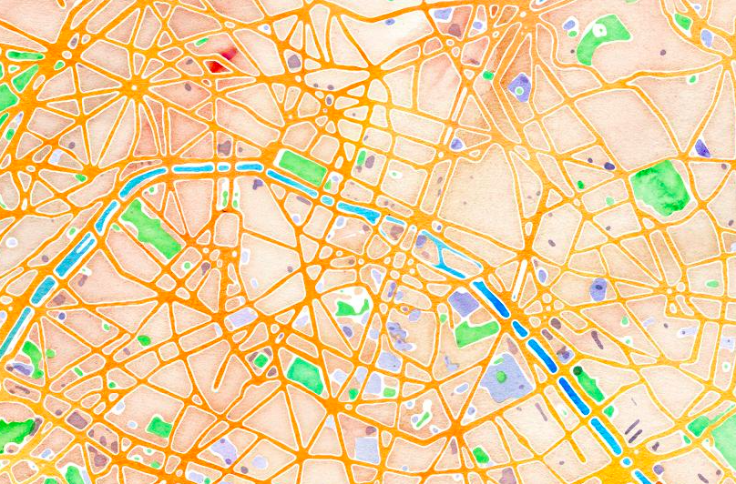

% Parcours de graphes
% Christoph Dürr; Jill-Jênn Vie
% SU November Camp\newline 2 novembre 2021
---
aspectratio: 169
theme: metropolis
mainfont: EBGaramond12-Regular.otf
mainfontoptions:
  - Path=/home/jj/.local/share/fonts/
  - "BoldFont=`LinLibertine_RB.otf`{=latex}"
colorlinks: true
header-includes:
  - \usepackage{minted}
---
# Un labyrinthe

\centering
\ 

# Parcours main gauche

\centering
\ 

# Parcours main gauche ?

\centering
\ 

# Parcours en profondeur (DFS) avec une pile {.fragile}

\centering
\ 

```python
from tryalgo.dfs import dfs  # pip install tryalgo
prec = dfs(laby_graph)
```

# Depth-first search {.fragile}

```
process(node)
    mark this node
    for each neighbor of node
        if neighbor is not marked
	        process(neighbor)
```

\pause

```python
def dfs_recursive(graph, node, seen):
    seen[node] = True
    for neighbor in graph[node]:
        if not seen[neighbor]:
            dfs_recursive(graph, neighbor, seen)
```

# Depth-first search, iterative {.fragile}

\scriptsize

```
dfs(node)
    todo |$\gets$| empty stack, then push node to todo
	while todo is not empty
	    node |$\gets$| pop from todo
		mark this node
		for each neighbor of node
		    if neighbor is not marked
			    push neighbor to todo
```

\pause

```python
def dfs_iterative(graph, start, seen):
    seen[start] = True
    to_visit = [start]
    while to_visit:
        node = to_visit.pop()
        for neighbor in graph[node]:
            if not seen[neighbor]:
                seen[neighbor] = True
                to_visit.append(neighbor)
```

# Parcours en profondeur (DFS) optimal ? {.fragile}

\centering
\ 
\qquad
\ 

```python
from tryalgo.dfs import dfs
prec = dfs(laby_graph)
```

# Parcours en largeur (BFS) avec une file {.fragile}

\centering
\ 
\qquad
\ 

```python
from tryalgo.bfs import bfs
dist, prec = bfs(laby_graph)
```

# Breadth-first search {.fragile}

```
bfs(node)
	todo |$\gets$| empty queue
	mark node
	push node to todo
	while todo is not empty
	    node |$\gets$| pop from todo
		for each neighbor of node
		    if neighbor is not marked
			    mark neighbor
			    push neighbor to todo
```

# Le graphe de Paris

\centering

\ 

# Google Hash Code 2014

## Énoncé original

- On vous donne \alert{8 voitures} partant de Google Paris sur le graphe de Paris à 11348 intersections, 17958 rues.
- Chaque rue est étiquetée par une \alert{distance} en mètres et un \alert{temps} de parcours en secondes.
- Certaines rues sont à \alert{double sens}, d'autres ne le sont pas.
- Comment explorer un \alert{maximum} de km de Paris en \alert{15 heures} ?

# La meilleure solution : graphes eulériens

\centering
\ 

\vspace{1cm}

\raggedright
\textbf{Condition :} 0 ou 2 nœuds ayant un nombre \alert{impair} de voisins.

# Eulérianiser Paris par des plus courts chemins

\centering
\ 

\vspace{1cm}

\raggedright
Certains nœuds ont \alert{trop} d'arcs entrants, d'autres en \alert{manquent}.  
\textbf{Idée :} les \alert{coupler} par des \textcolor{blue}{plus courts chemins}.

# Références

- [TryAlgo Maps in Paris](https://github.com/jilljenn/tryalgo#demo-tryalgo-in-paris), un notebook Jupyter pour jouer vos algorithmes sur le graphe de Paris
- [Pour en savoir plus sur l'épreuve Google Hash Code 2014](https://a3nm.net/blog/google_hashcode_2014_fr.html)  
par Antoine Amarilli
