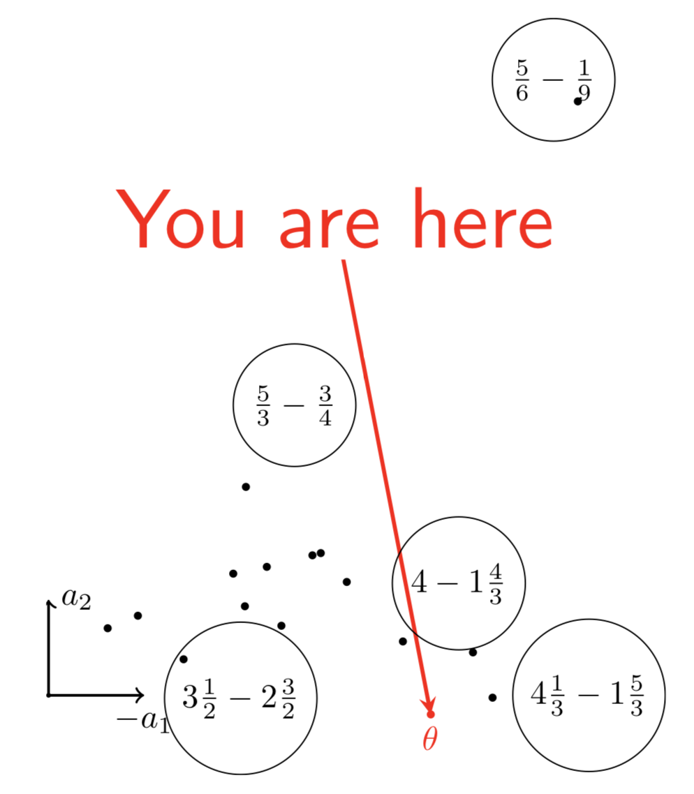
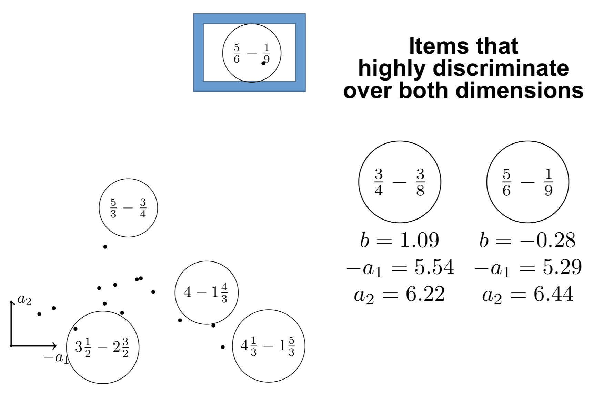
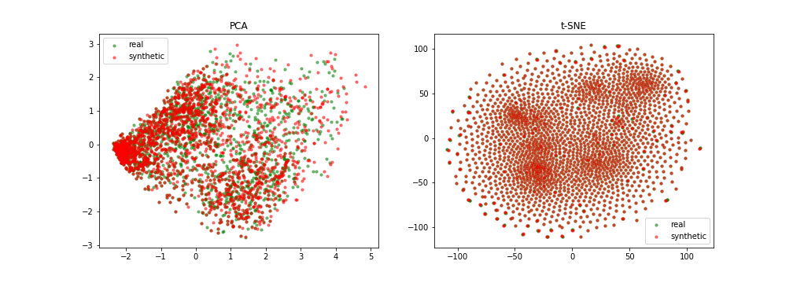

% Fairness et confidentialité en IA pour l'éducation :\newline risques et opportunités
% Jill-Jênn Vie
% 29 juin 2022
---
institute: \includegraphics[height=1cm]{figures/inria.png} \includegraphics[height=1cm]{figures/soda.png}
colorlinks: true
lang: fr
aspectratio: 169
biblio-style: authoryear
biblatexoptions: natbib
header-includes:
    - \usepackage{bm}
    - \usepackage{tikz}
    - \usepackage{booktabs}
    - \usepackage{colortbl}
    - \DeclareMathOperator\logit{logit}
    - \def\Dt{D_\theta}
    - \def\E{\mathbb{E}}
    - \def\logDt{\log \Dt(x)}
    - \def\logNotDt{\log(1 - \Dt(x))}
    - \newcommand\mycite[3]{\textcolor{blue}{#1} "#2".~#3.}
    - \usepackage{etoolbox}
    - \AtEndPreamble{\DefineBibliographyExtras{french}{\restorecommand\mkbibnamefamily}}
---

# Plan

- Exemples d'IA dans l'éducation
    - Avec des guidelines de la Commission européenne
- Confidentialité : génération de données difficiles à réidentifier
- Fairness : mesurer les discriminations pour réduire les inégalités

# Carte

# Mesurer les connaissances des apprenants

## À un instant donné

- psychométrie, théorie de la réponse à l'item, modèle de Rasch

## Au cours du temps

- traçage de connaissance (*knowledge tracing*), systèmes à répétition espacée

# Théorie de la réponse à l'item

(Rasch, 1961) danois, (Lord, 1986) américain ou (Binet, 1905) français

Compromis entre bien mesurer et poser peu de questions

{height=7cm}

# Théorie de la réponse à l'item multidimensionnelle

\centering

{height=8cm}

# Identifier les points forts

{height=8cm}

# Et les points faibles

{height=8cm}

# Et en grande dimension ?

\centering
\includegraphics[width=0.6\linewidth]{figures/cfirt.pdf}

<!-- \mycite{Psychometrika}{Bergner, Yoav, Peter Halpin, and Jill-Jênn Vie}{2021. “Multidimensional Item Response Theory in the Style of Collaborative Filtering.” Psychometrika, 1–23. https://rdcu.be/cAcgu. } -->

\raggedright
\small\fullcite{Bergner2021}

# Traçage de connaissances : essais d'étudiants sur exercices

Exercices de maths (ex. ASSISTments)

\centering
\begin{tabular}{cccc} \toprule
Items & 5 -- 5 = ? & 17 -- 3 = ? & 13 -- 7 = ?\\ \midrule
New student & \alert{$\circ$} & \alert{$\circ$} & \alert{$\mathbf{\times}$}\\ \bottomrule
\end{tabular}

\raggedright
Apprentissage d'une langue (jeu de données de Duolingo)

\includegraphics{figures/duolingo0.png}

## Challenges

- Les gens peuvent faire des erreurs d'inattention
- Les connaissances évoluent au cours du temps
- Biais des données manquantes (mesurer la persévérance)

<!--

# Combiner modèles discrets et Rasch

Poser la question qui maximise
le nombre moyen d'acquis validés ou invalidés :

\centering

$\textnormal{Maximiser } p(succès) N_{validés} + (1 - p(succès)) N_{invalidés}$

\raggedright

Le code de Pix, en JavaScript, est ouvert (AGPLv3) sur GitHub

\small
\fullcite{Vie2017PIX} -->

# Visuellement : le traçage de connaissances (KT)

\includegraphics[width=\linewidth]{figures/dkt.png}

- Couleurs : composantes de connaissances
- Disques : résultats d'apprenants sur ces composantes
    - Plein : correct
- On souhaite généraliser les connaissances à d'autres composantes
    - De bleu à vert : faible à haute probabilité de répondre correctement
- Les apprenants peuvent faire plusieurs essais

## Méthode

Apprendre des paramètres de questions sur des données d'historiques \hfill \emph{ex. difficulté}  
Mesurer les paramètres de nouveaux apprenants \hfill \emph{ex. expertise}  

# De nombreux modèles pour le traçage de connaissances

\centering
\includegraphics[width=\linewidth]{figures/ktm.pdf}

\includegraphics{figures/ktm-cite.pdf}

# Formellement : factorization machines

Apprendre un biais \alert{$w_k$} et un embedding \alert{$\bm{v_k}$} pour chaque composante $k$ tel que :
$$ \logit p(\bm{x}) = \mu + \underbrace{\sum_{k = 1}^N \alert{w_k} x_k}_{\textnormal{régression logistique}} + \underbrace{\sum_{1 \leq k < l \leq N} x_k x_l \langle \alert{\bm{v_k}}, \alert{\bm{v_l}} \rangle}_{\textnormal{interactions par paires}} $$

- La théorie de la réponse à l'item multidimensionnelle en est un cas particulier.
- Permet de modéliser des informations de contexte (ex. cet exercice a été résolu sur téléphone plutôt que sur ordinateur de bureau)

\small
\fullcite{rendle2012factorization}

\fullcite{Minn2018}

\fullcite{KTM2019}

# Systèmes à répétition espacée (Leitner, 1970s)

\includegraphics[width=0.5\linewidth]{figures/anki.png}\includegraphics[width=0.5\linewidth]{figures/leitner.png}
\centering

# Modèle de mémoire pour espacer les cartes de façon optimale

Principe simple :

- compter le nombre d'essais (heure, jour, semaine, mois, $\infty$)
- compter le nombre de succès dans ces fenêtres de temps

:::::: {.columns}
::: {.column}
Apprendre par régression logistique :

- la difficulté des exercices
- la difficulté des composantes de connaissances
- le progrès par essai, par composante, par fenêtre de temps
:::
::: {.column}
{width=100%}
:::
::::::

**EDM 2019**

:   \scriptsize
\mycite{Benoît Choffin, Fabrice Popineau, Yolaine Bourda, and Jill-Jênn Vie (2019)}{DAS3H: Modeling Student Learning and Forgetting for Optimally Scheduling Distributed Practice of Skills}{Best Paper Award at EDM 2019}

# Et l'apprentissage profond dans tout ça ?

Réseaux de neurones récurrents (DKT), avec attention (SAKT, AKT)

IRT bien entraîné peut faire mieux que deep knowledge tracing (Wilson, EDM 2016).

Sur des grandes données, lorsque l'aspect séquentiel est important, des modèles profonds peuvent avoir une meilleure performance.

\fullcite{gervet2020deep}

Important de connaître les fondements, merci Michel :

\fullcite{desmarais2012review}

# Europe : IA & données pour l'éducation et la formation

1. Facteur humain et supervision
2. Transparence
3. Diversité, non discrimination et *fairness* (impartialité)
4. Bien-être sociétal et environnemental
5. Confidentialité et gouvernance des données
6. Robustesse technique et sécurité
7. Responsabilité

# 3. Diversité, non discrimination et *fairness* (impartialité)

- Le système est-il \alert{accessible} pour tous sans barrière ?
- Modes d'interaction appropriés pour les personnes à besoins spéciaux / interfaces appropriées
- Y a-t-il des procédures pour s'assurer que l'IA n'induira pas un traitement discriminatoire ou injuste pour ses utilisateurs ?
- La documentation du système ou son procédé d'entraînement indique-t-elle des biais potentiels dans les données ?

# 5. Confidentialité et gouvernance des données

- Des mécanismes sont-ils en place pour s'assurer que les données sensibles sont anonymisées et protégées pour en limiter l'accès aux personnes nécessaires ?
- Les données sont-elles traitées dans le seul but pour lequel elles ont été collectées ?
- Les enseignants ont-ils un moyen de signaler des problèmes quant à la confidentialité ou la protection des données ? En sont-ils informés ?
- Simplement : est-ce que le système respecte la RGPD ? Les paramètres de confidentialité sont-ils modifiables ?

# Confidentialité

- Il est difficile d'accéder à des données sensibles (procédures très longues pour la recherche)
- Un jeu de données qui est ouvert peut être archivé pour toujours
- Pourquoi ne pas avoir plutôt accès à :
    - des statistiques (cf. DEPP)
    - des probabilités conditionnelles
    - des modèles pré-entraînés
    - des jeux de données synthétiques ? (ne serait-ce que pour la reproductibilité)

# Outline

- Privacy
- Metrics: utility and re-identification
- Attack models
    - Weak: Membership inference
    - Strong: Train on real and fake, learn to distinguish the two

# Striking facts

## People pseudonymize, but it's not enough
@narayanan2008robust managed to de-anonymize a Netflix pseudonymized dataset of seen movies with IMDb

## People $k$-anonymize, but high-dimensional data (e.g. mobility) is rarely $k$-anonymizable

- 4 timestamp-location points are needed to uniquely identify 95\% of individual trajectories in a dataset of 1.5M rows \citep{de2013unique}
- 15 demographic points are enough to re-identify 99.96\% of Americans \citep{rocher2019estimating}

# Differentially private graphical models

## $\varepsilon$-differential privacy

$$ \left|\log \frac{Pr(A(D_1) \in S)}{Pr(A(D_2) \in S)}\right| \leqslant \varepsilon $$

for all datasets $D_1$ and $D_2$ that differ on a single element  
for all possible subsets $S$ (of $\textnormal{Im } A$)

## PrivBayes \citep{zhang2017privbayes}

{width=50%}

However, we need a dynamic model

# Intuition

Knowledge embeddings are safe to be shared

User embeddings however should be drawn from distribution

\centering

{width=50%}

# Example data

\begin{table}[h]
%\caption{Example of minimal tabular dataset.}
\label{example-dataset}
\centering
\resizebox{\textwidth}{!}{
\begin{tabular}{ccc} \toprule
user ID & action ID & outcome \\ \midrule
2487 & 384 & 1 \\
2487 & 242 & 0 \\
2487 & 39 & 1 \\
2487 & 65 & 1 \\ \bottomrule
\end{tabular}
\arrayrulecolor{white}
\begin{tabular}{l} \toprule
description \\ \midrule
user 2487 got token ``I'' correct \\
user 2487 got token ``ate'' incorrect \\
user 2487 got token ``an'' correct \\
user 2487 got token ``apple'' correct \\ \bottomrule
\end{tabular}
}
\arrayrulecolor{black}
\end{table}

So in our case there are two models:

- Sequence generation (Markov chain, RNN)
- Response pattern generation (IRT, Bayesian networks)

# Item response theory for response pattern generation

Ex. $r_{ij}$ is 1 if user $i$ got a positive outcome on action (item) $j$

$$p_{ij} = \Pr(R_{ij} = 1) = \sigma(\theta_i + e_j)$$

\noindent
where $\theta_i$ is ability of user $i$ and $e_j$ is easiness of action $j$

\vspace{1cm}

Trained using Newton's method: minimize log-loss $\mathcal{L} = \sum_{i, j} (1 - r_{ij}) \log (1 - p_{ij}) + r_{ij} \log p_{ij}$

# Logistic regression with sparse features

Let us encode the event (user $i$, item $j$) as a two-hot vector $\bm{x}$:

\centering

$p_{ij} = \sigma(\langle \alert{\bm{w}}, \bm{x} \rangle) = \sigma(\sum_k \alert{w_k} x_k) = \sigma(\alert{\theta_i} + \alert{e_j})$

# Utility

\centering
Practictioners who conduct study on the real and fake dataset should have similar findings

$\downarrow$

Trained model on original dataset should have parameters that are not too far in RMSE

\raggedright

We also consider weighted RMSE:

$$ wRMSE = \sqrt{\sum_{i = 1}^N w_i (d_i - \widehat{d_i})^2} $$

where $w_i \in [0, 1]$ is the frequency of action $i$ in the training set.

# Reidentification

\centering
It should not be easy to re-identify people / the fake dataset should not leak too much information about participants

$\downarrow$

An attacker has to guess, from a broader population, who was in the training set

\centering
\begin{tikzpicture}[
    xscale=3,
    yscale=2,
    data/.style={draw},
    >=stealth
]
\node[data] (original) at (0,0) {Original};
\node[data] (training) at (1,0) {Training set};
\node[data] (fake) at (1,-1) {Fake set};
\node[data,text width=1.6cm,text centered] (real-irt) at (2,0) {Real item params $d$};
\node[data,text width=1.6cm,text centered] (fake-irt) at (2,-1) {Fake item params $\hat{d}$};
\draw[->] (original) edge node[above=3mm] {sampling half users} (training);
\draw[->] (training) edge node[right] {generator} (fake);
\draw[<->] (real-irt) edge node[right] {RMSE} (fake-irt);
\draw[->,dashed,bend right] (original) edge (training);
\draw[->,dashed,bend left=60,text width=2cm,text centered] (fake) edge node[below left] {reidentify\\AUC} (training);
\draw[->] (training) edge node[above] {IRT} (real-irt);
\draw[->] (fake) edge node[above] {IRT} (fake-irt);
\end{tikzpicture}

(framework inspired by NeurIPS "Hide and Seek" challenge in healthcare by \cite{jordon2020hide})

# Histogram of actions ($y$-axis: frequency)

\centering

Actions

# Quantitative results

{width=49%}
{width=49%}

# Slided bag of events for SNDS

# A bad example

# A good example

{width=100%}

# Fairness

"Different models with the same reported accuracy can have a very different distribution of error across population" (Hardt, 2017)

\pause

Crime prediction (watch [*Psycho-Pass*](https://mangaki.fr/anime/46)):

# Goals

- \alert{Group fairness}: positive rate in group $\simeq$ positive rate overall
- \alert{Individual fairness}: similar people receive similar outcomes
- Find a trade-off between accuracy and fairness

## Useful reads

Many results are being renamed and rediscovered :(

\fullcite{hutchinson201950}

\fullcite{zemel2013learning}

# Example of fairness

\centering

[{width=100%}](http://research.google.com/bigpicture/attacking-discrimination-in-ml/)

See [Attacking discrimination with smarter machine learning](https://research.google.com/bigpicture/attacking-discrimination-in-ml/)

# Visually

\centering

# Formally

$$ M_{n, k} = P(Z = k|x_n) \propto \exp(-d(x_n, \alert{v_k})) $$

\raggedleft
High if $x_n$ is close to $\alert{v_k}$

\raggedright

$$ \hat{x_n} = \sum_k M_{n, k} \alert{v_k} $$

\only<1>{$$ \displaystyle \widehat{y_n} = \sum_k M_{n, k} \alert{w_k} $$}
\only<2>{$$ \widehat{y_n} = \sum_k \underbrace{M_{n, k}}_{\in \{0, 1\}} \alert{w_k} $$}
\only<3>{$$ \widehat{y_n} = \sum_k \underbrace{M_{n, k}}_{\in \{0, 1\}} \underbrace{\alert{w_k}}_{\in \{0, 1\}} $$}

$\alert{v_k} \in \mathbf{R}^d$, $\alert{w_k} \in \mathbf{R}$ are \alert{learned}

# Objective

Accuracy

:   $L_y = \sum_n - y_n \log \hat{y_n} - (1 - y_n) \log (1 - \hat{y_n})$

Reconstruction

:   $L_x = \sum_n ||x_n - \hat{x}_n||^2$

Fairness

:   $L_z = \sum_k |M_k^+ - M_k^-|$

where $M_k^+ = \underbrace{\mathbb{E}_+ M_{n, k}}_{\textnormal{average across subgroup}}$

\only<1>{$$ L = A_z L_z + A_x L_x + A_y L_y $$}
\only<2>{$$ L = A_z L_z + A_x L_x + A_y \alert{N_D} $$}

# Baselines

LR: Logistic Regression

FNB: Fair Naive Bayes

RLR: Regularized LR

LFR: Learning Fair Representations

# Results I

Accuracy (high)

Discrimination (low)

$$D = | \mathbb{E}_+ \hat{y}^n - \mathbb{E}_- \hat{y}^n |$$

# Results I, see [paper](https://www.cs.toronto.edu/~toni/Papers/icml-final.pdf)

\centering

{width=70%}

# Results II

Consistency (high)

$$ y_{nn} = 1 - \frac1{Nk} \sum_n \left| \hat{y}_n - \sum_{j \in kNN(x_n)} \hat{y}_j \right| $$

# Results II

\centering

{width=60%}

# Going beyond: AUC constraints

Constraints on AUC or area between ROC curves (ABROCA)

\centering

{width=60%}

\raggedright

Evaluating the Fairness of Predictive Student Models Through
Slicing Analysis (Gardner, Brooks and Baker, 2019)

Also works from Bellet next door

# Going beyond: Relation to differential privacy

\centering

{width=60%}

\pause

$$ \begin{aligned}
\forall S \subset \textnormal{Im} A, \forall D_1, D_2 \textnormal{"close"}, Pr(A(D_1) \subset S) \leq e^\varepsilon Pr(A(D_2) \subset S)\\
\forall S \subset \textnormal{Im} A, \forall D_1, D_2 \textnormal{"close"} \left|\frac{\log Pr(A(D_1) \in S)}{\log Pr(A(D_2) \in S)}\right| \leq \varepsilon
\end{aligned} $$

\raggedright

For more on this beautiful relationship:  
[Fairness through Awareness](https://arxiv.org/abs/1104.3913) (Dwork et al., 2011)

# Conclusion

- Ouvrons massivement les données de gens qui n'existent pas
- Il faut mesurer les discriminations pour réduire les inégalités

\vspace{1cm}

\pause

Merci ! Questions ? \hfill Ces slides sur \href{https://jjv.ie/slides/pfia.pdf}{jjv.ie/slides/pfia.pdf}
