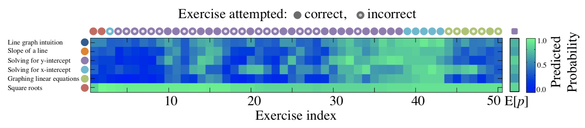

% Pix.fr : certification adaptative\newline des compétences numériques\vspace{1pt}
% Jill-Jênn Vie\newline\newline\includegraphics[height=1cm]{figures/pix.png}\qquad\inria
% 11 décembre 2019
---
theme: Frankfurt
section-titles: false
biblio-style: authoryear
header-includes:
    - \usepackage{booktabs}
    - \usepackage{multicol}
    - \usepackage{bm}
    - \usepackage{multirow}
    - \DeclareMathOperator\logit{logit}
    - \def\ReLU{\textnormal{ReLU}}
    - \def\inria{\includegraphics[height=1cm]{figures/inria.png}}
    - \newcommand\mycite[3]{\textcolor{blue}{#1} "#2".~#3.}
---
# Introduction

## Optimisation de l'apprentissage humain

On observe des données d'apprentissage sur une plateforme  
(évaluation, cours en ligne)

Comment utiliser ces données pour profiter aux autres apprenants ?

### Challenges

- Ne pas poser trop de questions aux apprenants
- Les apprenants évoluent au cours du temps
- Quelles données utiliser ?
- Quelle fonction objectif choisir ?

## Tests adaptatifs

\centering

# Tests de positionnement

## Référentiel de compétences numériques DIGCOMP 2.0

\centering
\includegraphics[width=0.5\linewidth]{figures/digcomp.png}

- Informations et données
  - Ex. rechercher de l'information sur Internet
- Communication collaboration
- Création de contenu
- Protection et sécurité
- Résolution de problèmes

## Certification des compétences numériques

Avant : B2i.

Maintenant :

{width=2cm}

La certification Pix remplace le B2i pour les lycéens  
(JO du 1\textsuperscript{er} septembre 2019)

- 1 intrapreneur au ministère de l'Éducation
- 3 chercheurs concepteurs d'épreuves
- 2 développeurs
- +1 concepteur de l'algorithme adaptatif

## Un exemple de problème Pix

\centering \Large
Dans le village de Montrésor,  
sur quelle rue débouche la rue des Perrières ?

\vspace{1cm} \pause

\normalsize
$\rightarrow$ permet de valider l'acquis \@rechercheInfo3

## Types de tests

### Tests de positionnement

Évaluer son niveau en peu de questions  
Faible enjeu ; basé sur une cartographie des connaissances

### Tests de certification

Fort enjeu : l'apprenant peut le valoriser

### Tests de progression

"Quoi apprendre ensuite ?"  
Optimiser l'apprentissage humain

## Théorie de la réponse à l'item

\centering

Utilisé par les certifications PISA, GMAT, etc.

## Exemple de test adaptatif :

- On pose une question de niveau 2
- L'apprenant \alert{réussit}
- On lui pose une question de niveau 6
- L'apprenant \alert{échoue}
- On lui pose une question de niveau 4
- L'apprenant \alert{réussit}
- Il est de niveau 5

## Choisir la bonne fonction à optimiser

\alert{Maximiser l'information} $\rightarrow$ les apprenants échouent 50 % du temps (bien pour l'évaluateur, pas pour les apprenants)

\pause

\alert{Maximiser le taux de succès} $\rightarrow$ on pose artificiellement des questions trop faciles

\pause

\alert{Maximiser la croissance du taux de succès}  
Travaux d'une équipe Inria à Bordeaux (Clement et al. 2015)

\pause

\alert{Identifier une lacune de l'apprenant le plus vite possible}  
(Seznec et al. 2019)

## Algorithme conçu pour Pix

Maximiser le nombre moyen d'acquis validés ou invalidés

Le code source de l'algorithme adaptatif est \alert{ouvert}  
(pix.fr, code sur GitHub sous licence AGPLv3)  
Déjà 350 000 comptes créés, 50 000 certifications délivrées

\centering
\includegraphics[width=\linewidth]{figures/example.pdf}

**Article**

:   \scriptsize\mycite{Jill-Jênn Vie, Fabrice Popineau, Françoise Tort, Benjamin Marteau, and Nathalie Denos (2017)}{A Heuristic Method for Large-Scale Cognitive-Diagnostic Computerized Adaptive Testing}{ACM Conference on Learning at Scale}

## Le but de cette étape ?

\centering

{width=60%}

## Identifier les points forts

## Et les lacunes

## Le niveau évolue au cours du temps

\centering

Si l'on peut simuler l'apprentissage,  
alors on peut optimiser l'apprentissage

# Conclusion

## Sujets de recherche

\alert{Tests de positionnement} Importance d'adapter l'évaluation,  
et de bien choisir la fonction à optimiser (évaluation, progression)

\alert{Systèmes de recommandation} Plus proches voisins  
Des données de tout type peuvent améliorer la précision,  
mais attention encore aux biais

\alert{Mémoire} En simulant l'humain au plus près,  
on peut optimiser l'enseignement

## Merci pour votre attention !

Nous organisons un colloque du \alert{mercredi 15 au 17 janvier 2020}
au lab 110 bis de l'Éducation nationale :

- conférences sur ce thème ;
- ateliers de réflexion ;
- ouverture de données anonymisées.

Contactez-moi pour en savoir plus.

\centering
Jill-Jênn Vie  
Twitter : \@jjvie  
`vie@jill-jenn.net`

