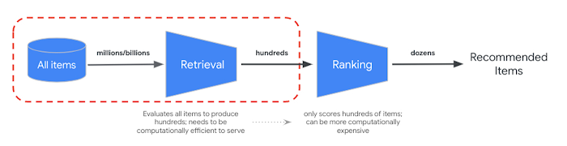

% Systèmes de recommandation industriels\newline et LLM pour la recommandation
% Jill-Jênn Vie
% Webinaire Pix, 17 juin 2025
---
institute: \includegraphics[height=1cm]{figures/inria.png}
aspectratio: 169
header-includes:
  - \usepackage{subfig}
  - \usepackage{booktabs}
---

# Jill-Jênn Vie

- Chercheur à Inria
- Ex ENS Paris-Saclay (Françoise Tort)
- Thèse en évaluation adaptative, appliquée à Pix en 2016
- Rentré dans l'IA via les systèmes de recommandation
- Préparateur (coach) de l'X aux concours de programmation (#1 SWERC 2024)

\centering

{width=80%}

# Systèmes de recommandation

<!-- :::::: {.columns}
::: {.column}

:::
::: {.column}

:::
:::::: -->

## Recommandations de films : filtrage collaboratif, bandits pour la pub ciblée \medskip

\centering

{width=60%}

## Traçage de connaissance : prédire la performance d'apprenants (e.g. Duolingo) \medskip

# Utiliser le contenu des posters pour la recommandation (2017)

# Spotify utilise le contenu de la musique pour la recommandation (2013)

\fullcite{van2013deep}

# Les systèmes de recommandation industriels sont des bases de données de vecteurs

Passer à l'échelle : sur le million d'offres, seulement 1500 sont présélectionnées et triées

*Vector database* : plus proches voisins par rapport à une requête (encodée sous forme de vecteur)

Lorsque je fais une \alert{requête}, je veux avoir des \alert{documents} proches

# IA : $K$ plus proches voisins

Une base de données : me renvoie les lignes que je demande  
\uncover<2>{Indexation des clés pour faire des recherches plus rapides}

Une IA : infère les lignes & valeurs manquantes par interpolation
\uncover<2>{(un LLM avec RAG)\\ Indexation des vecteurs pour trouver les plus proches voisins plus rapidement}

Un moteur de recherche : me renvoie les documents que je demande  
\uncover<2>{Indexation des métadonnées / du contenu "fulltext"}

\centering

{height=4cm}

# Des gens proches ont des comportements proches

## Films \hfill Éducation

\centering

:::::: {.columns}
::: {.column width=60%}

:::
::: {.column width=40%}

:::
::::::

# 

## Votre historique de soumissions de problèmes d'algo au cours du temps

\begin{tabular}{cccc}
  \toprule
  \textbf{Elo} & \textbf{Verdict} & \textbf{Nom} & \textbf{Tags} \\
  \midrule
  2300 & OK & \href{https://codeforces.com/problemset/problem/1942/E}{Farm Game} & combinatorics, games \\
  1900 & Trop lent & \href{https://codeforces.com/problemset/problem/1958/E}{Yet Another Permutation Constructive} & constructive \\
  1900 & OK & \href{https://codeforces.com/problemset/problem/1958/E}{Yet Another Permutation Constructive} & constructive \\
  2000 & Faux & \href{https://codeforces.com/problemset/problem/1958/F}{Narrow Paths} & combinatorics \\
  2000 & OK & \href{https://codeforces.com/problemset/problem/1958/F}{Narrow Paths} & combinatorics \\
  \bottomrule
\end{tabular}

## Base de problèmes d'algorithmique Codeforces

\vspace{1mm}

\begin{tabular}{cll}
  \toprule
  \textbf{Elo} & \textbf{Nom} & \textbf{Tags} \\
  \midrule
  1700 & \href{https://codeforces.com/problemset/problem/1916/D}{Math Problem} & brute force, constructive, geometry, math \\
  1200 & \href{https://codeforces.com/problemset/problem/1916/C}{Training Before IOI} & constructive, games, greedy, implementation, math \\
  1000 & \href{https://codeforces.com/problemset/problem/1916/B}{Two Divisors} & constructive, math, number theory \\
  800 & \href{https://codeforces.com/problemset/problem/1916/A}{2023} & constructive, implementation, math, number theory \\
  1800 & \href{https://codeforces.com/problemset/problem/1915/G}{Bicycles} & graphs, greedy, implementation, shortest paths, sortings \\
  \bottomrule
\end{tabular}\bigskip

Sur Hugging Face : dataset de 18 millions d'essais de 15k utilisateurs sur 30k problèmes

# Comment les scores Elo sont-ils calculés ?

\centering

# Régression logistique pour apprendre les scores (IRT, Elo)

\centering

\resizebox{0.9\linewidth}{!}{$\displaystyle \substack{\normalsize \Pr(\textnormal{"student A solves question B"})\\ \Pr(\textnormal{"player A beats player B"})\\ \Pr(\textnormal{"A is preferred to B"})} = \frac1{1 + \exp(-(score_A - score_B))}$}

\raggedright

Apprendre les scores à partir des données observées (tel utilisateur a réussi tel exercice)

\centering

{width=50%}

:::::: {.columns}
::: {.column width=55%}
Mise à jour : si $o \in \{0, 1\}$ est le vrai résultat (réussite ou échec) et $p$ était la probabilité :

$$score := score + \underbrace{(o - p)}_{\textnormal{positif ssi réussite }}$$

(descente de \alert{gradient}, i.e. dérivée de la proba)
:::
::: {.column width=45%}

:::
::::::

# Application à la certification des compétences numériques Pix

\centering

:::::: {.columns}
::: {.column width=30%}

:::
::: {.column width=70%}
Asking questions that validate/invalidate the highest expected number of nodes\bigskip

\footnotesize

\fullcite{Vie2017PIX}
:::
::::::

{width=90%}

# Challenge supplémentaire : l'apprenant apprend au cours du temps

\centering

{width=70%}

\textcolor{gray}{Figure from \cite{shabana2022curriculumtutor}.}

\raggedright

Reward is 1 if concept is within the frontier of knowledge, 0 otherwise.

\small

\fullcite{Vassoyan2023}

# Changer la fonction objectif : moins mettre en échec l'apprenant (flow)

Donner une plus grande récompense à l'IA si l'apprenant réussit à résoudre une question plus difficile, 0 s'il échoue

\centering

{width=50%}

\raggedright

Travaux en cours avec Samuel Girard

# Parcourir les réponses possibles d'un modèle large de langue (LLM)

\centering

<!-- https://mitchgordon.me/ml/2022/07/01/retro-is-blazing.html -->

# 

LLM : la tâche est dans les données d'entrée

Machine de Turing : le programme est dans les données

Machine de Turing universelle : exécuter le $i$-ème programme

François Chollet (ex ENSTA, ex Google) dit ça beaucoup mieux :\bigskip

> My mental model for LLMs is that they work as a repository of vector programs. When prompted, they will fetch the program that your prompt maps to and "execute" it on the input at hand. LLMs are a way to store and operationalize millions of useful mini-programs via passive exposure to human-generated content.\medskip

> If a LLM is like a database of millions of vector programs, then a prompt is like a search query in that database [...] this “program database” is continuous and interpolative — it’s not a discrete set of programs.

\small

Sources: \url{https://arcprize.org/blog/oai-o3-pub-breakthrough}, \url{https://simonwillison.net/2023/Oct/25/francois-chollet/}

# Pour réduire les hallucinations : Retrieval-Augmented Generation (2020)

# Conseils

Choisir un objectif : faire progresser le plus les gens, etc.

Évaluer via un test randomisé

## Exemple : Pass Culture

:::::: {.columns}
::: {.column width=70%}
Constamment des A/B tests pour choisir l'algorithme avec la meilleure conversion (taux de clic)

Expérimentation sur 100k personnes pendant 10 jours : baisse du taux de clic, mais augmentation de la diversité
:::
::: {.column width=30%}

\centering

Higher volume $\to$

\textcolor{gray}{\texttt{arxiv.org/pdf/2108.03888}}
:::
::::::

# Merci pour votre attention

jill-jenn.vie@inria.fr

Installez le système de recommandation : \url{https://github.com/anavAgrawal/AlgoAce/}
