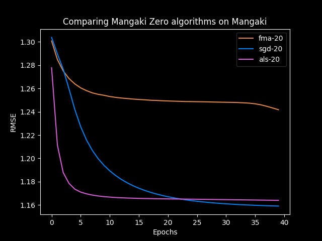

% Using Ratings & Posters\newline for Anime & Manga Recommendations \vspace{-5mm}
% \vspace{-5mm} {height=3.1cm} {height=3.1cm} {height=3.1cm} {height=3.1cm} \alert{Jill-Jênn Vie}¹³ \and \quad Florian Yger² \and \quad Ryan Lahfa³ \and \quad Hisashi Kashima¹\textsuperscript4\newline \and Basile Clement³ \and Kévin Cocchi³ \and Thomas Chalumeau³
% ¹ RIKEN Center for Advanced Intelligence Project (Tokyo)\newline ² Université Paris-Dauphine (France)\newline ³ Mangaki (Paris, France)\newline \textsuperscript4 Kyoto University \hfill \includegraphics[width=2cm]{figures/mangakiwhite.png}
---
theme: metropolis
themeoptions:
    - sectionpage=none
section-titles: false
header-includes:
    - \usepackage{tikz}
    - \usepackage{array}
    - \usepackage{icomma}
    - \usepackage{multicol,booktabs}
    - \def\R{\mathcal{R}}
    - \usecolortheme{owl}
---

# Mangaki

## Mangaki

### RIKEN Center for Advanced Intelligence Project (AIP)

\ 

- Public research institute ($\simeq$ Inria) near Tokyo Station
- Theoretical, applied & ethical AI research
- More GPUs than researchers
- 12 accepted papers at NeurIPS 2018  
13 at AAAI 2019  
14 at ICML 2019

### Mangaki, recommendations of anime/manga

Rate anime/manga and receive recommendations


350,000 ratings by 2,000 users on 10,000 anime & manga

- myAnimeList
- AniDB
- AniList
- (soon) TVtropes

### Build a profile


### Mangaki prioritizes your watchlist


### Browse the rankings: top works

```python
>>> from mangaki.models import Work
>>> Work.objects.filter(category__slug='anime').top()[:8]
```


### Why nonprofit?

- Why should blockbusters get all the fun/clicks/money?
- Maybe there is one precious, unknown anime \alert{for you}
    - and we can help you find it

#### Driven by passion, not profit

- Everything is open source: \alert{github.com/mangaki}
- Python (Django), Vue.js
- Many Jupyter notebooks (check 'em out!)

Awards: Microsoft Prize (2014) Japan Foundation (2016)

### A simple idea: precious pearls

```python
Work.objects.filter(category__slug='anime').pearls()[:8]
```


### Outline

#### 1. Usual algorithms for recommender systems

- Collaborative filtering (\alert{ALS})
- Content-based (\alert{LASSO})

#### 2. Our method

- How to use posters
- Blending models

#### 3. Experiments

- Dataset: Mangaki
- Results

# Recommender Systems

## Recommender Systems

### Recommender Systems

#### Problem

- Every user rates few items (1 %)
- How to infer missing ratings?

#### Example

\begin{tabular}{ccccc}
& \includegraphics[height=2.5cm]{figures/1.jpg} & \includegraphics[height=2.5cm]{figures/2.jpg} & \includegraphics[height=2.5cm]{figures/3.jpg} & \includegraphics[height=2.5cm]{figures/4.jpg}\\
Sacha & ? & 5 & 2 & ?\\
Ondine & 4 & 1 & ? & 5\\
Pierre & 3 & 3 & 1 & 4\\
Joëlle & 5 & ? & 2 & ?
\end{tabular}

### Recommender Systems

#### Problem

- Every user rates few items (1 %)
- How to infer missing ratings?

#### Example

\begin{tabular}{ccccc}
& \includegraphics[height=2.5cm]{figures/1.jpg} & \includegraphics[height=2.5cm]{figures/2.jpg} & \includegraphics[height=2.5cm]{figures/3.jpg} & \includegraphics[height=2.5cm]{figures/4.jpg}\\
Sacha & \alert{3} & 5 & 2 & \alert{2}\\
Ondine & 4 & 1 & \alert{4} & 5\\
Pierre & 3 & 3 & 1 & 4\\
Joëlle & 5 & \alert{2} & 2 & \alert{5}
\end{tabular}

### What is a machine learning algorithm?

#### Fit

\begin{center}
\begin{tabular}{ccc} \toprule
Ondine & \alert{like} & \emph{Zootopia}\\
Ondine & \alert{favorite} & \emph{Porco Rosso}\\
Sacha & \alert{favorite} & \emph{Tokikake}\\
Sacha & \alert{dislike} & \emph{The Martian}\\ \bottomrule
\end{tabular}
\end{center}

#### Predict

\begin{center}
\begin{tabular}{ccc} \toprule
Ondine & \alert{\only<1>{?}\only<2>{favorite}} & \emph{The Martian}\\
Sacha & \alert{\only<1>{?}\only<2>{like}} & \emph{Zootopia}\\  \bottomrule
\end{tabular}
\end{center}

### What is a \alert{bad} machine learning algorithm?

#### Fit

\begin{center}
\begin{tabular}{ccc} \toprule
Ondine & \alert{like} & \emph{Zootopia}\\
Ondine & \alert{favorite} & \emph{Porco Rosso}\\
Sacha & \alert{favorite} & \emph{Tokikake}\\
Sacha & \alert{dislike} & \emph{The Martian}\\ \bottomrule
\end{tabular}
\end{center}

\hfill 100% correct

#### Predict

\begin{center}
\begin{tabular}{ccc} \toprule
Ondine & \alert{dislike} & \emph{The Martian} (was: favorite)\\
Sacha & \alert{neutral} & \emph{Zootopia} (was: like)\\ \bottomrule
\end{tabular}
\end{center}

\hfill 20% correct

Cannot generalize

### What is a \alert{good} machine learning algorithm?

#### Fit

\begin{center}
\begin{tabular}{ccc} \toprule
Ondine & \alert{favorite} & \emph{Zootopia} (was: like)\\
Ondine & \alert{favorite} & \emph{Porco Rosso}\\
Sacha & \alert{favorite} & \emph{Tokikake}\\
Sacha & \alert{dislike} & \emph{The Martian}\\ \bottomrule
\end{tabular}
\end{center}

\hfill 90% correct

#### Predict

\begin{center}
\begin{tabular}{ccc} \toprule
Ondine & \alert{like} & \emph{The Martian} (was: favorite)\\
Sacha & \alert{favorite} & \emph{Zootopia} (was: like)\\ \bottomrule
\end{tabular}
\end{center}

\hfill 90% correct

### Usual techniques

Collaborative filtering

:   \hfill (solely based on ratings)

- $K$-nearest neighbors
- Matrix factorization:
    - Alternating least squares (\alert{ALS})

Content-based

:   \hfill (work features: directors, genre, etc.)

- Sparse linear regression (\alert{LASSO})

Hybrid recommender systems

:   \hfill (combine those two)

- The proposed method

### How to compare algorithms?

\centering
\begin{tabular}{cccccc}
dislike & wontsee & neutral & willsee & like & favorite\\
-2 & -0.5 & 0.1 & 0.5 & 2 & 4
\end{tabular}

\raggedright

#### Penalty

If I predict:

:   \alert{favorite} for favorite $\rightarrow$ 0 error  
    \alert{dislike} for favorite $\rightarrow$ $(4 - (-2))^2 = 36$ error  
    \alert{like} for favorite $\rightarrow$ 4 error

Error: Mean value of (difference)²  
RMSE: square root of that

#### \alert<2>{Divide} / \alert<3,5>{Fit} / \alert<4,6>{Predict}

\begin{tabular}{c|c|c|c|c}
A likes 1 & & C likes 1 & & E \alert<3-4>{\only<3>{?}\only<1-2,4-6>{neutral}} 3\\
B likes 2 & B dislikes 3 & C likes 2 & D \alert<5-6>{\only<5>{?}\only<1-4,6>{wontsee}} 3 & C \alert<3-4>{\only<3>{?}\only<1-2,4-6>{willsee}} 2\\
& B likes 4 & & D \alert<5-6>{\only<5>{?}\only<1-4,6>{wontsee}} 4
\end{tabular}

### Matrix factorization $\rightarrow$ reduce dimension to generalize

**Idea:** Do \alert{user2vec} for all users, \alert{item2vec} for all movies  
such that users like movies that are in their direction.

#### Fit

- $R$ ratings, \alert{$U$} user vectors, \alert{$W$} work vectors.

$$R = \alert{UW^T} \qquad \hat{r}_{ij}^{ALS} = U_i \cdot W_j$$

\pause

#### Predict: Will user $i$ like item $j$?

- Just compute $\alert{U_i} \cdot \alert{W_j}$ and you will find out!

#### Algorithm \alert{ALS}: Alternating Least Squares (Zhou, 2008)

- Until convergence (~ 20 iterations):
    - Fix $U$ (users) learn $W$ (works)  
    \hfill in order to minimize the error (+ something)
    - Fix $W$ find $U$

### Illustration of ALS

\only<1>{\includegraphics{figures/embed0.pdf}}
\only<2>{\includegraphics{figures/embed1.pdf}}
\only<3>{\includegraphics{figures/embed2.pdf}}
\only<4>{\includegraphics{figures/embed3.pdf}}
\only<5>{\includegraphics{figures/embed4.pdf}}
\only<6>{\includegraphics{figures/embed5.pdf}}
\only<7>{\includegraphics{figures/embed6.pdf}}
\only<8>{\includegraphics{figures/embed7.pdf}}
\only<9>{\includegraphics{figures/embed8.pdf}}
\only<10>{\includegraphics{figures/embed9.pdf}}
\only<11>{\includegraphics{figures/embed10.pdf}}
\only<12>{\includegraphics{figures/embed11.pdf}}
\only<13>{\includegraphics{figures/embed12.pdf}}
\only<14>{\includegraphics{figures/embed13.pdf}}
\only<15>{\includegraphics{figures/embed14.pdf}}
\only<16>{\includegraphics{figures/embed15.pdf}}
\only<17>{\includegraphics{figures/embed16.pdf}}
\only<18>{\includegraphics{figures/embed17.pdf}}
\only<19>{\includegraphics{figures/embed18.pdf}}
\only<20>{\includegraphics{figures/embed19.pdf}}
\only<21>{\includegraphics{figures/embed20.pdf}}
\only<22>{\includegraphics{figures/embed21.pdf}}
\only<23>{\includegraphics{figures/embed22.pdf}}
\only<24>{\includegraphics{figures/embed23.pdf}}
\only<25>{\includegraphics{figures/embed24.pdf}}
\only<26>{\includegraphics{figures/embed25.pdf}}
\only<27>{\includegraphics{figures/embed26.pdf}}
\only<28>{\includegraphics{figures/embed27.pdf}}
\only<29>{\includegraphics{figures/embed28.pdf}}
\only<30>{\includegraphics{figures/embed29.pdf}}
\only<31>{\includegraphics{figures/embed30.pdf}}
\only<32>{\includegraphics{figures/embed31.pdf}}
\only<33>{\includegraphics{figures/embed32.pdf}}
\only<34>{\includegraphics{figures/embed33.pdf}}
\only<35>{\includegraphics{figures/embed34.pdf}}
\only<36>{\includegraphics{figures/embed35.pdf}}
\only<37>{\includegraphics{figures/embed36.pdf}}
\only<38>{\includegraphics{figures/embed37.pdf}}
\only<39>{\includegraphics{figures/embed38.pdf}}

### Why \alert{+ something}? Regularize to generalize

\begin{columns}
\begin{column}{0.6\linewidth}
Just minimize RMSE\\
May not be optimal\\\vspace{2cm}
Minimize RMSE + regularization:\\
$\Rightarrow$ easier to optimize
\end{column}
\begin{column}{0.4\linewidth}
\hfill \includegraphics[width=\linewidth]{figures/nonreg.pdf}\\
\hfill \includegraphics[width=\linewidth]{figures/reg.pdf}
\end{column}
\end{columns}

### Alternating Least Squares

find \alert{$U_k$} that minimizes $$f(U_k) = \sum_{i, j} (\underbrace{\alert{U_i} \cdot W_j}_{pred} - \underbrace{r_{ij}}_{real})^2 + \underbrace{\lambda ||\alert{U_i}||_2^2 + \lambda ||W_j||_2^2}_{regularization}$$

(by the way: the derivative of $\alert{u} \cdot v$ with respect to $\alert{u}$ is $v$)

\pause

find the zeroes of $$f'(U_k) = \sum_{j \textnormal{ rated by } k} 2 (\alert{U_k} \cdot W_j - r_{kj}) W_j + 2 \lambda \alert{U_k} = 0$$
can be rewritten $A\alert{U_k} = B$ so $\alert{U_k} = A^{-1}B$ (easy!)

Complexity: $O(n^3)$ where $n$ is the size of $A$ (but can be parallelized)

### Benchmarks

ALS: minimizing $U$ then $W$ then $U$ then $W$  
SGD: minimizing $U$ and $W$ at the same time

\centering
{width=84%}\ 

### Visualizing all anime

\alert{Closer} points mean similar taste

\vspace{-1cm}

\ 

### Find your taste by plotting your vector

You will \alert{like} anime that are \alert{in your direction}

\vspace{-1cm}

\ 

### Drawback with collaborative filtering

#### Issue: Item Cold-Start

- If no ratings are available for a work $j$  
$\Rightarrow$ Its vector $W_j$ cannot be learned :-(

No way to distinguish between unrated works.

### But we have (many) posters!


# Our method

## Our method

### Illustration2Vec (Saito and Matsui, 2015)

\centering

{height=70%}\ 
{height=70%}\ 

- CNN (VGG-16) pretrained on ImageNet (photos)
- Retrained on Danbooru (1.5M manga illustrations with tags)
- 502 most frequent tags kept, outputs \alert{tag weights}

### Interpolation of anime characters

\ 

*Jin et al. (NIPS 2017 Workshop on Machine Learning Creativity and Design)* "*Towards the automatic anime characters creation with generative adversarial networks.*" https://make.girls.moe

### LASSO for sparse linear regression

$T$ matrix of 15000 works $\times$ 502 tags ($T_j$: tags of work $j$)

#### Fit

- Each user is described by its preferences over tags \alert{$P_i$}  
- \alert{LASSO constraint}: user likes/hates few tags
- Learn user preferences \alert{$P_i$} such that $$\hat{r}_{ij}^{LASSO} = \alert{P_i} \cdot T_j.$$

\pause

#### Predict: Will user $i$ like work $j$?

- Here is a new work with a poster and tags $T_j$
- Just compute $\alert{P_i} \cdot T_j$ and you will find out!

#### Interpretation and explanation of user preferences

- *You seem to like \alert{\emph{magical girls}} but not \alert{\emph{blonde hair}}  
$\Rightarrow$ Look! All of them are \alert{\emph{brown hair}}! Buy now!*

### Combine models

Which model should we choose between ALS and LASSO?

Answer

:   Both!

Methods

:   boosting, bagging, model stacking, blending.

Idea

:    find $\alert<2>{\alpha\only<2>{_j}}$ s.t. $\hat{r_{ij}} \triangleq \alert<2>{\alpha\only<2>{_j}} \hat{r}_{ij}^{ALS} + (1 - \alert<2>{\alpha\only<2>{_j}}) \hat{r}_{ij}^{LASSO}.$  
If popular, listen to ALS more than LASSO

### Our Architecture

\includegraphics{figures/archiwhite-rv.pdf}  

### Examples of $\alpha_j$

\centering \includegraphics{figures/curve1-rv.pdf}  
Mimics ALS $$\hat{r_{ij}} \triangleq \alert1 \hat{r}_{ij}^{ALS} + \alert0 \hat{r}_{ij}^{LASSO}.$$

### Examples of $\alpha_j$

\centering \includegraphics{figures/curve2-rv.pdf}  
Mimics LASSO $$\hat{r_{ij}} \triangleq \alert0 \hat{r}_{ij}^{ALS} + \alert1 \hat{r}_{ij}^{LASSO}.$$

### Examples of $\alpha_j$

\centering \includegraphics{figures/curve3-rv.pdf} $$ \hat{r}_{ij}^{BALSE} = \begin{cases}
\hat{r}_{ij}^{ALS} & \text{if item $j$ was rated at least $\gamma$ times}\\
\hat{r}_{ij}^{LASSO} & \text{otherwise}
\end{cases} $$ But we can't: \alert{Not differentiable!}

### Examples of $\alpha_j$

\centering \includegraphics{figures/curve4-rv.pdf} $$ \hat{r}_{ij}^{BALSE} = \alert{\sigma(\beta(R_j - \gamma))} \hat{r}_{ij}^{ALS} + \left(1 - \alert{\sigma(\beta(R_j - \gamma))}\right) \hat{r}_{ij}^{LASSO} $$ $\beta$ and $\gamma$ are learned by stochastic gradient descent.

### Blended Alternate Least Squares with Explanation

\centering


### Blended Alternate Least Squares with Explanation


### Blended Alternate Least Squares with Explanation


### Blended Alternate Least Squares with Explanation


### Blended Alternate Least Squares with Explanation


### Blended Alternate Least Squares with Explanation


### Blended Alternate Least Squares with Explanation \only<2>{(\alert{BALSE})}


# Experiments

## Experiments

### Comparing algorithms: cross-validation

- 80% of the ratings are used for training
- 20% of the ratings are kept for testing

Differents sets of items:

- Whole test set of works
- 1000 works least rated (1.5%)
- Cold-start: works not seen in the training set (only the posters)

### Results

\centering

\ 

### Summing up

We presented BALSE, a model that:

- uses information in the \alert{ratings} (collaborative filtering)
- uses information in the \alert{posters} using CNNs (content-based)
- combine them in a \alert{nonlinear} way

to \alert{improve} the recommendations, and \alert{explain} them.

### Future work: Make your neural network watch the anime

Extract frames from episodes


\hfill \emph{Cowboy Bebop EP 23} "Brain Scratch", Sunrise

### Coming soon: Watching assistant


### Coming soon: Watching assistant


### Coming soon: Watching assistant


### Thank you! Good luck for Prologin 2019! \hfill jj@mangaki.fr

\centering
{width=45%}\ 

Try it: \alert{mangaki.fr} \hfill Twitter: \alert{@MangakiFR}

\raggedright

\pause

#### Read the article

- Using Posters to Recommend Anime and Mangas in a Cold-Start Scenario: \alert{github.com/mangaki/balse} (front HN!)

\normalsize
\pause

#### Know more

- AI for Manga & Anime: \alert{research.mangaki.fr}

\centering
\includegraphics[height=3cm]{figures/twingan.jpg}
