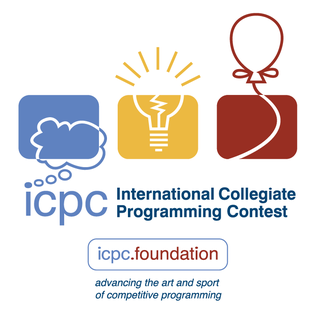
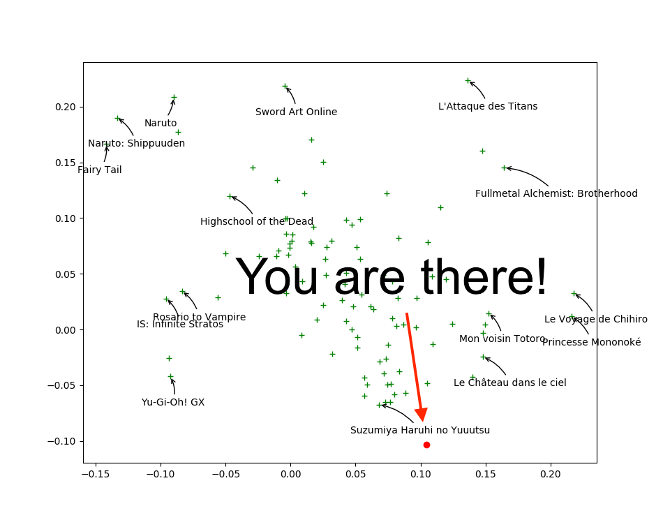
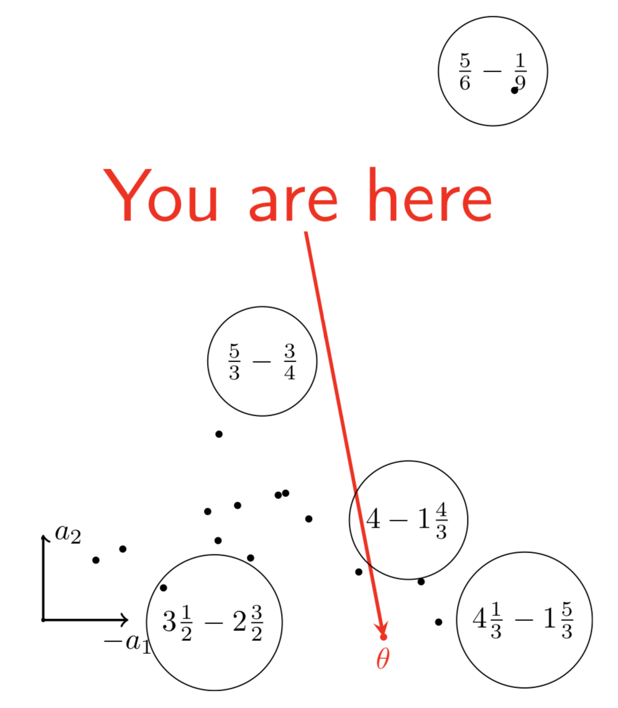

% Un système de recommandation de problèmes d'algo pour préparer Prologin et ICPC
% Jill-Jênn Vie; Anav Agrawal
% Finale Prologin 2025
---
institute: \includegraphics[height=1cm]{figures/inria.png}
aspectratio: 169
header-includes:
  - \usepackage{subfig}
  - \usepackage{booktabs}
---

# ICPC : International Collegiate Programming Contest (depuis 1977)

:::::: {.columns}
::: {.column width=50%}
\raggedleft
{height=3cm}
:::
::: {.column width=50%}
\raggedright
{height=3cm}
:::
::::::

C, C++, Python, Kotlin, Java \hfill $\uparrow$ Équipe Xeppelin, École polytechnique

Chaque établissement envoie jusqu'à 3 équipes de 3 personnes au SWERC.

:::::: {.columns}
::: {.column width=34%}
### SWERC (Eu. Sud-Ouest)

- 13 problèmes
- 5 heures par \alert{équipes} de 3 sur 1 clavier
- les 2 meilleures équipes sont qualifiées
:::
::: {.column width=33%}
### EUC (Europe)

- 11 problèmes
- 5 heures
- 8 équipes supplémentaires avancent en finale
:::
::: {.column width=33%}
### ICPC World Finals

- 11 problèmes
- 5 heures
- Accueille 1\% des 70000 participants du monde entier
:::
::::::

# Classement des équipes SWERC 2024

141 équipes de France, Italie, Suisse, Israël, Espagne, Portugal

\pause

Mon nom d'équipe préféré : "It's gonna be $O(k!)$"

# Quelques projets de l'institut de recherche Inria autour du logiciel

## Langage OCaml et preuves de programmes (Rocq, Why3)

## L'archive Software Heritage (cf. thèse d'Antoine Pietri)

Archive de tout le code public écrit par l'humanité (24B fichiers, 5B commits)  
Une base SQL (PostgreSQL) de quelques pétaoctets  
Un parcours en largeur de ce graphe peut coûter quelques milliers de dollars

## La bibliothèque d'IA scikit-learn

3 millions de téléchargements par jour !  
Maintenant une startup appelée `:probabl.`

# 

## Votre historique de soumissions de problèmes d'algo au cours du temps

\begin{tabular}{cccc}
  \toprule
  \textbf{Elo} & \textbf{Verdict} & \textbf{Nom} & \textbf{Tags} \\
  \midrule
  2300 & OK & \href{https://codeforces.com/problemset/problem/1942/E}{Farm Game} & combinatorics, games \\
  1900 & Trop lent & \href{https://codeforces.com/problemset/problem/1958/E}{Yet Another Permutation Constructive} & constructive \\
  1900 & OK & \href{https://codeforces.com/problemset/problem/1958/E}{Yet Another Permutation Constructive} & constructive \\
  2000 & Faux & \href{https://codeforces.com/problemset/problem/1958/F}{Narrow Paths} & combinatorics \\
  2000 & OK & \href{https://codeforces.com/problemset/problem/1958/F}{Narrow Paths} & combinatorics \\
  \bottomrule
\end{tabular}

## Base de problèmes Codeforces

\vspace{1mm}

\begin{tabular}{cll}
  \toprule
  \textbf{Elo} & \textbf{Nom} & \textbf{Tags} \\
  \midrule
  1700 & \href{https://codeforces.com/problemset/problem/1916/D}{Math Problem} & brute force, constructive, geometry, math \\
  1200 & \href{https://codeforces.com/problemset/problem/1916/C}{Training Before IOI} & constructive, games, greedy, implementation, math \\
  1000 & \href{https://codeforces.com/problemset/problem/1916/B}{Two Divisors} & constructive, math, number theory \\
  800 & \href{https://codeforces.com/problemset/problem/1916/A}{2023} & constructive, implementation, math, number theory \\
  1800 & \href{https://codeforces.com/problemset/problem/1915/G}{Bicycles} & graphs, greedy, implementation, shortest paths, sortings \\
  \bottomrule
\end{tabular}\bigskip

Sur Hugging Face : dataset de 18 millions d'essais de 15k utilisateurs sur 30k problèmes

# Comment les scores Elo sont-ils calculés ?

\centering

# Régression logistique pour apprendre les scores

\centering

\resizebox{0.9\linewidth}{!}{$\displaystyle \substack{\normalsize \Pr(\textnormal{"student A solves question B"})\\ \Pr(\textnormal{"player A beats player B"})\\ \Pr(\textnormal{"A is preferred to B"})} = \frac1{1 + \exp(-(score_A - score_B))}$}

\raggedright

Apprendre les scores à partir des données observées (tel utilisateur a réussi tel exercice)

\centering

{width=50%}

:::::: {.columns}
::: {.column width=55%}
Mise à jour : si $o \in \{0, 1\}$ est le vrai résultat (réussite ou échec) et $p$ était la probabilité :

$$score := score + \underbrace{(o - p)}_{\textnormal{positif ssi réussite }}$$

(descente de \alert{gradient}, i.e. dérivée de la proba)
:::
::: {.column width=45%}

:::
::::::

# IA : $K$ plus proches voisins

Une base de données : me renvoie les requêtes que je demande

Une IA : infère les points manquants par interpolation

\centering

{height=4cm}

\raggedright

Vector database : une structure de données pour calculer des $k$ plus proches voisins approchés efficacement ; basé sur des fonctions de hachage

Lorsque je fais une \alert{requête}, je veux avoir des \alert{documents} proches

# Des gens proches ont des comportements proches

\centering

:::::: {.columns}
::: {.column width=60%}

:::
::: {.column width=40%}

:::
::::::

# Parcourir les réponses possibles d'un modèle large de langue (LLM)

\centering

<!-- https://mitchgordon.me/ml/2022/07/01/retro-is-blazing.html -->

# 

LLM : la tâche est dans les données d'entrée

Machine de Turing : le programme est dans les données

Machine de Turing universelle : exécuter le $i$-ème programme

François Chollet (ex ENSTA, ex Google) dit ça beaucoup mieux :\bigskip

> My mental model for LLMs is that they work as a repository of vector programs. When prompted, they will fetch the program that your prompt maps to and "execute" it on the input at hand. LLMs are a way to store and operationalize millions of useful mini-programs via passive exposure to human-generated content.\medskip

> If a LLM is like a database of millions of vector programs, then a prompt is like a search query in that database [...] this “program database” is continuous and interpolative — it’s not a discrete set of programs.

\small

Sources: \url{https://arcprize.org/blog/oai-o3-pub-breakthrough}, \url{https://simonwillison.net/2023/Oct/25/francois-chollet/}

# Pour réduire les hallucinations : Retrieval-Augmented Generation (2020)

# Merci pour votre attention

jill-jenn.vie@inria.fr \hfill anav.agrawal@inria.fr

Installez le système de recommandation : \url{https://github.com/anavAgrawal/AlgoAce/}

Pour être au courant des tests, ou préparer ICPC, rejoignez notre Discord : 

\centering

