% Diversified recommendations of cultural activities with personalized determinantal point processes
% Carole Ibrahim; Hiba Bederina; Daniel Cuesta;\newline Laurent Montier; Cyrille Delabre; Jill-Jênn Vie
% April 15, 2025
---
aspectratio: 169
colorlinks: true
institute: \includegraphics[height=1.2cm]{figures/passculture.jpg} \quad \includegraphics[height=1.2cm]{figures/inria.png}
header-includes:
  - \def\E{\mathbb{E}}
  - \usepackage{booktabs}
  - \def\hfilll{\hspace{0pt plus 1 filll}}
---

# Most RecSys nowadays

Train on existing data

Select personalized top $K$ offers (according to relevance, click-through rate)

Show them to you

## Collaboration with Pass Culture \& Kyoto U

Encourage to discover new things

# Reward metric (key performance indicator) of Pass Culture

Diversification points obtained for each new category / subcategory / genre / location / type (a bit like set cover; achievement score); those are not visible to the user

# Existing algorithm

Among the million of offers, only 1500 are selected for ranking

Approximate nearest neighbor according to a query vector

- One model for retrieval (two-tower model $\sim$ neural collaborative filtering)
- Another one for ranking (LightGBM)

# 

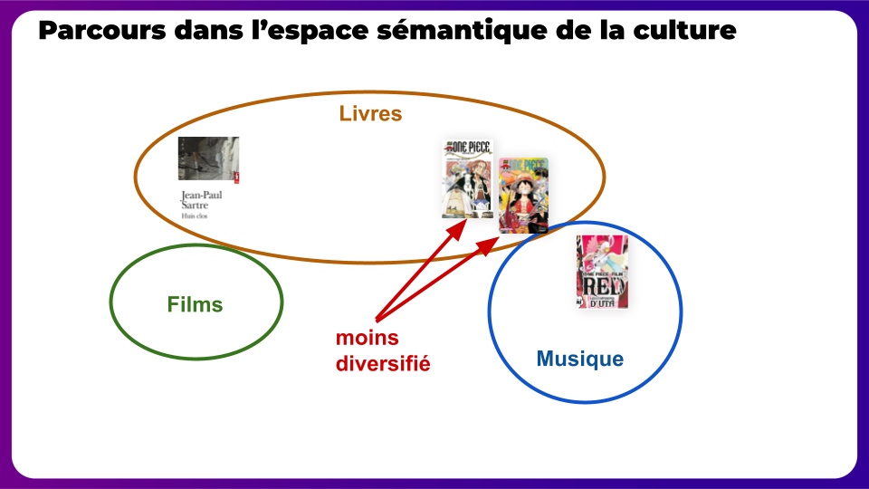

# 

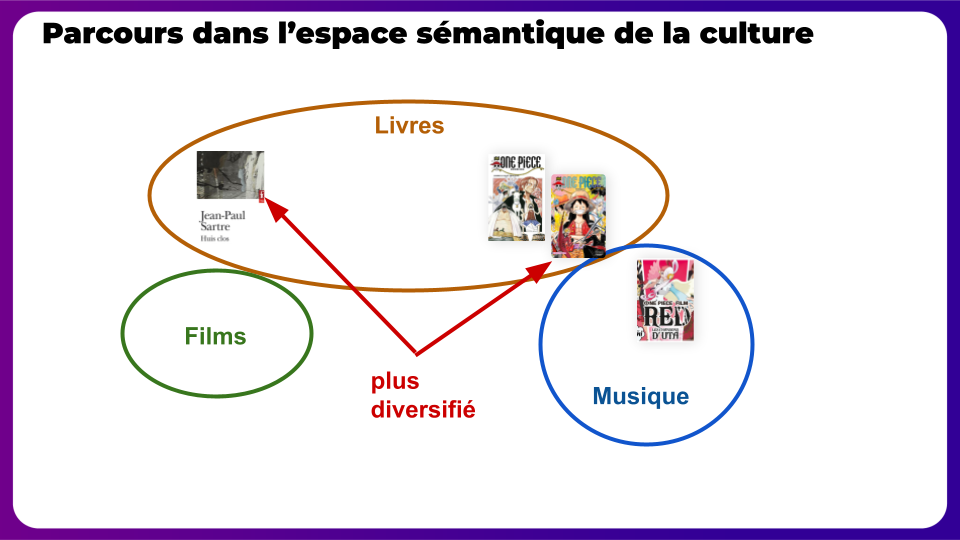

# 

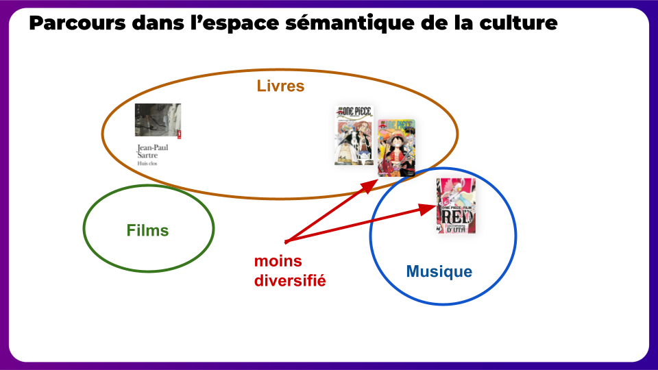

# Geometric modeling of diversity

\centering
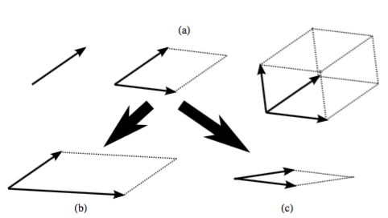{width=80%}

- Determinant = square of volume of parallelotope of vectors
- Vectors that are not correlated increase the volume
- We want to sample items proportionally to diversity

# 

\centering

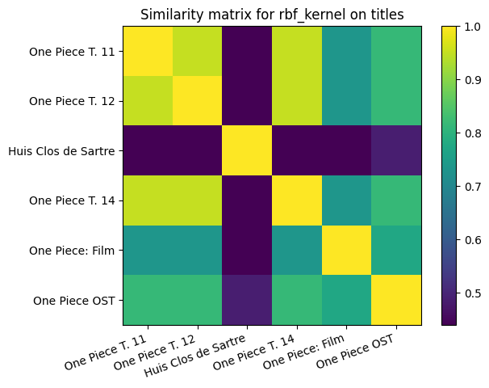

# Determinantal point process (DPP) sampling

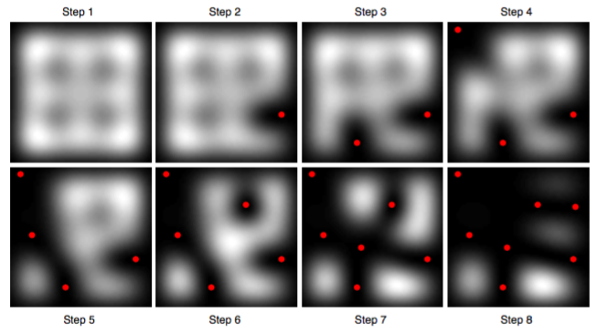\ 

# DPP

If we sample among $n$ items  
$K : n \times n$ \alert{similarity matrix} on items (positive semi-definite)

$P$ is a \alert{determinantal point process} if sample $Y$ verifies:
$$ \forall A \subset \{1, \ldots, n\}, \quad P(A \subseteq Y) \propto det(K_A) = Vol(\{x_i\}_{i \in A})^2 $$
where $K_A$ has subset $A$ of rows and columns.

There is a $O(nk^3)$ algorithm for sampling $k$ items among $n$, at the cost of knowing its eigenvalues in $O(n^3)$.

## Example

\begin{columns}
\begin{column}{0.5\textwidth}
\[ K = \left(\begin{array}{cccc}
1 & 2 & 3 & 4\\
2 & 5 & 6 & 7\\
3 & 6 & 8 & 9\\
4 & 7 & 9 & 1
\end{array}\right) \]
\end{column}
\begin{column}{0.5\textwidth}
$A = \{1, 2, 4\}$ will be included with probability proportional to
\[ K_A = det\left(\begin{array}{ccc}
1 & 2 & 4\\
2 & 5 & 7\\
4 & 7 & 1
\end{array}\right) \]
\end{column}
\end{columns}

# Quality-diversity decomposition

$K = X X^T$ and $K_{ij} = x_i^T x_j$ can be decomposed as $q_i \phi_i^T \phi_j q_j$ where $||\phi_i|| = 1$

- Decomposing into quality $q_i$ and diversity $\phi_i$ (semantic embedding)
- Then quality can be our relevance
- Diversity to select a diverse batch of recommendations

# Metrics

:::::: {.columns}
::: {.column width=50%}
1. Relevance

$$ q_i > 0 \quad \Pr(C = 1) \quad u^T v$$

2. Diversity inter-batch (history $H$ vs. $S$)

$$\min \sum K(H, S)$$

3. Diversity intra-batch ($S$ vs. $S$)

$$\max \det K(S, S)$$

Using DPP: sampling $S$ proportional to $\det K(S, S)$\bigskip
:::
::: {.column width=50%}
\centering

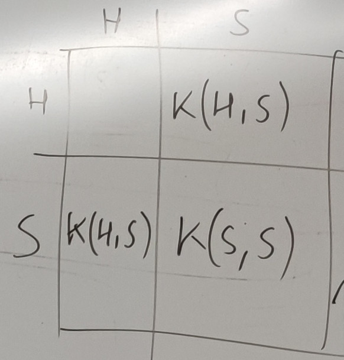{width=45%}

\raggedright

## Objectives 2 + 3 related to DPP

Sampling a set $A = H \cup S$ prop to $\det K(A, A)$ conditioned on the fact that it already contains $H$ (conditioned DPP)

## Reducing complexity is related to Nyström

Finding representative points $B$ that help predict the rest (i.e. covariance) on $A \setminus B$
:::
::::::

# Toy dataset to illustrate the importance of all metrics

\centering

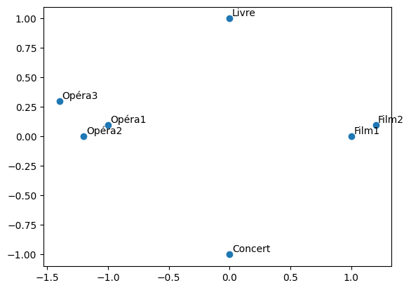

# Compromise quality-diversity

:::::: {.columns}
::: {.column width=50%}
## SVD top $K$

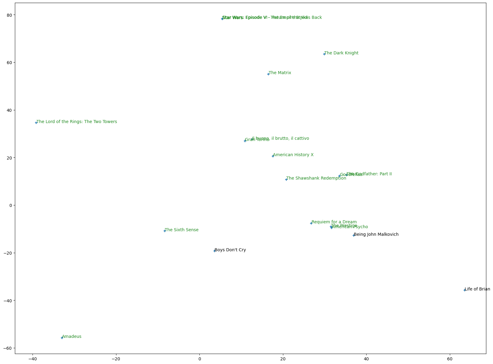
:::
::: {.column width=50%}
## $k$-DPP

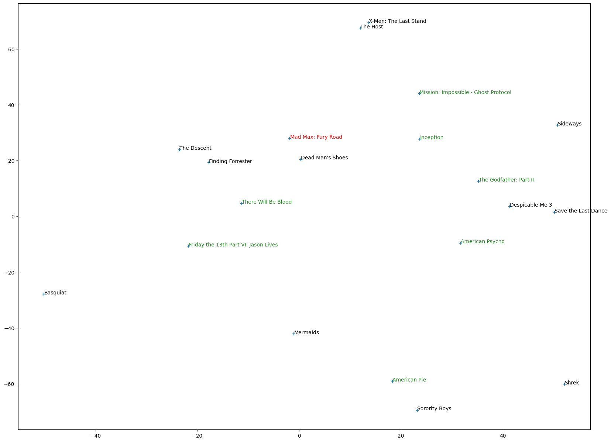
:::
::::::

# Compromise quality-diversity

:::::: {.columns}
::: {.column width=40%}
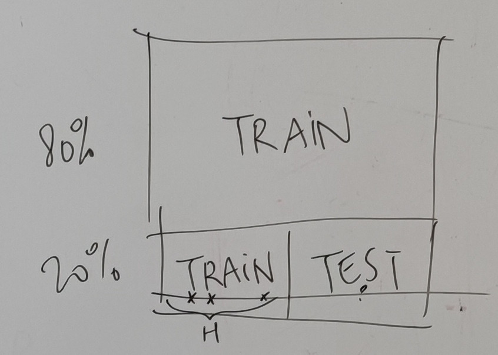

:::
::: {.column width=60%}

## Results

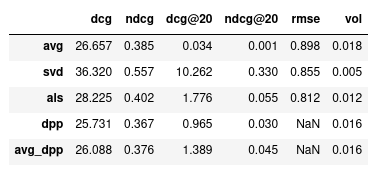

:::
::::::

SVD is very relevant (DCG@20 high) but not diverse (volume low)  

# Determinantal survey sampling

Actually during my PhD we used DPP to select a batch of diverse questions for assessing student level

DPP are implemented in Mangaki and in DPPy

Fancy applications like $O(\log N)$ with a binary search tree or $O(\alpha N)$ recommending without looking at all $N$ items.

\vfill

\footnotesize

\fullcite{Vie2018DPP}

\fullcite{Gautier2019}

\fullcite{gillenwater2019tree}

\fullcite{calandriello2020sampling}

# Approximate computation of DPP

Nyström or quadrature method: ${\displaystyle \int _{a}^{b}h(x)\; dx\approx \sum _{k=1}^{n}w_{k}h(x_{k})}$

Approximate Gram matrix $X X^T$ with a subset $X_S X_S^T$

Either select this subset $S$ greedily [@drineas2012fast] or sequentially \parencite{calandriello2016analysis}, recursively \parencite{musco2017recursive}, with divide and conquer \parencite{cherfaoui2022scalable}

Some people use Nyström to speed up DPP \parencite{affandi2013nystrom}

Some people use DPP to speed up Nyström \parencite{li2016fast}

Perhaps the "leverage score" for estimating the new information for a point is actually what we want to optimize: items that are not correlated with history

$$\ell_i = [K (K + \lambda I)^{-1}]_{ii} \quad \textnormal{(also takes $O(N^3)$ to compute)}$$

# Conditional DPP

\only<1>{\includegraphics{figures/dpp-cond1.png}}
\only<2>{\includegraphics{figures/dpp-cond2.png}}

# So

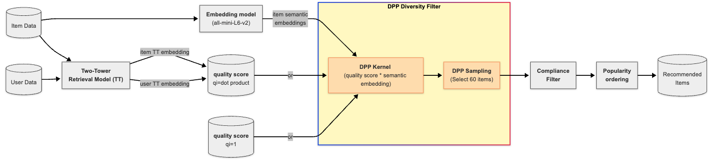

# Ongoing work

We[^1] are about to A/B test the DPP on 100k of users

Inria ethical committee (COERLE), etc.

\begin{table}
\begin{tabular}{ccrc} \toprule
& Relevance & Volume ratio & Diversification \\ \midrule
Model A & \textbf{0.525} & 1 & 2.759 \\
Model B & 0.399 & $\times$24.7 & \textbf{3.404} \\ 
Model C & 0.381 & $\times$\textbf{28.8} & \textbf{3.482} \\ \bottomrule
\end{tabular}
\caption{Offline results comparing baseline (A) vs DPP-based recommenders (B and C). Volume ratios use A as reference.}
\label{tab:offline_results}
\end{table} 

\begin{table}
\begin{tabular}{ccrc} \toprule
& Click rate & Volume ratio & Diversification\\ \midrule
Group A & \textbf{0.54\%} & 1  & 3.132 \\
Group B & 0.34\%* & $\times$12 & \textbf{3.512*} \\ 
Group C & 0.29\%* & $\times$\textbf{15.8}  & \textbf{3.590*} \\ \bottomrule
\end{tabular}
\caption{Online A/B/C test results. Values with * denote statistical significance ($p<0.001$) versus Group A.}
\label{tab:online_results}
\end{table}

[^1]: Hiba Bederina, Clémence Réda, Carole Ibrahim, Laurent Montier, Daniel Cuesta, JJV

# No need of a ***Thank you for your attention*** slide

Just stop your presentation here.

\vfill

My webpage: `jjv.ie` \hfill `jill-jenn.vie@inria.fr`  
(includes source of those slides \url{https://jjv.ie/slides/soda2025.pdf})
