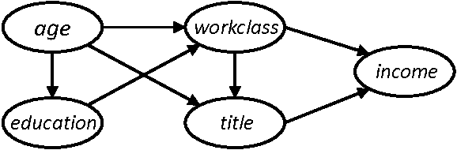

% Tabular deep learning:\newline missingness, uncertainty, foundation models
% [Jill-Jênn Vie](https://jjv.ie)
% March 3, 2025
---
aspectratio: 169
institute: Featuring many works from folks at Soda, Inria\newline \includegraphics[height=1cm]{figures/inria.png}
colorlinks: true
biblio-style: authoryear
---

# Tabular learning: most data is tabular

```python
!pip install pandas skrub
import pandas as pd
df = pd.read_csv('employees_salaries.csv')
from skrub import TableReport
TableReport(df).open()
```


Scikit-learn is downloaded 3M times per day. Pandas: 10M times per day.

# skrub's TableReport

## Like `df.info()` or `df.describe()`


# skrub's TableReport

## Histograms and most frequent values


# skrub's TableReport


# Example: electronic health records (EHR)


\fullcite{yin2019learning}

# Challenges of (tabular) data

- Continuous and categorical variables
- Missing data, measurements at irregular time intervals
- Human errors

\centering

{width=80%}

# 


# Outline today

The goal of this talk is to understand some characteristics of tabular data and some concepts related to the 2025 Nature article at the previous slide.

- Causality and missingness
- Human errors, "dirty categories"
- Training pipelines
- Bayesian learning
- Meta-learning, transfer learning, in-context learning (cf. foundation models, LLMs)
- TabPFN, a foundation model for tabular data

# Structural causal model (SCM)

\centering

{width=50%}

\raggedright

Conditional probability tables e.g. $\Pr(workclass = w \mid age = a, education = e)$

Can be used to generate synthetic datasets, e.g. sometimes ensuring privacy

\vfill

\fullcite{zhang2017privbayes}

# Causality vs. correlation

Observed data cannot discriminate between $A \to B$ or $B \to A$


Is it increasing elevation that reduces temperature? Or changing temperature that changes elevation?

\fullcite{goudet2019learning}

# Missing data pattern brings information about dataset

\centering

:::::: {.columns}
::: {.column width=70%}


:::
::: {.column width=30%}
\small

\vspace{5mm}

\fullcite{agarwal2023causal}

\vspace{2cm}

\fullcite{enders2022applied}
:::
::::::

# Missing data theorems

Any impute will do as long as you have enough data (because it does not add information)

More efficient impute will provide better results (smoother curve to learn)

\vfill

\fullcite{lemorvan2025}

# Two schools of human errors

:::::: {.columns}
::: {.column}
## pip install cleanlab

"6\% of ImageNet test labels are wrong"

Clean your dataset before you train your algorithm\bigskip

\url{https://github.com/cleanlab/cleanlab}

\vspace{1cm}

\fullcite{northcutt2021labelerrors}
:::
::: {.column}
## dirty_cat $\to$ pip install skrub

Learn with mistakes ("dirty categories")

\bigskip

\url{https://skrub-data.org}

\vspace{5mm}

\fullcite{cerda2020encoding}
:::
::::::

# Scikit-learn's pipelines (some of them directly generated by skrub)

```python
model = Pipeline([
    ('onehot', OneHotEncoder(handle_unknown='ignore')),
    ('lr', LogisticRegression(solver='liblinear', C=1e-1, max_iter=300))
])
```


# Hyperparameter search using cross validation

\centering

{width=60%}

\raggedright

Source: \url{https://scikit-learn.org/stable/modules/cross_validation.html}

# Scikit-learn's cross validation

Cross validation of a `model` defined by a pipeline

```python
cv_results = cross_validate(
    model, X, y,
    scoring=['accuracy_score', 'roc_auc_score'],  # Use all scores
    return_train_score=True, n_jobs=-1,  # Use all cores (parallel)
    cv=5, verbose=10
)
```

Check the docs: \url{https://scikit-learn.org/stable/modules/cross_validation.html#the-cross-validate-function-and-multiple-metric-evaluation}

# Decision trees

\centering


# Ensemble models

Bagging: reduce variance by averaging; mixture of experts

e.g. random forests

Boosting: reduce bias by increasing the complexity of model and fitting the error

e.g. gradient boosting decision trees (CatBoost, XGBoost)

# Tree-based models outperform deep neural networks (Grinsztajn et al. 2022)


# Findings of tree-based vs. DNNs paper

Tree-based models remain SOTA on medium-sized data (10k samples)

Trees are:

- robust to uninformative features
- can learn irregular functions (because nonparametric?)

DNNs are:

- rotational invariant (but tabular data is not)
- biased to overly smooth solutions

\vfill

\fullcite{grinsztajn2022tree}

# So-called "numerical embeddings" compensate difference trees/DL

:::::: {.columns}
::: {.column}


:::
::: {.column}

:::
::::::

\fullcite{gorishniy2022embeddings}

# Foundation models

"One pre-trained model to rule them all"

Generalize pretraining to new tasks

\vfill

\fullcite{brown2020language}

\fullcite{ouyang2022training}

# Example: Large Language Models (LLM)

1. Generative pretraining using a transformer to predict the next word

```
Transformers / are / a / new / machine / [learning]
Transformers / are / a / new / machine / learning / [architecture]
```

2. Supervised finetuning: expert demonstration data

```
Query: put the first letters in uppercase in "optimizing human learning"
Answer: Optimizing Human Learning
```

3. Reinforcement learning using human feedback: expert comparison data

```
Query: write a poem
Answer 1: Roses are red
Answer 2: Once upon a time, a prince in a castle
```

Where Answer 2 is favorably voted by experts

ChatGPT is therefore trained to optimize user preference and generalize to new tasks

# In-context learning

Normal ML: fit(train), predict(test)

Transfer learning: pretrain, finetune(train), predict(test) \hfill (e.g. word embeddings)

In-context learning: pretrain (LLM), predict(test, train)

# Bayesian learning

Instead of learning parameters $\theta$

Update a distribution over parameters $p(\theta \mid D)$

For example, $\theta_1, \ldots \theta_S \sim p(\theta \mid D)$

Then $\mathbb{E}_\theta f_\theta(x) = \displaystyle \int_\theta f_\theta(x) d\theta \simeq \frac1S \sum_{i = 1}^S f_\theta(x)$

"Advantage": reduce the number of hyperparameters (if we have a good prior)

\hfill Answer from students  
Can you name any Bayesian models? \hfill "Naive Bayes"  
Are LLMs Bayesian? \hfill "No"  
Do you know Bayesian deep learning models? \hfill "Variational autoencoders"

# Bayesian neural networks (BNNs)

:::::: {.columns}
::: {.column width=25%}

:::
::: {.column width=75%}
\centering

\bigskip

Source: `zhusuan.readthedocs.io`
:::
::::::


Snapshot ensembles: keeping last $T$ trained weights simulates a distribution over weights, which can give a distribution over outputs, and regularizes the model  
(see also "stochastic weight averaging")

# TabPFN is pretrained on 1 million synthetic datasets

\centering

{width=70%}

\raggedright

- Pretrain a foundation model to "train and test" (very meta)
- Directly estimate $p(y_{test} \mid x_{test}, D_{train})$ using in-context learning
- It becomes a strong baseline, see also results in the Nature paper
- Limitations: up to 10000 samples, TabPFN v1 (2023) does not consider missing data, TabPFN v2 (2025) version considers only MCAR data and is not open source.

\small

\fullcite{hollmann2022,hollmann2025}

# Questions from students

Q: The TabPFN paper says "up to 10000 samples", how to make it scalable?

A: Use numerical embeddings. This is the approach proposed by Yandex Research's \cite{gorishniy2022embeddings}, see their [code](https://github.com/yandex-research/rtdl-num-embeddings) and [blog post](https://research.yandex.com/blog/embeddings-for-numerical-features-in-tabular-deep-learning). See other methods like TabM or TabICL.

\vfill

Q: Can you please give more details about the TabPFN architecture?

A: Sorry, I didn't look at [TabPFN code](https://github.com/PriorLabs/TabPFN) yet (the 2023 paper has no detail but code, the 2025 has details but not all code). To have an intuition, check the [causal matrix completion paper](https://arxiv.org/pdf/2109.15154) and slides. Attention mechanism is a bit like "finding in the training set the nearest neighbors of the test data" (in the paper they also make an analogy with Gaussian processes).

# Take home message

\centering

{width=60%}

\raggedright

TabPFN gets inspiration from transformers/LLMs but also from old techniques like structural causal models (SCMs), while tabular data is encoded as tokens; promising directions for interpretability (see [Explaining TabPFN](https://shapiq.readthedocs.io/en/latest/notebooks/tabular_notebooks/explaining_tabpfn.html) by shapiq)

Please use TableReport from `pip install skrub`
