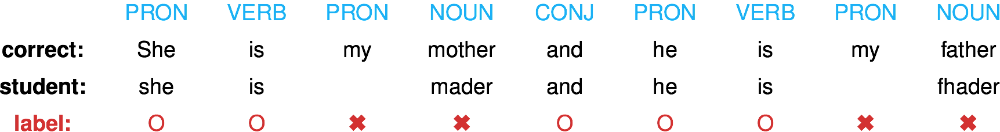

% Modeling uncertainty for policy learning in education
% Jill-Jênn Vie¹; Tomas Rigaux¹; Koh Takeuchi²; Hisashi Kashima²
% ¹ Inria Saclay, SODA team\newline ² Kyoto University
---
aspectratio: 169
handout: false
institute: \hfill \includegraphics[height=1cm]{figures/inria.png} \includegraphics[height=1cm]{figures/kyoto.png}
section-titles: false
theme: metropolis
header-includes:
    - \usepackage{bm}
    - \usepackage{multicol,booktabs}
    - \usepackage{algorithm,algpseudocode,algorithmicx}
    - \DeclareMathOperator\argmax{argmax}
    - \DeclareMathOperator\logit{logit}
    - \def\bm{\boldsymbol}
    - \def\u{\bm{u}}
    - \def\v{\bm{{v}}}
    - \def\X{\bm{X}}
    - \def\x{\bm{x}}
    - \def\y{\bm{y}}
    - \def\E{\mathbb{E}}
    - \def\F{\mathcal{F}}
    - \def\I{\mathcal{I}}
    - \def\N{\mathcal{N}}
    - \def\Lb{\mathcal{L}_B}
    - \def\KL{\textnormal{KL}}
    - \metroset{sectionpage=none}
---

# About me

## Hi, I'm JJ \hfill \only<2-3>{Jill = \includegraphics{jill} $\neq$ Giroud}

Positive prompts: \includegraphics{anime} \hfill Negative prompts: world cup, world history

\centering
\pause
\pause

{width=50%}

## Policy learning

Psychometrics (50s-60s): measuring \alert{latent constructs $\theta$} of examinees  
given their \alert{observed answers $X$} to a questionnaire  
Led to computerized adaptive tests (70s)

\centering

:::::: {.columns}
::: {.column}
\raggedleft

:::
::: {.column}
{width=60%}
:::
::::::

- Learner $p(X|\theta)$
- Teacher $\pi(j|X)$ based on estimate $q(\theta|X)$

$X = \{(\underbrace{j_t}_{\in \{1, \ldots, M\}}, \underbrace{r_{ij_t}}_{\in \{0, 1\}})\}_t$

## Example for $\theta \in \mathbb{R}$

\centering


## Example for $\theta \in \mathbb{R}^2$: prior

\centering


## Example for $\theta \in \mathbb{R}^2$: prior and posterior

\centering


## Cross-validation of policies

\centering


Green: interactive training set \hfill Red: validation set

## Goals

### Previous work

- PhD: assume $\theta$ does not evolve over time and learn good $\pi$
- Applied it to Pix.fr French certification of digital competencies  
(now in the French Code of Education; passed by 6M active users)  
Pix is free software: <https://github.com/1024pix/pix>
- Postdoc: assume $\theta$ can evolve and build better model $p(X|\theta)$

### Ongoing work

- If data $X$ was collected by $\pi$ how to evaluate $\pi'$?
- Measuring the treatment effect whether question $j$ was asked or not

## Graphical models for knowledge tracing

\centering

{width=90%}

:::::: {.columns}
::: {.column width="15%"}
:::
::: {.column width="15%"}

:::
::: {.column width="70%"}
$$p(x_{1:N}, z_{1:N}) = p(z_1) \prod_{n = 2}^N p(z_n|z_{n - 1}) \prod_{n = 1}^N p(x_n|z_n)$$

$$p(V) = \prod_{v \in V} p(v|\textnormal{parents}(v))$$
:::
::::::

## Graphical models for knowledge tracing

\centering

{width=90%}

\raggedright

Modeling learning using HMM

or LSTM: $\hat\theta = f_\psi(X_{1:t}) = f_\psi\left(\left\{(j_t, r_{ij_t})\right\}_t\right)$   
i.e. deep knowledge tracing (Piech et al., NeurIPS 2015)

## Rewards

### Pure exploitation (of information) if no prior

We want to maximize (log) likelihood: $\argmax_\theta \log p(X|\theta)$ or $\E_{p(\theta)} LL(X|\theta)$  
i.e. find its zeroes or go in the direction of gradient $\nabla_\theta LL$

Property: $\E_{p(X|\theta)} \nabla_\theta LL = 0$ at the true $\theta$ parameter

If $Var_{p(X|\theta)}(\nabla_\theta LL)$ is low, the observation brings few information

$$\I(\theta) = Var_{p(X|\theta)} (\nabla_\theta LL) = -E_{p(X|\theta)} \nabla^2_\theta LL$$

Interesting because (Cramér-Rao bound): $Var(\hat\theta) \geq \I(\theta)^{-1}$

Another index for choosing a question (Chang and Ying, 1996):

$$KLI(\theta) = \int_{B(\theta, r_n)} KL_{X}(\theta_0||\theta) d\theta_0 = \int_{B(\theta, r_n)} \E_{p(X|\theta_0)} \log \frac{p(X|\theta_0)}{p(X|\theta)} \quad r_n \to 0$$

## Pure exploitation: a toy example

Taking the simple model $p_j \triangleq p(X_j=1|\theta) = \sigma(\theta - d_j)$

$\nabla_\theta LL = X_j - p_j$

$\I(\theta) = -\E_{p(X|\theta)} \nabla^2_\theta LL = p_j (1 - p_j)$

So in the scalar case, the item of maximum Fisher information is the one of probability \alert{closest to 1/2}, given the current maximum likelihood estimate.

## Rewards

\alert{Maximize information} $\to$ learners fail 50% of the time (good for the examiner, not for the learners)

\alert{Minimize uncertainty} i.e. the entropy of $p(\theta|X)$

\alert{Maximize success rate} $\to$ we ask too easy questions

\alert{Maximize the growth of success rate} $\to$ Clement et al. (JEDM 2015) they use $\varepsilon$-greedy where the reward is: success rate over $k$ latest attempts minus success rate over the $k$ previous attempts.

What we are interested in: measuring precisely the knowledge of student without making them fail too much.

# Introduction

## Outline

### Preference elicitation

- Getting new info from new users is hard
- We need \alert{side information} and to \alert{model uncertainty}

### Factorization Machines (FMs)

- FMs are a generalization of latent factor models (Rendle, 2012)
- Used for both regression and classification
- Sometimes better than their deep counterparts

### In this paper

- Variational Factorization Machines
- Variational: Bayesian inference $\to$ optimization

# Recommender Systems

## Recommender Systems as Matrix Completion

### Problem

- Every user rates few items (1 %)
- How to infer missing ratings?

### Example

\centering
\begin{tabular}{ccccc}
& \includegraphics[height=2.5cm]{figures/1.jpg} & \includegraphics[height=2.5cm]{figures/2.jpg} & \includegraphics[height=2.5cm]{figures/3.jpg} & \includegraphics[height=2.5cm]{figures/4.jpg}\\
Satoshi & ? & 5 & 2 & ?\\
Kasumi & 4 & 1 & ? & 5\\
Takeshi & 3 & 3 & 1 & 4\\
Joy & 5 & ? & 2 & ?
\end{tabular}

## Recommender Systems as Matrix Completion

### Problem

- Every user rates few items (1 %)
- How to infer missing ratings?

### Example

\centering
\begin{tabular}{ccccc}
& \includegraphics[height=2.5cm]{figures/1.jpg} & \includegraphics[height=2.5cm]{figures/2.jpg} & \includegraphics[height=2.5cm]{figures/3.jpg} & \includegraphics[height=2.5cm]{figures/4.jpg}\\
Satoshi & \alert{3} & 5 & 2 & \alert{2}\\
Kasumi & 4 & 1 & \alert{4} & 5\\
Takeshi & 3 & 3 & 1 & 4\\
Joy & 5 & \alert{2} & 2 & \alert{5}
\end{tabular}

## Preference Elicitation: select an informative batch of $K$ items

\centering

{width=90%}

## Preference Elicitation: learn user embeddings in latent space

\centering

\includegraphics{figures/svd2.png}

## Matrix factorization for collaborative filtering

Approximate $R$ ratings $n \times m$ by learning embeddings for user and item

$$ \left.\begin{array}{r}
U \textnormal{ user embeddings } n \times d\\
V \textnormal{ item embeddings } m \times d
\end{array}\right\} \textnormal{ such that } R \simeq \alert{UV^T} $$

\begin{block}{Fit}
Learn $U$ and $V$ to \alert{minimize} $ {||R - UV^T||}_2^2 + \lambda \cdot \textnormal{regularization} $
\end{block}

\begin{block}{Predict: Will user $i$ like item $j$?}
Just compute $\langle \u_i, \v_j \rangle$
\end{block}

The actual model also contains bias terms for user $i$ and item $j$

$$r_{ij} = \mu + \alert{w^u_i + w^v_j} + \langle \u_i, \v_j \rangle$$

## How to model side information?

If you know user $i$ watched item $j$ at the \alert{cinema} (or on TV, or on smartphone), how to model it?

$r_{ij}$: rating of user $i$ on item $j$

### Collaborative filtering

$$ r_{ij} = w_{\textnormal{user } i} + w_{\textnormal{item } j} + \langle \bm{v}_{\textnormal{user $i$}}, \bm{v}_{\textnormal{item $j$}} \rangle $$

\pause

### With side information

$$ r_{ij} = w_{\textnormal{user } i} + w_{\textnormal{item } j} + \alert{w_{cinema}} + \langle \bm{v}_{\textnormal{user $i$}}, \bm{v}_{\textnormal{item $j$}} \rangle + \langle \bm{v}_{\textnormal{user $i$}}, \alert{\bm{v}_{\textnormal{cinema}}} \rangle + \langle \bm{v}_{\textnormal{item $j$}}, \alert{\bm{v}_{\textnormal{cinema}}} \rangle $$

## Encoding the problem using sparse features

\centering
\begin{tabular}{rrr|rrrr|rrr}
\toprule
\multicolumn{3}{c}{Users} & \multicolumn{4}{c}{Items} & \multicolumn{3}{c}{Formats}\\
\cmidrule{1-3} \cmidrule{4-6} \cmidrule{7-10}
 $U_1$ &  $U_2$ &  $U_3$ &  $I_1$ &  $I_2$ &  $I_3$ &  $I_4$ &  cinema &  TV & mobile \\
\midrule
 0 &  \alert1 &  0 &  0 &  \alert1 &  0 &  0 &  0 &  \alert1 & 0 \\
 0 &  0 &  \alert1 &  0 &  0 &  \alert1 &  0 &  0 &  \alert1 & 0 \\
 0 &  \alert1 &  0 &  0 &  0 &  \alert1 &  0 &  \alert1 &  0 & 0 \\
 0 &  \alert1 &  0 &  0 &  \alert1 &  0 &  0 &  \alert1 &  0 & 0 \\
 \alert1 &  0 &  0 &  0 &  0 &  0 &  \alert1 &  0 &  \alert1 & 0 \\
\bottomrule
\end{tabular}

## Graphically: factorization machines

\centering


## Formally: factorization machines

Learn bias \alert{$w_k$} and embedding \alert{$\bm{v_k}$} for each feature $k$ such that:
$$ y(\bm{x}) = \mu + \underbrace{\sum_{k = 1}^K \alert{w_k} x_k}_{\textnormal{linear regression}} + \underbrace{\sum_{1 \leq k < l \leq K} x_k x_l \langle \alert{\bm{v_k}}, \alert{\bm{v_l}} \rangle}_{\textnormal{pairwise interactions}} $$

This model is for regression  
If classification, use a link function like softmax/sigmoid or Gaussian CDF

\small
\fullcite{rendle2012factorization}

<!-- ## Duolingo




\fullcite{Settles2018}

-->

## Training using, for example, SGD

Take a batch $(\X_B, y_B)$ and update the parameters such that the error is minimized.

- Loss in classification: cross-entropy
- Loss in regression: squared error

\begin{algorithm}[H]
\begin{algorithmic}
\For {batch $\bm{X}_B, y_B$}
    \For {$k$ feature involved in this batch $\bm{X}_B$}
        \State Update $w_k, \bm{v}_k$ to decrease loss estimate $\mathcal{L}$ on $\bm{X}_B$
    \EndFor
\EndFor
\end{algorithmic}
\caption{SGD}
\label{algo-vfm}
\end{algorithm}

# Bayesian variational inference

## Why do we prefer distributions over point estimates?

- Because we can measure \alert{uncertainty}
- More robust for critical applications
- Can guide sequential estimation (preference elicitation)

## Variational inference

\only<1>{Approximate true posterior with an easier distribution (Gaussian)} 

\only<2>{\begin{align*}
\textnormal{Priors } p(w_k) = \N(\nu^w_{g(k)}, 1/\lambda^w_{g(k)}) \qquad p(v_{kf}) = \N(\nu^{v,f}_{g(k)}, 1/\lambda^{v,f}_{g(k)})\\
\textnormal{Approx. posteriors } q(w_k) = \N(\mu^w_k, (\sigma^w_k)^2) \qquad q(v_{kf}) = \N(\mu^{v,f}_k, (\sigma^{v,f}_k)^2)
\end{align*}}

Idea: increase the ELBO $\Rightarrow$ increase the objective

\begin{align*}
\log p(\y) & \geq \sum_{i = 1}^N \underbrace{\E_{q(\theta)} [\log p(y_i|x_i,\theta)] - \KL(q(\theta)||p(\theta))}_{\textrm{Evidence Lower Bound (ELBO) }}\\
& \quad = \sum_{i = 1}^N \E_{q(\theta)} [ \log p(y_i|x_i,\theta) ] - \KL(q(w_0)||p(w_0)) - \sum_{k = 1}^K \KL(q(\theta_k)||p(\theta_k))
\end{align*}

Needs to be rescaled for mini-batching (see in [the paper](https://jiji.cat/bigdata/vie2022vfm.pdf))

## Graphically: Variational Factorization Machines

\centering


## VFM training

\begin{algorithm}[H]
\begin{algorithmic}
\For {each batch $B \subseteq \{1, \ldots, N\}$}
    \State Sample $w_0 \sim q(w_0)$
    \For {$k \in F(B)$ feature involved in batch $B$}
        \State Sample $S$ times $w_k \sim q(w_k)$, $\bm{v}_k \sim q(\bm{v}_k)$
    \EndFor
    \For {$k \in F(B)$ feature involved in batch $B$}
        \State Update parameters $\mu_k^w, \sigma_k^w, \bm{\mu}_k^v, \bm{\sigma}_k^v$ to increase ELBO estimate
    \EndFor
    \State Update hyper-parameters $\mu_0, \sigma_0, \nu, \lambda, \alpha$
    \State Keep a moving average of the parameters to compute mean predictions
\EndFor
\end{algorithmic}
\caption{Variational Training (SGVB) of FMs}
\label{algo-vfm}
\end{algorithm}
\vspace{-5mm}
Then $\sigma$ can be reused for preference elicitation (see how in the paper)

## Stochastic weight averaging

A beneficial regularization: keep all weights over training epochs and average them.

Connections to Polyak-Ruppert averaging, aka stochastic weight averaging

## Experiments on real data

\centering
\begin{tabular}{llrrrr}
\toprule
Task & Dataset &  \#users &  \#items &  \#entries & Sparsity \\
\midrule
%fraction  &     536 &      20 &     10720 &    0.000 \\
%duolingo  &    1213 &    2417 &   1064228 &    0.637 \\ \midrule
Regression & movie100k &     944 &    1683 &    100000 &    0.937 \\
           & movie1M   &    6041 &    3707 &   1000209 &    0.955 \\
%           & movie10M  &   69879 &   10678 &  10000054 &    0.987 \\
\midrule
Classification & movie100   &     100 &     100 &      10000 &    0 \\
 & movie100k &     944 &    1683 &    100000 &    0.937 \\
           & movie1M   &    6041 &    3707 &   1000209 &    0.955 \\
    & Duolingo & 1213 & 2416 & 1199732 & 0.828\\
\bottomrule
\vspace{-5pt}
\end{tabular}

### Models

- The proposed approach VFM
- libFM MCMC implementation
- We found another preprint VBFM \cite{Saha2018} only for regression

## Results on regression

:::::: {.columns}
::: {.column}
\vspace{1cm}
\centering
\begin{tabular}{ccc}
\toprule
RMSE & Movie100k & Movie1M \\
\midrule
MCMC & \textbf{0.906} & \textbf{0.840} \\
\textbf{VFM} & \textbf{0.906} & 0.854 \\
VBFM & 0.907 & 0.856 \\
OVBFM & 0.912 & 0.846 \\
\bottomrule
\end{tabular}

\vspace{2cm}
\footnotetext{OVBFM is online (batch size = 1) of VBFM}
:::
::: {.column}

:::
::::::

## Results on classification

:::::: {.columns}
::: {.column}
\vspace{1cm}
\centering

| ACC  | Movie100k | Movie1M   | Duolingo  |
|:----:|:---------:|:---------:|:---------:|
| MCMC | 0.717     | 0.739     | **0.848** |
| **VFM**  | **0.722** | **0.746** | 0.846     |
| VBFM | 0.692     | 0.732     | 0.842     |

\vspace{1cm}
\footnotetext{In the paper, we also report AUC and mean average precision.}

:::
::: {.column}

:::
::::::

# Conclusion

## Conclusion

- FMs are a strong baseline
- In this paper we present a variational approach for learning them
    - so that we can deal with u n c e r t a i n t y
- Our method is batched so suitable for large-scale datasets
- We have better performance on some (not all) classification datasets; perhaps due to Adam optimizer or stochastic weight averaging (beneficial regularization)

## Thanks for listening!

:::::: {.columns}
::: {.column}
VFM is implemented in TF & PyTorch\bigskip

$\E_{q(\theta)} [\log p(y_i|\bm{x}_i,\theta)]$ becomes

```python
outputs.log_prob(observed).mean()
```

Same implementation for classification and regression: the only difference in the distribution (Bernoulli vs. Gaussian)

\vspace{1cm}

Feel free to try it on GitHub (`vfm.py`):

[github.com/jilljenn/vae](https://github.com/jilljenn/vae)
:::
::: {.column}


See more benchmarks on \href{https://github.com/mangaki/zero}{github.com/mangaki/zero}
:::
::::::
