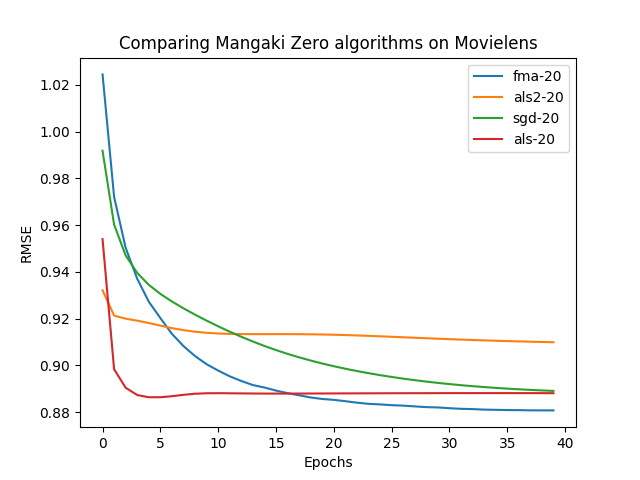
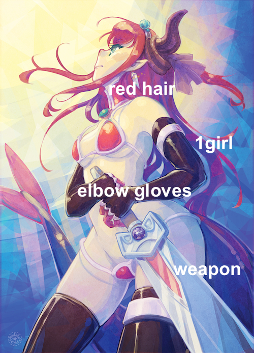

% Variational factorization machines applied to anime/manga recommendations\newline and preference elicitation
% Jill-Jênn Vie¹ \and Hisashi Kashima¹²
% ¹ RIKEN Center for AIP, Tokyo\newline ² Kyoto University
---
handout: true
theme: Frankfurt
section-titles: false
header-includes:
    - \usepackage{bm}
    - \usepackage{multicol,booktabs}
    - \usepackage{algorithm,algpseudocode}
    - \DeclareMathOperator\logit{logit}
    - \def\Lb{\mathcal{L}_b}
    - \def\ReLU{\textnormal{ReLU}}
---

# Introduction

## About France

\includegraphics[width=\linewidth]{figures/france7.jpg}

## Outline

### Anime/Manga Recommendations (regression)

- Modeling pairwise interactions for collaborative filtering
- ALS-WR: Alternating Least Squares (Zhou et al., 2008)
- Using side information (posters) (V et al., 2017)

### Knowledge Tracing (binary classification)

- Modeling side information
- Item Response Theory (1985)
- Factorization Machines (Rendle, 2012)
- Deep FMs (Guo et al., 2017)

### Variational Training of Factorization Machines

- Bayesian FMs
- Variational: inference $\rightarrow$ optimization

# Recommender Systems

## Recommender Systems

### Problem

- Every user rates few items (1 %)
- How to infer missing ratings?

### Example

\begin{tabular}{ccccc}
& \includegraphics[height=2.5cm]{figures/1.jpg} & \includegraphics[height=2.5cm]{figures/2.jpg} & \includegraphics[height=2.5cm]{figures/3.jpg} & \includegraphics[height=2.5cm]{figures/4.jpg}\\
Satoshi & ? & 5 & 2 & ?\\
Kasumi & 4 & 1 & ? & 5\\
Takeshi & 3 & 3 & 1 & 4\\
Joy & 5 & ? & 2 & ?
\end{tabular}

## Recommender Systems

### Problem

- Every user rates few items (1 %)
- How to infer missing ratings?

### Example

\begin{tabular}{ccccc}
& \includegraphics[height=2.5cm]{figures/1.jpg} & \includegraphics[height=2.5cm]{figures/2.jpg} & \includegraphics[height=2.5cm]{figures/3.jpg} & \includegraphics[height=2.5cm]{figures/4.jpg}\\
Satoshi & \alert{3} & 5 & 2 & \alert{2}\\
Kasumi & 4 & 1 & \alert{4} & 5\\
Takeshi & 3 & 3 & 1 & 4\\
Joy & 5 & \alert{2} & 2 & \alert{5}
\end{tabular}

## Rate anime

\ 

## Build a profile

\ 

## Find recommendations

\ 

## Mangaki data

\ 

- 360000 ratings from 2400 users over 17000 items
- Python / Django $\rightarrow$ open source on GitHub
- Got a prize from Japan Foundation

## Modeling the problem

### Fit on existing ratings

\begin{center}
\begin{tabular}{ccc} \toprule
Kasumi & \alert{like} & \emph{Zootopia}\\
Kasumi & \alert{favorite} & \emph{Porco Rosso}\\
Satoshi & \alert{favorite} & \emph{Tokikake}\\
Satoshi & \alert{dislike} & \emph{The Martian}\\ \bottomrule
\end{tabular}
\end{center}

### Predict new user-item pairs

\begin{center}
\begin{tabular}{ccc} \toprule
Kasumi & \alert{\only<1>{?}\only<2>{favorite}} & \emph{The Martian}\\
Satoshi & \alert{\only<1>{?}\only<2>{like}} & \emph{Zootopia}\\  \bottomrule
\end{tabular}
\end{center}

## Graphically

\includegraphics{figures/svd2black.jpg}

## A popular model for collaborative filtering

Approximate $R$ ratings $n \times m$

- \alert{$U$} user vectors $n \times d$
- \alert{$V$} item vectors $m \times d$.

$$ R \simeq \alert{UV^T} $$

\begin{block}{Fit}
Learn $U$ and $V$ to \alert{minimize} $ {||R - UV^T||}_2^2 + \lambda \cdot \textnormal{regularization} $
\end{block}

\pause

\begin{block}{Predict: Will user Satoshi like item Naruto?}
Just compute $\alert{U_\textnormal{Satoshi}} \cdot \alert{V_\textnormal{Naruto}}$ and you will know!
\end{block}

## Alternating Least Squares (Zhou et al., 2008)

\begin{algorithm}[H]
Initialize randomly $U$ and $V$
\begin{algorithmic}
\Repeat
    \State Fix users $U$ learn items $V$ to minimize error + reg 
    \State Fix items $V$ learn users $U$
\Until {convergence}
\end{algorithmic}
\caption{Alternating Least Squares with Weighted Regularization}
\label{als-wr}
\end{algorithm}

\fullcite{zhou2008large}

## Graphically running ALS-WR (orange: users, blue: items)

\includegraphics{figures/embed38.pdf}

## Our implementations are on \url{github.com/mangaki/zero}

\centering
{width=80%}\ 

\pause

\alert{N. B.} -- FMA does not mean Fullmetal Alchemist  
FMA means Factorization Machine

## Drawback with collaborative filtering: Cold-Start

If no ratings are available for a work $j$  
$\Rightarrow$ Its vector $W_j$ cannot be learned :-(

$\Rightarrow$ No way to distinguish between unrated works.

## But we have (many) posters!

## Illustration2Vec (Saito and Matsui, 2015)

\centering

{height=70%}\ 
{height=70%}\ 

- CNN (VGG-16) pretrained on ImageNet (photos)
- Retrained on Danbooru (1.5M manga illustrations with tags)
- 502 most frequent tags kept, outputs \alert{tag weights}

## Blended Alternate Least Squares with Explanation

\includegraphics{figures/archifinal.pdf}

## Published in MANPU workshop in ICDAR 2017

From the reviewers: \bigskip

\pause

> Two models individually are existing methods, but this work presents a novel fusion method called \alert{Steins gate} to integrate results given by two models.

\fullcite{BALSE2017}

# FMs for Item Response Theory

## A new problem setting: knowledge tracing

### Fit

Existing student $i$ got question $j$ correct or incorrect

### Predict

Will student $i$ get question $j$ correct?

## Graphically

\centering
\includegraphics[width=0.49\linewidth]{figures/embedding1.png}

## Side information

- User: country, days, client (desktop, mobile), session, format, time
- Item: gender, part of speech

<!-- \includegraphics{figures/duolingo2.png} -->

## One simple model: Item Response Theory

Learn abilities $\theta_i$ for each user $i$  
Learn easiness $e_j$ for each item $j$ such that:
$$ \begin{aligned}
Pr(\textnormal{User $i$ Item $j$ OK}) & = \sigma(\theta_i + e_j)\\
\logit Pr(\textnormal{User $i$ Item $j$ OK}) & = \theta_i + e_j
\end{aligned}$$

### Intuition

- If user $i$ is \alert{strong} (high $\theta_i$)  
$\rightarrow$ they have higher chance to solve any question
- If question $j$ is \alert{easy} (high $e_j$)  
$\rightarrow$ anyone has higher chance to solve it

\pause

### Logistic regression

Learn $\alert{\bm{w}}$ such that $\logit Pr(\bm{x}) = \langle \alert{\bm{w}}, \bm{x} \rangle$

Usually with L2 regularization: ${||\bm{w}||}_2^2$ penalty $\leftrightarrow$ Gaussian prior

## Graphically: IRT as logistic regression

\centering

$$ Pr(\textnormal{User $i$ Item $j$ OK}) = \sigma(\langle \bm{w}, \bm{x} \rangle) = \sigma(\theta_i + e_j) $$

## How to model side information?

If you know user $i$ attempted item $j$ on \alert{mobile} (not desktop)  
How to model it?

$y$: score of event "user $i$ solves correctly item $j$"

### IRT

$$ y = \theta_i + e_j $$

### Multidimensional IRT

$$ y = \theta_i + e_j + \langle \bm{v_\textnormal{user $i$}}, \bm{v_\textnormal{item $j$}} \rangle $$

\pause

### With side information

$$ y = \theta_i + e_j + \langle \bm{v_\textnormal{user $i$}}, \bm{v_\textnormal{item $j$}} \rangle + \langle \bm{v_\textnormal{user $i$}}, \alert{\bm{v_\textnormal{mobile}}} \rangle + \langle \bm{v_\textnormal{item $j$}}, \alert{\bm{v_\textnormal{mobile}}} \rangle $$

## Encoding the problem using sparse features

\centering
\input{tables/show-swf}

## Graphically: factorization machines

\centering

## Formally: factorization machines

Learn bias \alert{$w_k$} and embedding \alert{$\bm{v_k}$} for each feature $k$ such that:
$$ \logit p(\bm{x}) = \mu + \underbrace{\sum_{k = 1}^N \alert{w_k} x_k}_{\textnormal{logistic regression}} + \underbrace{\sum_{1 \leq k < l \leq N} x_k x_l \langle \alert{\bm{v_k}}, \alert{\bm{v_l}} \rangle}_{\textnormal{pairwise interactions}} $$

\fullcite{rendle2012factorization}

## Training using, for example, SGD

Take a batch $x_{batch}$ and $y_{batch}$ and update the parameters such that the error is minimized.

- Error in classification:  
cross-entropy, log loss, negative log-likelihood
- Error in regression: RMSE

\begin{algorithm}[H]
\begin{algorithmic}
\For {batch $\bm{X}_B, y_B$}
    \For {$k$ feature involved in this batch $\bm{X}_B$}
        \State Update $w_k, \bm{v}_k$ to decrease loss estimate $\mathcal{L}$ on $\bm{X}_B$
    \EndFor
\EndFor
\end{algorithmic}
\caption{SGD}
\label{algo-vfm}
\end{algorithm}

## Why do we prefer distributions over point estimates?

- Because we measure \alert{uncertainty}
- More robust for critical applications
- Can guide sequential estimation (preference elicitation)

## Training using MCMC

\begin{algorithm}[H]
Prior on every $V$
\begin{algorithmic}
\For {each iteration}
    \State Sample hyperparameters from posterior using MCMC
    \State Sample weights $w$
    \State Sample vectors $V$
    \State Sample predictions $y$
\EndFor
\end{algorithmic}
\caption{MCMC implementation of FMs}
\label{mcmc-fm}
\end{algorithm}

MCMC require many samples to converge

\fullcite{rendle2012factorization}

## Deep Factorization Machines

Learn layers \alert{$W^{(\ell)}$} and \alert{$b^{(\ell)}$} such that:
$$ \begin{aligned}[c]
\bm{a}^{0}(\bm{x}) & = (\alert{\bm{v_{\texttt{user}}}}, \alert{\bm{v_{\texttt{item}}}}, \alert{\bm{v_{\texttt{device}}}}, \ldots)\\
\bm{a}^{(\ell + 1)}(\bm{x}) & = \ReLU(\alert{W^{(\ell)}} \bm{a}^{(\ell)}(\bm{x}) + \alert{\bm{b}^{(\ell)}}) \quad \ell = 0, \ldots, L - 1\\
y_{DNN}(\bm{x}) & = \ReLU(\alert{W^{(L)}} \bm{a}^{(L)}(\bm{x}) + \alert{\bm{b}^{(L)}})
\end{aligned} $$

$$ \logit p(\bm{x}) = y_{FM}(\bm{x}) + y_{DNN}(\bm{x}) $$

<!-- When trained, performance was lower than Bayesian FMs. -->

\fullcite{guo2017deepfm}

## Experiments: Duolingo

\fullcite{Settles2018}

## Duolingo dataset

\centering
\input{tables/duolingo}

Available on \url{http://sharedtask.duolingo.com}

## Duolingo ranking

\centering

\begin{tabular}{cccc} \toprule
Rank & Team & Algo & AUC\\ \midrule
1 & SanaLabs & RNN + GBDT & .857\\
2 & singsound & RNN & .854\\
2 & NYU & GBDT & .854\\
4 & CECL & LR + L1 (13M feat.) & .843\\
5 & TMU & RNN & .839\\ \midrule
7 (off) & JJV & Bayesian FM & .822\\
8 (off) & JJV & DeepFM & .814\\
10 & JJV & DeepFM & .809\\ \midrule
15 & Duolingo & LR & .771\\ \bottomrule
\end{tabular}

\raggedright
\fullcite{Duolingo2018}

# Variational Training

## Variational inference

Approximate true posterior with an easier distribution (Gaussian)  
according to the KL divergence

### Idea

- We want to increase some objective which is intractable
- $\textnormal{objective} \geq \underbrace{\textnormal{easyobjective} - \textnormal{KLdivergence}}_{\textnormal{ELBO: Evidence Lower Bound}}$\bigskip

Increase the ELBO $\Rightarrow$ increase the objective

## Graphically: VFM

## VFM training

\begin{algorithm}[H]
\begin{algorithmic}
\For {batch $\bm{X}_B, y_B$}
    \For {$k$ feature involved in this batch $\bm{X}_B$}
        \State Sample $w_k \sim q(w_k)$, $\bm{v}_k \sim q(\bm{v}_k)$
    \EndFor
    \For {$k$ feature involved in this batch $\bm{X}_B$}
        \State Update each* parameter $\theta$ to increase an unbiased ELBO estimate $\Lb$ on this batch $\bm{X}_B$
    \EndFor
\EndFor
\end{algorithmic}
\caption{Variational Training (SGVB) of FMs}
\label{algo-vfm}
\end{algorithm}

\* Here, $\theta \in \{\mu_k^w, \sigma_k^w, \bm{\mu}_k^v, \bm{\sigma}_k^v\}$

## Experiments

### Data

\centering
\input{tables/datasets-movies}

### Models

- libFM ALS implementation
- libFM MCMC implementation
- ALS-WR
- VFM
- VFM+si: VFM plus side information

## Movielens

\scriptsize
\begin{table}[h]
\centering
\input{tables/table-sep-4-forced}
\caption{Results on all datasets for the regression task.}
\label{results}
\end{table}

## Fraction

\tiny
\begin{table}
\centering
\input{tables/table-sep-5b}
\caption{Results on the Fraction dataset for the classification task.}
\label{results-class}
\end{table}

# Conclusion

## Conclusion

- FMs are a better baseline than logistic regression when side information is abundant
- But noisy side information degrades performance

\vspace{1cm}

- Variational training speeds up training  
and can make better inference
- Notably useful in large datasets

## Thanks for listening!

VFM is implemented in TensorFlow.

Feel free to try it on GitHub (`vfm.py`):

`github.com/jilljenn/vae`

\vspace{1cm}

Please try Mangaki:

`mangaki.fr`
