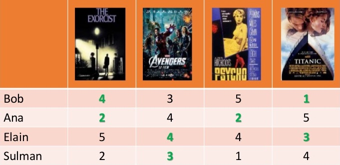

% Programme ta culture !
% Jill-Jênn Vie
% 7 mars 2017
---
header-includes:
    - \usepackage{tikz}
    - \usepackage{array}
    - \usepackage{icomma}
    - \usepackage{multicol,booktabs}
    - \def\R{\mathcal{R}}
handout: true
---

# Hi, I'm JJ

- 2012 Président de Prologin
- 2014 Agrégé de mathématiques + Girls Can Code! + Mangaki
- 2016 Docteur en informatique + 2 livres d'algorithmique
    - *Programmation efficace* (concours de programmation) w/ Dürr
    - *Les clés pour l'info* (concours des ENS) w/ Mansuy, Belghiti
- 2017 Postdoc à RIKEN Tokyo

# Recommandation de films

## Problème

- Chaque utilisateur note peu de films (1 %)
- Comment inférer les notes manquantes ?

\ 

# Cartographie des goûts

## Problème

Comment mettre un nom sur les goûts de l'utilisateur ?

## Exemple

Votre corps est composé à 80 % d'eau, à 10 % de Woody Allen, à 10 % de films noirs.

# Élicitation des préférences

## Problème

Comment faire un diagnostic des goûts de l'utilisateur ?

\ 

\centering \em \small What to Watch on Netflix, Silver Oak Casino, 2013

# Jeu de données 1 : Movielens

\ 

- 700 utilisateurs
- 9000 films
- 100000 notes

# Jeu de données 2 : Mangaki

\ 

- 2100 utilisateurs
- 15000 œuvres \textcolor{gray}{\hfill {\em \small anime / manga / OST}}
- 310000 notes \textcolor{gray}{\hfill {\em \small fav / like / dislike / neutral / willsee / wontsee}}
- Un utilisateur note quelques œuvres \textcolor{gray}{\hfill {\em \small Élicitation des préférences}}
- Et reçoit des recommandations \textcolor{gray}{\hfill {\em \small Filtrage collaboratif}}

# Tout algorithme de machine learning supervisé

## fit($X$, $y$)

\centering
\begin{tabular}{ccc} \toprule
\multicolumn{2}{c}{$X$} & $y$\\ \cmidrule{1-2}
\texttt{user\_id} & \texttt{work\_id} & \texttt{rating}\\ \midrule
24 & 823 & like\\
12 & 823 & dislike\\
12 & 25 & favorite\\
\ldots & \ldots & \ldots\\ \bottomrule
\end{tabular}

\pause

## $\hat{y}$ = predict($X$)

\centering
\begin{tabular}{ccc} \toprule
\multicolumn{2}{c}{$X$} & $\hat{y}$\\ \cmidrule{1-2}
\texttt{user\_id} & \texttt{work\_id} & \texttt{rating}\\ \midrule
24 & 25 & \only<2>{?}\only<3>{\alert{disliked}}\\
12 & 42 & \only<2>{?}\only<3>{\alert{liked}}\\ \bottomrule
\end{tabular}

# Évaluation : RMSE

Si je prédis $\hat{y}$ pour chacun des $n$ paires à évaluer,  
alors que la vérité est $y^*$ :

$$ RMSE(\hat{y}, y^*) = \sqrt{\frac1n \sum_i (\hat{y}_i - y^*_i)^2}. $$

# KNN $\rightarrow$ mesurer la similarité

## $K$ plus proches voisins

- Score de similarité entre utilisateurs :
$$ score(u, v) = \frac{\R_u \cdot \R_v}{||\R_u|| \cdot ||\R_v||}. $$
- Identifions les $k$ plus proches voisins d'un utilisateur
- Recommandons-lui ce que ses voisins ont aimé qu'il n'a pas vu

## Astuce

Si $R$ est la matrice $N \times M$ des $\frac{\R_u}{||\R_u||}$, alors pour obtenir la matrice des scores entre utilisateurs $N \times N$ il suffit de calculer $R R^T$.

# PCA, SVD $\rightarrow$ réduire la dimension

## Analyse de composantes principales, déc. en valeurs singulières

\vspace{-7mm}

$$ R = \left(\begin{array}{c}
\R_1\\
\R_2\\
\vdots\\
\R_n
\end{array}\right) = \raisebox{-1cm}{\begin{tikzpicture}
\draw (0,0) rectangle (2.5,2);
\end{tikzpicture}} =
\raisebox{-1cm}{\begin{tikzpicture}
\draw (0,0) rectangle ++(1,2);
\draw node at (0.5,1) {$C$};
\draw (1.1,1) rectangle ++(2.5,1);
\draw node at (2.35,1.5) {$P$};
\end{tikzpicture}} $$
Chaque ligne $\R_u$ est une combinaison linéaire des profils $P$.

\pause

## Profils types

\begin{tabular}{@{}lccc@{}}
Si $P$ & $P_1$ : aventure & $P_2$ : romance & $P_3$ : plot twist\\
Et $C_u$ & $0,2$ & $-0,5$ & $0,6$
\end{tabular}

$\Rightarrow$ $u$ \alert{aime un peu} l'aventure, \alert{déteste} la romance, \alert{adore} les plot twists.

\vspace{2mm}

\pause

$R = (U \cdot \Sigma)V^T$ où $U : N \times r$ et $V : M \times r$ sont orthogonales et $\Sigma : r \times r$ diagonale.

# ALS-WR $\rightarrow$ variantes

## Moindres carrés alternés avec régularisation pondérée

Rappel : $R$ notes, $C$ coefficients, $P$ profils.

$R = CP = CF^T$ i.e. $r_{ij} \simeq C_i \cdot F_j$.

## L'erreur de reconstruction est minimisée

SVD : $\sum_{i, j}~(r_{ij} - C_i \cdot F_j)^2$ (vaut 0 si $r$ est égal au rang)

\pause

ALS : $\sum_{i, j \textnormal{\alert{ connus}}}~(r_{ij} - C_i \cdot F_j)^2$

\pause

ALS-WR : $\sum_{i, j \textnormal{\alert{ connus}}}~(r_{ij} - C_i \cdot F_j)^2 + \lambda (\sum_i N_i ||C_i||^2 + \sum_j M_j ||F_j||^2)$

\pause

WALS by Tensorflow™ : $$\sum_{i, j} w_{ij} \cdot (r_{ij} - C_i \cdot F_j)^2 + \lambda (\sum_i ||C_i||^2 + \sum_j ||F_j||^2)$$

\pause

## À votre avis, qui gagne ?

# NMF $\rightarrow$ interpréter les composantes

## Non-negative matrix factorization

On suppose $R$, $C$ et $F \geq 0$.

NMF : $\sum_{i, j}~(r_{ij} - C_i \cdot F_j)^2 + \lambda (\sum_i ||C_i||^2 + \sum_j ||F_j||^2)$

## Avantage

Les composantes sont plus facilement interprétables.

# Arbre de décision

\ 

Bon équilibre entre likes, dislikes et « ne sait pas »

# Comment poser des bonnes questions ?

Si on a quelques vecteurs de $F$ :

\centering

\ 

# Interprétation géométrique de la diversité

\centering
\ 

- Déterminant = carré du volume du parallélotope formé
- Vecteurs peu corrélés (\alert{diversifiés}) augmentent le volume
- On souhaite échantillonner $k$ éléments parmi $n$ efficacement

# DPP : pour modéliser la diversité

## Processus à point déterminantal

\centering
points \alert{éloignés les uns des autres}  
=  
films \alert{diversifiés}

\ 

# DPP

On souhaite échantillonner $n$ œuvres  
$K : n \times n$ \alert{matrice de similarité} sur les œuvres (semi-définie positive)

$P$ est un \alert{processus à point déterminantal} si l'échantillon $Y$ vérifie :
$$ \forall A \subset \{1, \ldots, n\}, \quad P(A \subseteq Y) \propto det(K_A) = Vol(\{x_i\}_{i \in A})^2 $$

Il existe un algo en $O(nk^3)$ pour échantillonner $k$ parmi $n$ !

## Exemple

\begin{columns}
\begin{column}{0.5\textwidth}
\[ K = \left(\begin{array}{cccc}
1 & 2 & 3 & 4\\
2 & 5 & 6 & 7\\
3 & 6 & 8 & 9\\
4 & 7 & 9 & 1
\end{array}\right) \]
\end{column}
\begin{column}{0.5\textwidth}
$A = \{1, 2, 4\}$ sera inclus dans la sélection avec probabilité
\[ K_A = det\left(\begin{array}{ccc}
1 & 2 & 4\\
2 & 5 & 7\\
4 & 7 & 1
\end{array}\right) \]
\end{column}
\end{columns}

# SAE

Avec SVD, on passe d'une représentation des gens en dimension $M$ films à une représentation en dimension $r$, qui est censée suffire à décrire leurs notes.

\pause

## Ça ne vous fait pas penser à quelque chose ?

\pause

\begin{center}
\includegraphics[height=4cm]{figures/sae.png}
Sparse autoencoder!
\end{center}

# Une petite anecdote

> - Le 2 octobre 2006, Netflix a lancé un concours :  
*Le premier qui bat notre algorithme de plus de 10 % remportera 1 million de dollars.*  
et ont filé des données anonymisées
> - La moitié de la communauté en IA s'est jetée sur le problème
> - Le 8 octobre, quelqu'un a battu Cinematch
> - Le 15 octobre, 3 équipes l'avaient battu, dont 1 de 1,06 %
> - Le 26 juin 2009, une équipe 1 bat Cinematch de 10,05 %  
$\rightarrow$ \alert{last call} : plus qu'un mois pour gagner
> - Le 25 juillet 2009, une \alert{équipe 2} bat Cinematch de 10,09 %
> - L'équipe 1 fait 10,09 % aussi
> - 20 minutes plus tard \alert{l'équipe 2} fait 10,10 %
> - … En fait, les deux équipes étaient ex \ae quo sur le sous-ensemble de validation
> - … Du coup c'est la première équipe à envoyer ses résultats qui a gagné (équipe 1, 10,09 %)

# Confidentialité des utilisateurs

> - Août 2009, Netflix annonce une saison 2
> - Entre-temps, en 2007 deux chercheurs de l'université du Texas ont été capables d'\alert{identifier} les utilisateurs du jeu de données anonymisées en croisant les données avec IMDb
> - (année approximative de naissance, code postal, films vus)
> - En décembre 2009, 4 utilisateurs de Netflix ont attaqué Netflix en justice
> - Mars 2010, arrangement à l'amiable, la plainte est close

# Programme ta culture !

Initiation à la programmation à la création numérique  
(option ICN au lycée séries L, ES et S)

## Activités

- Exploration de données massives
- Création artistique numérique
- Recommandation de films

`tryalgo.org/programme-ta-culture`

# Quelle série voir, finalement ?

\begin{tabular}{cccl}
\Large Données & \raisebox{-2cm}{\includegraphics[width=2.5cm]{figures/bm.jpg}} & \raisebox{-2cm}{\includegraphics[width=2.5cm]{figures/kaiba.jpg}} & \small \em Kaiba\\
\Large Chat \& souris & \raisebox{-2cm}{\includegraphics[width=2.5cm]{figures/sherlock.jpg}} & \raisebox{-2cm}{\includegraphics[width=2.5cm]{figures/fujiko.jpg}} & \parbox{2cm}{\small \em Lupin the Third: The Woman Called Fujiko Mine}
\end{tabular}

# Merci de votre attention !

\centering
\ 

\raggedright

## Retrouvez ces slides

Sur `research.mangaki.fr`

## Retrouvez le code

Sur GitHub : `github.com/mangaki`

## Suivez-nous

Sur Twitter : `@mangakifr`
